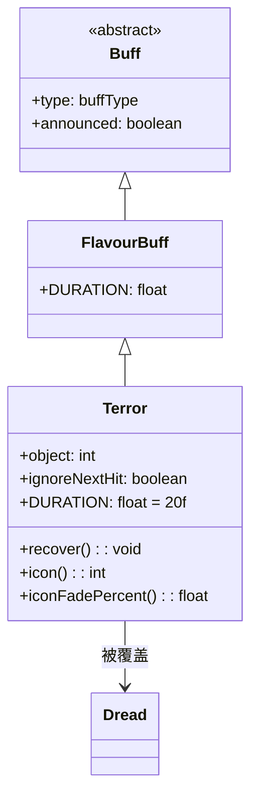

# Terror 类文档

## 1. 基本信息
| 属性 | 值 |
|------|-----|
| 文件路径 | core/src/main/java/com/shatteredpixel/shatteredpixeldungeon/actors/buffs/Terror.java |
| 包名 | com.shatteredpixel.shatteredpixeldungeon.actors.buffs |
| 类类型 | class |
| 继承关系 | extends FlavourBuff |
| 代码行数 | 74 |

## 2. 类职责说明
Terror（恐惧）是一个负面Buff，使受影响的敌人陷入恐惧状态并逃跑。恐惧状态下敌人会远离恐惧源，受到攻击会减少持续时间。Dread（绝望）会覆盖Terror效果。主要用于诅咒武器、特定技能效果等场景。

## 4. 继承与协作关系


## 静态常量表
| 常量名 | 类型 | 值 | 说明 |
|--------|------|-----|------|
| DURATION | float | 20f | 默认持续时间（回合数） |
| OBJECT | String | "object" | Bundle存储键 - 恐惧源位置 |

## 实例字段表
| 字段名 | 类型 | 修饰符 | 说明 |
|--------|------|--------|------|
| object | int | public | 恐惧源目标的位置 |
| ignoreNextHit | boolean | public | 是否忽略下一次攻击 |
| type | buffType | - | NEGATIVE（负面Buff） |
| announced | boolean | - | true（会公告） |

## 7. 方法详解

### recover()
**签名**: `public void recover()`
**功能**: 处理受到攻击时的恢复逻辑，减少5回合持续时间。
**实现逻辑**:
```java
// 如果标记忽略下一次攻击
if (ignoreNextHit) {
    ignoreNextHit = false;
    return;  // 不减少时间
}
spend(-5f);  // 减少5回合
if (cooldown() <= 0) {
    detach();  // 时间耗尽则移除
}
```

### icon()
**签名**: `public int icon()`
**功能**: 返回Buff图标的索引标识符。
**返回值**: int - 返回BuffIndicator.TERROR（恐惧图标）。

### iconFadePercent()
**签名**: `public float iconFadePercent()`
**功能**: 计算Buff图标的淡出百分比。
**返回值**: float - 图标完整度比例。

## 11. 使用示例
```java
// 对敌人施加恐惧效果，持续20回合
Terror terror = Buff.affect(enemy, Terror.class, Terror.DURATION);
terror.object = hero.pos;

// 受到攻击时减少时间
if (enemy.buff(Terror.class) != null) {
    enemy.buff(Terror.class).recover();
}

// 忽略下一次攻击（用于特定技能）
terror.ignoreNextHit = true;
```

## 注意事项
1. 恐惧使敌人逃跑
2. 受到攻击会减少5回合持续时间
3. Dread会覆盖Terror效果
4. ignoreNextHit可以忽略下一次攻击的恢复效果
5. 是负面Buff，会被净化效果移除
6. 持续时间较长（20回合）

## 最佳实践
1. 用于控制敌人群体
2. 利用恐惧让敌人逃跑
3. 注意攻击会减少恐惧时间
4. 配合诅咒武器使用效果更佳