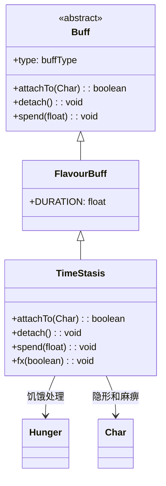

# TimeStasis 类文档

## 1. 基本信息
| 属性 | 值 |
|------|-----|
| 文件路径 | core/src/main/java/com/shatteredpixel/shatteredpixeldungeon/actors/buffs/TimeStasis.java |
| 包名 | com.shatteredpixel.shatteredpixeldungeon.actors.buffs |
| 类类型 | class |
| 继承关系 | extends FlavourBuff |
| 代码行数 | 83 |

## 2. 类职责说明
TimeStasis（时间静止）是一个正面Buff，使角色进入时间静止状态。角色变得隐形且麻痹，时间不会流逝（除了饥饿）。主要用于时间守护者的沙漏神器。

## 4. 继承与协作关系


## 实例字段表
| 字段名 | 类型 | 修饰符 | 说明 |
|--------|------|--------|------|
| type | buffType | - | POSITIVE（正面Buff） |
| actPriority | int | - | BUFF_PRIO-3（在其他Buff之后执行） |

## 7. 方法详解

### attachTo(Char target)
**签名**: `public boolean attachTo(Char target)`
**功能**: 重写附加方法，设置隐形和麻痹状态。
**参数**:
- target: Char - 目标角色
**返回值**: boolean - 是否成功附加。
**实现逻辑**:
```java
if (super.attachTo(target)) {
    target.invisible++;      // 增加隐形计数
    target.paralysed++;      // 增加麻痹计数
    target.next();           // 立即结束当前回合
    
    if (Dungeon.hero != null) {
        Dungeon.observe();   // 更新视野
    }
    return true;
}
return false;
```

### spend(float time)
**签名**: `protected void spend(float time)`
**功能**: 重写spend方法，处理饥饿消耗。
**参数**:
- time: float - 消耗的时间
**实现逻辑**:
```java
super.spend(time);

// 不因频繁使用时间静止而惩罚玩家
Hunger hunger = Buff.affect(target, Hunger.class);
if (hunger != null && !hunger.isStarving()) {
    hunger.affectHunger(cooldown(), true);  // 消耗饥饿值
}
```

### detach()
**签名**: `public void detach()`
**功能**: 重写移除方法，恢复隐形和麻痹状态。
**实现逻辑**:
```java
if (target.invisible > 0) target.invisible--;
if (target.paralysed > 0) target.paralysed--;
super.detach();
Dungeon.observe();  // 更新视野
```

### fx(boolean on)
**签名**: `public void fx(boolean on)`
**功能**: 设置角色的视觉效果。
**参数**:
- on: boolean - true表示添加效果，false表示移除效果
**实现逻辑**:
```java
if (on) {
    target.sprite.add(CharSprite.State.PARALYSED);
} else {
    if (target.paralysed == 0) target.sprite.remove(CharSprite.State.PARALYSED);
    if (target.invisible == 0) target.sprite.remove(CharSprite.State.INVISIBLE);
}
```

## 11. 使用示例
```java
// 添加时间静止效果
Buff.affect(hero, TimeStasis.class);

// 检查是否有时间静止
if (hero.buff(TimeStasis.class) != null) {
    // 英雄处于时间静止状态
}
```

## 注意事项
1. 角色变得隐形且麻痹
2. 时间不会流逝（除饥饿）
3. 饥饿值仍会消耗
4. 移除时恢复隐形和麻痹状态
5. 是正面Buff

## 最佳实践
1. 用于跳过危险情况
2. 注意饥饿值仍在消耗
3. 无法在时间静止中行动
4. 配合沙漏神器使用