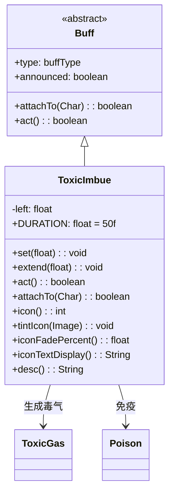

# ToxicImbue 类文档

## 1. 基本信息
| 属性 | 值 |
|------|-----|
| 文件路径 | core/src/main/java/com/shatteredpixel/shatteredpixeldungeon/actors/buffs/ToxicImbue.java |
| 包名 | com.shatteredpixel.shatteredpixeldungeon.actors.buffs |
| 类类型 | class |
| 继承关系 | extends Buff |
| 代码行数 | 132 |

## 2. 类职责说明
ToxicImbue（毒素灌注）是一个正面Buff，使角色在移动时产生毒气云。每回合在角色周围生成毒气，免疫毒气和毒素效果。添加时会移除已有的毒素效果。主要用于毒素药剂、神器效果等场景。

## 4. 继承与协作关系


## 静态常量表
| 常量名 | 类型 | 值 | 说明 |
|--------|------|-----|------|
| DURATION | float | 50f | 默认持续时间 |
| LEFT | String | "left" | Bundle存储键 |

## 实例字段表
| 字段名 | 类型 | 修饰符 | 说明 |
|--------|------|--------|------|
| left | float | protected | 剩余持续时间 |
| type | buffType | - | POSITIVE（正面Buff） |
| announced | boolean | - | true（会公告） |
| immunities | HashSet | - | 包含ToxicGas.class和Poison.class |

## 7. 方法详解

### attachTo(Char target)
**签名**: `public boolean attachTo(Char target)`
**功能**: 重写附加方法，移除已有的毒素效果。
**参数**:
- target: Char - 目标角色
**返回值**: boolean - 是否成功附加。
**实现逻辑**:
```java
if (super.attachTo(target)) {
    Buff.detach(target, Poison.class);  // 移除毒素
    return true;
}
return false;
```

### set(float duration)
**签名**: `public void set(float duration)`
**功能**: 设置持续时间。
**参数**:
- duration: float - 持续回合数

### extend(float duration)
**签名**: `public void extend(float duration)`
**功能**: 延长持续时间。
**参数**:
- duration: float - 要延长的回合数

### act()
**签名**: `public boolean act()`
**功能**: 每回合在周围生成毒气云。
**返回值**: boolean - 返回true表示成功执行。
**实现逻辑**:
```java
if (left > 0) {
    // 总共生成54单位毒气
    int centerVolume = 6;
    for (int i : PathFinder.NEIGHBOURS8) {
        if (!Dungeon.level.solid[target.pos + i]) {
            GameScene.add(Blob.seed(target.pos + i, 6, ToxicGas.class));
        } else {
            centerVolume += 6;  // 墙壁位置的中心毒气增加
        }
    }
    GameScene.add(Blob.seed(target.pos, centerVolume, ToxicGas.class));
}

spend(TICK);
left -= TICK;
if (left <= -5) {
    detach();  // 延迟移除以便显示
}
return true;
```

### icon()
**签名**: `public int icon()`
**功能**: 返回Buff图标的索引标识符。
**返回值**: int - 返回BuffIndicator.IMBUE或NONE（取决于剩余时间）。

### tintIcon(Image icon)
**签名**: `public void tintIcon(Image icon)`
**功能**: 为Buff图标设置颜色色调。
**参数**:
- icon: Image - 需要着色的图标图像
**实现逻辑**:
```java
icon.hardlight(1f, 1.5f, 0f);  // 设置黄绿色高光效果
```

### iconFadePercent()
**签名**: `public float iconFadePercent()`
**功能**: 计算Buff图标的淡出百分比。
**返回值**: float - 图标完整度比例。

### iconTextDisplay()
**签名**: `public String iconTextDisplay()`
**功能**: 返回图标上显示的文本（剩余时间）。
**返回值**: String - 剩余时间的字符串表示。

### desc()
**签名**: `public String desc()`
**功能**: 返回Buff的详细描述文本。
**返回值**: String - 包含剩余时间的描述。

## 11. 使用示例
```java
// 添加毒素灌注效果，持续50回合
ToxicImbue imbue = Buff.affect(hero, ToxicImbue.class);
imbue.set(ToxicImbue.DURATION);

// 检查是否有毒素灌注
if (hero.buff(ToxicImbue.class) != null) {
    // 英雄免疫毒气和毒素
}

// 延长持续时间
if (hero.buff(ToxicImbue.class) != null) {
    hero.buff(ToxicImbue.class).extend(20f);
}
```

## 注意事项
1. 每回合在周围生成毒气云
2. 免疫毒气和毒素效果
3. 添加时移除已有的毒素
4. 持续时间较长（50回合）
5. 是正面Buff

## 最佳实践
1. 用于在敌群中制造混乱
2. 配合移动效果更佳
3. 对毒气免疫的敌人效果降低
4. 注意会伤害盟友