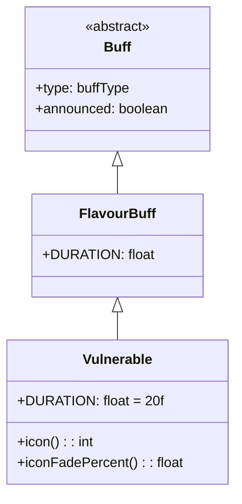

# Vulnerable 类文档

## 1. 基本信息
| 属性 | 值 |
|------|-----|
| 文件路径 | core/src/main/java/com/shatteredpixel/shatteredpixeldungeon/actors/buffs/Vulnerable.java |
| 包名 | com.shatteredpixel.shatteredpixeldungeon.actors.buffs |
| 类类型 | class |
| 继承关系 | extends FlavourBuff |
| 代码行数 | 44 |

## 2. 类职责说明
Vulnerable（脆弱）是一个负面Buff，使受影响的角色受到的伤害增加33%。脆弱状态下角色更容易被击败，需要更加小心。主要用于诅咒效果、特定敌人攻击等场景。

## 4. 继承与协作关系


## 静态常量表
| 常量名 | 类型 | 值 | 说明 |
|--------|------|-----|------|
| DURATION | float | 20f | 默认持续时间（回合数） |

## 实例字段表
| 字段名 | 类型 | 修饰符 | 说明 |
|--------|------|--------|------|
| type | buffType | - | NEGATIVE（负面Buff） |
| announced | boolean | - | true（会公告） |

## 7. 方法详解

### icon()
**签名**: `public int icon()`
**功能**: 返回Buff图标的索引标识符。
**返回值**: int - 返回BuffIndicator.VULNERABLE（脆弱图标）。

### iconFadePercent()
**签名**: `public float iconFadePercent()`
**功能**: 计算Buff图标的淡出百分比。
**返回值**: float - 图标完整度比例。

## 11. 使用示例
```java
// 对敌人施加脆弱效果，持续20回合
Buff.affect(enemy, Vulnerable.class, Vulnerable.DURATION);

// 检查是否有脆弱
if (hero.buff(Vulnerable.class) != null) {
    // 英雄受到伤害增加33%
}

// 延长脆弱时间
Buff.prolong(hero, Vulnerable.class, 10f);
```

## 注意事项
1. 脆弱效果使受到伤害增加33%
2. 实际的伤害计算在Char类中检查此Buff实现
3. 是负面Buff，会被净化效果移除
4. 持续时间较长（20回合）
5. 会显示公告消息

## 最佳实践
1. 对强敌使用可以提高击杀效率
2. 在危险时避免被施加脆弱
3. 使用净化道具尽快移除
4. 配合高伤害攻击快速击杀