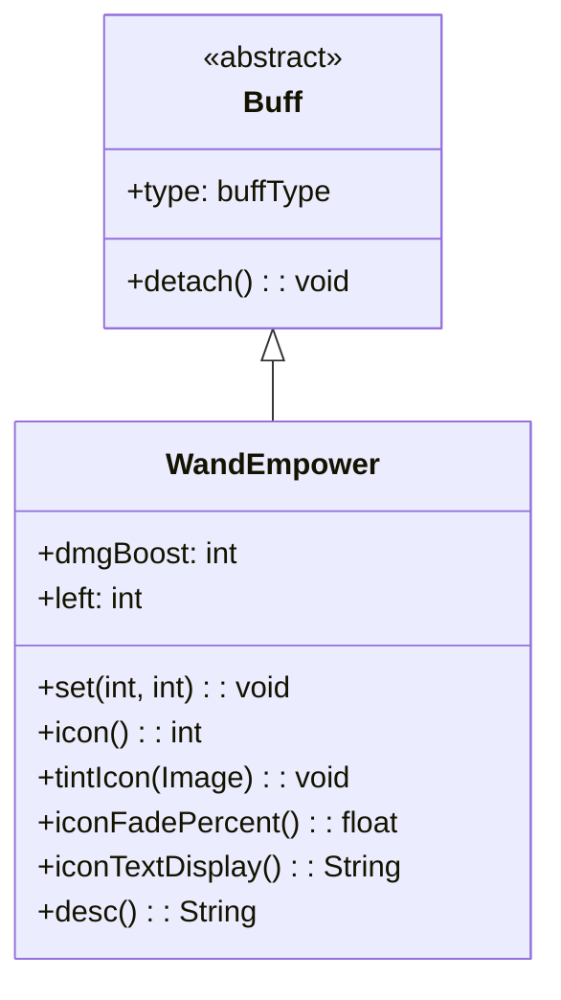

# WandEmpower 类文档

## 1. 基本信息
| 属性 | 值 |
|------|-----|
| 文件路径 | core/src/main/java/com/shatteredpixel/shatteredpixeldungeon/actors/buffs/WandEmpower.java |
| 包名 | com.shatteredpixel.shatteredpixeldungeon.actors.buffs |
| 类类型 | class |
| 继承关系 | extends Buff |
| 代码行数 | 85 |

## 2. 类职责说明
WandEmpower（法杖强化）是一个正面Buff，使法杖攻击获得额外伤害加成。使用法杖攻击会消耗一次强化次数。主要用于法杖强化卷轴、特定技能效果等场景。

## 4. 继承与协作关系


## 静态常量表
| 常量名 | 类型 | 值 | 说明 |
|--------|------|-----|------|
| BOOST | String | "boost" | Bundle存储键 |
| LEFT | String | "left" | Bundle存储键 |

## 实例字段表
| 字段名 | 类型 | 修饰符 | 说明 |
|--------|------|--------|------|
| dmgBoost | int | public | 伤害加成值 |
| left | int | public | 剩余使用次数 |
| type | buffType | - | POSITIVE（正面Buff） |

## 7. 方法详解

### set(int dmg, int shots)
**签名**: `public void set(int dmg, int shots)`
**功能**: 设置伤害加成和使用次数。
**参数**:
- dmg: int - 伤害加成值
- shots: int - 使用次数
**实现逻辑**:
```java
dmgBoost = dmg;
left = Math.max(left, shots);  // 取较大值
```

### icon()
**签名**: `public int icon()`
**功能**: 返回Buff图标的索引标识符。
**返回值**: int - 返回BuffIndicator.WAND（法杖图标）。

### tintIcon(Image icon)
**签名**: `public void tintIcon(Image icon)`
**功能**: 为Buff图标设置颜色色调。
**参数**:
- icon: Image - 需要着色的图标图像
**实现逻辑**:
```java
icon.hardlight(1, 1, 0);  // 设置黄色高光效果
```

### iconFadePercent()
**签名**: `public float iconFadePercent()`
**功能**: 计算Buff图标的淡出百分比。
**返回值**: float - 图标完整度比例（基于剩余次数）。
**实现逻辑**:
```java
return Math.max(0, (3 - left) / 3f);
```

### iconTextDisplay()
**签名**: `public String iconTextDisplay()`
**功能**: 返回图标上显示的文本（剩余次数）。
**返回值**: String - 剩余次数的字符串表示。

### desc()
**签名**: `public String desc()`
**功能**: 返回Buff的详细描述文本。
**返回值**: String - 包含伤害加成和剩余次数的描述。

## 11. 使用示例
```java
// 添加法杖强化，伤害+5，3次使用
WandEmpower empower = Buff.affect(hero, WandEmpower.class);
empower.set(5, 3);

// 使用法杖攻击时消耗
if (hero.buff(WandEmpower.class) != null) {
    int bonus = hero.buff(WandEmpower.class).dmgBoost;
    // 法杖伤害 + bonus
    hero.buff(WandEmpower.class).left--;
}
```

## 注意事项
1. 每次使用法杖攻击消耗一次
2. 次数用尽后Buff移除
3. 伤害加成对所有法杖有效
4. 是正面Buff

## 最佳实践
1. 在关键时刻使用强化法杖
2. 配合高伤害法杖效果更佳
3. 注意剩余使用次数
4. 叠加使用次数可延长效果