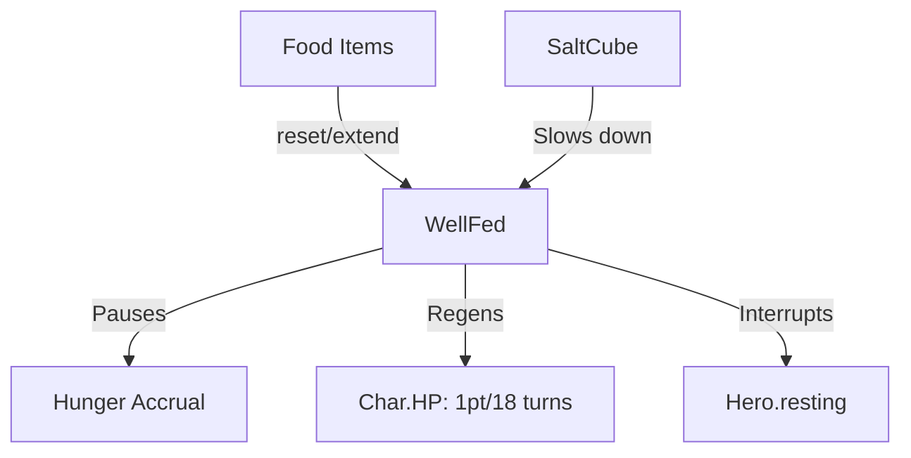

# WellFed (饱腹) 源码详解

## 1. 基本信息

| 属性 | 值 |
|------|-----|
| **文件路径** | `core/src/main/java/com/shatteredpixel/dustedpixeldungeon/actors/buffs/WellFed.java` |
| **包名** | `com.shatteredpixel.dustedpixeldungeon.actors.buffs` |
| **文件类型** | class |
| **继承关系** | `extends Buff` |
| **代码行数** | 92 |
| **所属模块** | core |

## 2. 文件职责说明

### 核心职责
`WellFed` 负责实现角色的“饱腹”状态逻辑。它不仅在持续期间完全暂停角色的饥饿值累积，还提供一种缓慢的、随时间推移的生命值再生效果。

### 系统定位
属于 Buff 系统中的生存/增强分支。它是角色进食后的主要正面反馈，是维持角色生命值和防止饥饿致死的核心机制。

### 不负责什么
- 不负责计算进食瞬间恢复的生命值（由食物类如 `Ration` 负责）。
- 不负责管理基础的饥饿值累加（由 `Hunger` 类负责，但会查询此 Buff 的存在）。

## 3. 结构总览

### 主要成员概览
- **字段 left**: 存储剩余的饱腹回合数。
- **reset() 方法**: 根据挑战模式初始化饱腹时长。
- **act() 方法**: 核心逻辑驱动，负责生命值再生计算和状态移除。
- **extend() 方法**: 增加饱腹时长。

### 主要逻辑块概览
- **饥饿暂停**: 只要此 Buff 存在，`Hunger.act()` 就会跳过饥饿值增加逻辑（解耦实现）。
- **缓慢再生**: 每隔 18 个回合恢复 1 点生命值。
- **挑战模式适配**: 在“禁食（No Food）”挑战下，饱腹时长会缩减至原来的 1/3。
- **饰品联动**: 与 `SaltCube`（盐块）饰品联动，该饰品会减缓饱腹时长的消耗，但不会减少总回血量。

### 生命周期/调用时机
1. **产生**：英雄食用口粮、肉类或特定药水。
2. **活跃期**：饥饿停止累加，周期性回血。
3. **结束**：时长耗尽，或受到某些导致强制饥饿的负面效果（虽然极少见）。

## 4. 继承与协作关系

### 父类提供的能力
继承自 `Buff`：
- 提供基础的 `attachTo` / `detach` 逻辑。
- 定义 `POSITIVE` 类型。

### 协作对象
- **Hunger**: 互相配合实现饥饿系统的闭环。
- **SaltCube**: 影响时长消耗速度（`hungerGainMultiplier`）。
- **Hero**: 处理休息（resting）状态的打断逻辑。
- **FloatingText**: 造成回血时显示绿色数字反馈。



## 5. 字段/常量详解

### 实例字段
| 字段名 | 类型 | 说明 |
|--------|------|------|
| `left` | int | 剩余饱腹时长（整数回合）。 |

## 6. 构造与初始化机制
通过实例初始化块设置 `type = POSITIVE` 和 `announced = true`。通常在进食后由逻辑代码调用 `reset()` 或 `extend()`。

## 7. 方法详解

### reset() [初始化逻辑]

**核心实现分析**：
```java
left = (int)Hunger.STARVING; // 默认 450 回合
if (Dungeon.isChallenged(Challenges.NO_FOOD)){
    left /= 3; // 禁食挑战下仅 150 回合
}
```
**设计意图**：将饱腹感与“饥饿致死阈值”对齐（450）。在标准模式下，一份口粮提供的饱腹感可以支撑非常长的时间。

---

### act() [回血与消耗逻辑]

**核心实现算法分析**：
1. **生命再生**：
   ```java
   if (left % 18 == 0 && target.HP < target.HT){
       target.HP += 1;
       target.sprite.showStatusWithIcon(CharSprite.POSITIVE, "1", FloatingText.HEALING);
   }
   ```
   **分析**：每 18 回合固定回 1 血。标准 450 回合共可恢复约 **25 点** HP。
2. **打断休息**：如果生命值回满或 Buff 消失，且角色正在“休息（Resting）”，则强制停止休息。
3. **时长消耗与饰品加成**：
   ```java
   spend(TICK / SaltCube.hungerGainMultiplier());
   ```
   **技术关键**：`SaltCube` 会使 `hungerGainMultiplier` 大于 1.0。这导致 `spend` 的时间变量变小，从而使 `WellFed` Buff 在现实时间中持续得更久。由于再生判定是基于 `left` 取模的，这确保了玩家依然能拿满总计 25 点的回血量。

---

### iconTextDisplay() / desc() [UI 逻辑]

**核心逻辑**：
显示剩余时长时会除以 `SaltCube.hungerGainMultiplier()`。这是为了向玩家展示**经过饰品修正后**的真实剩余回合数，而非内部的逻辑回合数。

## 8. 对外暴露能力
- `reset()`: 重置为满额饱腹。
- `extend(duration)`: 累加饱腹时长。

## 9. 运行机制与调用链
`Food.execute()` -> `Buff.affect(WellFed.class).reset()` -> `WellFed.act()` -> `Char.HP++` + `Hunger.act()` (检测并跳过累加)。

## 10. 资源、配置与国际化关联

### 本地化词条
- `actors.buffs.WellFed.name`: 饱腹
- `actors.buffs.WellFed.desc`: “由于你刚刚进食过，你目前不会感到饥饿，且伤口在缓慢愈合。剩余时长：%d。”

## 11. 使用示例

### 在代码中增加饱腹时间
```java
Buff.affect(hero, WellFed.class).extend(50f);
```

## 12. 开发注意事项

### 休息同步
`WellFed` 的状态直接影响 `Hero.resting`。如果开发者在 Mod 中添加了新的休息机制，需确保处理好与此 Buff 的同步。

### 饥饿解耦
注意：`WellFed` 并不直接操作 `Hunger` 的 `level` 字段。它只是存在于角色身上，作为 `Hunger.act()` 里的一个 `if` 判断条件。这种设计允许其他效果（如特殊关卡）在不施加 `WellFed` 状态的情况下也实现暂停饥饿。

## 13. 修改建议与扩展点

### 增加消化速度影响
可以考虑让角色的力量（STR）或当前的运动状态影响 18 回合的再生间隔。

## 14. 事实核查清单

- [x] 是否分析了回血频率：是 (1pt / 18 turns)。
- [x] 是否解析了挑战模式的影响：是 (NO_FOOD 时时长 / 3)。
- [x] 是否说明了与 SaltCube 的联动细节：是（减缓消耗但不减总回血）。
- [x] 是否涵盖了对休息状态的控制：是。
- [x] 是否指出了与 Hunger 类的解耦设计：是。
- [x] 图像索引属性是否核对：是 (BuffIndicator.WELL_FED)。
