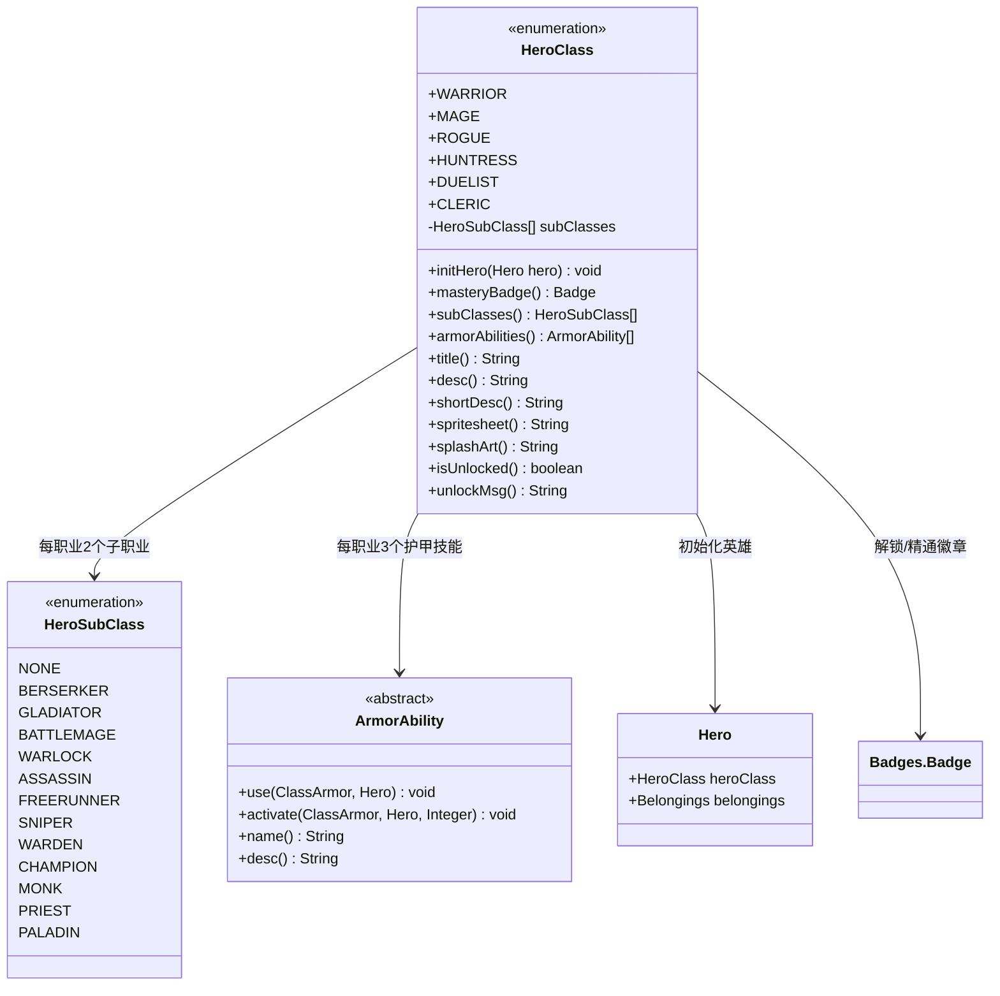

# HeroClass 英雄职业枚举类文档

## 1. 基本信息
| 属性 | 值 |
|------|-----|
| 文件路径 | core/src/main/java/com/shatteredpixel/shatteredpixeldungeon/actors/hero/HeroClass.java |
| 包名 | com.shatteredpixel.shatteredpixeldungeon.actors.hero |
| 类类型 | enum (枚举) |
| 继承关系 | java.lang.Enum<HeroClass> |
| 代码行数 | 354 |

## 2. 类职责说明
HeroClass 枚举定义了游戏中所有可玩的英雄职业类型。每个职业拥有独特的初始装备、子职业选项和护甲技能。该类负责初始化英雄的起始状态（包括装备、物品和快捷栏设置），管理职业解锁状态，以及提供职业相关的元数据（如精灵图、介绍图等）。

## 4. 继承与协作关系


## 枚举常量表
| 常量名 | 子职业 | 初始武器 | 初始神器/特殊物品 | 已识别药水 | 已识别卷轴 | 说明 |
|--------|--------|----------|------------------|------------|------------|------|
| **WARRIOR** | BERSERKER, GLADIATOR | 磨损短剑(WornShortsword) | 破碎封印(BrokenSeal) | 治疗药水 | 狂暴卷轴 | 默认解锁，初始装备投掷石块 |
| **MAGE** | BATTLEMAGE, WARLOCK | 法师法杖(MagesStaff, 内置魔法飞弹法杖) | - | 液态火焰药水 | 升级卷轴 | 需要解锁 |
| **ROGUE** | ASSASSIN, FREERUNNER | 匕首(Dagger) | 暗影斗篷(CloakOfShadows) | 隐身药水 | 魔法地图卷轴 | 需要解锁，初始装备投掷匕首 |
| **HUNTRESS** | SNIPER, WARDEN | 拳套(Gloves) | 精灵弓(SpiritBow) | 心眼药水 | 催眠卷轴 | 需要解锁 |
| **DUELIST** | CHAMPION, MONK | 迅捷剑(Rapier) | - | 力量药水 | 镜像卷轴 | 需要解锁，初始装备投掷尖刺(2个) |
| **CLERIC** | PRIEST, PALADIN | 短棍(Cudgel) | 神圣典籍(HolyTome) | 净化药水 | 解咒卷轴 | 需要解锁 |

### 子职业详细说明
| 主职业 | 子职业1 | 子职业2 |
|--------|---------|---------|
| WARRIOR | BERSERKER（狂战士）- 狂暴战斗风格 | GLADIATOR（角斗士）- 连击战斗风格 |
| MAGE | BATTLEMAGE（战斗法师）- 法杖近战增强 | WARLOCK（术士）- 诅咒与生命偷取 |
| ROGUE | ASSASSIN（刺客）- 暴击与潜行杀敌 | FREERUNNER（自由奔跑者）- 移动与闪避 |
| HUNTRESS | SNIPER（狙击手）- 远程精准射击 | WARDEN（守护者）- 自然与植物能力 |
| DUELIST | CHAMPION（冠军）- 武器精通 | MONK（武僧）- 徒手与内力 |
| CLERIC | PRIEST（牧师）- 神圣法术 | PALADIN（圣骑士）- 神圣护甲 |

## 实例字段表
| 字段名 | 类型 | 修饰符 | 说明 |
|--------|------|--------|------|
| subClasses | HeroSubClass[] | private final | 该职业可选择的子职业数组（固定2个） |

## 7. 方法详解

### initHero
**签名**: `public void initHero(Hero hero)`
**功能**: 初始化英雄的所有起始状态，包括职业设置、装备、物品和快捷栏
**参数**:
- hero: Hero - 要初始化的英雄对象
**返回值**: void - 无返回值

**实现逻辑**:
```
1. 设置英雄的职业为当前枚举值 (hero.heroClass = this)
2. 初始化该职业的天赋 (Talent.initClassTalents(hero))
3. 装备基础布甲 (ClothArmor)，检查是否被挑战模式阻挡
4. 给予一份食物 (Food)
5. 装备丝绒袋 (VelvetPouch) 用于存放小物品
6. 给予水袋 (Waterskin) 用于存储生命之水
7. 自动识别鉴定卷轴 (ScrollOfIdentify)
8. 根据职业类型调用对应的初始化方法 (switch-case)
9. 如果设置中开启了"水袋快捷栏"，自动将水袋放入第一个空快捷栏位
```

### initWarrior (战士初始化)
**签名**: `private static void initWarrior(Hero hero)`
**功能**: 初始化战士职业的独特装备和物品
**参数**:
- hero: Hero - 战士英雄对象
**返回值**: void - 无返回值

**实现逻辑**:
```
1. 装备磨损短剑 (WornShortsword) 作为初始武器并识别
2. 获得投掷石块 (ThrowingStone) 并识别
3. 将投掷石块放入快捷栏槽位0
4. 在布甲上附加破碎封印 (BrokenSeal) - 战士独有特性
5. 设置封印为已发现（因为不会加入物品栏）
6. 识别治疗药水 (PotionOfHealing)
7. 识别狂暴卷轴 (ScrollOfRage)
```

### initMage (法师初始化)
**签名**: `private static void initMage(Hero hero)`
**功能**: 初始化法师职业的独特装备和物品
**参数**:
- hero: Hero - 法师英雄对象
**返回值**: void - 无返回值

**实现逻辑**:
```
1. 创建法师法杖 (MagesStaff)，内置魔法飞弹法杖 (WandOfMagicMissile)
2. 装备法师法杖并识别
3. 激活法师法杖（使其充能）
4. 将法师法杖放入快捷栏槽位0
5. 识别升级卷轴 (ScrollOfUpgrade)
6. 识别液态火焰药水 (PotionOfLiquidFlame)
```

### initRogue (盗贼初始化)
**签名**: `private static void initRogue(Hero hero)`
**功能**: 初始化盗贼职业的独特装备和物品
**参数**:
- hero: Hero - 盗贼英雄对象
**返回值**: void - 无返回值

**实现逻辑**:
```
1. 装备匕首 (Dagger) 作为初始武器并识别
2. 获得暗影斗篷 (CloakOfShadows) 神器并识别
3. 激活暗影斗篷（盗贼专属神器，可进入隐身）
4. 获得投掷匕首 (ThrowingKnife) 并识别
5. 将暗影斗篷放入快捷栏槽位0
6. 将投掷匕首放入快捷栏槽位1
7. 识别魔法地图卷轴 (ScrollOfMagicMapping)
8. 识别隐身药水 (PotionOfInvisibility)
```

### initHuntress (猎人初始化)
**签名**: `private static void initHuntress(Hero hero)`
**功能**: 初始化猎人职业的独特装备和物品
**参数**:
- hero: Hero - 猎人英雄对象
**返回值**: void - 无返回值

**实现逻辑**:
```
1. 装备拳套 (Gloves) 作为初始武器并识别
2. 获得精灵弓 (SpiritBow) 并识别（猎人专属远程武器）
3. 将精灵弓放入快捷栏槽位0
4. 识别心眼药水 (PotionOfMindVision)
5. 识别催眠卷轴 (ScrollOfLullaby)
```

### initDuelist (决斗者初始化)
**签名**: `private static void initDuelist(Hero hero)`
**功能**: 初始化决斗者职业的独特装备和物品
**参数**:
- hero: Hero - 决斗者英雄对象
**返回值**: void - 无返回值

**实现逻辑**:
```
1. 装备迅捷剑 (Rapier) 作为初始武器并识别
2. 激活迅捷剑（决斗者武器有特殊能力）
3. 获得投掷尖刺 (ThrowingSpike)，数量设为2并识别
4. 将迅捷剑放入快捷栏槽位0
5. 将投掷尖刺放入快捷栏槽位1
6. 识别力量药水 (PotionOfStrength)
7. 识别镜像卷轴 (ScrollOfMirrorImage)
```

### initCleric (牧师初始化)
**签名**: `private static void initCleric(Hero hero)`
**功能**: 初始化牧师职业的独特装备和物品
**参数**:
- hero: Hero - 牧师英雄对象
**返回值**: void - 无返回值

**实现逻辑**:
```
1. 装备短棍 (Cudgel) 作为初始武器并识别
2. 激活短棍
3. 获得神圣典籍 (HolyTome) 神器并识别
4. 激活神圣典籍（牧师专属神器，可施放神圣法术）
5. 将神圣典籍放入快捷栏槽位0
6. 识别净化药水 (PotionOfPurity)
7. 识别解咒卷轴 (ScrollOfRemoveCurse)
```

### masteryBadge
**签名**: `public Badges.Badge masteryBadge()`
**功能**: 获取该职业的精通徽章
**参数**: 无
**返回值**: Badges.Badge - 对应的精通徽章枚举值

**实现逻辑**:
```
使用 switch-case 根据职业返回对应的精通徽章:
- WARRIOR → MASTERY_WARRIOR
- MAGE → MASTERY_MAGE
- ROGUE → MASTERY_ROGUE
- HUNTRESS → MASTERY_HUNTRESS
- DUELIST → MASTERY_DUELIST
- CLERIC → MASTERY_CLERIC
```

### subClasses
**签名**: `public HeroSubClass[] subClasses()`
**功能**: 获取该职业可选的子职业数组
**参数**: 无
**返回值**: HeroSubClass[] - 子职业数组（固定2个元素）

**实现逻辑**: 直接返回构造函数中设置的 subClasses 字段

### armorAbilities
**签名**: `public ArmorAbility[] armorAbilities()`
**功能**: 获取该职业可用的护甲技能数组
**参数**: 无
**返回值**: ArmorAbility[] - 护甲技能数组（固定3个元素）

**实现逻辑**:
```
使用 switch-case 根据职业返回对应的护甲技能:

WARRIOR: 英雄跃击(HeroicLeap), 冲击波(Shockwave), 坚忍(Endure)
MAGE: 元素爆破(ElementalBlast), 狂野魔法(WildMagic), 传送信标(WarpBeacon)
ROGUE: 烟雾弹(SmokeBomb), 死亡印记(DeathMark), 影分身(ShadowClone)
HUNTRESS: 幽冥之刃(SpectralBlades), 自然之力(NaturesPower), 灵鹰(SpiritHawk)
DUELIST: 挑战(Challenge), 元素打击(ElementalStrike), 佯攻(Feint)
CLERIC: 升华形态(AscendedForm), 三位一体(Trinity), 众力之力(PowerOfMany)
```

### title
**签名**: `public String title()`
**功能**: 获取职业的本地化显示名称
**参数**: 无
**返回值**: String - 本地化的职业名称

**实现逻辑**: 使用 Messages.get() 从资源文件获取对应枚举名称的翻译

### desc
**签名**: `public String desc()`
**功能**: 获取职业的详细描述
**参数**: 无
**返回值**: String - 本地化的详细描述文本

**实现逻辑**: 使用 Messages.get() 获取 "枚举名_desc" 的翻译

### shortDesc
**签名**: `public String shortDesc()`
**功能**: 获取职业的简短描述
**参数**: 无
**返回值**: String - 本地化的简短描述文本

**实现逻辑**: 使用 Messages.get() 获取 "枚举名_desc_short" 的翻译

### spritesheet
**签名**: `public String spritesheet()`
**功能**: 获取该职业的精灵图资源路径
**参数**: 无
**返回值**: String - 精灵图资源路径

**实现逻辑**:
```
使用 switch-case 返回对应的资源路径:
- WARRIOR → Assets.Sprites.WARRIOR
- MAGE → Assets.Sprites.MAGE
- ROGUE → Assets.Sprites.ROGUE
- HUNTRESS → Assets.Sprites.HUNTRESS
- DUELIST → Assets.Sprites.DUELIST
- CLERIC → Assets.Sprites.CLERIC
```

### splashArt
**签名**: `public String splashArt()`
**功能**: 获取该职业的介绍图资源路径
**参数**: 无
**返回值**: String - 介绍图资源路径

**实现逻辑**:
```
使用 switch-case 返回对应的资源路径:
- WARRIOR → Assets.Splashes.WARRIOR
- MAGE → Assets.Splashes.MAGE
- ROGUE → Assets.Splashes.ROGUE
- HUNTRESS → Assets.Splashes.HUNTRESS
- DUELIST → Assets.Splashes.DUELIST
- CLERIC → Assets.Splashes.CLERIC
```

### isUnlocked
**签名**: `public boolean isUnlocked()`
**功能**: 检查该职业是否已解锁
**参数**: 无
**返回值**: boolean - true表示已解锁，false表示未解锁

**实现逻辑**:
```
1. 如果是调试版本 (DeviceCompat.isDebug())，始终返回 true
2. WARRIOR 始终返回 true（默认解锁）
3. 其他职业检查对应的解锁徽章:
   - MAGE → Badges.Badge.UNLOCK_MAGE
   - ROGUE → Badges.Badge.UNLOCK_ROGUE
   - HUNTRESS → Badges.Badge.UNLOCK_HUNTRESS
   - DUELIST → Badges.Badge.UNLOCK_DUELIST
   - CLERIC → Badges.Badge.UNLOCK_CLERIC
```

### unlockMsg
**签名**: `public String unlockMsg()`
**功能**: 获取职业的解锁提示消息
**参数**: 无
**返回值**: String - 包含简短描述和解锁条件的消息

**实现逻辑**: 返回 shortDesc() + "\n\n" + 解锁条件本地化消息

## 护甲技能详解
每个职业在装备英雄护甲时可使用3种护甲技能：

| 职业 | 技能1 | 技能2 | 技能3 |
|------|-------|-------|-------|
| **WARRIOR** | HeroicLeap - 跳向目标位置并造成范围伤害 | Shockwave - 发出冲击波眩晕敌人 | Endure - 承受伤害后反弹伤害 |
| **MAGE** | ElementalBlast - 根据法杖释放元素爆炸 | WildMagic - 随机激活所有法杖效果 | WarpBeacon - 设置传送信标 |
| **ROGUE** | SmokeBomb - 烟雾弹传送并隐身 | DeathMark - 标记敌人，死亡时获得充能 | ShadowClone - 召唤影分身 |
| **HUNTRESS** | SpectralBlades - 发射幽冥之刃 | NaturesPower - 自然之力增强移动和攻击 | SpiritHawk - 召唤灵鹰侦察 |
| **DUELIST** | Challenge - 挑选单个敌人决斗 | ElementalStrike - 元素打击武器攻击 | Feint - 假动作攻击 |
| **CLERIC** | AscendedForm - 升华神圣形态 | Trinity - 三位一体治疗 | PowerOfMany - 众力之力增强盟友 |

## 解锁系统详解
游戏使用徽章系统(Badges)来控制职业解锁：

| 职业 | 解锁徽章 | 解锁条件 |
|------|----------|----------|
| WARRIOR | - | 默认解锁 |
| MAGE | UNLOCK_MAGE | 使用1次升级卷轴 |
| ROGUE | UNLOCK_ROGUE | 完成10次偷袭攻击 |
| HUNTRESS | UNLOCK_HUNTRESS | 完成10次投掷攻击 |
| DUELIST | UNLOCK_DUELIST | 使用武器特殊能力攻击敌人 |
| CLERIC | UNLOCK_CLERIC | 完成教程 |

### 精通徽章
当玩家使用某职业获胜后获得精通徽章，解锁挑战模式：
- MASTERY_WARRIOR
- MASTERY_MAGE
- MASTERY_ROGUE
- MASTERY_HUNTRESS
- MASTERY_DUELIST
- MASTERY_CLERIC

## 11. 使用示例

### 检查职业解锁状态
```java
// 检查法师是否已解锁
if (HeroClass.MAGE.isUnlocked()) {
    // 显示法师选择按钮
}
```

### 初始化新英雄
```java
// 创建新游戏时初始化战士
Hero hero = new Hero();
HeroClass.WARRIOR.initHero(hero);
// 此时英雄已装备磨损短剑、布甲（带破碎封印）、投掷石块、食物和水袋
```

### 获取职业信息
```java
// 获取职业名称和描述
String name = HeroClass.WARRIOR.title();  // "战士"
String desc = HeroClass.WARRIOR.desc();   // 详细描述
String shortDesc = HeroClass.WARRIOR.shortDesc();  // 简短描述

// 获取护甲技能
ArmorAbility[] abilities = HeroClass.WARRIOR.armorAbilities();
for (ArmorAbility ability : abilities) {
    System.out.println(ability.name());
}
```

### 获取子职业
```java
// 获取战士的子职业
HeroSubClass[] subs = HeroClass.WARRIOR.subClasses();
// subs[0] = BERSERKER
// subs[1] = GLADIATOR
```

## 注意事项
1. **初始装备检查**：所有职业初始化时都会检查 `Challenges.isItemBlocked()`，某些挑战模式会移除特定初始物品
2. **快捷栏设置**：初始物品会自动放入快捷栏，战士、法师、猎人、牧师占用槽位0，盗贼和决斗者占用槽位0和1
3. **水袋设置**：水袋是否自动放入快捷栏取决于 `SPDSettings.quickslotWaterskin()` 设置
4. **封印特殊处理**：战士的破碎封印需要通过 `Catalog.setSeen()` 手动标记为已发现，因为它不会加入物品栏
5. **神器激活**：盗贼的暗影斗篷和牧师的神圣典籍需要调用 `activate()` 方法才能开始充能

## 最佳实践
1. **添加新职业**：需要在 HeroClass 枚举中添加新常量，同时创建对应的 HeroSubClass 和 ArmorAbility
2. **修改初始装备**：修改对应的 initXxx() 方法，注意检查挑战模式限制
3. **职业平衡调整**：初始物品数量和类型直接影响早期游戏难度，需谨慎调整
4. **国际化支持**：所有显示文本通过 Messages.get() 获取，确保添加对应的资源文件条目