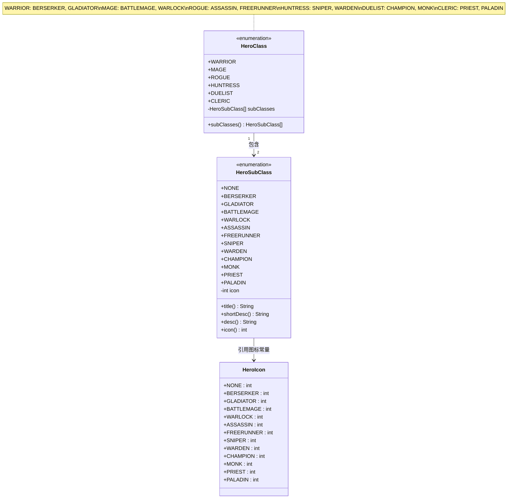

# HeroSubClass 类文档

## 1. 基本信息
| 属性 | 值 |
|------|-----|
| 文件路径 | core/src/main/java/com/shatteredpixel/shatteredpixeldungeon/actors/hero/HeroSubClass.java |
| 包名 | com.shatteredpixel.shatteredpixeldungeon.actors.hero |
| 类类型 | enum (枚举) |
| 继承关系 | extends java.lang.Enum&lt;HeroSubClass&gt; |
| 代码行数 | 88 行 |

## 2. 类职责说明
HeroSubClass 是定义英雄子职业的枚举类，共包含13个枚举常量（1个NONE + 12个实际子职业）。每个基础职业（HeroClass）拥有2个专属子职业，子职业为英雄提供独特的能力加成和游戏机制，是角色构建的核心系统之一。

## 4. 继承与协作关系


## 子职业与父职业对应表
| 子职业常量 | 中文名称 | 父职业 | 游戏风格 |
|-----------|---------|--------|---------|
| NONE | 无 | - | 默认状态，未选择子职业 |
| BERSERKER | 狂战士 | 战士(WARRIOR) | 高风险高回报，怒气系统 |
| GLADIATOR | 角斗士 | 战士(WARRIOR) | 连击系统，战技组合 |
| BATTLEMAGE | 战斗法师 | 法师(MAGE) | 魔杖近战，法杖特效 |
| WARLOCK | 术士 | 法师(MAGE) | 灵魂标记，吸血恢复 |
| ASSASSIN | 刺客 | 盗贼(ROGUE) | 潜行蓄力，爆发斩杀 |
| FREERUNNER | 疾行者 | 盗贼(ROGUE) | 机动性，动量系统 |
| SNIPER | 狙击手 | 猎人(HUNTRESS) | 远程专精，穿甲追击 |
| WARDEN | 守望者 | 猎人(HUNTRESS) | 自然联结，植物增益 |
| CHAMPION | 勇士 | 决斗家(DUELIST) | 双持武器，武技强化 |
| MONK | 武僧 | 决斗家(DUELIST) | 内力系统，武功技能 |
| PRIEST | 祭司 | 牧师(CLERIC) | 远程法术，光耀伤害 |
| PALADIN | 圣骑士 | 牧师(CLERIC) | 近战法术，神圣加成 |

## 枚举常量详解

### NONE (无子职业)
**图标**: HeroIcon.NONE (透明图标, 值=127)
**说明**: 默认状态，表示英雄尚未选择子职业。在游戏初期或重置子职业时使用。

### BERSERKER (狂战士)
**图标**: HeroIcon.BERSERKER (值=0)
**父职业**: 战士(WARRIOR)
**核心机制**: 怒气系统
**特点**:
- 受到伤害时积累怒气，最多+50%伤害加成
- 满怒气时进入狂暴状态，获得基于护甲等级和已损生命值的护盾
- 狂暴期间造成+50%额外伤害
- 狂暴结束后需要休息才能再次积累怒气

### GLADIATOR (角斗士)
**图标**: HeroIcon.GLADIATOR (值=1)
**父职业**: 战士(WARRIOR)
**核心机制**: 连击系统
**特点**:
- 成功命中敌人时积累连击数
- 连击解锁特殊战技：2连击(击退)、4连击(护甲伤害)、6连击(招架)、8连击(AOE)、10连击(多段攻击)
- 破碎纹章提供的护盾在连击期间不会衰减

### BATTLEMAGE (战斗法师)
**图标**: HeroIcon.BATTLEMAGE (值=2)
**父职业**: 法师(MAGE)
**核心机制**: 魔杖近战特效
**特点**:
- 使用魔杖近战时触发法杖专属特效
- 每种法杖提供不同的近战附魔效果
- 近战攻击为魔杖恢复0.5充能
- 描述信息动态包含当前魔杖灌注的法杖信息

### WARLOCK (术士)
**图标**: HeroIcon.WARLOCK (值=3)
**父职业**: 法师(MAGE)
**核心机制**: 灵魂标记
**特点**:
- 使用法杖时有概率标记敌人灵魂
- 标记概率和持续时间随法杖等级提升
- 物理攻击被标记敌人时恢复生命(每5点伤害恢复2点HP)
- 仅物理攻击触发吸血，法杖伤害无效

### ASSASSIN (刺客)
**图标**: HeroIcon.ASSASSIN (值=4)
**父职业**: 盗贼(ROGUE)
**核心机制**: 蓄力准备
**特点**:
- 隐身时蓄力致命一击，最多9回合
- 蓄力越久伤害越高
- 可闪现至目标位置
- 能直接斩杀足够虚弱的敌人

### FREERUNNER (疾行者)
**图标**: HeroIcon.FREERUNNER (值=5)
**父职业**: 盗贼(ROGUE)
**核心机制**: 动量系统
**特点**:
- 移动时积累动量，最多10点
- 动量用于激活逸动状态，每点动量获得2回合逸动
- 逸动状态下双倍移动速度
- 逸动期间获得基于等级的额外闪避

### SNIPER (狙击手)
**图标**: HeroIcon.SNIPER (值=6)
**父职业**: 猎人(HUNTRESS)
**核心机制**: 狙击标记
**特点**:
- 远程攻击无视护甲
- 投掷武器命中后施加狙击标记
- 可用灵能弓进行特殊追击：速射/连射/狙杀
- 追击类型取决于弓的强化方式

### WARDEN (守望者)
**图标**: HeroIcon.WARDEN (值=7)
**父职业**: 猎人(HUNTRESS)
**核心机制**: 自然联结
**特点**:
- 具有穿透高草与枯草的视野
- 种植种子时周围生草
- 踩踏植物获得增益效果替代原本效果
- 所有植物对其完全无害

### CHAMPION (勇士)
**图标**: HeroIcon.CHAMPION (值=8)
**父职业**: 决斗家(DUELIST)
**核心机制**: 双持系统
**特点**:
- 可装备主武器和副武器
- 主武器进行普通攻击
- 不耗时切换主副武器
- 可施展两武器各自的武技
- +2武技充能上限，+50%充能回复

### MONK (武僧)
**图标**: HeroIcon.MONK (值=9)
**父职业**: 决斗家(DUELIST)
**核心机制**: 内力系统
**特点**:
- 击败敌人时获得内力
- 内力用于施展武功：
  - 1点：空振(连续打击)
  - 2点：凝神(招架下次攻击)
  - 3点：登云(瞬移)
  - 4点：盘龙(击退敌人)
  - 5点：冥思(清除负面效果+充能)

### PRIEST (祭司)
**图标**: HeroIcon.PRIEST (值=10)
**父职业**: 牧师(CLERIC)
**核心机制**: 远程法术
**特点**:
- 获得远程法术系列
- 强化版神导之光：每50回合免费施放一次
- 通过法术/法杖/盟友消耗光耀造成额外伤害
- 获得破晓辐光法术

### PALADIN (圣骑士)
**图标**: HeroIcon.PALADIN (值=11)
**父职业**: 牧师(CLERIC)
**核心机制**: 近战法术
**特点**:
- 获得近战法术系列
- 强化版神圣武器：+6魔法伤害，不覆盖附魔
- 强化版神圣护甲：+3伤害防御，不覆盖刻印
- 施放其他法术可延长神圣效果时长
- 获得至圣斩击法术

## 实例字段表
| 字段名 | 类型 | 修饰符 | 说明 |
|--------|------|--------|------|
| icon | int | private | 子职业图标索引，对应HeroIcon中的常量值 |

## 7. 方法详解

### 构造方法
**签名**: `HeroSubClass(int icon)`
**功能**: 初始化枚举常量，设置图标索引
**参数**:
- icon: int - HeroIcon类中定义的图标常量值
**实现逻辑**:
```java
HeroSubClass(int icon){
    this.icon = icon;
}
```

### title()
**签名**: `public String title()`
**功能**: 获取子职业的本地化标题名称
**返回值**: String - 子职业的中文名称
**实现逻辑**:
```java
public String title() {
    return Messages.get(this, name());
}
```
通过Messages系统获取当前枚举常量名称对应的本地化字符串，例如`actors.hero.herosubclass.berserker`对应"狂战士"。

### shortDesc()
**签名**: `public String shortDesc()`
**功能**: 获取子职业的简短描述
**返回值**: String - 子职业的一句话简介
**实现逻辑**:
```java
public String shortDesc() {
    return Messages.get(this, name()+"_short_desc");
}
```
获取格式为`{name}_short_desc`的消息键值，用于UI中快速展示子职业特点。

### desc()
**签名**: `public String desc()`
**功能**: 获取子职业的详细描述
**返回值**: String - 子职业的完整说明文本
**实现逻辑**:
```java
public String desc() {
    // BATTLEMAGE特殊处理：包含法杖效果描述
    if (this == BATTLEMAGE){
        String desc = Messages.get(this, name() + "_desc");
        // 检查是否在游戏场景中
        if (Game.scene() instanceof GameScene){
            // 获取英雄装备的魔杖
            MagesStaff staff = Dungeon.hero.belongings.getItem(MagesStaff.class);
            // 如果魔杖存在且已灌注法杖
            if (staff != null && staff.wandClass() != null){
                // 追加法杖的战斗法师特效描述
                desc += "\n\n" + Messages.get(staff.wandClass(), "bmage_desc");
                desc = desc.replaceAll("_", "");
            }
        }
        return desc;
    } else {
        return Messages.get(this, name() + "_desc");
    }
}
```
**特殊逻辑说明**:
- BATTLEMAGE子职业的描述会动态包含当前魔杖灌注法杖的特效说明
- 这通过检查`Dungeon.hero.belongings.getItem(MagesStaff.class)`实现
- 如果英雄装备了魔杖且已灌注，会追加法杖的`bmage_desc`消息

### icon()
**签名**: `public int icon()`
**功能**: 获取子职业的图标索引
**返回值**: int - 图标索引值，用于HeroIcon渲染
**实现逻辑**:
```java
public int icon(){
    return icon;
}
```

## 图标系统说明

HeroSubClass的图标通过HeroIcon类管理，采用统一的图集纹理：

| 子职业 | HeroIcon常量 | 索引值 | 图集位置 |
|--------|-------------|--------|---------|
| NONE | HeroIcon.NONE | 127 | 透明图标 |
| BERSERKER | HeroIcon.BERSERKER | 0 | 第1行第1列 |
| GLADIATOR | HeroIcon.GLADIATOR | 1 | 第1行第2列 |
| BATTLEMAGE | HeroIcon.BATTLEMAGE | 2 | 第1行第3列 |
| WARLOCK | HeroIcon.WARLOCK | 3 | 第1行第4列 |
| ASSASSIN | HeroIcon.ASSASSIN | 4 | 第2行第1列 |
| FREERUNNER | HeroIcon.FREERUNNER | 5 | 第2行第2列 |
| SNIPER | HeroIcon.SNIPER | 6 | 第2行第3列 |
| WARDEN | HeroIcon.WARDEN | 7 | 第2行第4列 |
| CHAMPION | HeroIcon.CHAMPION | 8 | 第3行第1列 |
| MONK | HeroIcon.MONK | 9 | 第3行第2列 |
| PRIEST | HeroIcon.PRIEST | 10 | 第3行第3列 |
| PALADIN | HeroIcon.PALADIN | 11 | 第3行第4列 |

**渲染机制**:
- 所有图标存储在`Assets.Interfaces.HERO_ICONS`纹理中
- 每个图标尺寸为16x16像素
- HeroIcon类通过`TextureFilm`根据索引值裁剪对应区域

## 11. 使用示例

### 判断英雄子职业
```java
// 检查英雄是否为特定子职业
if (Dungeon.hero.subClass == HeroSubClass.BERSERKER) {
    // 狂战士专属逻辑
}

// 检查是否选择了子职业
if (Dungeon.hero.subClass != HeroSubClass.NONE) {
    // 已选择子职业的逻辑
}
```

### 获取子职业信息
```java
HeroSubClass subClass = Dungeon.hero.subClass;

// 获取标题
String title = subClass.title(); // 例如: "狂战士"

// 获取简短描述
String shortDesc = subClass.shortDesc(); // UI提示用

// 获取详细描述
String desc = subClass.desc(); // 完整说明

// 获取图标
int iconIndex = subClass.icon();
Image icon = new HeroIcon(subClass);
```

### 获取父职业的子职业列表
```java
HeroClass heroClass = Dungeon.hero.heroClass;
HeroSubClass[] subClasses = heroClass.subClasses();
// 例如 WARRIOR 返回 [BERSERKER, GLADIATOR]
```

## 注意事项

1. **子职业解锁**: 子职业需要通过游戏进度解锁，每个职业有独立的解锁条件

2. **BATTLEMAGE特殊处理**: 
   - 其`desc()`方法有特殊逻辑
   - 在游戏场景中会动态追加魔杖特效说明
   - 如果没有装备魔杖或未灌注，仅显示基础描述

3. **消息系统依赖**:
   - 所有文本通过`Messages.get()`获取
   - 消息键格式: `actors.hero.herosubclass.{name}`、`{name}_short_desc`、`{name}_desc`
   - 需要对应的本地化文件支持

4. **枚举常量顺序**:
   - NONE放在最前面作为默认值
   - 其他子职业按父职业分组排列
   - 顺序与HeroClass中定义的subClasses数组一致

5. **图标资源**:
   - 图标索引必须与HeroIcon常量对应
   - 图集纹理尺寸固定为16x16

## 最佳实践

1. **使用枚举比较**: 始终使用`==`比较枚举常量，而非`equals()`
   ```java
   // 推荐
   if (subClass == HeroSubClass.BERSERKER)
   
   // 不推荐
   if (subClass.equals(HeroSubClass.BERSERKER))
   ```

2. **空值检查**: 处理子职业时先检查是否为NONE
   ```java
   if (hero.subClass != HeroSubClass.NONE) {
       // 执行子职业相关逻辑
   }
   ```

3. **UI渲染**: 使用HeroIcon类而非直接处理图标索引
   ```java
   Image icon = new HeroIcon(hero.subClass);
   ```

4. **描述获取**: 根据UI空间选择合适的描述方法
   ```java
   // 紧凑空间使用shortDesc()
   tooltip.text(subClass.shortDesc());
   
   // 详情界面使用desc()
   details.text(subClass.desc());
   ```

5. **子职业切换**: 切换子职业时需考虑相关联的状态重置
   ```java
   // 切换子职业后可能需要重置相关Buff
   if (oldSubClass == HeroSubClass.BERSERKER) {
       Buff.detach(hero, Berserk.class);
   }
   ```