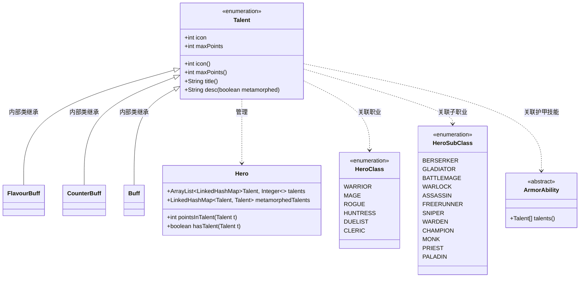

# Talent 类文档

## 1. 基本信息
| 属性 | 值 |
|------|-----|
| 文件路径 | D:\Develop\Workspace\DustedPixelDungeon\core\src\main\java\com\shatteredpixel\shatteredpixeldungeon\actors\hero\Talent.java |
| 包名 | com.shatteredpixel.shatteredpixeldungeon.actors.hero |
| 类类型 | enum (枚举) |
| 继承关系 | extends Enum\<Talent\> |
| 代码行数 | 1219 行 |

## 2. 类职责说明

`Talent` 枚举类定义了《Shattered Pixel Dungeon》游戏中的**天赋系统**。它包含所有可用的天赋类型、天赋点数上限、天赋图标索引，以及与天赋相关的静态回调方法。天赋系统分为4个层级(Tier)，玩家通过升级获得天赋点，解锁不同层级的天赋能力。

## 4. 继承与协作关系



## 天赋层级系统

### 层级解锁阈值
| 层级 | 解锁等级 | 说明 |
|------|----------|------|
| Tier 1 | 2级 | 基础职业天赋，每职业4个 |
| Tier 2 | 7级 | 进阶职业天赋，每职业5个 |
| Tier 3 | 13级 | 子职业天赋，基础2个+子职业3个 |
| Tier 4 | 21级 | 护甲技能天赋，每技能3个 |

```java
public static int[] tierLevelThresholds = new int[]{0, 2, 7, 13, 21, 31};
```

### 天赋点数上限
- **Tier 1-2 天赋**: 最大2点 (构造函数默认值)
- **Tier 3-4 天赋**: 最大3点 (显式指定)

## 枚举常量表

### 战士 (Warrior) 天赋

#### Tier 1 基础天赋
| 常量名 | 图标索引 | 最大点数 | 说明 |
|--------|----------|----------|------|
| HEARTY_MEAL | 0 | 2 | 丰盛一餐 - 生命值低于33%时进食回复4/6点HP |
| VETERANS_INTUITION | 1 | 2 | 老兵直觉 - 护甲鉴定速度提升1.75x/2.5x，满级时装备即鉴定 |
| PROVOKED_ANGER | 2 | 2 | 激怒反击 - 受到攻击后下一次攻击额外造成1-3/1-5点伤害 |
| IRON_WILL | 3 | 2 | 钢铁意志 - 获得护盾效果，变身其他职业时同样生效 |

#### Tier 2 进阶天赋
| 常量名 | 图标索引 | 最大点数 | 说明 |
|--------|----------|----------|------|
| IRON_STOMACH | 4 | 2 | 钢铁胃 - 进食期间获得免疫效果 |
| LIQUID_WILLPOWER | 5 | 2 | 液体意志 - 使用药剂时获得6.5%/10%最大生命护盾 |
| RUNIC_TRANSFERENCE | 6 | 2 | 符文转移 - 强化刻印效果 |
| LETHAL_MOMENTUM | 7 | 2 | 致命动量 - 击杀敌人后获得移动力加成 |
| IMPROVISED_PROJECTILES | 8 | 2 | 即兴投掷 - 投掷物品造成额外效果 |

#### Tier 3 基础天赋
| 常量名 | 图标索引 | 最大点数 | 说明 |
|--------|----------|----------|------|
| HOLD_FAST | 9 | 3 | 站稳脚跟 - 站立不动时获得防御加成 |
| STRONGMAN | 10 | 3 | 大力士 - 增加力量效果 |

#### Tier 3 狂战士 (Berserker) 专属
| 常量名 | 图标索引 | 最大点数 | 说明 |
|--------|----------|----------|------|
| ENDLESS_RAGE | 11 | 3 | 无尽狂怒 - 狂怒持续时间延长 |
| DEATHLESS_FURY | 12 | 3 | 不死之怒 - 濒死时触发狂怒保命 |
| ENRAGED_CATALYST | 13 | 3 | 狂怒催化 - 狂怒状态下增强效果 |

#### Tier 3 角斗士 (Gladiator) 专属
| 常量名 | 图标索引 | 最大点数 | 说明 |
|--------|----------|----------|------|
| CLEAVE | 14 | 3 | 劈砍 - 连击后造成额外伤害 |
| LETHAL_DEFENSE | 15 | 3 | 致命防御 - 连击后获得护盾 |
| ENHANCED_COMBO | 16 | 3 | 强化连击 - 提升连击效果 |

#### Tier 4 英雄跃击 (Heroic Leap) 技能天赋
| 常量名 | 图标索引 | 最大点数 | 说明 |
|--------|----------|----------|------|
| BODY_SLAM | 17 | 4 | 重摔 - 跃击落地时造成范围伤害 |
| IMPACT_WAVE | 18 | 4 | 冲击波 - 跃击击退周围敌人 |
| DOUBLE_JUMP | 19 | 4 | 双重跳跃 - 立即重置跃击冷却 |

#### Tier 4 冲击波 (Shockwave) 技能天赋
| 常量名 | 图标索引 | 最大点数 | 说明 |
|--------|----------|----------|------|
| EXPANDING_WAVE | 20 | 4 | 扩散波 - 增加冲击波范围 |
| STRIKING_WAVE | 21 | 4 | 打击波 - 冲击波造成伤害 |
| SHOCK_FORCE | 22 | 4 | 震荡力 - 增加眩晕时间 |

#### Tier 4 坚忍 (Endure) 技能天赋
| 常量名 | 图标索引 | 最大点数 | 说明 |
|--------|----------|----------|------|
| SUSTAINED_RETRIBUTION | 23 | 4 | 持续报复 - 延长反击伤害加成时间 |
| SHRUG_IT_OFF | 24 | 4 | 无视伤害 - 减少受到的伤害 |
| EVEN_THE_ODDS | 25 | 4 | 扳回劣势 - 敌人越多伤害越高 |

---

### 法师 (Mage) 天赋

#### Tier 1 基础天赋
| 常量名 | 图标索引 | 最大点数 | 说明 |
|--------|----------|----------|------|
| EMPOWERING_MEAL | 32 | 2 | 赋能一餐 - 进食后下3次法杖攻击额外造成2/3点伤害 |
| SCHOLARS_INTUITION | 33 | 2 | 学者直觉 - 法杖鉴定速度提升3倍，满级时使用即鉴定 |
| LINGERING_MAGIC | 34 | 2 | 残留魔法 - 使用法杖后下一次近战攻击额外造成1-2点伤害 |
| BACKUP_BARRIER | 35 | 2 | 备用屏障 - 使用法杖时获得护盾 |

#### Tier 2 进阶天赋
| 常量名 | 图标索引 | 最大点数 | 说明 |
|--------|----------|----------|------|
| ENERGIZING_MEAL | 36 | 2 | 充能一餐 - 进食后获得5/8回合法杖充能 |
| INSCRIBED_POWER | 37 | 2 | 铭刻之力 - 使用卷轴后获得2/3次强化法术效果 |
| WAND_PRESERVATION | 38 | 2 | 法杖保存 - 升级法杖时保留原有等级 |
| ARCANE_VISION | 39 | 2 | 奥术视野 - 使用法杖时获得敌人视野 |
| SHIELD_BATTERY | 40 | 2 | 护盾电池 - 满充能时将溢出充能转为护盾 |

#### Tier 3 基础天赋
| 常量名 | 图标索引 | 最大点数 | 说明 |
|--------|----------|----------|------|
| DESPERATE_POWER | 41 | 3 | 绝境之力 - 生命值低时增强法杖威力 |
| ALLY_WARP | 42 | 3 | 盟友传送 - 与召唤物交换位置 |

#### Tier 3 战斗法师 (Battlemage) 专属
| 常量名 | 图标索引 | 最大点数 | 说明 |
|--------|----------|----------|------|
| EMPOWERED_STRIKE | 43 | 3 | 强化打击 - 用法杖近战时触发法术效果 |
| MYSTICAL_CHARGE | 44 | 3 | 神秘充能 - 用法杖近战时获得充能 |
| EXCESS_CHARGE | 45 | 3 | 过量充能 - 满充能时增强法杖效果 |

#### Tier 3 术士 (Warlock) 专属
| 常量名 | 图标索引 | 最大点数 | 说明 |
|--------|----------|----------|------|
| SOUL_EATER | 46 | 3 | 灵魂吞噬 - 击杀敌人时回复饥饿值 |
| SOUL_SIPHON | 47 | 3 | 灵魂虹吸 - 法术伤害转化为生命 |
| NECROMANCERS_MINIONS | 48 | 3 | 亡灵仆从 - 击杀敌人时召唤亡灵 |

#### Tier 4 元素爆破 (Elemental Blast) 技能天赋
| 常量名 | 图标索引 | 最大点数 | 说明 |
|--------|----------|----------|------|
| BLAST_RADIUS | 49 | 4 | 爆破半径 - 增加技能范围 |
| ELEMENTAL_POWER | 50 | 4 | 元素之力 - 增加伤害 |
| REACTIVE_BARRIER | 51 | 4 | 反应屏障 - 造成伤害时获得护盾 |

#### Tier 4 狂野魔法 (Wild Magic) 技能天赋
| 常量名 | 图标索引 | 最大点数 | 说明 |
|--------|----------|----------|------|
| WILD_POWER | 52 | 4 | 狂野之力 - 增强随机法杖效果 |
| FIRE_EVERYTHING | 53 | 4 | 全力开火 - 同时发射多根法杖 |
| CONSERVED_MAGIC | 54 | 4 | 节约魔法 - 有几率不消耗充能 |

#### Tier 4 传送信标 (Warp Beacon) 技能天赋
| 常量名 | 图标索引 | 最大点数 | 说明 |
|--------|----------|----------|------|
| TELEFRAG | 55 | 4 | 传送杀敌 - 传送到敌人位置时造成伤害 |
| REMOTE_BEACON | 56 | 4 | 远程信标 - 远程放置信标 |
| LONGRANGE_WARP | 57 | 4 | 远距传送 - 增加传送距离 |

---

### 盗贼 (Rogue) 天赋

#### Tier 1 基础天赋
| 常量名 | 图标索引 | 最大点数 | 说明 |
|--------|----------|----------|------|
| CACHED_RATIONS | 64 | 2 | 藏匿口粮 - 每层生成2/4个隐藏口粮 |
| THIEFS_INTUITION | 65 | 2 | 盗贼直觉 - 戒指鉴定速度翻倍，满级时装备即鉴定并识别所有同类戒指 |
| SUCKER_PUNCH | 66 | 2 | 偷袭 - 对未发现你的敌人造成额外1-2点伤害 |
| PROTECTIVE_SHADOWS | 67 | 2 | 保护阴影 - 隐身时每2/1回合获得1点护盾，最多3/5点 |

#### Tier 2 进阶天赋
| 常量名 | 图标索引 | 最大点数 | 说明 |
|--------|----------|----------|------|
| MYSTICAL_MEAL | 68 | 2 | 神秘一餐 - 进食后获得3/5回合神器充能 |
| INSCRIBED_STEALTH | 69 | 2 | 铭刻潜行 - 使用卷轴后获得3/5回合隐身 |
| WIDE_SEARCH | 70 | 2 | 广域搜索 - 增加搜索范围 |
| SILENT_STEPS | 71 | 2 | 无声脚步 - 不会惊醒睡眠中的敌人 |
| ROGUES_FORESIGHT | 72 | 2 | 盗贼预感 - 提前感知陷阱和秘密门 |

#### Tier 3 基础天赋
| 常量名 | 图标索引 | 最大点数 | 说明 |
|--------|----------|----------|------|
| ENHANCED_RINGS | 73 | 3 | 强化戒指 - 使用神器后戒指效果增强3/6回合 |
| LIGHT_CLOAK | 74 | 3 | 轻盈斗篷 - 允许在失去物品栏后使用暗影斗篷 |

#### Tier 3 刺客 (Assassin) 专属
| 常量名 | 图标索引 | 最大点数 | 说明 |
|--------|----------|----------|------|
| ENHANCED_LETHALITY | 75 | 3 | 强化致命 - 提升暗杀伤害阈值 |
| ASSASSINS_REACH | 76 | 3 | 刺客范围 - 增加暗杀距离 |
| BOUNTY_HUNTER | 77 | 3 | 赏金猎人 - 暗杀敌人时掉落更多物品 |

#### Tier 3 自由奔跑者 (Freerunner) 专属
| 常量名 | 图标索引 | 最大点数 | 说明 |
|--------|----------|----------|------|
| EVASIVE_ARMOR | 78 | 3 | 闪避装甲 - 移动时增加闪避 |
| PROJECTILE_MOMENTUM | 79 | 3 | 投掷动量 - 移动后投掷武器更强 |
| SPEEDY_STEALTH | 80 | 3 | 迅速潜行 - 隐身时移动更快 |

#### Tier 4 烟雾弹 (Smoke Bomb) 技能天赋
| 常量名 | 图标索引 | 最大点数 | 说明 |
|--------|----------|----------|------|
| HASTY_RETREAT | 81 | 4 | 急速撤退 - 使用烟雾弹后获得加速 |
| BODY_REPLACEMENT | 82 | 4 | 替身术 - 留下一个替身吸引敌人 |
| SHADOW_STEP | 83 | 4 | 暗影步 - 瞬移距离增加 |

#### Tier 4 死亡标记 (Death Mark) 技能天赋
| 常量名 | 图标索引 | 最大点数 | 说明 |
|--------|----------|----------|------|
| FEAR_THE_REAPER | 84 | 4 | 死亡恐惧 - 标记敌人时造成恐惧 |
| DEATHLY_DURABILITY | 85 | 4 | 死亡耐久 - 击杀标记敌人时获得护盾 |
| DOUBLE_MARK | 86 | 4 | 双重标记 - 可同时标记两个敌人 |

#### Tier 4 暗影分身 (Shadow Clone) 技能天赋
| 常量名 | 图标索引 | 最大点数 | 说明 |
|--------|----------|----------|------|
| SHADOW_BLADE | 87 | 4 | 暗影之刃 - 分身攻击更强 |
| CLONED_ARMOR | 88 | 4 | 分身护甲 - 分身更耐打 |
| PERFECT_COPY | 89 | 4 | 完美复制 - 分身持续时间更长 |

---

### 女猎人 (Huntress) 天赋

#### Tier 1 基础天赋
| 常量名 | 图标索引 | 最大点数 | 说明 |
|--------|----------|----------|------|
| NATURES_BOUNTY | 96 | 2 | 自然馈赠 - 每层生成2/4个浆果 |
| SURVIVALISTS_INTUITION | 97 | 2 | 生存者直觉 - 投掷武器鉴定速度提升3倍，满级时使用即鉴定 |
| FOLLOWUP_STRIKE | 98 | 2 | 追击 - 投掷武器命中后近战攻击造成额外伤害 |
| NATURES_AID | 99 | 2 | 自然援助 - 使用精神弓时获得树皮护甲 |

#### Tier 2 进阶天赋
| 常量名 | 图标索引 | 最大点数 | 说明 |
|--------|----------|----------|------|
| INVIGORATING_MEAL | 100 | 2 | 振奋一餐 - 进食后获得加速效果 |
| LIQUID_NATURE | 101 | 2 | 液体自然 - 使用药剂时生长草丛并定身敌人 |
| REJUVENATING_STEPS | 102 | 2 | 回春步伐 - 在草上行走时回复生命 |
| HEIGHTENED_SENSES | 103 | 2 | 敏锐感知 - 感知周围敌人位置 |
| DURABLE_PROJECTILES | 104 | 2 | 耐久投掷 - 投掷武器有几率不消耗 |

#### Tier 3 基础天赋
| 常量名 | 图标索引 | 最大点数 | 说明 |
|--------|----------|----------|------|
| POINT_BLANK | 105 | 3 | 近距射击 - 近距离使用精神弓更强 |
| SEER_SHOT | 106 | 3 | 预知射击 - 射击揭示目标区域 |

#### Tier 3 狙击手 (Sniper) 专属
| 常量名 | 图标索引 | 最大点数 | 说明 |
|--------|----------|----------|------|
| FARSIGHT | 107 | 3 | 远视 - 增加视野范围 |
| SHARED_ENCHANTMENT | 108 | 3 | 共享附魔 - 精神弓共享武器附魔 |
| SHARED_UPGRADES | 109 | 3 | 共享升级 - 精神弓共享武器升级等级 |

#### Tier 3 守护者 (Warden) 专属
| 常量名 | 图标索引 | 最大点数 | 说明 |
|--------|----------|----------|------|
| DURABLE_TIPS | 110 | 3 | 耐久箭矢 - 精神箭不消耗 |
| BARKSKIN | 111 | 3 | 树皮皮肤 - 在草上时获得护甲 |
| SHIELDING_DEW | 112 | 3 | 露水护盾 - 露水转化为护盾 |

#### Tier 4 幽灵之刃 (Spectral Blades) 技能天赋
| 常量名 | 图标索引 | 最大点数 | 说明 |
|--------|----------|----------|------|
| FAN_OF_BLADES | 113 | 4 | 扇形之刃 - 攻击多个目标 |
| PROJECTING_BLADES | 114 | 4 | 投射之刃 - 增加射程 |
| SPIRIT_BLADES | 115 | 4 | 幽灵之刃 - 攻击触发精神弓效果 |

#### Tier 4 自然之力 (Nature's Power) 技能天赋
| 常量名 | 图标索引 | 最大点数 | 说明 |
|--------|----------|----------|------|
| GROWING_POWER | 116 | 4 | 成长之力 - 延长技能持续时间 |
| NATURES_WRATH | 117 | 4 | 自然之怒 - 增加伤害 |
| WILD_MOMENTUM | 118 | 4 | 野性动量 - 击杀延长技能效果 |

#### Tier 4 灵鹰 (Spirit Hawk) 技能天赋
| 常量名 | 图标索引 | 最大点数 | 说明 |
|--------|----------|----------|------|
| EAGLE_EYE | 119 | 4 | 鹰眼 - 鹰视野更大 |
| GO_FOR_THE_EYES | 120 | 4 | 致盲攻击 - 鹰攻击致盲敌人 |
| SWIFT_SPIRIT | 121 | 4 | 迅捷之灵 - 鹰移动更快 |

---

### 决斗者 (Duelist) 天赋

#### Tier 1 基础天赋
| 常量名 | 图标索引 | 最大点数 | 说明 |
|--------|----------|----------|------|
| STRENGTHENING_MEAL | 128 | 2 | 强化一餐 - 进食后下2/3次近战攻击额外造成3点伤害 |
| ADVENTURERS_INTUITION | 129 | 2 | 冒险者直觉 - 武器鉴定速度提升2.5倍，满级时装备即鉴定 |
| PATIENT_STRIKE | 130 | 2 | 耐心打击 - 站立不动后下一次攻击额外造成1-2点伤害 |
| AGGRESSIVE_BARRIER | 131 | 2 | 激进屏障 - 低生命时攻击获得护盾 |

#### Tier 2 进阶天赋
| 常量名 | 图标索引 | 最大点数 | 说明 |
|--------|----------|----------|------|
| FOCUSED_MEAL | 132 | 2 | 专注一餐 - 进食后获得武器充能，其他职业获得近战伤害加成 |
| LIQUID_AGILITY | 133 | 2 | 液体敏捷 - 使用药剂后获得闪避和精准加成 |
| WEAPON_RECHARGING | 134 | 2 | 武器充能 - 获得武器充能速度提升 |
| LETHAL_HASTE | 135 | 2 | 致命急速 - 击杀敌人后获得加速 |
| SWIFT_EQUIP | 136 | 2 | 迅捷装备 - 快速切换武器 |

#### Tier 3 基础天赋
| 常量名 | 图标索引 | 最大点数 | 说明 |
|--------|----------|----------|------|
| PRECISE_ASSAULT | 137 | 3 | 精确突击 - 使用武器技能后下一次攻击必定命中 |
| DEADLY_FOLLOWUP | 138 | 3 | 致命追击 - 投掷武器命中后近战对该敌人造成额外伤害 |

#### Tier 3 冠军 (Champion) 专属
| 常量名 | 图标索引 | 最大点数 | 说明 |
|--------|----------|----------|------|
| VARIED_CHARGE | 139 | 3 | 多样充能 - 使用不同武器时获得额外充能 |
| TWIN_UPGRADES | 140 | 3 | 双子升级 - 两把武器共享升级收益 |
| COMBINED_LETHALITY | 141 | 3 | 联合致命 - 武器技能击杀返还充能 |

#### Tier 3 武僧 (Monk) 专属
| 常量名 | 图标索引 | 最大点数 | 说明 |
|--------|----------|----------|------|
| UNENCUMBERED_SPIRIT | 142 | 3 | 无负重之灵 - 满级时免费获得布甲和手套 |
| MONASTIC_VIGOR | 143 | 3 | 修行活力 - 低充能时增强武器技能 |
| COMBINED_ENERGY | 144 | 3 | 联合能量 - 武器技能和武僧技能互相增强 |

#### Tier 4 挑战 (Challenge) 技能天赋
| 常量名 | 图标索引 | 最大点数 | 说明 |
|--------|----------|----------|------|
| CLOSE_THE_GAP | 145 | 4 | 缩短距离 - 挑战时冲刺向目标 |
| INVIGORATING_VICTORY | 146 | 4 | 振奋胜利 - 击杀被挑战敌人回复生命 |
| ELIMINATION_MATCH | 147 | 4 | 淘汰赛 - 连续挑战多个敌人 |

#### Tier 4 元素打击 (Elemental Strike) 技能天赋
| 常量名 | 图标索引 | 最大点数 | 说明 |
|--------|----------|----------|------|
| ELEMENTAL_REACH | 148 | 4 | 元素范围 - 增加技能范围 |
| STRIKING_FORCE | 149 | 4 | 打击力度 - 增加伤害 |
| DIRECTED_POWER | 150 | 4 | 定向能量 - 集中伤害 |

#### Tier 4 假动作 (Feint) 技能天赋
| 常量名 | 图标索引 | 最大点数 | 说明 |
|--------|----------|----------|------|
| FEIGNED_RETREAT | 151 | 4 | 假装撤退 - 假动作后获得闪避 |
| EXPOSE_WEAKNESS | 152 | 4 | 暴露弱点 - 敌人暴露弱点 |
| COUNTER_ABILITY | 153 | 4 | 反击能力 - 可反击敌人 |

---

### 牧师 (Cleric) 天赋

#### Tier 1 基础天赋
| 常量名 | 图标索引 | 最大点数 | 说明 |
|--------|----------|----------|------|
| SATIATED_SPELLS | 160 | 2 | 饱腹施法 - 进食后法术效果增强，其他职业获得延迟护盾 |
| HOLY_INTUITION | 161 | 2 | 神圣直觉 - 神圣典籍鉴定速度提升 |
| SEARING_LIGHT | 162 | 2 | 灼热之光 - 攻击时造成光耀伤害 |
| SHIELD_OF_LIGHT | 163 | 2 | 光之护盾 - 使用神圣典籍时获得护盾 |

#### Tier 2 进阶天赋
| 常量名 | 图标索引 | 最大点数 | 说明 |
|--------|----------|----------|------|
| ENLIGHTENING_MEAL | 164 | 2 | 启迪一餐 - 进食后获得神圣典籍充能，其他职业获得双充能 |
| RECALL_INSCRIPTION | 165 | 2 | 回忆铭刻 - 有几率返还使用的卷轴/符石 |
| SUNRAY | 166 | 2 | 阳光射线 - 释放致盲光线 |
| DIVINE_SENSE | 167 | 2 | 神圣感知 - 感知周围敌人 |
| BLESS | 168 | 2 | 祝福 - 祝福效果 |

#### Tier 3 基础天赋
| 常量名 | 图标索引 | 最大点数 | 说明 |
|--------|----------|----------|------|
| CLEANSE | 169 | 3 | 净化 - 有几率移除负面效果 |
| LIGHT_READING | 170 | 3 | 轻松阅读 - 神圣典籍充能速度提升 |

#### Tier 3 牧师 (Priest) 专属
| 常量名 | 图标索引 | 最大点数 | 说明 |
|--------|----------|----------|------|
| HOLY_LANCE | 171 | 3 | 神圣长矛 - 投掷光矛造成伤害 |
| HALLOWED_GROUND | 172 | 3 | 圣化之地 - 创造神圣区域 |
| MNEMONIC_PRAYER | 173 | 3 | 记忆祈祷 - 记住并重复使用法术 |

#### Tier 3 圣骑士 (Paladin) 专属
| 常量名 | 图标索引 | 最大点数 | 说明 |
|--------|----------|----------|------|
| LAY_ON_HANDS | 174 | 3 | 按手礼 - 治疗自己或盟友 |
| AURA_OF_PROTECTION | 175 | 3 | 保护光环 - 周围获得护盾光环 |
| WALL_OF_LIGHT | 176 | 3 | 光之墙 - 创造光墙阻挡敌人 |

#### Tier 4 升华形态 (Ascended Form) 技能天赋
| 常量名 | 图标索引 | 最大点数 | 说明 |
|--------|----------|----------|------|
| DIVINE_INTERVENTION | 177 | 4 | 神圣干预 - 濒死时自动施放 |
| JUDGEMENT | 178 | 4 | 审判 - 造成额外伤害 |
| FLASH | 179 | 4 | 闪光 - 瞬间移动 |

#### Tier 4 三位一体 (Trinity) 技能天赋
| 常量名 | 图标索引 | 最大点数 | 说明 |
|--------|----------|----------|------|
| BODY_FORM | 180 | 4 | 肉体形态 - 增强物理能力 |
| MIND_FORM | 181 | 4 | 精神形态 - 增强法术能力 |
| SPIRIT_FORM | 182 | 4 | 灵魂形态 - 增强辅助能力 |

#### Tier 4 众人之力 (Power of Many) 技能天赋
| 常量名 | 图标索引 | 最大点数 | 说明 |
|--------|----------|----------|------|
| BEAMING_RAY | 183 | 4 | 光束射线 - 发射光束 |
| LIFE_LINK | 184 | 4 | 生命链接 - 分担伤害 |
| STASIS | 185 | 4 | 静滞 - 暂停时间 |

---

### 通用/特殊天赋

#### Tier 4 通用天赋
| 常量名 | 图标索引 | 最大点数 | 说明 |
|--------|----------|----------|------|
| HEROIC_ENERGY | 26 | 4 | 英雄能量 - 减少护甲技能冷却，图标根据职业变化 |

#### Tier 4 老鼠化 (Ratmogrify) 技能天赋
| 常量名 | 图标索引 | 最大点数 | 说明 |
|--------|----------|----------|------|
| RATSISTANCE | 215 | 4 | 鼠抗性 - 老鼠获得抗性 |
| RATLOMACY | 216 | 4 | 鼠语 - 与老鼠沟通 |
| RATFORCEMENTS | 217 | 4 | 鼠援军 - 召唤老鼠援军 |

---

## 静态字段表

| 字段名 | 类型 | 修饰符 | 说明 |
|--------|------|--------|------|
| tierLevelThresholds | int[] | public static | 各层级解锁等级阈值，值为 {0, 2, 7, 13, 21, 31} |
| MAX_TALENT_TIERS | int | public static final | 最大天赋层级数，值为 4 |
| removedTalents | HashSet\<String\> | private static final | 已移除的天赋名称集合（用于存档兼容） |
| renamedTalents | HashMap\<String, String\> | private static final | 已重命名的天赋映射（用于存档兼容） |

## 实例字段表

| 字段名 | 类型 | 修饰符 | 说明 |
|--------|------|--------|------|
| icon | int | private final | 天赋图标的资源索引 |
| maxPoints | int | private final | 该天赋可分配的最大点数（通常为2或3） |

---

## 内部类详解

### ImprovisedProjectileCooldown
**继承关系**: extends FlavourBuff
**功能**: 追踪即兴投掷天赋的冷却时间
**图标**: 时间图标 (BuffIndicator.TIME)
**视觉**: 蓝色调图标

### LethalMomentumTracker
**继承关系**: extends FlavourBuff
**功能**: 标记致命动量天赋效果激活状态

### StrikingWaveTracker
**继承关系**: extends FlavourBuff
**功能**: 标记打击波天赋效果激活状态

### WandPreservationCounter
**继承关系**: extends CounterBuff
**功能**: 计数器，追踪法杖保存天赋的触发次数
**特性**: revivePersists = true（死亡后保留）

### EmpoweredStrikeTracker
**继承关系**: extends FlavourBuff
**功能**: 追踪强化打击天赋状态
**特殊字段**:
- `delayedDetach`: boolean - 是否延迟分离（用于爆破波特效）

### ProtectiveShadowsTracker
**继承关系**: extends Buff
**功能**: 管理保护阴影天赋的护盾积累
**核心逻辑**:
- 英雄处于隐身状态时激活
- 每2/1回合（根据天赋点数）积累1点护盾
- 护盾上限为3/5点（根据天赋点数）
- 失去隐身时自动分离

### BountyHunterTracker
**继承关系**: extends FlavourBuff
**功能**: 标记赏金猎人天赋目标

### RejuvenatingStepsCooldown
**继承关系**: extends FlavourBuff
**功能**: 追踪回春步伐天赋的冷却时间
**图标**: 时间图标
**视觉**: 绿色调

### RejuvenatingStepsFurrow
**继承关系**: extends CounterBuff
**功能**: 计数器，追踪已犁过的草地区域
**特性**: revivePersists = true

### SeerShotCooldown
**继承关系**: extends FlavourBuff
**功能**: 追踪预知射击天赋的冷却时间
**图标**: 条件性显示（有揭示区域时隐藏）

### SpiritBladesTracker
**继承关系**: extends FlavourBuff
**功能**: 标记幽灵之刃天赋激活状态

### PatientStrikeTracker
**继承关系**: extends Buff
**功能**: 追踪耐心打击天赋的位置要求
**核心字段**:
- `pos`: int - 英雄站立位置
**逻辑**: 离开原位置时效果消失

### AggressiveBarrierCooldown
**继承关系**: extends FlavourBuff
**功能**: 追踪激进屏障天赋的冷却时间

### LiquidAgilEVATracker
**继承关系**: extends FlavourBuff
**功能**: 追踪液体敏捷天赋的闪避加成
**特性**: actPriority = HERO_PRIO+1（英雄行动后分离）

### LiquidAgilACCTracker
**继承关系**: extends FlavourBuff
**功能**: 追踪液体敏捷天赋的精准加成
**核心字段**:
- `uses`: int - 剩余使用次数
**图标**: 反转标记图标

### LethalHasteCooldown
**继承关系**: extends FlavourBuff
**功能**: 追踪致命急速天赋的冷却时间

### SwiftEquipCooldown
**继承关系**: extends FlavourBuff
**功能**: 追踪迅捷装备天赋的冷却时间
**核心字段**:
- `secondUse`: boolean - 是否有第二次使用机会

### DeadlyFollowupTracker
**继承关系**: extends FlavourBuff
**功能**: 追踪致命追击天赋的目标
**核心字段**:
- `object`: int - 目标敌人的ID

### PreciseAssaultTracker
**继承关系**: extends FlavourBuff
**功能**: 标记精确突击天赋激活状态

### VariedChargeTracker
**继承关系**: extends Buff
**功能**: 追踪多样充能天赋上次使用的武器类型
**核心字段**:
- `weapon`: Class - 武器类型

### CombinedLethalityAbilityTracker
**继承关系**: extends FlavourBuff
**功能**: 追踪联合致命天赋的武器信息
**核心字段**:
- `weapon`: MeleeWeapon - 使用的武器

### CombinedEnergyAbilityTracker
**继承关系**: extends FlavourBuff
**功能**: 追踪联合能量天赋的技能使用状态
**核心字段**:
- `monkAbilused`: boolean - 是否使用了武僧技能
- `wepAbilUsed`: boolean - 是否使用了武器技能

### CounterAbilityTacker
**继承关系**: extends FlavourBuff
**功能**: 标记反击能力天赋激活状态

### SatiatedSpellsTracker
**继承关系**: extends Buff
**功能**: 标记饱腹施法天赋激活状态
**图标**: SPELL_FOOD

### SearingLightCooldown
**继承关系**: extends FlavourBuff
**功能**: 追踪变身灼热之光天赋的冷却时间

### WarriorFoodImmunity
**继承关系**: extends FlavourBuff
**功能**: 追踪钢铁胃天赋的进食免疫效果

### ProvokedAngerTracker
**继承关系**: extends FlavourBuff
**功能**: 标记激怒反击天赋激活状态

### LingeringMagicTracker
**继承关系**: extends FlavourBuff
**功能**: 标记残留魔法天赋激活状态

### SuckerPunchTracker
**继承关系**: extends Buff
**功能**: 标记偷袭天赋已生效的敌人（防止重复触发）

### FollowupStrikeTracker
**继承关系**: extends FlavourBuff
**功能**: 追踪追击天赋的目标敌人
**核心字段**:
- `object`: int - 目标敌人的ID

### CachedRationsDropped
**继承关系**: extends CounterBuff
**功能**: 计数器，追踪已投放的藏匿口粮数量

### NatureBerriesDropped
**继承关系**: extends CounterBuff
**功能**: 计数器，追踪已投放的自然馈赠浆果数量

---

## 7. 方法详解

### icon()
**签名**: `public int icon()`
**功能**: 获取天赋图标资源索引
**返回值**: int - 图标索引
**特殊逻辑**:
- HEROIC_ENERGY 天赋根据当前职业返回不同图标
- 若 Ratmogrify.useRatroicEnergy 为 true，返回老鼠图标

### maxPoints()
**签名**: `public int maxPoints()`
**功能**: 获取该天赋可分配的最大点数
**返回值**: int - 最大点数（通常为2或3）

### title()
**签名**: `public String title()`
**功能**: 获取天赋的本地化标题
**返回值**: String - 本地化标题文本
**特殊逻辑**:
- HEROIC_ENERGY 在老鼠模式下返回特殊标题

### desc()
**签名**: `public String desc()`
**功能**: 获取天赋的本地化描述
**返回值**: String - 本地化描述文本

### desc(boolean metamorphed)
**签名**: `public String desc(boolean metamorphed)`
**功能**: 获取天赋描述，可选包含变身说明
**参数**:
- metamorphed: boolean - 是否为变身后的天赋
**返回值**: String - 描述文本
**实现逻辑**: 如果是变身天赋且有专门的变身描述，则附加变身描述

### onTalentUpgraded()
**签名**: `public static void onTalentUpgraded(Hero hero, Talent talent)`
**功能**: 天赋升级时的回调处理
**参数**:
- hero: Hero - 英雄实例
- talent: Talent - 被升级的天赋
**实现逻辑**:
1. IRON_WILL: 非战士职业变身时添加战士护盾
2. VETERANS_INTUITION: 满级时自动鉴定护甲
3. THIEFS_INTUITION: 满级时识别所有戒指
4. ADVENTURERS_INTUITION: 满级时自动鉴定武器
5. PROTECTIVE_SHADOWS: 处于隐身时激活护盾追踪器
6. LIGHT_CLOAK: 激活暗影斗篷
7. HEIGHTENED_SENSES/FARSIGHT/DIVINE_SENSE: 更新视野
8. UNENCUMBERED_SPIRIT: 满级时赠送布甲和手套
9. LIGHT_READING: 激活神圣典籍

### onFoodEaten()
**签名**: `public static void onFoodEaten(Hero hero, float foodVal, Item foodSource)`
**功能**: 进食时的天赋效果处理
**参数**:
- hero: Hero - 英雄实例
- foodVal: float - 食物价值
- foodSource: Item - 食物来源物品
**实现逻辑**:
1. HEARTY_MEAL: 生命值低于33%时回复HP
2. IRON_STOMACH: 进食期间获得免疫
3. EMPOWERING_MEAL: 法杖伤害加成
4. ENERGIZING_MEAL: 法杖充能
5. MYSTICAL_MEAL: 神器充能
6. INVIGORATING_MEAL: 加速效果
7. STRENGTHENING_MEAL: 近战伤害加成
8. FOCUSED_MEAL: 决斗者充能/其他职业近战加成
9. SATIATED_SPELLS: 牧师法术增强/其他职业护盾
10. ENLIGHTENING_MEAL: 牧师神圣典籍充能/其他职业双充能

### itemIDSpeedFactor()
**签名**: `public static float itemIDSpeedFactor(Hero hero, Item item)`
**功能**: 计算物品鉴定速度倍率
**参数**:
- hero: Hero - 英雄实例
- item: Item - 待鉴定物品
**返回值**: float - 鉴定速度倍率
**实现逻辑**: 根据英雄的天赋和物品类型计算加速倍率

### onPotionUsed()
**签名**: `public static void onPotionUsed(Hero hero, int cell, float factor)`
**功能**: 使用药剂时的天赋效果处理
**参数**:
- hero: Hero - 英雄实例
- cell: int - 目标单元格
- factor: float - 效果倍率
**实现逻辑**:
1. LIQUID_WILLPOWER: 获得最大生命值比例护盾
2. LIQUID_NATURE: 生成草丛并定身敌人
3. LIQUID_AGILITY: 获得闪避和精准加成

### onScrollUsed()
**签名**: `public static void onScrollUsed(Hero hero, int pos, float factor, Class<? extends Item> cls)`
**功能**: 使用卷轴时的天赋效果处理
**参数**:
- hero: Hero - 英雄实例
- pos: int - 目标位置
- factor: float - 效果倍率
- cls: Class - 卷轴类型
**实现逻辑**:
1. INSCRIBED_POWER: 法杖攻击强化
2. INSCRIBED_STEALTH: 获得隐身
3. RECALL_INSCRIPTION: 牧师记忆卷轴/其他职业几率返还

### onRunestoneUsed()
**签名**: `public static void onRunestoneUsed(Hero hero, int pos, Class<? extends Item> cls)`
**功能**: 使用符石时的天赋效果处理
**参数**:
- hero: Hero - 英雄实例
- pos: int - 目标位置
- cls: Class - 符石类型
**实现逻辑**: RECALL_INSCRIPTION 天赋有几率返还使用的符石

### onArtifactUsed()
**签名**: `public static void onArtifactUsed(Hero hero)`
**功能**: 使用神器时的天赋效果处理
**参数**:
- hero: Hero - 英雄实例
**实现逻辑**:
1. ENHANCED_RINGS: 戒指效果增强
2. DIVINE_SENSE: 非牧师获得神圣感知
3. CLEANSE: 非牧师有几率移除负面效果

### onItemEquipped()
**签名**: `public static void onItemEquipped(Hero hero, Item item)`
**功能**: 装备物品时的天赋效果处理
**参数**:
- hero: Hero - 英雄实例
- item: Item - 装备的物品
**实现逻辑**: 满级直觉天赋时自动鉴定对应装备

### onItemCollected()
**签名**: `public static void onItemCollected(Hero hero, Item item)`
**功能**: 拾取物品时的天赋效果处理
**参数**:
- hero: Hero - 英雄实例
- item: Item - 拾取的物品
**实现逻辑**: THIEFS_INTUITION 满级时识别所有同类戒指

### onAttackProc()
**签名**: `public static int onAttackProc(Hero hero, Char enemy, int dmg)`
**功能**: 攻击时的天赋效果处理
**参数**:
- hero: Hero - 英雄实例
- enemy: Char - 被攻击的敌人
- dmg: int - 基础伤害
**返回值**: int - 修正后的伤害
**实现逻辑**:
1. PROVOKED_ANGER: 愤怒反击额外伤害
2. LINGERING_MAGIC: 残留魔法额外伤害
3. SUCKER_PUNCH: 偷袭额外伤害
4. FOLLOWUP_STRIKE: 追击额外伤害
5. SPIRIT_BLADES: 幽灵之刃触发
6. PATIENT_STRIKE: 耐心打击额外伤害
7. DEADLY_FOLLOWUP: 致命追击伤害加成

### initClassTalents()
**签名**: 
- `public static void initClassTalents(Hero hero)`
- `public static void initClassTalents(HeroClass cls, ArrayList<LinkedHashMap<Talent, Integer>> talents)`
- `public static void initClassTalents(HeroClass cls, ArrayList<LinkedHashMap<Talent, Integer>> talents, LinkedHashMap<Talent, Talent> replacements)`

**功能**: 初始化职业天赋列表
**参数**:
- hero: Hero - 英雄实例
- cls: HeroClass - 职业类型
- talents: ArrayList - 天赋列表（按层级）
- replacements: LinkedHashMap - 变身替换映射
**实现逻辑**: 根据职业初始化 Tier 1-2 天赋，支持变身替换

### initSubclassTalents()
**签名**: 
- `public static void initSubclassTalents(Hero hero)`
- `public static void initSubclassTalents(HeroSubClass cls, ArrayList<LinkedHashMap<Talent, Integer>> talents)`

**功能**: 初始化子职业天赋列表
**参数**:
- hero: Hero - 英雄实例
- cls: HeroSubClass - 子职业类型
- talents: ArrayList - 天赋列表
**实现逻辑**: 根据子职业初始化 Tier 3 子职业专属天赋

### initArmorTalents()
**签名**: 
- `public static void initArmorTalents(Hero hero)`
- `public static void initArmorTalents(ArmorAbility abil, ArrayList<LinkedHashMap<Talent, Integer>> talents)`

**功能**: 初始化护甲技能天赋列表
**参数**:
- hero: Hero - 英雄实例
- abil: ArmorAbility - 护甲技能
- talents: ArrayList - 天赋列表
**实现逻辑**: 从护甲技能获取并初始化 Tier 4 天赋

### storeTalentsInBundle()
**签名**: `public static void storeTalentsInBundle(Bundle bundle, Hero hero)`
**功能**: 将天赋数据保存到 Bundle
**参数**:
- bundle: Bundle - 存储容器
- hero: Hero - 英雄实例
**实现逻辑**: 
1. 保存各层级天赋点数分配
2. 保存变身替换映射

### restoreTalentsFromBundle()
**签名**: `public static void restoreTalentsFromBundle(Bundle bundle, Hero hero)`
**功能**: 从 Bundle 恢复天赋数据
**参数**:
- bundle: Bundle - 存储容器
- hero: Hero - 英雄实例
**实现逻辑**: 
1. 处理已重命名和已移除的天赋
2. 重新初始化天赋结构
3. 恢复天赋点数分配

---

## 天赋树结构图

```mermaid
graph TB
    subgraph Warrior[战士 Warrior]
        W1[Tier 1: HEARTY_MEAL, VETERANS_INTUITION, PROVOKED_ANGER, IRON_WILL]
        W2[Tier 2: IRON_STOMACH, LIQUID_WILLPOWER, RUNIC_TRANSFERENCE, LETHAL_MOMENTUM, IMPROVISED_PROJECTILES]
        W3[Tier 3 基础: HOLD_FAST, STRONGMAN]
        W3B[Berserker: ENDLESS_RAGE, DEATHLESS_FURY, ENRAGED_CATALYST]
        W3G[Gladiator: CLEAVE, LETHAL_DEFENSE, ENHANCED_COMBO]
        W4HL[Heroic Leap: BODY_SLAM, IMPACT_WAVE, DOUBLE_JUMP]
        W4SW[Shockwave: EXPANDING_WAVE, STRIKING_WAVE, SHOCK_FORCE]
        W4EN[Endure: SUSTAINED_RETRIBUTION, SHRUG_IT_OFF, EVEN_THE_ODDS]
        
        W1 --> W2 --> W3
        W3 --> W3B
        W3 --> W3G
        W3B --> W4HL & W4SW & W4EN
        W3G --> W4HL & W4SW & W4EN
    end
    
    subgraph Mage[法师 Mage]
        M1[Tier 1: EMPOWERING_MEAL, SCHOLARS_INTUITION, LINGERING_MAGIC, BACKUP_BARRIER]
        M2[Tier 2: ENERGIZING_MEAL, INSCRIBED_POWER, WAND_PRESERVATION, ARCANE_VISION, SHIELD_BATTERY]
        M3[Tier 3 基础: DESPERATE_POWER, ALLY_WARP]
        M3BM[Battlemage: EMPOWERED_STRIKE, MYSTICAL_CHARGE, EXCESS_CHARGE]
        M3WL[Warlock: SOUL_EATER, SOUL_SIPHON, NECROMANCERS_MINIONS]
        M4EB[Elemental Blast: BLAST_RADIUS, ELEMENTAL_POWER, REACTIVE_BARRIER]
        M4WM[Wild Magic: WILD_POWER, FIRE_EVERYTHING, CONSERVED_MAGIC]
        M4WB[Warp Beacon: TELEFRAG, REMOTE_BEACON, LONGRANGE_WARP]
        
        M1 --> M2 --> M3
        M3 --> M3BM
        M3 --> M3WL
    end
    
    subgraph Rogue[盗贼 Rogue]
        R1[Tier 1: CACHED_RATIONS, THIEFS_INTUITION, SUCKER_PUNCH, PROTECTIVE_SHADOWS]
        R2[Tier 2: MYSTICAL_MEAL, INSCRIBED_STEALTH, WIDE_SEARCH, SILENT_STEPS, ROGUES_FORESIGHT]
        R3[Tier 3 基础: ENHANCED_RINGS, LIGHT_CLOAK]
        R3AS[Assassin: ENHANCED_LETHALITY, ASSASSINS_REACH, BOUNTY_HUNTER]
        R3FR[Freerunner: EVASIVE_ARMOR, PROJECTILE_MOMENTUM, SPEEDY_STEALTH]
    end
    
    subgraph Huntress[女猎人 Huntress]
        H1[Tier 1: NATURES_BOUNTY, SURVIVALISTS_INTUITION, FOLLOWUP_STRIKE, NATURES_AID]
        H2[Tier 2: INVIGORATING_MEAL, LIQUID_NATURE, REJUVENATING_STEPS, HEIGHTENED_SENSES, DURABLE_PROJECTILES]
        H3[Tier 3 基础: POINT_BLANK, SEER_SHOT]
        H3SN[Sniper: FARSIGHT, SHARED_ENCHANTMENT, SHARED_UPGRADES]
        H3WD[Warden: DURABLE_TIPS, BARKSKIN, SHIELDING_DEW]
    end
    
    subgraph Duelist[决斗者 Duelist]
        D1[Tier 1: STRENGTHENING_MEAL, ADVENTURERS_INTUITION, PATIENT_STRIKE, AGGRESSIVE_BARRIER]
        D2[Tier 2: FOCUSED_MEAL, LIQUID_AGILITY, WEAPON_RECHARGING, LETHAL_HASTE, SWIFT_EQUIP]
        D3[Tier 3 基础: PRECISE_ASSAULT, DEADLY_FOLLOWUP]
        D3CH[Champion: VARIED_CHARGE, TWIN_UPGRADES, COMBINED_LETHALITY]
        D3MK[Monk: UNENCUMBERED_SPIRIT, MONASTIC_VIGOR, COMBINED_ENERGY]
    end
    
    subgraph Cleric[牧师 Cleric]
        C1[Tier 1: SATIATED_SPELLS, HOLY_INTUITION, SEARING_LIGHT, SHIELD_OF_LIGHT]
        C2[Tier 2: ENLIGHTENING_MEAL, RECALL_INSCRIPTION, SUNRAY, DIVINE_SENSE, BLESS]
        C3[Tier 3 基础: CLEANSE, LIGHT_READING]
        C3PR[Priest: HOLY_LANCE, HALLOWED_GROUND, MNEMONIC_PRAYER]
        C3PA[Paladin: LAY_ON_HANDS, AURA_OF_PROTECTION, WALL_OF_LIGHT]
    end
```



---

## 变身系统 (Metamorphosis)

变身系统允许英雄将某个天赋替换为其他职业的天赋。以下是关键实现细节：

### 替换机制
- 使用 `metamorphedTalents` 映射存储替换关系
- 键为原始天赋，值为替换后的天赋
- 在天赋初始化时应用替换

### 特殊处理
1. **IRON_WILL**: 非战士职业变身此天赋时，会自动获得 `BrokenSeal.WarriorShield` 护盾效果
2. **LIGHT_CLOAK**: 允许非盗贼职业使用暗影斗篷的轻量化版本
3. **描述文本**: 变身天赋会显示额外的 `.meta_desc` 说明文本

### 存档兼容
- 使用 `removedTalents` 集合处理已删除的天赋
- 使用 `renamedTalents` 映射处理重命名的天赋

---

## 11. 使用示例

### 检查英雄是否拥有天赋
```java
// 检查是否分配了至少1点到 HEARTY_MEAL 天赋
if (hero.hasTalent(Talent.HEARTY_MEAL)) {
    // 执行天赋效果
}

// 获取天赋点数
int points = hero.pointsInTalent(Talent.HEARTY_MEAL);
if (points >= 2) {
    // 满级效果
}
```

### 进食时触发天赋效果
```java
// 在 Food 类的执行逻辑中调用
Talent.onFoodEaten(hero, foodValue, this);
```

### 初始化英雄天赋
```java
// 游戏开始时
Talent.initClassTalents(hero);

// 选择子职业后
Talent.initSubclassTalents(hero);

// 选择护甲技能后
Talent.initArmorTalents(hero);
```

### 保存和恢复天赋
```java
// 保存游戏时
Bundle bundle = new Bundle();
Talent.storeTalentsInBundle(bundle, hero);

// 加载游戏时
Talent.restoreTalentsFromBundle(bundle, hero);
```

---

## 注意事项

1. **天赋图标索引**: 图标索引对应资源文件中的精灵图表位置，修改时需同步更新资源文件

2. **层级限制**: Tier 4 天赋与护甲技能绑定，必须先选择护甲技能才能解锁

3. **变身天赋**: 使用变身天赋时，需要确保相关资源（如暗影斗篷）已正确初始化

4. **存档兼容**: 添加或删除天赋时，需更新 `removedTalents` 和 `renamedTalents` 以保证存档兼容性

5. **本地化**: 所有天赋标题和描述通过 `Messages.get()` 获取，需要在对应的属性文件中提供翻译

---

## 最佳实践

1. **新增天赋时**:
   - 选择唯一的图标索引
   - 设置正确的 maxPoints 值
   - 在对应的职业初始化方法中添加天赋
   - 创建必要的追踪器内部类

2. **实现天赋效果时**:
   - 使用专门的追踪器类管理状态
   - 在适当的回调方法中添加效果逻辑
   - 考虑变身情况下的特殊处理

3. **测试天赋时**:
   - 验证各级别效果正确
   - 测试变身后的兼容性
   - 确保存档/读档正确