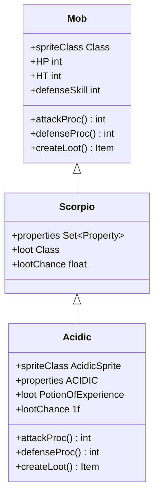

# Acidic 类文档

## 1. 基本信息
| 属性 | 值 |
|------|-----|
| 文件路径 | core/src/main/java/com/shatteredpixel/shatteredpixeldungeon/actors/mobs/Acidic.java |
| 包名 | com.shatteredpixel.shatteredpixeldungeon.actors.mobs |
| 类类型 | public class |
| 继承关系 | extends Scorpio |
| 代码行数 | 60 行 |

## 2. 类职责说明
Acidic（酸性蝎子）是 Scorpio（蝎子）的变种怪物，具有酸性攻击能力。攻击敌人时会施加 Ooze（粘液）效果，被近战攻击时也会溅射酸性粘液。掉落经验药水作为战利品。

## 4. 继承与协作关系


## 静态常量表
无静态常量。

## 实例字段表
| 字段名 | 类型 | 修饰符 | 说明 |
|--------|------|--------|------|
| spriteClass | Class | 初始化块 | 精灵类为 AcidicSprite |
| properties | Set\<Property\> | 继承+修改 | 添加 ACIDIC 属性 |
| loot | Class | 继承 | 掉落物为经验药水 |
| lootChance | float | 继承 | 100% 掉落概率 |

## 7. 方法详解

### attackProc
**签名**: `public int attackProc(Char enemy, int damage)`
**功能**: 攻击敌人时施加酸性粘液效果
**参数**:
- enemy: Char - 被攻击的目标
- damage: int - 基础伤害值
**返回值**: int - 最终伤害值
**实现逻辑**:
```java
// 第43-46行：攻击时施加 Ooze（粘液）效果
Buff.affect(enemy, Ooze.class).set(Ooze.DURATION);  // 给敌人施加粘液状态，持续固定时长
return super.attackProc(enemy, damage);              // 调用父类方法处理其余逻辑
```

### defenseProc
**签名**: `public int defenseProc(Char enemy, int damage)`
**功能**: 被近战攻击时溅射酸性粘液
**参数**:
- enemy: Char - 攻击者
- damage: int - 受到的伤害值
**返回值**: int - 最终伤害值
**实现逻辑**:
```java
// 第49-54行：防御时溅射酸性粘液
if (Dungeon.level.adjacent(pos, enemy.pos)) {        // 检查攻击者是否相邻（近战攻击）
    Buff.affect(enemy, Ooze.class).set(Ooze.DURATION); // 给攻击者施加粘液状态
}
return super.defenseProc(enemy, damage);             // 调用父类方法处理其余逻辑
```

### createLoot
**签名**: `public Item createLoot()`
**功能**: 创建掉落物（经验药水）
**返回值**: Item - 新创建的经验药水实例
**实现逻辑**:
```java
// 第57-59行：创建经验药水作为掉落物
return new PotionOfExperience();  // 返回新的经验药水实例
```

## 11. 使用示例
```java
// 在关卡生成时创建酸性蝎子
Acidic acidic = new Acidic();
acidic.pos = position;
Dungeon.level.mobs.add(acidic);

// 酸性蝎子被攻击时自动溅射粘液
// 攻击敌人时自动施加粘液效果
// 击杀后必定掉落经验药水
```

## 注意事项
1. 继承自 Scorpio，拥有蝎子的基础属性和行为
2. ACIDIC 属性标记表示该怪物具有酸性特性
3. 被远程攻击时不会溅射粘液（仅近战相邻时触发）
4. 100% 掉落经验药水，是获取经验的重要来源

## 最佳实践
1. 远程攻击酸性蝎子可以避免粘液溅射
2. 击杀酸性蝎子获取经验药水可以加速升级
3. 注意携带清洁工具或药物应对粘液效果