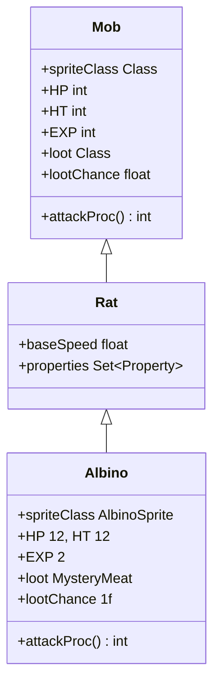

# Albino 类文档

## 1. 基本信息
| 属性 | 值 |
|------|-----|
| 文件路径 | core/src/main/java/com/shatteredpixel/shatteredpixeldungeon/actors/mobs/Albino.java |
| 包名 | com.shatteredpixel.shatteredpixeldungeon.actors.mobs |
| 类类型 | public class |
| 继承关系 | extends Rat |
| 代码行数 | 52 行 |

## 2. 类职责说明
Albino（白化鼠）是 Rat（老鼠）的变种怪物，拥有更高的生命值和攻击能力。攻击时有 50% 概率造成流血效果，掉落神秘肉作为战利品。是一种早期的危险敌人。

## 4. 继承与协作关系


## 静态常量表
无静态常量。

## 实例字段表
| 字段名 | 类型 | 修饰符 | 说明 |
|--------|------|--------|------|
| spriteClass | Class | 初始化块 | 精灵类为 AlbinoSprite |
| HP | int | 初始化块 | 当前生命值 12 |
| HT | int | 初始化块 | 最大生命值 12 |
| EXP | int | 初始化块 | 经验值 2 |
| loot | Class | 初始化块 | 掉落物为 MysteryMeat |
| lootChance | float | 初始化块 | 100% 掉落概率 |

## 7. 方法详解

### attackProc
**签名**: `public int attackProc(Char enemy, int damage)`
**功能**: 攻击敌人时有概率造成流血效果
**参数**:
- enemy: Char - 被攻击的目标
- damage: int - 基础伤害值
**返回值**: int - 最终伤害值
**实现逻辑**:
```java
// 第44-51行：攻击时有50%概率造成流血
damage = super.attackProc(enemy, damage);            // 先调用父类方法
if (damage > 0 && Random.Int(2) == 0) {              // 如果造成伤害且有50%概率
    Buff.affect(enemy, Bleeding.class).set(Random.NormalFloat(2, 3)); // 施加流血效果，持续2-3回合
}
return damage;                                        // 返回伤害值
```

## 11. 使用示例
```java
// 在关卡生成时创建白化鼠
Albino albino = new Albino();
albino.pos = position;
Dungeon.level.mobs.add(albino);

// 白化鼠攻击时可能造成流血
// 击杀后必定掉落神秘肉
```

## 注意事项
1. 继承自 Rat，具有老鼠的基础移动速度
2. 生命值 12 比普通老鼠更高
3. 流血效果会持续造成伤害，需要及时治疗
4. 100% 掉落神秘肉，可作为食物来源

## 最佳实践
1. 流血效果可通过绷带等物品治疗
2. 神秘肉可以烤熟后食用，避免负面效果
3. 注意保持距离，避免被连续攻击导致流血叠加