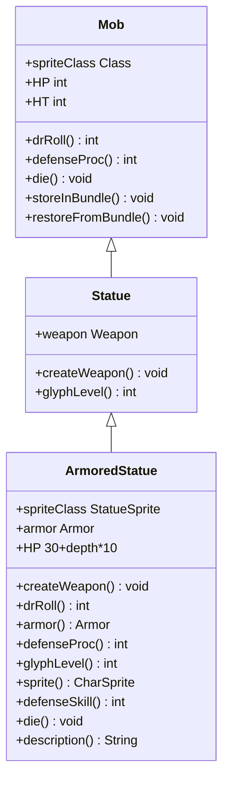

# ArmoredStatue 类文档

## 1. 基本信息
| 属性 | 值 |
|------|-----|
| 文件路径 | core/src/main/java/com/shatteredpixel/shatteredpixeldungeon/actors/mobs/ArmoredStatue.java |
| 包名 | com.shatteredpixel.shatteredpixeldungeon.actors.mobs |
| 类类型 | public class |
| 继承关系 | extends Statue |
| 代码行数 | 129 行 |

## 2. 类职责说明
ArmoredStatue（装甲雕像）是 Statue（雕像）的精英变种，装备随机武器和护甲。护甲提供额外伤害减免和符文效果，生命值是普通雕像的两倍。死亡时掉落装备的武器和护甲。

## 4. 继承与协作关系


## 静态常量表
| 常量名 | 类型 | 值 | 说明 |
|--------|------|-----|------|
| ARMOR | String | "armor" | Bundle 存储键名 |

## 实例字段表
| 字段名 | 类型 | 修饰符 | 说明 |
|--------|------|--------|------|
| spriteClass | Class | 初始化块 | 精灵类为 StatueSprite |
| armor | Armor | protected | 装备的护甲 |

## 7. 方法详解

### 构造函数
**签名**: `public ArmoredStatue()`
**功能**: 初始化装甲雕像，设置双倍生命值
**实现逻辑**:
```java
// 第42-47行：初始化双倍生命值
super();                              // 调用父类构造函数
HP = HT = 30 + Dungeon.depth * 10;    // 设置生命值为普通雕像的两倍
```

### createWeapon
**签名**: `public void createWeapon(boolean useDecks)`
**功能**: 创建武器和护甲
**参数**:
- useDecks: boolean - 是否使用卡牌系统
**实现逻辑**:
```java
// 第50-56行：创建武器和护甲
super.createWeapon(useDecks);          // 调用父类创建武器
armor = Generator.randomArmor();       // 随机生成护甲
armor.cursed = false;                  // 护甲不诅咒
armor.inscribe(Armor.Glyph.random());  // 随机添加符文
```

### storeInBundle
**签名**: `public void storeInBundle(Bundle bundle)`
**功能**: 将护甲状态保存到 Bundle
**参数**:
- bundle: Bundle - 存储容器
**实现逻辑**:
```java
// 第61-64行：保存护甲
super.storeInBundle(bundle);           // 保存父类数据
bundle.put(ARMOR, armor);              // 保存护甲
```

### restoreFromBundle
**签名**: `public void restoreFromBundle(Bundle bundle)`
**功能**: 从 Bundle 恢复护甲状态
**参数**:
- bundle: Bundle - 存储容器
**实现逻辑**:
```java
// 第67-70行：恢复护甲
super.restoreFromBundle(bundle);       // 恢复父类数据
armor = (Armor) bundle.get(ARMOR);     // 恢复护甲
```

### drRoll
**签名**: `public int drRoll()`
**功能**: 计算伤害减免值（包含护甲加成）
**返回值**: int - 总伤害减免值
**实现逻辑**:
```java
// 第73-75行：计算伤害减免
return super.drRoll() + Random.NormalIntRange(armor.DRMin(), armor.DRMax()); // 父类减免 + 护甲减免
```

### armor
**签名**: `public Armor armor()`
**功能**: 获取装备的护甲
**返回值**: Armor - 装备的护甲实例
**实现逻辑**:
```java
// 第78-80行：返回护甲
return armor;  // 用于符文计算
```

### defenseProc
**签名**: `public int defenseProc(Char enemy, int damage)`
**功能**: 防御时触发护甲符文效果
**参数**:
- enemy: Char - 攻击者
- damage: int - 受到的伤害
**返回值**: int - 最终伤害值
**实现逻辑**:
```java
// 第83-86行：触发护甲符文
damage = armor.proc(enemy, this, damage);  // 护甲处理伤害
return super.defenseProc(enemy, damage);   // 调用父类防御处理
```

### glyphLevel
**签名**: `public int glyphLevel(Class<? extends Armor.Glyph> cls)`
**功能**: 获取符文等级
**参数**:
- cls: Class<? extends Armor.Glyph> - 符文类型
**返回值**: int - 符文等级
**实现逻辑**:
```java
// 第89-95行：计算符文等级
if (armor != null && armor.hasGlyph(cls, this)) {  // 如果护甲有该符文
    return Math.max(super.glyphLevel(cls), armor.buffedLvl()); // 取最大等级
} else {
    return super.glyphLevel(cls);                   // 否则返回父类等级
}
```

### sprite
**签名**: `public CharSprite sprite()`
**功能**: 获取精灵并根据护甲设置外观
**返回值**: CharSprite - 角色精灵
**实现逻辑**:
```java
// 第98-106行：设置精灵外观
CharSprite sprite = super.sprite();       // 获取父类精灵
if (armor != null) {                       // 如果有护甲
    ((StatueSprite) sprite).setArmor(armor.tier); // 设置护甲层级外观
} else {
    ((StatueSprite) sprite).setArmor(3);   // 默认层级3
}
return sprite;
```

### defenseSkill
**签名**: `public int defenseSkill(Char enemy)`
**功能**: 计算防御技能值（考虑护甲闪避因子）
**参数**:
- enemy: Char - 攻击者
**返回值**: int - 防御技能值
**实现逻辑**:
```java
// 第109-111行：计算防御技能
return Math.round(armor.evasionFactor(this, super.defenseSkill(enemy))); // 护甲影响闪避
```

### die
**签名**: `public void die(Object cause)`
**功能**: 死亡时掉落护甲
**参数**:
- cause: Object - 死亡原因
**实现逻辑**:
```java
// 第114-118行：死亡掉落护甲
armor.identify(false);                     // 鉴定护甲
Dungeon.level.drop(armor, pos).sprite.drop(); // 掉落护甲
super.die(cause);                          // 调用父类死亡处理
```

### description
**签名**: `public String description()`
**功能**: 获取描述文本（包含武器和护甲信息）
**返回值**: String - 描述文本
**实现逻辑**:
```java
// 第121-127行：生成描述
String desc = Messages.get(this, "desc");  // 基础描述
if (weapon != null && armor != null) {     // 如果有武器和护甲
    desc += "\n\n" + Messages.get(this, "desc_arm_wep", weapon.name(), armor.name()); // 添加装备信息
}
return desc;
```

## 11. 使用示例
```java
// 在关卡生成时创建装甲雕像
ArmoredStatue statue = new ArmoredStatue();
statue.pos = position;
Dungeon.level.mobs.add(statue);

// 装甲雕像拥有武器和护甲
// 护甲提供额外伤害减免和符文效果
// 击杀后掉落武器和护甲
```

## 注意事项
1. 继承自 Statue，具有雕像的基础属性和行为
2. 生命值是普通雕像的两倍
3. 护甲的符文会在防御时触发效果
4. 死亡时掉落武器和护甲（护甲已鉴定）

## 最佳实践
1. 注意护甲符文效果，选择合适的战斗方式
2. 高伤害武器可以更快击杀
3. 掉落的护甲可能具有有用的符文
4. 护甲层级影响雕像外观，可用于预判