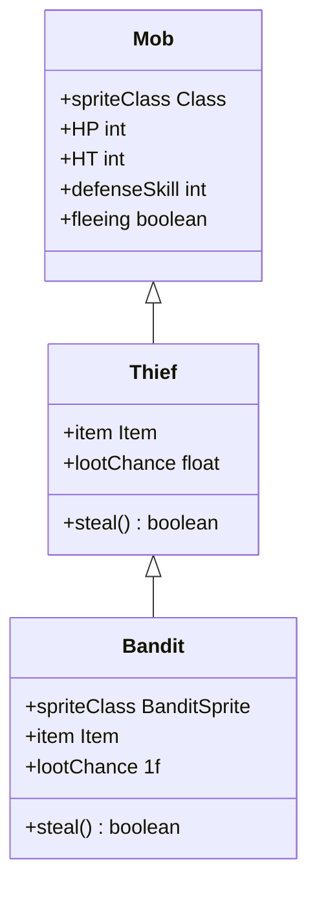

# Bandit 类文档

## 1. 基本信息
| 属性 | 值 |
|------|-----|
| 文件路径 | core/src/main/java/com/shatteredpixel/shatteredpixeldungeon/actors/mobs/Bandit.java |
| 包名 | com.shatteredpixel.shatteredpixeldungeon.actors.mobs |
| 类类型 | public class |
| 继承关系 | extends Thief |
| 代码行数 | 60 行 |

## 2. 类职责说明
Bandit（强盗）是 Thief（窃贼）的变种怪物，在偷窃成功后会对玩家施加致盲、中毒和残废效果。是一种危险的早期敌人，需要小心应对。

## 4. 继承与协作关系


## 静态常量表
无静态常量。

## 实例字段表
| 字段名 | 类型 | 修饰符 | 说明 |
|--------|------|--------|------|
| spriteClass | Class | 初始化块 | 精灵类为 BanditSprite |
| item | Item | public | 偷窃的物品 |
| lootChance | float | 初始化块 | 100% 掉落概率 |

## 7. 方法详解

### steal
**签名**: `protected boolean steal(Hero hero)`
**功能**: 偷窃玩家的物品并施加负面效果
**参数**:
- hero: Hero - 被偷窃的玩家
**返回值**: boolean - 是否偷窃成功
**实现逻辑**:
```java
// 第46-58行：偷窃并施加负面效果
if (super.steal(hero)) {                              // 如果父类偷窃成功
    Buff.prolong(hero, Blindness.class, Blindness.DURATION/2f); // 施加致盲效果（减半持续时间）
    Buff.affect(hero, Poison.class).set(Random.IntRange(5, 6)); // 施加中毒效果（5-6回合）
    Buff.prolong(hero, Cripple.class, Cripple.DURATION/2f);     // 施加残废效果（减半持续时间）
    Dungeon.observe();                                // 更新视野
    return true;                                      // 返回成功
} else {
    return false;                                     // 返回失败
}
```

## 11. 使用示例
```java
// 在关卡生成时创建强盗
Bandit bandit = new Bandit();
bandit.pos = position;
Dungeon.level.mobs.add(bandit);

// 强盗偷窃成功后施加致盲、中毒、残废
// 玩家需要准备好解药和绷带
```

## 注意事项
1. 继承自 Thief，具有窃贼的基础属性和偷窃行为
2. 偷窃成功后施加三种负面效果
3. 致盲和残废效果持续时间为正常的一半
4. 中毒效果持续 5-6 回合

## 最佳实践
1. 保持警惕，随时准备应对偷窃
2. 携带解毒药和治疗物品
3. 击杀强盗后夺回被偷的物品
4. 致盲时注意周围环境，避免误入陷阱