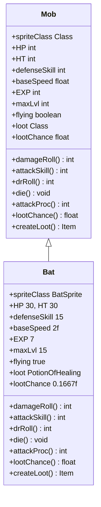

# Bat 类文档

## 1. 基本信息
| 属性 | 值 |
|------|-----|
| 文件路径 | core/src/main/java/com/shatteredpixel/shatteredpixeldungeon/actors/mobs/Bat.java |
| 包名 | com.shatteredpixel.shatteredpixeldungeon.actors.mobs |
| 类类型 | public class |
| 继承关系 | extends Mob |
| 代码行数 | 96 行 |

## 2. 类职责说明
Bat（蝙蝠）是一种飞行怪物，具有生命偷取能力。攻击敌人时会回复自身生命值，移动速度是普通怪物的两倍。掉落治疗药水，且有掉落数量限制（最多7瓶）。

## 4. 继承与协作关系


## 静态常量表
无静态常量。

## 实例字段表
| 字段名 | 类型 | 修饰符 | 说明 |
|--------|------|--------|------|
| spriteClass | Class | 初始化块 | 精灵类为 BatSprite |
| HP | int | 初始化块 | 当前生命值 30 |
| HT | int | 初始化块 | 最大生命值 30 |
| defenseSkill | int | 初始化块 | 防御技能 15 |
| baseSpeed | float | 初始化块 | 移动速度 2f（两倍速） |
| EXP | int | 初始化块 | 经验值 7 |
| maxLvl | int | 初始化块 | 最大等级 15 |
| flying | boolean | 初始化块 | 飞行状态 true |
| loot | Class | 初始化块 | 掉落物为治疗药水 |
| lootChance | float | 初始化块 | 基础掉落概率 0.1667f |

## 7. 方法详解

### damageRoll
**签名**: `public int damageRoll()`
**功能**: 计算伤害值
**返回值**: int - 随机伤害值（5-18）
**实现逻辑**:
```java
// 第52-54行：计算随机伤害
return Random.NormalIntRange(5, 18);  // 返回5到18之间的随机伤害
```

### attackSkill
**签名**: `public int attackSkill(Char target)`
**功能**: 获取攻击技能值
**参数**:
- target: Char - 攻击目标
**返回值**: int - 攻击技能值（16）
**实现逻辑**:
```java
// 第57-59行：返回攻击技能
return 16;  // 固定攻击技能值
```

### drRoll
**签名**: `public int drRoll()`
**功能**: 计算伤害减免值
**返回值**: int - 随机伤害减免值（0-4）
**实现逻辑**:
```java
// 第62-64行：计算伤害减免
return super.drRoll() + Random.NormalIntRange(0, 4);  // 父类减免 + 随机0-4
```

### die
**签名**: `public void die(Object cause)`
**功能**: 死亡时取消飞行状态
**参数**:
- cause: Object - 死亡原因
**实现逻辑**:
```java
// 第67-70行：死亡处理
flying = false;           // 取消飞行状态
super.die(cause);         // 调用父类死亡处理
```

### attackProc
**签名**: `public int attackProc(Char enemy, int damage)`
**功能**: 攻击时回复自身生命值（生命偷取）
**参数**:
- enemy: Char - 被攻击的目标
- damage: int - 基础伤害值
**返回值**: int - 最终伤害值
**实现逻辑**:
```java
// 第73-83行：生命偷取
damage = super.attackProc(enemy, damage);               // 调用父类方法
int reg = Math.min(damage - 4, HT - HP);                // 计算回复量（伤害-4，不超过缺失生命）
if (reg > 0) {                                          // 如果有回复量
    HP += reg;                                          // 增加生命值
    sprite.showStatusWithIcon(CharSprite.POSITIVE, Integer.toString(reg), FloatingText.HEALING); // 显示回复效果
}
return damage;
```

### lootChance
**签名**: `public float lootChance()`
**功能**: 计算实际掉落概率（受已掉落数量影响）
**返回值**: float - 实际掉落概率
**实现逻辑**:
```java
// 第86-88行：计算掉落概率
return super.lootChance() * ((7f - Dungeon.LimitedDrops.BAT_HP.count) / 7f); // 基础概率 * (剩余次数/7)
```

### createLoot
**签名**: `public Item createLoot()`
**功能**: 创建掉落物并增加掉落计数
**返回值**: Item - 治疗药水
**实现逻辑**:
```java
// 第91-94行：创建掉落物
Dungeon.LimitedDrops.BAT_HP.count++;  // 增加掉落计数
return super.createLoot();            // 返回治疗药水
```

## 11. 使用示例
```java
// 在关卡生成时创建蝙蝠
Bat bat = new Bat();
bat.pos = position;
Dungeon.level.mobs.add(bat);

// 蝙蝠攻击时回复生命
// 击杀后可能掉落治疗药水（最多7瓶）
```

## 注意事项
1. 飞行状态使其可以跨越障碍物和陷阱
2. 攻击伤害-4 为实际回复量（至少造成5点伤害才能回复）
3. 移动速度是普通怪物的两倍
4. 治疗药水有掉落上限（每层最多7瓶）

## 最佳实践
1. 高伤害武器可以快速击杀
2. 蝙蝠回复量有限，持续攻击可击杀
3. 远程攻击可以避免被生命偷取
4. 治疗药水掉落有限，珍惜使用