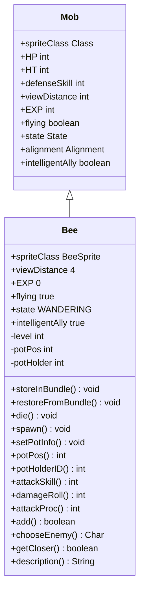

# Bee 类文档

## 1. 基本信息
| 属性 | 值 |
|------|-----|
| 文件路径 | core/src/main/java/com/shatteredpixel/shatteredpixeldungeon/actors/mobs/Bee.java |
| 包名 | com.shatteredpixel.shatteredpixeldungeon.actors.mobs |
| 类类型 | public class |
| 继承关系 | extends Mob |
| 代码行数 | 236 行 |

## 2. 类职责说明
Bee（蜜蜂）是一种特殊的飞行怪物，通常从蜂蜜罐中生成。具有智能AI系统，会保护蜂蜜罐或攻击罐子的持有者。可被蜜糖治疗药水转化为盟友。属性随关卡等级缩放。

## 4. 继承与协作关系


## 静态常量表
| 常量名 | 类型 | 值 | 说明 |
|--------|------|-----|------|
| LEVEL | String | "level" | Bundle 存储键 - 等级 |
| POTPOS | String | "potpos" | Bundle 存储键 - 罐子位置 |
| POTHOLDER | String | "potholder" | Bundle 存储键 - 罐子持有者 |
| ALIGMNENT | String | "alignment" | Bundle 存储键 - 阵营 |

## 实例字段表
| 字段名 | 类型 | 修饰符 | 说明 |
|--------|------|--------|------|
| spriteClass | Class | 初始化块 | 精灵类为 BeeSprite |
| viewDistance | int | 初始化块 | 视野距离 4 |
| EXP | int | 初始化块 | 经验值 0 |
| flying | boolean | 初始化块 | 飞行状态 true |
| state | State | 初始化块 | 初始状态为 WANDERING |
| intelligentAlly | boolean | 初始化块 | 智能盟友 true |
| level | int | private | 蜜蜂等级 |
| potPos | int | private | 罐子位置（-1表示丢失） |
| potHolder | int | private | 罐子持有者ID（-1表示无持有者） |

## 7. 方法详解

### storeInBundle
**签名**: `public void storeInBundle(Bundle bundle)`
**功能**: 保存蜜蜂状态到 Bundle
**参数**:
- bundle: Bundle - 存储容器
**实现逻辑**:
```java
// 第66-72行：保存所有状态
super.storeInBundle(bundle);            // 保存父类数据
bundle.put(LEVEL, level);               // 保存等级
bundle.put(POTPOS, potPos);             // 保存罐子位置
bundle.put(POTHOLDER, potHolder);       // 保存罐子持有者
bundle.put(ALIGMNENT, alignment);       // 保存阵营
```

### restoreFromBundle
**签名**: `public void restoreFromBundle(Bundle bundle)`
**功能**: 从 Bundle 恢复蜜蜂状态
**参数**:
- bundle: Bundle - 存储容器
**实现逻辑**:
```java
// 第75-81行：恢复所有状态
super.restoreFromBundle(bundle);                                    // 恢复父类数据
spawn(bundle.getInt(LEVEL));                                        // 生成蜜蜂
potPos = bundle.getInt(POTPOS);                                     // 恢复罐子位置
potHolder = bundle.getInt(POTHOLDER);                               // 恢复罐子持有者
if (bundle.contains(ALIGMNENT)) alignment = bundle.getEnum(ALIGMNENT, Alignment.class); // 恢复阵营
```

### die
**签名**: `public void die(Object cause)`
**功能**: 死亡时取消飞行状态
**参数**:
- cause: Object - 死亡原因
**实现逻辑**:
```java
// 第84-87行：死亡处理
flying = false;           // 取消飞行状态
super.die(cause);         // 调用父类死亡处理
```

### spawn
**签名**: `public void spawn(int level)`
**功能**: 根据等级生成蜜蜂属性
**参数**:
- level: int - 关卡等级
**实现逻辑**:
```java
// 第89-94行：设置等级和属性
this.level = level;                              // 设置等级
HT = (2 + level) * 4;                           // 计算最大生命值
defenseSkill = 9 + level;                       // 计算防御技能
```

### setPotInfo
**签名**: `public void setPotInfo(int potPos, Char potHolder)`
**功能**: 设置蜂蜜罐信息
**参数**:
- potPos: int - 罐子位置
- potHolder: Char - 罐子持有者
**实现逻辑**:
```java
// 第96-102行：设置罐子信息
this.potPos = potPos;                   // 设置罐子位置
if (potHolder == null)                  // 如果无持有者
    this.potHolder = -1;                // 设置为-1
else
    this.potHolder = potHolder.id();    // 设置持有者ID
```

### potPos
**签名**: `public int potPos()`
**功能**: 获取罐子位置
**返回值**: int - 罐子位置
**实现逻辑**:
```java
// 第104-106行：返回罐子位置
return potPos;
```

### potHolderID
**签名**: `public int potHolderID()`
**功能**: 获取罐子持有者ID
**返回值**: int - 持有者ID
**实现逻辑**:
```java
// 第108-110行：返回持有者ID
return potHolder;
```

### attackSkill
**签名**: `public int attackSkill(Char target)`
**功能**: 获取攻击技能值（等于防御技能）
**参数**:
- target: Char - 攻击目标
**返回值**: int - 攻击技能值
**实现逻辑**:
```java
// 第113-115行：返回防御技能值
return defenseSkill;  // 攻击技能等于防御技能
```

### damageRoll
**签名**: `public int damageRoll()`
**功能**: 计算伤害值（基于最大生命值）
**返回值**: int - 随机伤害值
**实现逻辑**:
```java
// 第118-120行：计算随机伤害
return Random.NormalIntRange(HT / 10, HT / 4);  // 伤害范围为最大生命值的1/10到1/4
```

### attackProc
**签名**: `public int attackProc(Char enemy, int damage)`
**功能**: 攻击时让敌人锁定自己
**参数**:
- enemy: Char - 被攻击的目标
- damage: int - 基础伤害值
**返回值**: int - 最终伤害值
**实现逻辑**:
```java
// 第123-129行：攻击时激怒敌人
damage = super.attackProc(enemy, damage);            // 调用父类方法
if (enemy instanceof Mob) {                          // 如果敌人是怪物
    ((Mob)enemy).aggro(this);                        // 让敌人攻击自己
}
return damage;
```

### add
**签名**: `public boolean add(Buff buff)`
**功能**: 添加Buff时处理盟友状态
**参数**:
- buff: Buff - 要添加的Buff
**返回值**: boolean - 是否成功添加
**实现逻辑**:
```java
// 第132-142行：处理盟友Buff
if (super.add(buff)) {                               // 如果父类添加成功
    if (buff instanceof AllyBuff) {                  // 如果是盟友Buff
        intelligentAlly = false;                     // 取消智能盟友
        setPotInfo(-1, null);                        // 清除罐子信息
    }
    return true;
}
return false;
```

### chooseEnemy
**签名**: `protected Char chooseEnemy()`
**功能**: 选择攻击目标（复杂AI逻辑）
**返回值**: Char - 选中的敌人
**实现逻辑**:
```java
// 第145-210行：复杂的目标选择逻辑
// 如果是盟友或罐子丢失，使用默认AI
if (alignment == Alignment.ALLY || (potHolder == -1 && potPos == -1)) {
    return super.chooseEnemy();
}
// 如果有人持有罐子，攻击持有者
else if (Actor.findById(potHolder) != null) {
    return (Char) Actor.findById(potHolder);
}
// 如果罐子在地面上，寻找罐子附近3格内的敌人
else {
    // 处理激怒标记和寻找最近敌人
    // 优先攻击持有者，其次是罐子附近的敌人
}
```

### getCloser
**签名**: `protected boolean getCloser(int target)`
**功能**: 移动逻辑（考虑罐子位置）
**参数**:
- target: int - 目标位置
**返回值**: boolean - 是否成功移动
**实现逻辑**:
```java
// 第213-226行：移动逻辑
// 盟友无敌人时跟随英雄
if (alignment == Alignment.ALLY && enemy == null && buffs(AllyBuff.class).isEmpty()) {
    target = Dungeon.hero.pos;
}
// 追击罐子持有者
else if (enemy != null && Actor.findById(potHolder) == enemy) {
    target = enemy.pos;
}
// 返回罐子位置
else if (potPos != -1 && (state == WANDERING || Dungeon.level.distance(target, potPos) > 3)) {
    this.target = target = potPos;
}
return super.getCloser(target);
```

### description
**签名**: `public String description()`
**功能**: 获取描述文本
**返回值**: String - 描述文本
**实现逻辑**:
```java
// 第229-235行：返回描述
if (alignment == Alignment.ALLY && buffs(AllyBuff.class).isEmpty()) {
    return Messages.get(this, "desc_honey");  // 蜜糖蜜蜂描述
} else {
    return super.description();                // 默认描述
}
```

## 11. 使用示例
```java
// 从蜂蜜罐生成蜜蜂
Bee bee = new Bee();
bee.spawn(Dungeon.depth);
bee.setPotInfo(potPos, null);
Dungeon.level.mobs.add(bee);

// 蜜蜂会保护罐子，攻击附近敌人
// 使用蜜糖治疗药水可以使其成为盟友
```

## 注意事项
1. 代码注释提到AI逻辑变得复杂，需要重构（FIXME）
2. 蜜蜂属性随等级缩放，高级蜜蜂更强
3. 智能盟友模式下会自动跟随玩家
4. 罐子丢失（potPos=-1）时使用默认AI

## 最佳实践
1. 蜜糖治疗药水可以将蜜蜂转化为永久盟友
2. 蜜蜂飞行可以穿越障碍物
3. 盟友蜜蜂不会提供经验值
4. 注意保护蜜蜂，它们是有效的战斗伙伴