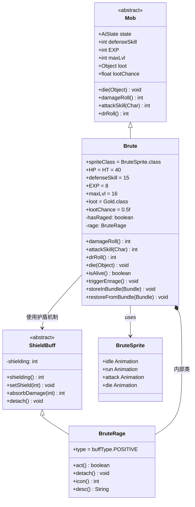
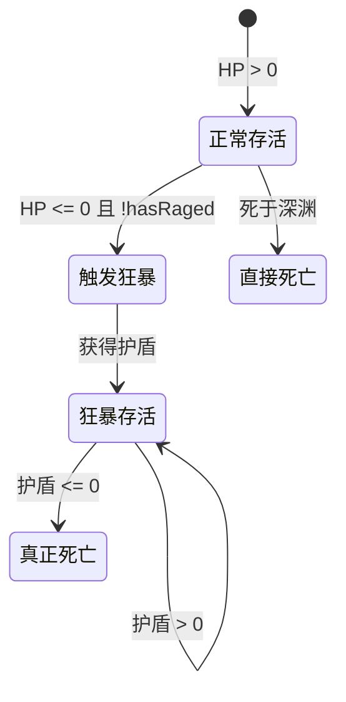
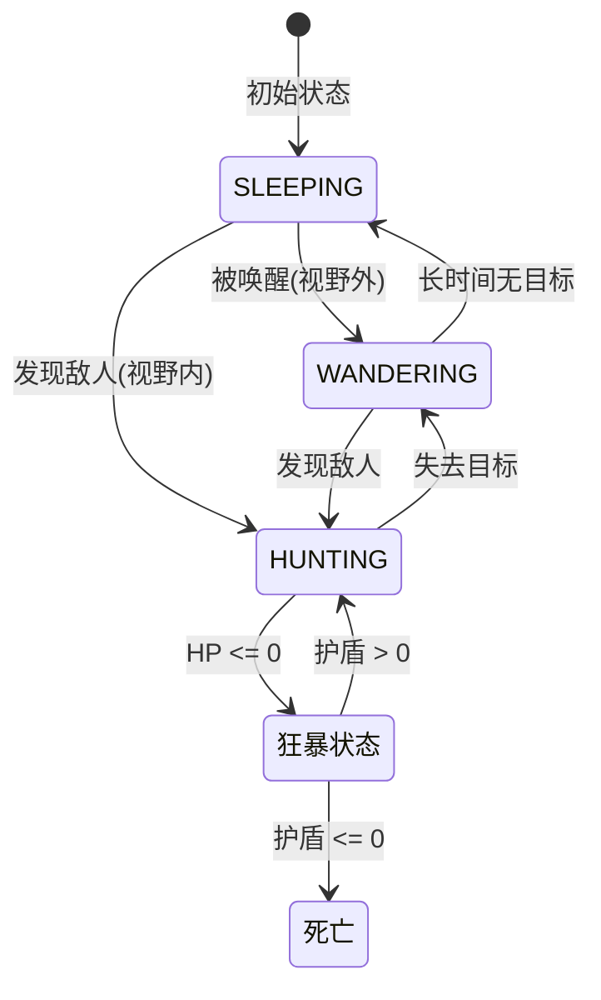

# Brute 源码详解

## 1. 基本信息

| 属性 | 值 |
|------|-----|
| **文件路径** | core/src/main/java/com/shatteredpixel/shatteredpixeldungeon/actors/mobs/Brute.java |
| **包名** | com.shatteredpixel.shatteredpixeldungeon.actors.mobs |
| **类类型** | public class |
| **继承关系** | extends Mob |
| **代码行数** | 170 |
| **中文名称** | 蛮兵 |
| **怪物类型** | 中等难度敌人（监狱/矿洞区域常见） |

---

## 类职责

Brute（蛮兵）是游戏中的中型敌人，具有独特的"狂暴复活"机制。

**核心职责**：

1. **战斗威胁**：拥有较高的生命值和伤害输出
2. **狂暴机制**：死亡时有概率触发狂暴状态，获得护盾并继续战斗
3. **金币掉落**：高概率掉落金币，鼓励玩家击杀

**设计特点**：
- 死亡时触发"狂暴"状态，获得临时护盾（生命值一半 + 4）
- 狂暴状态下伤害大幅提升（从5-25提升至15-40）
- 护盾每回合衰减，护盾归零后真正死亡
- 深渊死亡不触发狂暴（防止连锁问题）

---

## 4. 继承与协作关系



---

## 静态常量表

| 常量 | 类型 | 值 | 用途 |
|------|------|-----|------|
| `HAS_RAGED` | String | "has_raged" | Bundle存储键，用于保存狂暴状态 |

**使用的外部常量**：

| 常量 | 来源 | 用途 |
|------|------|------|
| `BuffIndicator.FURY` | BuffIndicator | 狂暴Buff的UI图标索引 |
| `SpellSprite.BERSERK` | SpellSprite | 狂暴触发时的视觉效果 |
| `FloatingText.SHIELDING` | FloatingText | 护盾获取的浮动文字类型 |
| `CharSprite.POSITIVE` | CharSprite | 正面状态的文字颜色 |

---

## 实例字段表

### 主类字段

| 字段名 | 类型 | 初始值 | 说明 |
|--------|------|--------|------|
| `spriteClass` | Class | BruteSprite.class | 精灵类，决定蛮兵的视觉表现 |
| `HP` | int | 40 | 当前生命值 |
| `HT` | int | 40 | 最大生命值 |
| `defenseSkill` | int | 15 | 防御技能值，影响闪避率 |
| `EXP` | int | 8 | 击杀经验值 |
| `maxLvl` | int | 16 | 最大有效等级 |
| `loot` | Class | Gold.class | 掉落物类型（金币） |
| `lootChance` | float | 0.5f | 基础掉落概率（50%） |
| `hasRaged` | boolean | false | 是否已触发过狂暴（防止重复触发） |
| `rage` | BruteRage | null | 狂暴Buff缓存 |

### 内部类 BruteRage 字段

| 字段名 | 类型 | 值 | 说明 |
|--------|------|-----|------|
| `type` | buffType | POSITIVE | 正面Buff类型 |
| `shielding` | int | 动态 | 护盾值（继承自ShieldBuff） |

---

## 7. 方法详解

### 1. 实例初始化块

```java
{
    spriteClass = BruteSprite.class;
    
    HP = HT = 40;
    defenseSkill = 15;
    
    EXP = 8;
    maxLvl = 16;
    
    loot = Gold.class;
    lootChance = 0.5f;
}
```

**逐行解释**：

| 行号 | 代码 | 作用 |
|------|------|------|
| 43 | `spriteClass = BruteSprite.class;` | 设置精灵类为BruteSprite |
| 45 | `HP = HT = 40;` | 设置生命值为40点（中等偏上） |
| 46 | `defenseSkill = 15;` | 防御技能为15点 |
| 48 | `EXP = 8;` | 击杀获得8点经验 |
| 49 | `maxLvl = 16;` | 最大有效等级16 |
| 51 | `loot = Gold.class;` | 掉落物为金币 |
| 52 | `lootChance = 0.5f;` | 50%掉落概率 |

---

### 2. damageRoll() 方法

```java
@Override
public int damageRoll() {
    return buff(BruteRage.class) != null ?
            Random.NormalIntRange( 15, 40 ) :
            Random.NormalIntRange( 5, 25 );
}
```

**方法作用**：返回蛮兵攻击时造成的伤害值，根据是否狂暴状态动态调整。

**逐行解释**：

| 行号 | 代码 | 作用 |
|------|------|------|
| 58-61 | `buff(BruteRage.class) != null ? ... : ...` | 三元运算符判断狂暴状态 |
| 59 | `Random.NormalIntRange(15, 40)` | 狂暴状态：15-40点伤害 |
| 60 | `Random.NormalIntRange(5, 25)` | 普通状态：5-25点伤害 |

**伤害对比分析**：

| 状态 | 最低伤害 | 最高伤害 | 平均伤害 | 伤害提升 |
|------|---------|---------|---------|---------|
| 普通状态 | 5 | 25 | 15 | - |
| 狂暴状态 | 15 | 40 | 27.5 | +83% |

---

### 3. attackSkill() 方法

```java
@Override
public int attackSkill( Char target ) {
    return 20;
}
```

**方法作用**：返回蛮兵对目标攻击时的技能值。

| 参数 | 说明 |
|------|------|
| target | 攻击目标（未使用） |
| 返回值 | 固定20点攻击技能值 |

**命中率计算**：
- 命中率 = 攻击技能 / (攻击技能 + 目标防御技能)
- 对防御技能5的玩家：命中率 = 20/(20+5) = 80%
- 对防御技能15的玩家：命中率 = 20/(20+15) ≈ 57%

---

### 4. drRoll() 方法

```java
@Override
public int drRoll() {
    return super.drRoll() + Random.NormalIntRange(0, 8);
}
```

**方法作用**：返回蛮兵的伤害减免值。

| 参数 | 说明 |
|------|------|
| 返回值 | 父类减免 + 0-8点随机减免 |

**伤害减免分析**：
- 基础减免（父类）：通常为0
- 额外减免：0-8点（均匀分布）
- 平均减免：4点
- 相比Skeleton（0-5点），蛮兵有更强的防御能力

---

### 5. die() 方法

```java
@Override
public void die(Object cause) {
    super.die(cause);

    if (cause == Chasm.class){
        hasRaged = true; //don't let enrage trigger for chasm deaths
    }
}
```

**方法作用**：处理蛮兵死亡逻辑，标记深渊死亡防止狂暴触发。

**逐行解释**：

| 行号 | 代码 | 作用 |
|------|------|------|
| 76 | `super.die(cause)` | 调用父类死亡处理 |
| 78-80 | `if (cause == Chasm.class) { hasRaged = true; }` | 如果死于深渊，标记已狂暴，阻止后续狂暴触发 |

**设计意义**：
- 防止深渊死亡后狂暴导致的不一致状态
- 避免视觉和逻辑上的问题（如深渊后仍出现狂暴特效）

---

### 6. isAlive() 方法 —— 核心狂暴触发逻辑

```java
//cache this buff to prevent having to call buff(...) a bunch in isAlive
private BruteRage rage;

@Override
public boolean isAlive() {
    if (super.isAlive()){
        return true;
    } else {
        if (!hasRaged){
            triggerEnrage();
        }
        if (rage == null){
            for (BruteRage b : buffs(BruteRage.class)){
                rage = b;
            }
        }
        return rage != null && rage.shielding() > 0;
    }
}
```

**方法作用**：判断蛮兵是否存活，实现"假死-狂暴"机制。

**逐行解释**：

| 行号 | 代码 | 作用 |
|------|------|------|
| 84 | `private BruteRage rage;` | 缓存狂暴Buff引用，避免重复查询 |
| 88-90 | `if (super.isAlive()) { return true; }` | 如果真正存活，返回true |
| 91-93 | `if (!hasRaged) { triggerEnrage(); }` | 如果未狂暴过，触发狂暴 |
| 94-97 | 遍历并缓存BruteRage Buff | 获取狂暴Buff引用 |
| 99 | `return rage != null && rage.shielding() > 0` | 有狂暴且护盾>0时视为存活 |

**状态流程图**：



---

### 7. triggerEnrage() 方法 —— 狂暴触发

```java
protected void triggerEnrage(){
    rage = Buff.affect(this, BruteRage.class);
    rage.setShield(HT/2 + 4);
    sprite.showStatusWithIcon( CharSprite.POSITIVE, Integer.toString(HT/2), FloatingText.SHIELDING );
    if (Dungeon.level.heroFOV[pos]) {
        SpellSprite.show( this, SpellSprite.BERSERK);
    }
    spend( TICK );
    hasRaged = true;
}
```

**方法作用**：触发狂暴状态，获得护盾并显示特效。

**逐行解释**：

| 行号 | 代码 | 作用 |
|------|------|------|
| 104 | `rage = Buff.affect(this, BruteRage.class)` | 添加狂暴Buff |
| 105 | `rage.setShield(HT/2 + 4)` | 设置护盾值为生命值一半+4（40/2+4=24） |
| 106 | `sprite.showStatusWithIcon(...)` | 显示护盾获取浮动文字 |
| 107-109 | `if (Dungeon.level.heroFOV[pos]) { SpellSprite.show(...) }` | 在玩家视野内显示狂暴特效 |
| 110 | `spend(TICK)` | 消耗一回合（防止立即行动） |
| 111 | `hasRaged = true` | 标记已狂暴 |

**护盾计算**：
- 基础护盾 = HT / 2 + 4 = 40 / 2 + 4 = 24点

---

### 8. storeInBundle() 方法

```java
private static final String HAS_RAGED = "has_raged";

@Override
public void storeInBundle(Bundle bundle) {
    super.storeInBundle(bundle);
    bundle.put(HAS_RAGED, hasRaged);
}
```

**方法作用**：保存蛮兵状态到Bundle。

| 步骤 | 代码 | 作用 |
|------|------|------|
| 1 | `super.storeInBundle(bundle)` | 调用父类存储逻辑 |
| 2 | `bundle.put(HAS_RAGED, hasRaged)` | 保存狂暴状态标记 |

---

### 9. restoreFromBundle() 方法

```java
@Override
public void restoreFromBundle(Bundle bundle) {
    super.restoreFromBundle(bundle);
    hasRaged = bundle.getBoolean(HAS_RAGED);
}
```

**方法作用**：从Bundle恢复蛮兵状态。

| 步骤 | 代码 | 作用 |
|------|------|------|
| 1 | `super.restoreFromBundle(bundle)` | 调用父类恢复逻辑 |
| 2 | `hasRaged = bundle.getBoolean(HAS_RAGED)` | 恢复狂暴状态标记 |

---

## 内部类 BruteRage 详解

### 概述

BruteRage是Brute的内部静态类，继承自ShieldBuff，实现狂暴状态的护盾机制。

```java
public static class BruteRage extends ShieldBuff {
    
    {
        type = buffType.POSITIVE;
    }
    
    // ...
}
```

---

### act() 方法 —— 护盾衰减逻辑

```java
@Override
public boolean act() {
    
    if (target.HP > 0){
        detach();
        return true;
    }
    
    absorbDamage( Math.round(4*AscensionChallenge.statModifier(target)));
    
    if (shielding() <= 0){
        target.die(null);
    }
    
    spend( TICK );
    
    return true;
}
```

**方法作用**：每回合执行一次，处理护盾衰减。

**逐行解释**：

| 行号 | 代码 | 作用 |
|------|------|------|
| 137-140 | `if (target.HP > 0) { detach(); return true; }` | 如果目标恢复生命值（如治疗），移除狂暴 |
| 142 | `absorbDamage(Math.round(4*AscensionChallenge.statModifier(target)))` | 护盾每回合衰减4点（受飞升挑战修正） |
| 144-146 | `if (shielding() <= 0) { target.die(null); }` | 护盾耗尽时真正死亡 |
| 148 | `spend(TICK)` | 等待下一回合 |
| 150 | `return true` | 返回true表示继续执行 |

**护盾衰减计算**：

| 情况 | 每回合衰减 | 存活回合数 |
|------|-----------|-----------|
| 普通游戏 | 4点 | 24÷4 = 6回合 |
| 飞升挑战 | 4×修正系数 | 根据系数减少 |

---

### detach() 方法

```java
@Override
public void detach() {
    super.detach();
    decShield(shielding()); //clear shielding to track that this was detached
}
```

**方法作用**：移除Buff时清除护盾值。

| 步骤 | 代码 | 作用 |
|------|------|------|
| 1 | `super.detach()` | 调用父类移除逻辑 |
| 2 | `decShield(shielding())` | 清零护盾值 |

**设计意义**：
- 确保护盾值正确归零
- 便于`isAlive()`判断`shielding() > 0`

---

### icon() 方法

```java
@Override
public int icon () {
    return BuffIndicator.FURY;
}
```

**方法作用**：返回Buff图标的资源索引。

| 返回值 | 说明 |
|--------|------|
| `BuffIndicator.FURY` | 狂暴图标（红色愤怒标志） |

---

### desc() 方法

```java
@Override
public String desc () {
    return Messages.get(this, "desc", shielding());
}
```

**方法作用**：返回Buff的描述文本。

| 参数 | 说明 |
|------|------|
| 返回值 | 格式化的描述字符串，包含当前护盾值 |

---

## AI行为说明

Brute类没有重写AI相关方法，使用Mob类的标准AI行为：



**行为特点**：
- 初始为睡眠状态
- 发现敌人后进入追击状态
- 生命值归零时触发狂暴
- 狂暴状态下继续战斗直到护盾耗尽

---

## 属性总结表

### 战斗属性

| 属性 | 值 | 评价 |
|------|-----|------|
| HP | 40 | 中等偏高 |
| 攻击伤害（普通） | 5-25 | 波动大，平均15 |
| 攻击伤害（狂暴） | 15-40 | 高伤害，平均27.5 |
| 攻击技能 | 20 | 较高 |
| 防御技能 | 15 | 中等 |
| 伤害减免 | 0-8 | 有一定防御能力 |
| 经验值 | 8 | 较高经验 |
| 最大有效等级 | 16 | 矿洞区域有效 |

### 特殊能力

| 能力 | 描述 |
|------|------|
| 狂暴复活 | 死亡时获得24点护盾继续战斗 |
| 伤害提升 | 狂暴状态伤害提升约83% |
| 护盾衰减 | 每回合护盾减少4点 |
| 深渊豁免 | 死于深渊不触发狂暴 |

### 生成位置

| 区域 | 出现层数 |
|------|----------|
| 监狱 | 可能在后期出现 |
| 矿洞 | 主要分布区域 |

---

## 11. 使用示例

### 1. 创建类似狂暴机制的敌人

```java
public class Berserker extends Mob {
    
    protected boolean hasRaged = false;
    
    @Override
    public boolean isAlive() {
        if (super.isAlive()) {
            return true;
        } else {
            if (!hasRaged) {
                triggerBerserk();
            }
            return buff(BerserkShield.class) != null 
                && buff(BerserkShield.class).shielding() > 0;
        }
    }
    
    protected void triggerBerserk() {
        BerserkShield shield = Buff.affect(this, BerserkShield.class);
        shield.setShield(HT); // 满血护盾
        hasRaged = true;
    }
    
    @Override
    public int damageRoll() {
        return hasRaged ? 
            Random.NormalIntRange(20, 50) : 
            Random.NormalIntRange(10, 30);
    }
}
```

### 2. 检测蛮兵状态

```java
// 检查是否处于狂暴状态
BruteRage rage = brute.buff(BruteRage.class);
if (rage != null) {
    int shield = rage.shielding();
    GLog.i("蛮兵正处于狂暴状态，剩余护盾: " + shield);
}

// 检查是否可以触发狂暴
if (!brute.hasRaged && brute.HP <= 0) {
    GLog.w("蛮兵即将触发狂暴！");
}
```

### 3. 预估击杀所需伤害

```java
public int estimateKillDamage(Brute brute) {
    // 基础生命值
    int totalHP = brute.HT;
    
    // 如果未狂暴过，需要额外伤害
    if (!brute.hasRaged) {
        totalHP += brute.HT / 2 + 4; // 护盾值
    }
    
    // 如果正在狂暴中，加上当前护盾
    BruteRage rage = brute.buff(BruteRage.class);
    if (rage != null) {
        totalHP += rage.shielding();
    }
    
    return totalHP;
}
```

### 4. 强制跳过狂暴

```java
// 方法1：使用深渊击杀
public void killViaChasm(Brute brute) {
    // 深渊击杀会设置 hasRaged = true
    Dungeon.level.drop(brute, brute.pos);
    Chasm.mobFall(brute);
}

// 方法2：直接标记
public void forceKill(Brute brute) {
    brute.hasRaged = true; // 阻止狂暴触发
    brute.die(this);
}
```

---

## 注意事项

### 1. 狂暴触发条件

- **触发时机**：`isAlive()` 返回false时检查
- **触发次数**：每个蛮兵只能触发一次
- **深渊豁免**：死于深渊(`Chasm.class`)不触发狂暴
- **护盾持久性**：护盾不随存档消失，会正确保存/恢复

### 2. 护盾衰减机制

- 每回合自动衰减4点
- 受飞升挑战修正影响
- 护盾归零触发真正死亡
- 如果目标恢复生命值，狂暴Buff会自动移除

### 3. 状态保存

```java
// hasRaged 必须正确保存
@Override
public void storeInBundle(Bundle bundle) {
    super.storeInBundle(bundle);
    bundle.put(HAS_RAGED, hasRaged); // 关键！
}
```

### 4. 线程安全

- `rage` 字段是缓存优化，不是线程安全的
- 如果需要多线程访问，应直接使用 `buff(BruteRage.class)`

### 5. 与其他Buff的交互

- 狂暴护盾与其他护盾共用ShieldBuff系统
- 护盾消耗顺序由 `shieldUsePriority` 决定
- BruteRage使用默认优先级(0)

---

## 最佳实践

### 1. 应对蛮兵的策略

```java
// 玩家策略建议：
// 1. 预估总血量 = 40 + 24 = 64点伤害
// 2. 护盾每回合减少4点，可拖延时间
// 3. 狂暴状态下伤害更高，尽快击杀
// 4. 使用深渊击杀可跳过狂暴
```

### 2. 实现自定义护盾Buff

```java
public class CustomShieldBuff extends ShieldBuff {
    
    {
        type = buffType.POSITIVE;
        shieldUsePriority = 1; // 更高优先级
    }
    
    @Override
    public boolean act() {
        // 自定义衰减逻辑
        absorbDamage(2); // 每回合减少2点
        
        if (shielding() <= 0) {
            detach();
        }
        
        spend(TICK);
        return true;
    }
    
    @Override
    public int icon() {
        return BuffIndicator.BARRIER;
    }
}
```

### 3. 监听狂暴触发

```java
// 在自定义的isAlive重写中添加回调
@Override
public boolean isAlive() {
    if (super.isAlive()) {
        return true;
    } else {
        if (!hasRaged) {
            // 触发前回调
            onEnrageTrigger();
            triggerEnrage();
            // 触发后回调
            onEnrageComplete();
        }
        // ...
    }
}
```

### 4. 护盾值UI显示

```java
// 获取护盾值用于UI显示
public String getShieldStatus(Brute brute) {
    BruteRage rage = brute.buff(BruteRage.class);
    if (rage != null) {
        return "护盾: " + rage.shielding();
    }
    return "无护盾";
}
```

---

## 与相关类的对比

| 类 | HP | 伤害 | 防御 | 特殊能力 | 出现区域 |
|----|-----|------|------|---------|---------|
| **Brute** | 40 | 5-25(狂暴15-40) | 15 | 狂暴复活 | 矿洞 |
| Skeleton | 25 | 2-10 | 9 | 死亡爆炸 | 监狱 |
| Guard | 30 | 5-10 | 10 | 照明弹 | 监狱 |
| DM100 | 20 | 6-12 | 8 | 电击攻击 | 矿洞 |
| Shaman | 15 | 5-15 | 8 | 远程攻击 | 矿洞 |

---

## 技术细节

### 1. 护盾值计算

```
护盾值 = HT/2 + 4 = 40/2 + 4 = 24
```

### 2. 狂暴存活回合数

```
存活回合数 = 护盾值 / 每回合衰减 = 24 / 4 = 6回合
```

### 3. 伤害提升比例

```
普通平均伤害: (5+25)/2 = 15
狂暴平均伤害: (15+40)/2 = 27.5
提升比例: (27.5-15)/15 = 83.3%
```

### 4. 飞升挑战修正

```java
// AscensionChallenge.statModifier 返回修正系数
// 普通模式: 1.0
// 飞升挑战: 可能 > 1.0，增加护盾衰减速度
```

---

## 版本历史

| 版本 | 变更 |
|------|------|
| 初始版本 | 实现蛮兵基础属性和狂暴机制 |
| 深渊处理 | 添加深渊死亡不触发狂暴的逻辑 |
| 护盾缓存 | 添加rage字段缓存优化，避免重复buff查询 |
| 飞升挑战 | 集成AscensionChallenge.statModifier修正护盾衰减 |

---

## 相关文件

- `BruteSprite.java` - 蛮兵精灵类
- `ShieldBuff.java` - 护盾Buff基类
- `BuffIndicator.java` - Buff图标定义
- `SpellSprite.java` - 法术视觉效果
- `FloatingText.java` - 浮动文字显示
- `AscensionChallenge.java` - 飞升挑战修正