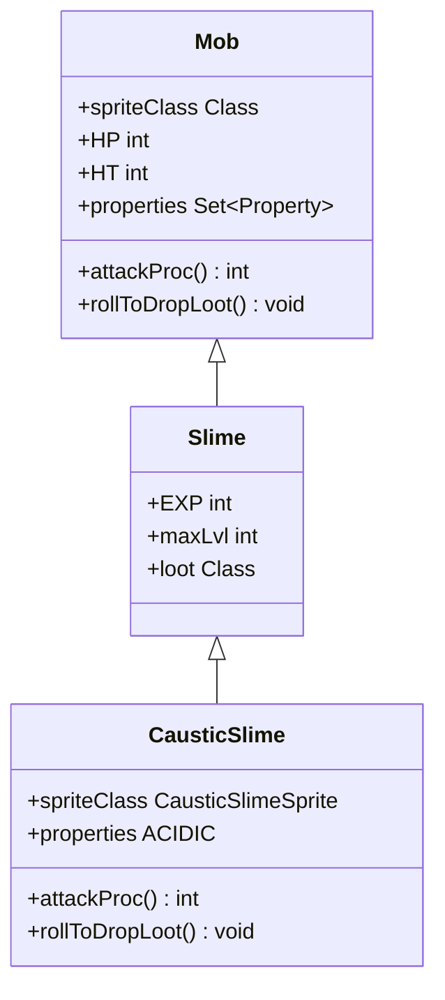

# CausticSlime 类文档

## 1. 基本信息
| 属性 | 值 |
|------|-----|
| 文件路径 | core/src/main/java/com/shatteredpixel/shatteredpixeldungeon/actors/mobs/CausticSlime.java |
| 包名 | com.shatteredpixel.shatteredpixeldungeon.actors.mobs |
| 类类型 | public class |
| 继承关系 | extends Slime |
| 代码行数 | 63 行 |

## 2. 类职责说明
CausticSlime（腐蚀史莱姆）是 Slime（史莱姆）的变种怪物，攻击时有 50% 概率施加 Ooze（粘液）效果。死亡时掉落 GooBlob（粘液球）作为任务物品。具有 ACIDIC 属性标记。

## 4. 继承与协作关系


## 静态常量表
无静态常量。

## 实例字段表
| 字段名 | 类型 | 修饰符 | 说明 |
|--------|------|--------|------|
| spriteClass | Class | 初始化块 | 精灵类为 CausticSlimeSprite |
| properties | Set\<Property\> | 继承+修改 | 添加 ACIDIC 属性 |

## 7. 方法详解

### attackProc
**签名**: `public int attackProc(Char enemy, int damage)`
**功能**: 攻击时有概率施加粘液效果
**参数**:
- enemy: Char - 被攻击的目标
- damage: int - 基础伤害值
**返回值**: int - 最终伤害值
**实现逻辑**:
```java
// 第42-49行：攻击时施加粘液
if (Random.Int(2) == 0) {                            // 50%概率
    Buff.affect(enemy, Ooze.class).set(Ooze.DURATION); // 施加粘液效果
    enemy.sprite.burst(0x000000, 5);                  // 显示黑色爆发特效
}
return super.attackProc(enemy, damage);              // 调用父类方法
```

### rollToDropLoot
**签名**: `public void rollToDropLoot()`
**功能**: 掉落粘液球
**实现逻辑**:
```java
// 第52-62行：掉落粘液球
if (Dungeon.hero.lvl > maxLvl + 2) return;           // 如果玩家等级过高则不掉落
super.rollToDropLoot();                              // 调用父类掉落逻辑

int ofs;
do {
    ofs = PathFinder.NEIGHBOURS8[Random.Int(8)];     // 随机选择相邻位置
} while (Dungeon.level.solid[pos + ofs] && !Dungeon.level.passable[pos + ofs]); // 确保位置有效
Dungeon.level.drop(new GooBlob(), pos + ofs).sprite.drop(pos); // 在相邻位置掉落粘液球
```

## 11. 使用示例
```java
// 在关卡生成时创建腐蚀史莱姆
CausticSlime slime = new CausticSlime();
slime.pos = position;
Dungeon.level.mobs.add(slime);

// 攻击时有50%概率施加粘液
// 死亡时掉落粘液球（任务物品）
```

## 注意事项
1. 继承自 Slime，具有史莱姆的基础属性
2. ACIDIC 属性表示具有酸性特性
3. 粘液效果会持续造成伤害
4. 粘液球是任务物品，用于制作药剂

## 最佳实践
1. 远程攻击可以避免粘液效果
2. 击杀后收集粘液球完成任务
3. 携带清洁物品应对粘液效果
4. 注意粘液球的掉落位置可能在相邻格子