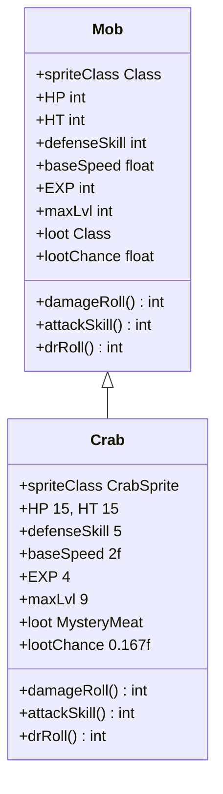

# Crab 类文档

## 1. 基本信息
| 属性 | 值 |
|------|-----|
| 文件路径 | core/src/main/java/com/shatteredpixel/shatteredpixeldungeon/actors/mobs/Crab.java |
| 包名 | com.shatteredpixel.shatteredpixeldungeon.actors.mobs |
| 类类型 | public class |
| 继承关系 | extends Mob |
| 代码行数 | 59 行 |

## 2. 类职责说明
Crab（螃蟹）是一种早期的近战怪物，拥有较高的伤害减免和两倍移动速度。生命值适中，是玩家在早期关卡常见的中等难度敌人。掉落神秘肉作为食物来源。

## 4. 继承与协作关系


## 静态常量表
无静态常量。

## 实例字段表
| 字段名 | 类型 | 修饰符 | 说明 |
|--------|------|--------|------|
| spriteClass | Class | 初始化块 | 精灵类为 CrabSprite |
| HP | int | 初始化块 | 当前生命值 15 |
| HT | int | 初始化块 | 最大生命值 15 |
| defenseSkill | int | 初始化块 | 防御技能 5 |
| baseSpeed | float | 初始化块 | 移动速度 2f（两倍速） |
| EXP | int | 初始化块 | 经验值 4 |
| maxLvl | int | 初始化块 | 最大等级 9 |
| loot | Class | 初始化块 | 掉落物为 MysteryMeat |
| lootChance | float | 初始化块 | 掉落概率 0.167f（约16.7%） |

## 7. 方法详解

### damageRoll
**签名**: `public int damageRoll()`
**功能**: 计算伤害值
**返回值**: int - 随机伤害值（1-7）
**实现逻辑**:
```java
// 第46-48行：计算随机伤害
return Random.NormalIntRange(1, 7);  // 返回1到7之间的随机伤害
```

### attackSkill
**签名**: `public int attackSkill(Char target)`
**功能**: 获取攻击技能值
**参数**:
- target: Char - 攻击目标
**返回值**: int - 攻击技能值（12）
**实现逻辑**:
```java
// 第51-53行：返回攻击技能
return 12;  // 固定攻击技能值
```

### drRoll
**签名**: `public int drRoll()`
**功能**: 计算伤害减免值
**返回值**: int - 随机伤害减免值（0-4）
**实现逻辑**:
```java
// 第56-58行：计算伤害减免
return super.drRoll() + Random.NormalIntRange(0, 4);  // 父类减免 + 随机0-4
```

## 11. 使用示例
```java
// 在关卡生成时创建螃蟹
Crab crab = new Crab();
crab.pos = position;
Dungeon.level.mobs.add(crab);

// 螃蟹移动速度快，有伤害减免
// 击杀后有概率掉落神秘肉
```

## 注意事项
1. 两倍移动速度使其能快速接近玩家
2. 伤害减免 0-4 点，需要更高伤害才能有效击杀
3. 防御技能较低（5），容易被击中
4. 掉落概率较低（约16.7%）

## 最佳实践
1. 高伤害武器可以忽略伤害减免
2. 利用远程攻击保持距离
3. 神秘肉烤熟后食用更安全
4. 螃蟹是早期获取食物的来源之一