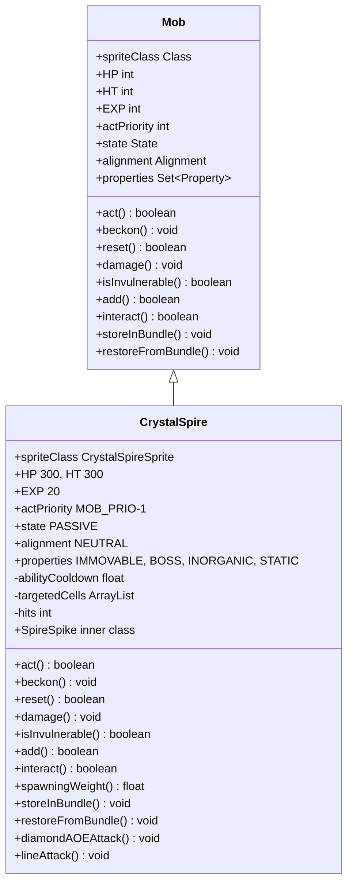

# CrystalSpire 类文档

## 1. 基本信息
| 属性 | 值 |
|------|-----|
| 文件路径 | core/src/main/java/com/shatteredpixel/shatteredpixeldungeon/actors/mobs/CrystalSpire.java |
| 包名 | com.shatteredpixel.shatteredpixeldungeon.actors.mobs |
| 类类型 | public class |
| 继承关系 | extends Mob |
| 代码行数 | 523 行 |

## 2. 类职责说明
CrystalSpire（水晶尖塔）是水晶矿区的Boss怪物，只能用镐子攻击。被敲击3次后激活，开始生成水晶攻击。攻击有两种模式：菱形AOE和直线攻击。生命值随伤害阶段增强攻击范围。击杀后破坏所有可见水晶并击杀附近的水晶守卫。

## 4. 继承与协作关系


## 静态常量表
| 常量名 | 类型 | 值 | 说明 |
|--------|------|-----|------|
| ABILITY_CD | int | 15 | 技能冷却回合数 |
| SPRITE | String | "sprite" | Bundle 存储键 - 精灵类 |
| HITS | String | "hits" | Bundle 存储键 - 敲击次数 |
| ABILITY_COOLDOWN | String | "ability_cooldown" | Bundle 存储键 - 技能冷却 |
| TARGETED_CELLS | String | "targeted_cells" | Bundle 存储键 - 目标格子 |

## 实例字段表
| 字段名 | 类型 | 修饰符 | 说明 |
|--------|------|--------|------|
| spriteClass | Class | 初始化块 | 精灵类（随机蓝/绿/红） |
| HP | int | 初始化块 | 当前生命值 300 |
| HT | int | 初始化块 | 最大生命值 300 |
| EXP | int | 初始化块 | 经验值 20 |
| actPriority | int | 初始化块 | 行动优先级 MOB_PRIO-1 |
| state | State | 初始化块 | 初始状态为 PASSIVE |
| alignment | Alignment | 初始化块 | 初始阵营为 NEUTRAL |
| properties | Set\<Property\> | 初始化块 | IMMOVABLE, BOSS, INORGANIC, STATIC |
| abilityCooldown | float | private | 技能冷却时间 |
| targetedCells | ArrayList\<ArrayList\<Integer\>\> | private | 目标格子列表 |
| hits | int | private | 被敲击次数 |

## 7. 方法详解

### act
**签名**: `protected boolean act()`
**功能**: 执行行动逻辑（攻击和生成水晶）
**返回值**: boolean - 行动完成
**实现逻辑**:
```java
// 第87-209行：复杂的行为逻辑
// 1. 更新视野
Dungeon.level.updateFieldOfView(this, fieldOfView);

// 2. 处理已标记的攻击目标
if (!targetedCells.isEmpty()) {
    // 生成水晶并对目标造成伤害
    // 对水晶守卫造成额外伤害并击退
    // 对玩家扣减任务分数
}

// 3. 如果敲击次数<3或未看到敌人，只消耗时间
if (hits < 3 || !enemySeen) {
    spend(TICK);
    return true;
}

// 4. 技能冷却结束后释放攻击
if (abilityCooldown <= 0) {
    if (Random.Int(2) == 0) {
        diamondAOEAttack();  // 50%概率菱形AOE
    } else {
        lineAttack();         // 50%概率直线攻击
    }
    abilityCooldown += ABILITY_CD;  // 重置冷却
}
```

### diamondAOEAttack
**签名**: `private void diamondAOEAttack()`
**功能**: 菱形范围攻击
**实现逻辑**:
```java
// 第213-229行：菱形AOE攻击
targetedCells.clear();
ArrayList<Integer> aoeCells = new ArrayList<>();
aoeCells.add(Dungeon.hero.pos);                    // 以玩家位置为中心
aoeCells.addAll(spreadDiamondAOE(aoeCells));       // 扩散一层
targetedCells.add(new ArrayList<>(aoeCells));

// 生命值低于2/3时增加扩散层数
if (HP < 2*HT/3f) {
    aoeCells.addAll(spreadDiamondAOE(aoeCells));
    targetedCells.add(new ArrayList<>(aoeCells));
    // 生命值低于1/3时再增加一层
    if (HP < HT/3f) {
        aoeCells.addAll(spreadDiamondAOE(aoeCells));
        targetedCells.add(aoeCells);
    }
}
```

### lineAttack
**签名**: `private void lineAttack()`
**功能**: 直线攻击
**实现逻辑**:
```java
// 第244-266行：直线攻击
targetedCells.clear();
ArrayList<Integer> lineCells = new ArrayList<>();
Ballistica aim = new Ballistica(pos, Dungeon.hero.pos, Ballistica.WONT_STOP);
for (int i : aim.subPath(1, 7)) {                  // 从尖塔向玩家方向7格
    if (!Dungeon.level.solid[i] || Dungeon.level.map[i] == Terrain.MINE_CRYSTAL) {
        lineCells.add(i);
    } else {
        break;                                      // 遇到障碍停止
    }
}
// 生命值低时增加扩散范围
```

### beckon
**签名**: `public void beckon(int cell)`
**功能**: 响应召唤（不响应）
**实现逻辑**:
```java
// 第282-284行：不响应召唤
// do nothing
```

### reset
**签名**: `public boolean reset()`
**功能**: 是否重置状态
**返回值**: boolean - true（不重置）
**实现逻辑**:
```java
// 第287-289行：不会重置
return true;
```

### damage
**签名**: `public void damage(int dmg, Object src)`
**功能**: 受到伤害（仅镐子有效）
**参数**:
- dmg: int - 伤害值
- src: Object - 伤害来源
**实现逻辑**:
```java
// 第292-297行：只有镐子能造成伤害
if (!(src instanceof Pickaxe)) {
    dmg = 0;  // 非镐子伤害无效
}
super.damage(dmg, src);
```

### isInvulnerable
**签名**: `public boolean isInvulnerable(Class effect)`
**功能**: 判断是否免疫效果
**参数**:
- effect: Class - 效果类型
**返回值**: boolean - 是否免疫
**实现逻辑**:
```java
// 第300-302行：只受镐子影响
return super.isInvulnerable(effect) || effect != Pickaxe.class;
```

### add
**签名**: `public boolean add(Buff buff)`
**功能**: 添加Buff（免疫所有Buff）
**参数**:
- buff: Buff - 要添加的Buff
**返回值**: boolean - false（总是拒绝）
**实现逻辑**:
```java
// 第305-307行：免疫所有Buff
return false;
```

### interact
**签名**: `public boolean interact(Char c)`
**功能**: 与玩家交互（用镐子攻击）
**参数**:
- c: Char - 交互角色
**返回值**: boolean - 是否完成交互
**实现逻辑**:
```java
// 第312-452行：镐子攻击逻辑
if (c == Dungeon.hero) {
    final Pickaxe p = Dungeon.hero.belongings.getItem(Pickaxe.class);
    if (p == null) return true;  // 没有镐子则无法交互
    
    Dungeon.hero.sprite.attack(pos, new Callback() {
        public void call() {
            int dmg = p.damageRoll(CrystalSpire.this);  // 计算伤害
            damage(dmg, p);                              // 造成伤害
            abilityCooldown -= dmg/10f;                  // 减少技能冷却
            
            hits++;                                      // 增加敲击次数
            
            if (hits == 1) {
                // 第一次敲击：警告
                GLog.w(Messages.get(CrystalSpire.class, "warning"));
            } else if (hits >= 3) {
                // 第三次敲击：激活Boss战
                BossHealthBar.assignBoss(CrystalSpire.this);
                // 召唤水晶守卫和精灵
            }
            
            if (!isAlive()) {
                // 死亡时清理所有水晶和守卫
                Blacksmith.Quest.beatBoss();
            }
        }
    });
}
```

### spawningWeight
**签名**: `public float spawningWeight()`
**功能**: 获取生成权重
**返回值**: float - 0（不随机生成）
**实现逻辑**:
```java
// 第470-472行：不随机生成
return 0;
```

## 内部类详解

### SpireSpike
**类型**: public static class
**功能**: 水晶尖刺伤害标记类
**用途**: 用于标识水晶尖塔造成的伤害类型

## 11. 使用示例
```java
// 创建水晶尖塔
CrystalSpire spire = new CrystalSpire();
spire.pos = centerPos;
Dungeon.level.mobs.add(spire);

// 玩家需要用镐子敲击3次激活Boss战
// 击杀后完成任务并清理水晶
```

## 注意事项
1. 只能用镐子造成伤害，其他攻击无效
2. 敲击3次后激活，开始释放攻击
3. 攻击会生成水晶地形
4. 击杀后破坏所有可见水晶并击杀守卫
5. 免疫所有Buff和Debuff

## 最佳实践
1. 准备好镐子再挑战
2. 注意躲避攻击标记的红格子
3. 生命值越低攻击范围越大
4. 先清理附近的水晶守卫
5. 击杀后所有守卫会被秒杀