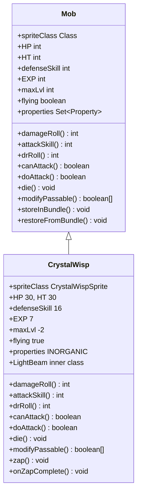

# CrystalWisp 类文档

## 1. 基本信息
| 属性 | 值 |
|------|-----|
| 文件路径 | core/src/main/java/com/shatteredpixel/shatteredpixeldungeon/actors/mobs/CrystalWisp.java |
| 包名 | com.shatteredpixel.shatteredpixeldungeon.actors.mobs |
| 类类型 | public class |
| 继承关系 | extends Mob |
| 代码行数 | 163 行 |

## 2. 类职责说明
CrystalWisp（水晶精灵）是一种飞行怪物，可以穿越水晶地形。具有近战和远程两种攻击方式，远程发射光束造成魔法伤害。死亡后取消飞行状态。是水晶矿区的常见敌人。

## 4. 继承与协作关系


## 静态常量表
| 常量名 | 类型 | 值 | 说明 |
|--------|------|-----|------|
| SPRITE | String | "sprite" | Bundle 存储键 - 精灵类 |

## 实例字段表
| 字段名 | 类型 | 修饰符 | 说明 |
|--------|------|--------|------|
| spriteClass | Class | 初始化块 | 精灵类（随机蓝/绿/红） |
| HP | int | 初始化块 | 当前生命值 30 |
| HT | int | 初始化块 | 最大生命值 30 |
| defenseSkill | int | 初始化块 | 防御技能 16 |
| EXP | int | 初始化块 | 经验值 7 |
| maxLvl | int | 初始化块 | 最大等级 -2（无等级上限） |
| flying | boolean | 初始化块 | 飞行状态 true |
| properties | Set\<Property\> | 初始化块 | INORGANIC（无机物） |

## 7. 方法详解

### 构造函数
**签名**: `public CrystalWisp()`
**功能**: 初始化精灵并随机设置颜色
**实现逻辑**:
```java
// 第53-66行：随机选择颜色
super();
switch (Random.Int(3)) {
    case 0: default:
        spriteClass = CrystalWispSprite.Blue.class;   // 蓝色
        break;
    case 1:
        spriteClass = CrystalWispSprite.Green.class;  // 绿色
        break;
    case 2:
        spriteClass = CrystalWispSprite.Red.class;    // 红色
        break;
}
```

### modifyPassable
**签名**: `public boolean[] modifyPassable(boolean[] passable)`
**功能**: 修改可行走区域（可穿越水晶）
**参数**:
- passable: boolean[] - 原始可行走数组
**返回值**: boolean[] - 修改后的可行走数组
**实现逻辑**:
```java
// 第69-74行：可穿越水晶
for (int i = 0; i < Dungeon.level.length(); i++) {
    passable[i] = passable[i] || Dungeon.level.map[i] == Terrain.MINE_CRYSTAL;
}
return passable;
```

### damageRoll
**签名**: `public int damageRoll()`
**功能**: 计算伤害值
**返回值**: int - 随机伤害值（5-10）
**实现逻辑**:
```java
// 第77-79行：计算随机伤害
return Random.NormalIntRange(5, 10);
```

### attackSkill
**签名**: `public int attackSkill(Char target)`
**功能**: 获取攻击技能值
**参数**:
- target: Char - 攻击目标
**返回值**: int - 攻击技能值（18）
**实现逻辑**:
```java
// 第82-84行：返回攻击技能
return 18;
```

### drRoll
**签名**: `public int drRoll()`
**功能**: 计算伤害减免值
**返回值**: int - 随机伤害减免值（0-5）
**实现逻辑**:
```java
// 第87-89行：计算伤害减免
return super.drRoll() + Random.NormalIntRange(0, 5);
```

### canAttack
**签名**: `protected boolean canAttack(Char enemy)`
**功能**: 判断是否可以攻击（包含远程判断）
**参数**:
- enemy: Char - 攻击目标
**返回值**: boolean - 是否可以攻击
**实现逻辑**:
```java
// 第92-95行：近战或远程攻击判断
return super.canAttack(enemy)  // 相邻可近战
    || new Ballistica(pos, enemy.pos, Ballistica.MAGIC_BOLT).collisionPos == enemy.pos; // 或魔法弹道可命中
```

### doAttack
**签名**: `protected boolean doAttack(Char enemy)`
**功能**: 执行攻击（近战或远程）
**参数**:
- enemy: Char - 攻击目标
**返回值**: boolean - 攻击是否完成
**实现逻辑**:
```java
// 第97-114行：选择攻击方式
if (Dungeon.level.adjacent(pos, enemy.pos)
        || new Ballistica(pos, enemy.pos, Ballistica.MAGIC_BOLT).collisionPos != enemy.pos) {
    return super.doAttack(enemy);  // 近战攻击
} else {
    if (sprite != null && (sprite.visible || enemy.sprite.visible)) {
        sprite.zap(enemy.pos);     // 播放远程攻击动画
        return false;
    } else {
        zap();                      // 直接远程攻击
        return true;
    }
}
```

### die
**签名**: `public void die(Object cause)`
**功能**: 死亡时取消飞行状态
**参数**:
- cause: Object - 死亡原因
**实现逻辑**:
```java
// 第117-120行：死亡处理
flying = false;       // 取消飞行状态
super.die(cause);
```

### zap
**签名**: `private void zap()`
**功能**: 远程光束攻击
**实现逻辑**:
```java
// 第125-143行：远程攻击逻辑
spend(1f);                                     // 消耗1回合
Invisibility.dispel(this);                     // 解除隐身
Char enemy = this.enemy;
if (hit(this, enemy, true)) {                  // 命中判定
    int dmg = Random.NormalIntRange(5, 10);    // 计算伤害
    enemy.damage(dmg, new LightBeam());        // 造成光束伤害
    if (!enemy.isAlive() && enemy == Dungeon.hero) {
        Badges.validateDeathFromEnemyMagic();  // 验证魔法击杀徽章
        Dungeon.fail(this);
        GLog.n(Messages.get(this, "beam_kill"));
    }
} else {
    enemy.sprite.showStatus(CharSprite.NEUTRAL, enemy.defenseVerb()); // 显示闪避
}
```

### onZapComplete
**签名**: `public void onZapComplete()`
**功能**: 远程攻击动画完成后执行
**实现逻辑**:
```java
// 第145-148行：完成远程攻击
zap();        // 执行远程攻击
next();       // 继续行动
```

### storeInBundle / restoreFromBundle
**功能**: 保存/恢复精灵类状态
**实现逻辑**: 标准的 Bundle 序列化

## 内部类详解

### LightBeam
**类型**: public static class
**功能**: 光束伤害标记类
**用途**: 用于标识水晶精灵远程攻击的伤害类型，便于抗性计算

## 11. 使用示例
```java
// 创建水晶精灵
CrystalWisp wisp = new CrystalWisp();
wisp.pos = position;
Dungeon.level.mobs.add(wisp);

// 水晶精灵可以穿越水晶地形
// 近战和远程两种攻击方式
// 远程攻击造成光束伤害
```

## 注意事项
1. 飞行状态可穿越障碍物和水晶
2. 远程攻击需要魔法弹道可命中
3. 远程伤害被标记为 LightBeam 类型
4. 死亡后不再飞行

## 最佳实践
1. 利用地形阻挡远程攻击
2. 注意光束伤害的抗性机制
3. 远程攻击会解除隐身状态
4. 水晶地形不影响其移动