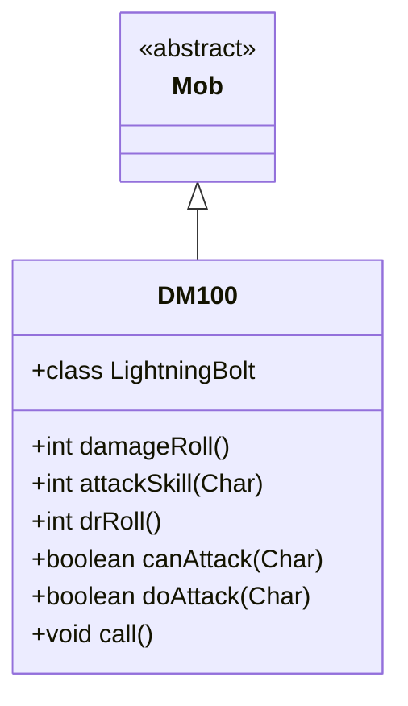

# DM100 类文档

## 1. 基本信息
| 属性 | 值 |
|------|-----|
| 文件路径 | core/src/main/java/com/shatteredpixel/shatteredpixeldungeon/actors/mobs/DM100.java |
| 包名 | com.shatteredpixel.shatteredpixeldungeon.actors.mobs |
| 类类型 | class |
| 继承关系 | extends Mob implements Callback |
| 代码行数 | 135 行 |

## 2. 类职责说明
DM100 是一种机械敌人，可以发射电击攻击远程目标。它是监狱层的基础机械单位，具有远程攻击能力。DM100 掉落卷轴。

## 4. 继承与协作关系


## 静态常量表
| 常量名 | 类型 | 值 | 说明 |
|--------|------|-----|------|
| TIME_TO_ZAP | float | 1f | 电击所需时间 |

## 实例字段表
（无额外实例字段，继承自 Mob）

## 7. 方法详解

### damageRoll()
**签名**: `public int damageRoll()`
**功能**: 计算伤害掷骰
**返回值**: int - 伤害范围 2-8

### attackSkill(Char target)
**签名**: `public int attackSkill(Char target)`
**功能**: 获取攻击技能值
**返回值**: int - 攻击技能值 11

### drRoll()
**签名**: `public int drRoll()`
**功能**: 计算伤害减免
**返回值**: int - 伤害减免 0-4

### canAttack(Char enemy)
**签名**: `protected boolean canAttack(Char enemy)`
**功能**: 判断是否能攻击（包括远程）
**参数**:
- enemy: Char - 目标
**返回值**: boolean - 是否能攻击
**实现逻辑**:
```
第77-78行: 近战范围内或魔法弹道可达
```

### doAttack(Char enemy)
**签名**: `protected boolean doAttack(Char enemy)`
**功能**: 执行攻击（近战或远程电击）
**参数**:
- enemy: Char - 目标
**返回值**: boolean - 攻击是否完成
**实现逻辑**:
```
第87-91行: 如果近战或弹道被阻挡，使用近战
第94-127行: 否则释放电击：
  - 消耗1回合
  - 命中时造成3-10伤害
  - 显示电击粒子效果
  - 如果杀死英雄，记录失败
```

### call()
**签名**: `public void call()`
**功能**: Callback 接口实现，进入下一回合
**实现逻辑**:
```
第132行: 调用 next()
```

## 内部类详解

### LightningBolt
**功能**: 电击伤害类型标记
**用途**: 允许区分近战和魔法攻击的抗性

## 11. 使用示例
```java
// DM100 可以远程电击
DM100 dm = new DM100();

// 电击造成3-10伤害
// 掉落卷轴
```

## 注意事项
1. **电击属性**: 属于 ELECTRIC 类型
2. **无机属性**: 属于 INORGANIC 类型
3. **远程攻击**: 可以远程电击
4. **卷轴掉落**: 25%概率掉落卷轴
5. **低伤害**: 近战伤害较低

## 最佳实践
1. 保持移动避开电击
2. 近战更有效
3. 注意电击的视觉提示
4. 使用电击抗性装备