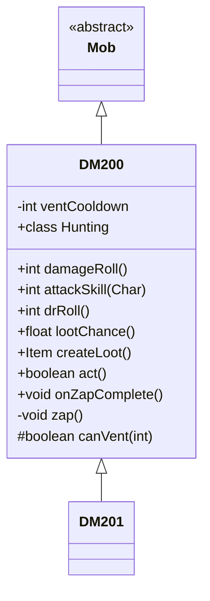

# DM200 类文档

## 1. 基本信息
| 属性 | 值 |
|------|-----|
| 文件路径 | core/src/main/java/com/shatteredpixel/shatteredpixeldungeon/actors/mobs/DM200.java |
| 包名 | com.shatteredpixel.shatteredpixeldungeon.actors.mobs |
| 类类型 | class |
| 继承关系 | extends Mob |
| 代码行数 | 188 行 |

## 2. 类职责说明
DM200 是一种机械敌人，可以喷射毒气攻击远处的目标。它是大型无机单位，能从远处释放有毒气体。DM200 掉落武器或护甲，掉落概率随已掉落数量递减。

## 4. 继承与协作关系


## 静态常量表
| 常量名 | 类型 | 值 | 说明 |
|--------|------|-----|------|
| VENT_COOLDOWN | String | "vent_cooldown" | Bundle 存储键 |

## 实例字段表
| 字段名 | 类型 | 修饰符 | 说明 |
|--------|------|--------|------|
| ventCooldown | int | private | 喷射冷却时间 |

## 7. 方法详解

### damageRoll()
**签名**: `public int damageRoll()`
**功能**: 计算伤害掷骰
**返回值**: int - 伤害范围 10-25

### attackSkill(Char target)
**签名**: `public int attackSkill(Char target)`
**功能**: 获取攻击技能值
**返回值**: int - 攻击技能值 20

### drRoll()
**签名**: `public int drRoll()`
**功能**: 计算伤害减免
**返回值**: int - 伤害减免 0-8

### lootChance()
**签名**: `public float lootChance()`
**功能**: 计算掉落概率
**返回值**: float - 随掉落数量降低的概率

### createLoot()
**签名**: `public Item createLoot()`
**功能**: 创建掉落物品
**返回值**: Item - 武器或护甲（T4）
**实现逻辑**:
```
第81行: 增加有限掉落计数
第83-87行: 返回 T4 武器或护甲
```

### act()
**签名**: `protected boolean act()`
**功能**: 每回合减少冷却
**返回值**: boolean - 行动结果
**实现逻辑**:
```
第108行: 减少喷射冷却
```

### onZapComplete()
**签名**: `public void onZapComplete()`
**功能**: 精灵动画完成后执行攻击
**实现逻辑**:
```
第113-114行: 执行喷射，进入下一回合
```

### zap()
**签名**: `private void zap()`
**功能**: 喷射毒气
**实现逻辑**:
```
第118行: 消耗一回合
第119行: 设置30回合冷却
第121-126行: 沿弹道放置毒气
          碰撞点放置大量毒气
```

### canVent(int target)
**签名**: `protected boolean canVent(int target)`
**功能**: 检查是否能喷射毒气
**参数**:
- target: int - 目标位置
**返回值**: boolean - 是否能喷射
**实现逻辑**:
```
第131行: 检查冷却
第132-136行: 检查路径可达性
```

## 内部类详解

### Hunting
**功能**: 管理远程喷射攻击行为
**方法**:
- `act()`: 在适当时机喷射毒气或接近目标

## 11. 使用示例
```java
// DM200 可以远程喷射毒气
DM200 dm = new DM200();

// 喷射后30回合冷却
// 大型单位，需要开阔空间
// 掉落T4装备
```

## 注意事项
1. **无机属性**: 属于 INORGANIC 类型
2. **大型单位**: 属于 LARGE 属性
3. **毒气喷射**: 30回合冷却
4. **装备掉落**: 掉落 T4 武器或护甲
5. **毒气免疫**: 免疫毒气

## 最佳实践
1. 保持移动避开毒气
2. 等待喷射后的冷却窗口
3. 准备解毒手段
4. 利用狭窄空间限制其移动