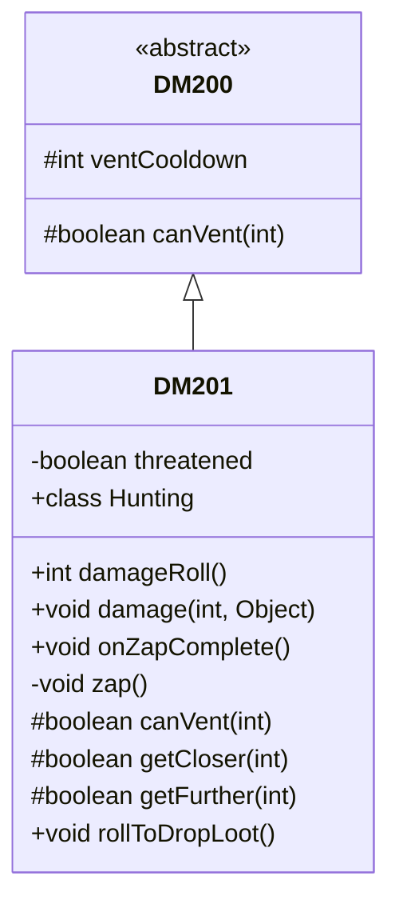

# DM201 类文档

## 1. 基本信息
| 属性 | 值 |
|------|-----|
| 文件路径 | core/src/main/java/com/shatteredpixel/shatteredpixeldungeon/actors/mobs/DM201.java |
| 包名 | com.shatteredpixel.shatteredpixeldungeon.actors.mobs |
| 类类型 | class |
| 继承关系 | extends DM200 |
| 代码行数 | 132 行 |

## 2. 类职责说明
DM201 是 DM200 的稀有变种。它是不可移动的守卫单位，当受到远程攻击或受到伤害时目标不在相邻位置时会喷射腐蚀气体。死亡时掉落金属碎片。

## 4. 继承与协作关系


## 静态常量表
（无静态常量）

## 实例字段表
| 字段名 | 类型 | 修饰符 | 说明 |
|--------|------|--------|------|
| threatened | boolean | private | 是否处于威胁状态 |

## 7. 方法详解

### damageRoll()
**签名**: `public int damageRoll()`
**功能**: 计算伤害掷骰
**返回值**: int - 伤害范围 15-25

### damage(int dmg, Object src)
**签名**: `public void damage(int dmg, Object src)`
**功能**: 受伤时检查是否被威胁
**参数**:
- dmg: int - 伤害值
- src: Object - 伤害来源
**实现逻辑**:
```
第56-61行: 如果不是腐化伤害且：
         - 来源是远程角色
         - 或敌人不在相邻位置
         设置威胁状态
```

### onZapComplete()
**签名**: `public void onZapComplete()`
**功能**: 精灵动画完成后执行攻击
**实现逻辑**:
```
第66-67行: 执行喷射，进入下一回合
```

### zap()
**签名**: `private void zap()`
**功能**: 喷射腐蚀气体
**实现逻辑**:
```
第71行: 清除威胁状态
第72行: 消耗一回合
第74-79行: 在敌人位置及周围放置腐蚀气体
          腐蚀强度为8
```

### canVent(int target)
**签名**: `protected boolean canVent(int target)`
**功能**: DM201 不使用喷射
**返回值**: boolean - 始终返回 false

### getCloser(int target) / getFurther(int target)
**签名**: `protected boolean getCloser/getFurther(int target)`
**功能**: DM201 不可移动
**返回值**: boolean - 始终返回 false

### rollToDropLoot()
**签名**: `public void rollToDropLoot()`
**功能**: 掉落金属碎片
**实现逻辑**:
```
第100行: 检查英雄等级
第102行: 调用父类掉落处理
第104-108行: 在相邻位置掉落金属碎片
```

## 内部类详解

### Hunting
**功能**: 管理威胁响应行为
**方法**:
- `act()`: 威胁状态下喷射腐蚀气体

## 11. 使用示例
```java
// DM201 是不可移动的守卫
DM201 dm = new DM201();

// 受到远程攻击时会喷射腐蚀气体
// 死亡掉落金属碎片
```

## 注意事项
1. **不可移动**: 具有 IMMOVABLE 属性
2. **更高HP**: 120 HP（比 DM200 高）
3. **腐蚀气体**: 喷射腐蚀而非毒气
4. **威胁触发**: 远程攻击触发响应
5. **金属碎片**: 必定掉落

## 最佳实践
1. 使用近战攻击避免触发
2. 准备腐蚀抗性
3. 保持距离可能更安全
4. 金属碎片用于升级