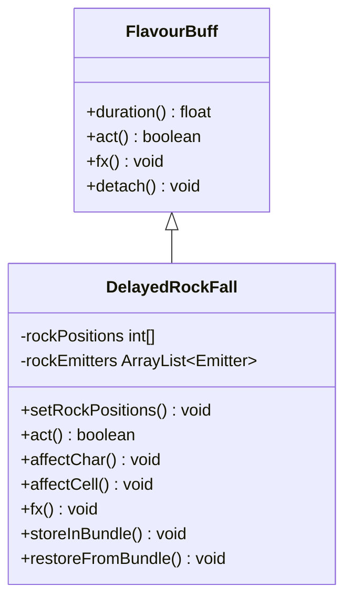

# DelayedRockFall 类文档

## 1. 基本信息
| 属性 | 值 |
|------|-----|
| 文件路径 | core/src/main/java/com/shatteredpixel/shatteredpixeldungeon/actors/mobs/DelayedRockFall.java |
| 包名 | com.shatteredpixel.shatteredpixeldungeon.actors.mobs |
| 类类型 | public class |
| 继承关系 | extends FlavourBuff |
| 代码行数 | 114 行 |

## 2. 类职责说明
DelayedRockFall（延迟落石）是一个Buff类，用于处理各种敌人攻击后延迟落石的效果。设置落石位置后，在指定回合数后岩石落下，对位置上的角色和格子造成效果。显示下落岩石的粒子效果作为警告。

## 4. 继承与协作关系


## 静态常量表
| 常量名 | 类型 | 值 | 说明 |
|--------|------|-----|------|
| POSITIONS | String | "positions" | Bundle 存储键 - 位置数组 |

## 实例字段表
| 字段名 | 类型 | 修饰符 | 说明 |
|--------|------|--------|------|
| rockPositions | int[] | private | 落石位置数组 |
| rockEmitters | ArrayList\<Emitter\> | private | 岩石粒子发射器列表 |

## 7. 方法详解

### setRockPositions
**签名**: `public void setRockPositions(List<Integer> rockPositions)`
**功能**: 设置落石位置并显示警告效果
**参数**:
- rockPositions: List\<Integer\> - 落石位置列表
**实现逻辑**:
```java
// 第46-53行：设置落石位置
this.rockPositions = new int[rockPositions.size()];
for (int i = 0; i < rockPositions.size(); i++) {
    this.rockPositions[i] = rockPositions.get(i);  // 转换为数组
}
fx(true);  // 显示警告粒子效果
```

### act
**签名**: `public boolean act()`
**功能**: 执行落石效果
**返回值**: boolean - 行动完成
**实现逻辑**:
```java
// 第56-73行：落石效果
for (int i : rockPositions) {
    // 显示岩石碎裂效果
    CellEmitter.get(i).start(Speck.factory(Speck.ROCK), 0.07f, 10);
    
    Char ch = Actor.findChar(i);
    if (ch != null) {
        affectChar(ch);     // 影响角色
    } else {
        affectCell(i);      // 影响格子
    }
}

// 屏幕震动和音效
PixelScene.shake(3, 0.7f);
Sample.INSTANCE.play(Assets.Sounds.ROCKS);

detach();  // 移除Buff
return super.act();
```

### affectChar
**签名**: `public void affectChar(Char ch)`
**功能**: 影响角色（默认无效果）
**参数**:
- ch: Char - 被影响的角色
**实现逻辑**:
```java
// 第75-77行：默认无效果
// 子类可重写此方法实现具体效果
// do nothing by default
```

### affectCell
**签名**: `public void affectCell(int cell)`
**功能**: 影响格子（默认无效果）
**参数**:
- cell: int - 被影响的格子位置
**实现逻辑**:
```java
// 第79-81行：默认无效果
// 子类可重写此方法实现具体效果
// do nothing by default
```

### fx
**签名**: `public void fx(boolean on)`
**功能**: 显示/隐藏警告粒子效果
**参数**:
- on: boolean - 是否显示
**实现逻辑**:
```java
// 第84-98行：警告粒子效果
if (on && rockPositions != null) {
    for (int i : this.rockPositions) {
        Emitter e = CellEmitter.get(i);
        e.y -= DungeonTilemap.SIZE * 0.2f;  // 调整发射器位置
        e.height *= 0.4f;                    // 压缩高度
        e.pour(EarthParticle.FALLING, 0.1f); // 添加下落岩石粒子
        rockEmitters.add(e);
    }
} else {
    for (Emitter e : rockEmitters) {
        e.on = false;  // 停止粒子发射
    }
}
```

### storeInBundle / restoreFromBundle
**功能**: 保存/恢复状态
**实现逻辑**: 标准的 Bundle 序列化，保存落石位置数组

## 11. 使用示例
```java
// 创建延迟落石效果
DelayedRockFall rockfall = new DelayedRockFall();
rockfall.setRockPositions(Arrays.asList(pos1, pos2, pos3));

// 设置延迟回合数
Buff.affect(target, rockfall, 3f);  // 3回合后落石

// 自定义落石效果
DelayedRockFall customRock = new DelayedRockFall() {
    @Override
    public void affectChar(Char ch) {
        ch.damage(20, this);  // 造成20点伤害
    }
};
```

## 注意事项
1. 这是一个Buff类，不是Mob
2. 默认不造成伤害，需要子类重写方法
3. 落石前会显示警告粒子效果
4. 可同时设置多个落石位置

## 最佳实践
1. 子类化并重写 affectChar 和 affectCell 方法
2. 设置合理的延迟时间让玩家有时间躲避
3. 使用警告粒子效果让玩家知道危险区域
4. 落石效果可以是伤害、地形改变等