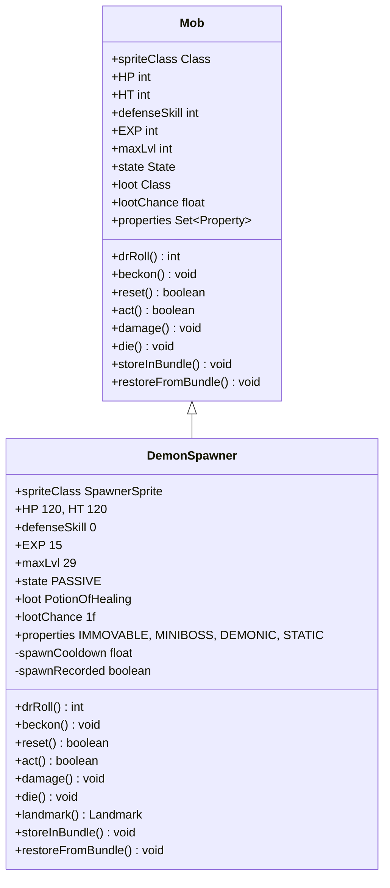

# DemonSpawner 类文档

## 1. 基本信息
| 属性 | 值 |
|------|-----|
| 文件路径 | core/src/main/java/com/shatteredpixel/shatteredpixeldungeon/actors/mobs/DemonSpawner.java |
| 包名 | com.shatteredpixel.shatteredpixeldungeon.actors.mobs |
| 类类型 | public class |
| 继承关系 | extends Mob |
| 代码行数 | 176 行 |

## 2. 类职责说明
DemonSpawner（恶魔孵化器）是一种固定位置的怪物，定期生成 RipperDemon（撕裂恶魔）。受到的伤害会加速生成，高伤害有减伤效果。死亡时必定掉落治疗药水，并更新统计信息和地图标记。

## 4. 继承与协作关系


## 静态常量表
| 常量名 | 类型 | 值 | 说明 |
|--------|------|-----|------|
| SPAWN_COOLDOWN | String | "spawn_cooldown" | Bundle 存储键 - 生成冷却 |
| SPAWN_RECORDED | String | "spawn_recorded" | Bundle 存储键 - 生成记录 |

## 实例字段表
| 字段名 | 类型 | 修饰符 | 说明 |
|--------|------|--------|------|
| spriteClass | Class | 初始化块 | 精灵类为 SpawnerSprite |
| HP | int | 初始化块 | 当前生命值 120 |
| HT | int | 初始化块 | 最大生命值 120 |
| defenseSkill | int | 初始化块 | 防御技能 0（无法闪避） |
| EXP | int | 初始化块 | 经验值 15 |
| maxLvl | int | 初始化块 | 最大等级 29 |
| state | State | 初始化块 | 初始状态为 PASSIVE |
| loot | Class | 初始化块 | 掉落物为 PotionOfHealing |
| lootChance | float | 初始化块 | 100% 掉落概率 |
| properties | Set\<Property\> | 初始化块 | IMMOVABLE, MINIBOSS, DEMONIC, STATIC |
| spawnCooldown | float | private | 生成冷却时间 |
| spawnRecorded | boolean | public | 是否已记录生成统计 |

## 7. 方法详解

### drRoll
**签名**: `public int drRoll()`
**功能**: 计算伤害减免值
**返回值**: int - 随机伤害减免值（0-12）
**实现逻辑**:
```java
// 第64-66行：计算伤害减免
return super.drRoll() + Random.NormalIntRange(0, 12);
```

### beckon
**签名**: `public void beckon(int cell)`
**功能**: 响应召唤（不响应）
**实现逻辑**:
```java
// 第69-71行：不响应召唤
// do nothing
```

### reset
**签名**: `public boolean reset()`
**功能**: 是否重置状态
**返回值**: boolean - true（不重置）
**实现逻辑**:
```java
// 第74-76行：不会重置
return true;
```

### act
**签名**: `protected boolean act()`
**功能**: 执行行动逻辑（生成撕裂恶魔）
**返回值**: boolean - 行动完成
**实现逻辑**:
```java
// 第84-131行：生成恶魔逻辑
// 1. 记录生成统计
if (!spawnRecorded) {
    Statistics.spawnersAlive++;
    spawnRecorded = true;
}

// 2. 飞升挑战模式下限制冷却
if (Dungeon.hero.buff(AscensionChallenge.class) != null && spawnCooldown > 20) {
    spawnCooldown = 20;
}

// 3. 冷却结束后生成恶魔
spawnCooldown--;
if (spawnCooldown <= 0) {
    // 防止冷却过低
    if (spawnCooldown < -20) {
        spawnCooldown = -20;
    }
    
    // 寻找相邻空位
    ArrayList<Integer> candidates = new ArrayList<>();
    for (int n : PathFinder.NEIGHBOURS8) {
        if (Dungeon.level.passable[pos+n] && Actor.findChar(pos+n) == null) {
            candidates.add(pos+n);
        }
    }
    
    if (!candidates.isEmpty()) {
        // 生成撕裂恶魔
        RipperDemon spawn = new RipperDemon();
        spawn.pos = Random.element(candidates);
        spawn.state = spawn.HUNTING;
        GameScene.add(spawn, 1);
        
        // 重置冷却（60回合，深层更快）
        spawnCooldown += 60;
        if (Dungeon.depth > 21) {
            spawnCooldown -= Math.min(20, (Dungeon.depth-21)*6.67);
        }
    }
}
```

### damage
**签名**: `public void damage(int dmg, Object src)`
**功能**: 受到伤害（高伤害减伤，加速生成）
**参数**:
- dmg: int - 伤害值
- src: Object - 伤害来源
**实现逻辑**:
```java
// 第134-142行：伤害处理
if (dmg >= 20) {
    // 高伤害时减伤：伤害公式 sqrt(8*(dmg-19)+1)/2
    // 20/21/22/23/24/25/26/27/28/29/30 实际伤害
    // 在 20/22/25/29/34/40/47/55/64/74/85 输入伤害时
    dmg = 19 + (int)(Math.sqrt(8*(dmg - 19) + 1) - 1)/2;
}
spawnCooldown -= dmg;  // 伤害加速生成
super.damage(dmg, src);
```

### landmark
**签名**: `public Notes.Landmark landmark()`
**功能**: 获取地图标记类型
**返回值**: Notes.Landmark - DEMON_SPAWNER 标记
**实现逻辑**:
```java
// 第145-147行：返回地图标记
return Notes.Landmark.DEMON_SPAWNER;
```

### die
**签名**: `public void die(Object cause)`
**功能**: 死亡时更新统计和移除标记
**参数**:
- cause: Object - 死亡原因
**实现逻辑**:
```java
// 第150-157行：死亡处理
if (spawnRecorded) {
    Statistics.spawnersAlive--;      // 减少存活计数
    Notes.remove(landmark());         // 移除地图标记
}
GLog.h(Messages.get(this, "on_death"));  // 显示击杀消息
super.die(cause);
```

### storeInBundle / restoreFromBundle
**功能**: 保存/恢复状态
**实现逻辑**: 标准的 Bundle 序列化，包含生成冷却和记录状态

## 11. 使用示例
```java
// 创建恶魔孵化器
DemonSpawner spawner = new DemonSpawner();
spawner.pos = position;
Dungeon.level.mobs.add(spawner);

// 每60回合生成一个撕裂恶魔（深层更快）
// 受到伤害会加速生成
// 击杀后必定掉落治疗药水
```

## 注意事项
1. 固定位置，无法移动
2. 防御技能为0，容易被击中
3. 高伤害有减伤效果（防止一击秒杀）
4. 受伤会加速恶魔生成
5. 地图上显示为恶魔孵化器标记

## 最佳实践
1. 优先击杀以减少恶魔生成
2. 高爆发伤害会被减伤，持续输出更有效
3. 击杀后必定掉落治疗药水
4. 深层孵化器生成更快，需要更快击杀
5. 注意周围的撕裂恶魔数量