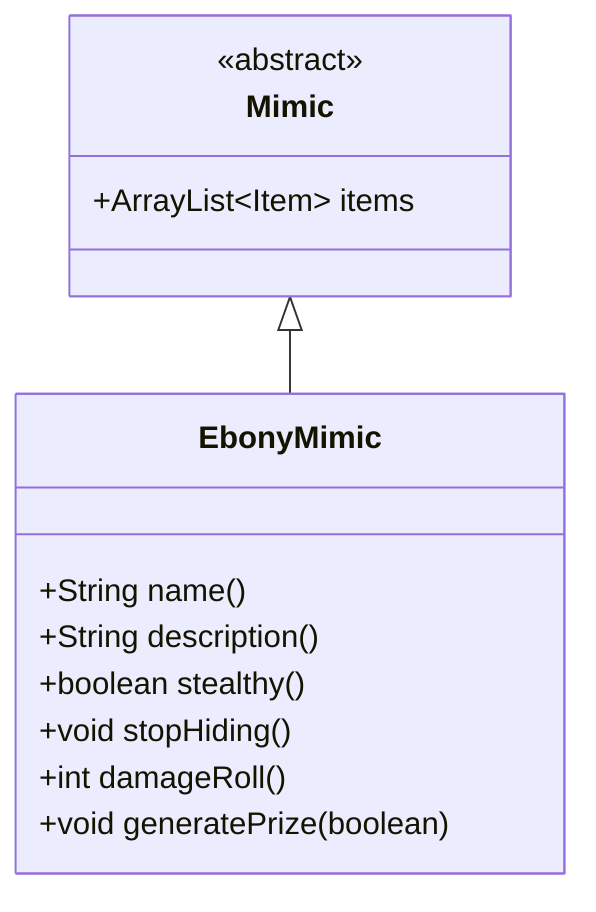

# EbonyMimic 类文档

## 1. 基本信息
| 属性 | 值 |
|------|-----|
| 文件路径 | core/src/main/java/com/shatteredpixel/shatteredpixeldungeon/actors/mobs/EbonyMimic.java |
| 包名 | com.shatteredpixel.shatteredpixeldungeon.actors.mobs |
| 类类型 | class |
| 继承关系 | extends Mimic |
| 代码行数 | 121 行 |

## 2. 类职责说明
EbonyMimic（乌木宝箱怪）是 Mimic 的特殊变种，伪装成墙壁或门。它是隐蔽的，被发现前不会显示名称和描述。被激活时造成双倍伤害的突袭攻击。掉落物品必定不诅咒且至少+1强化。

## 4. 继承与协作关系


## 静态常量表
（无静态常量）

## 实例字段表
（无额外实例字段，继承自 Mimic）

## 7. 方法详解

### name()
**签名**: `public String name()`
**功能**: 获取名称
**返回值**: String - 中立状态时显示隐藏名称
**实现逻辑**:
```
第52-56行: 中立时显示隐藏名称，敌对时显示宝箱怪名称
```

### description()
**签名**: `public String description()`
**功能**: 获取描述
**返回值**: String - 中立状态时显示隐藏描述
**实现逻辑**:
```
第61-65行: 中立时显示隐藏描述，敌对时显示普通描述
```

### stealthy()
**签名**: `public boolean stealthy()`
**功能**: 是否为隐蔽宝箱怪
**返回值**: boolean - 始终返回 true

### stopHiding()
**签名**: `public void stopHiding()`
**功能**: 停止隐藏，开始攻击
**实现逻辑**:
```
第74行: 进入追猎状态
第75-82行: 如果在视野内，显示警告和粒子效果
第83-85行: 如果在门上，进入门
```

### damageRoll()
**签名**: `public int damageRoll()`
**功能**: 计算伤害掷骰
**返回值**: int - 中立时双倍伤害
**实现逻辑**:
```
第90-94行: 中立状态（突袭）时造成双倍伤害
```

### generatePrize(boolean useDecks)
**签名**: `protected void generatePrize(boolean useDecks)`
**功能**: 生成优质奖品
**参数**:
- useDecks: boolean - 是否使用牌组生成
**实现逻辑**:
```
第101行: 添加额外随机物品
第104-118行: 所有装备物品：
  - 取消诅咒
  - 移除诅咒附魔/刻印
  - 所有+0物品升级为+1
```

## 11. 使用示例
```java
// 乌木宝箱怪伪装成墙壁
EbonyMimic mimic = new EbonyMimic();

// 隐蔽的，不易发现
// 突袭时双倍伤害
// 掉落物品必定+1以上
```

## 注意事项
1. **隐蔽**: stealthy() 返回 true
2. **突袭伤害**: 中立状态下双倍伤害
3. **优质掉落**: 物品必定不诅咒且+1
4. **额外物品**: 额外掉落一个随机物品
5. **环境伪装**: 可以伪装成门

## 最佳实践
1. 使用探知能力发现
2. 小心突袭的双倍伤害
3. 高价值掉落值得挑战
4. 准备好再激活