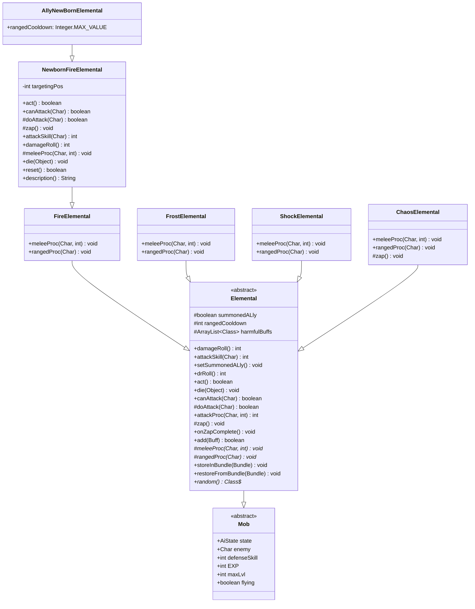

# Elemental 源码详解

## 1. 基本信息

| 属性 | 值 |
|------|-----|
| **文件路径** | core/src/main/java/com/shatteredpixel/shatteredpixeldungeon/actors/mobs/Elemental.java |
| **包名** | com.shatteredpixel.shatteredpixeldungeon.actors.mobs |
| **类类型** | abstract class |
| **继承关系** | extends Mob |
| **代码行数** | 615 |
| **子类** | FireElemental, FrostElemental, ShockElemental, ChaosElemental, NewbornFireElemental, AllyNewBornElemental |

---

## 类职责

Elemental 是游戏中所有"元素怪物"的抽象基类，代表具有元素属性的魔法生物。它在 Mob 的基础上添加了：

1. **远程攻击机制**：元素怪物可以在一定距离外发动魔法攻击，拥有独立的冷却系统
2. **元素能力抽象**：定义了 `meleeProc()` 和 `rangedProc()` 两个抽象方法，让子类实现各自的元素效果
3. **有害Buff反应**：对特定有害Buff产生受伤反应而非正常叠加（如火焰元素被冰霜攻击会受到伤害）
4. **召唤盟友模式**：支持作为玩家召唤物时的属性缩放机制

**核心设计模式**：模板方法模式（Template Method Pattern）——基类定义攻击流程框架，子类实现具体元素效果

---

## 4. 继承与协作关系



---

## 静态常量表

| 常量名 | 类型 | 值 | 用途 |
|--------|------|-----|------|
| `COOLDOWN` | String | "cooldown" | Bundle存储键：远程攻击冷却时间 |
| `SUMMONED_ALLY` | String | "summoned_ally" | Bundle存储键：是否为召唤盟友标识 |
| `TARGETING_POS` | String | "targeting_pos" | Bundle存储键：新生火焰元素的瞄准位置（NewbornFireElemental内部类） |

---

## 实例字段表

| 字段名 | 类型 | 初始值 | 用途 |
|--------|------|--------|------|
| `HP` | int | 60 | 生命值 |
| `HT` | int | 60 | 最大生命值 |
| `defenseSkill` | int | 20 | 防御技能值 |
| `EXP` | int | 10 | 击杀获得经验值 |
| `maxLvl` | int | 20 | 最大有效等级 |
| `flying` | boolean | true | 飞行单位（可越过地形障碍） |
| `summonedALly` | boolean | false | 是否为召唤的盟友单位 |
| `rangedCooldown` | int | Random(3,5) | 远程攻击冷却回合数 |
| `harmfulBuffs` | ArrayList\<Class\<? extends Buff\>\> | new ArrayList<>() | 有害Buff列表（触发时造成伤害而非叠加） |

---

## 7. 方法详解

### 构造块（实例初始化）

```java
{
    HP = HT = 60;
    defenseSkill = 20;
    
    EXP = 10;
    maxLvl = 20;
    
    flying = true;
}
```

**逐行解释：**
- **L69-70**：设置生命值为60，这是普通元素怪物的基础生命值
- **L71**：防御技能值为20，影响闪避率
- **L73-74**：击杀获得10点经验，最大有效等级为20（超过此等级击杀不获得经验）
- **L76**：`flying = true` 使元素怪物成为飞行单位，可以越过坑洞等障碍

---

### damageRoll() - 伤害掷骰

```java
@Override
public int damageRoll() {
    if (!summonedALly) {
        return Random.NormalIntRange(20, 25);
    } else {
        int regionScale = Math.max(2, (1 + Dungeon.scalingDepth()/5));
        return Random.NormalIntRange(5*regionScale, 5 + 5*regionScale);
    }
}
```

**逐行解释：**
- **L82-84**：非召唤盟友时，返回20-25的随机伤害值
- **L85-88**：召唤盟友模式下，伤害根据游戏深度进行缩放：
  - `Dungeon.scalingDepth()` 获取当前区域的缩放深度
  - `regionScale` 计算区域缩放因子（最小为2）
  - 伤害范围为 `5*regionScale` 到 `5 + 5*regionScale`

**设计意图**：召唤盟友的伤害会随游戏进度增长，而非召唤敌人保持固定伤害，这是为了平衡游戏后期的召唤物强度。

---

### attackSkill() - 攻击技能值

```java
@Override
public int attackSkill( Char target ) {
    if (!summonedALly) {
        return 25;
    } else {
        int regionScale = Math.max(2, (1 + Dungeon.scalingDepth()/5));
        return 5 + 5*regionScale;
    }
}
```

**逐行解释：**
- **L92-94**：非召唤盟友返回固定攻击技能值25
- **L95-98**：召唤盟友模式下，攻击技能值随游戏深度缩放，公式为 `5 + 5*regionScale`

**用途**：攻击技能值用于计算命中概率，影响攻击的命中率。

---

### setSummonedALly() - 设置召唤盟友状态

```java
public void setSummonedALly(){
    summonedALly = true;
    //sewers are prison are equivalent, otherwise scales as normal (2/2/3/4/5)
    int regionScale = Math.max(2, (1 + Dungeon.scalingDepth()/5));
    defenseSkill = 5*regionScale;
    HT = 15*regionScale;
}
```

**逐行解释：**
- **L101**：标记为召唤盟友
- **L103**：注释说明下水道和监狱区域等效，其他区域按2/2/3/4/5缩放
- **L104**：计算区域缩放因子
- **L105**：防御技能值设为 `5*regionScale`
- **L106**：最大生命值设为 `15*regionScale`

**重要**：调用此方法后，元素怪物会根据当前游戏深度动态调整属性，适用于玩家召唤的元素盟友。

---

### drRoll() - 伤害减免掷骰

```java
@Override
public int drRoll() {
    return super.drRoll() + Random.NormalIntRange(0, 5);
}
```

**逐行解释：**
- **L111**：调用父类的伤害减免后，额外增加0-5的随机减伤值

**设计意图**：元素怪物具有一定的天然护甲，减少受到的物理伤害。

---

### act() - 行动逻辑

```java
@Override
protected boolean act() {
    if (state == HUNTING){
        rangedCooldown--;
    }
    
    return super.act();
}
```

**逐行解释：**
- **L117-119**：当处于追击状态时，远程攻击冷却时间减1
- **L121**：调用父类Mob的act方法执行标准行为

**重要**：只有追击状态才会减少冷却，其他状态（如游荡、睡眠）不会减少，这确保了玩家在逃跑时有恢复机会。

---

### die() - 死亡处理

```java
@Override
public void die(Object cause) {
    flying = false;
    super.die(cause);
}
```

**逐行解释：**
- **L127**：死亡时取消飞行状态
- **L128**：调用父类的死亡处理逻辑

**设计意图**：死亡后不再飞行，视觉上元素怪物会"落地"。

---

### canAttack() - 判断是否可以攻击

```java
@Override
protected boolean canAttack( Char enemy ) {
    if (super.canAttack(enemy)){
        return true;
    } else {
        return rangedCooldown < 0 && new Ballistica( pos, enemy.pos, Ballistica.MAGIC_BOLT ).collisionPos == enemy.pos;
    }
}
```

**逐行解释：**
- **L132-134**：如果可以近战攻击（相邻格子），直接返回true
- **L136**：否则检查：
  - `rangedCooldown < 0`：远程攻击冷却已就绪
  - `Ballistica.MAGIC_BOLT`：使用魔法弹道计算，检查从自身位置到敌人位置是否有清晰的魔法路径
  - 如果弹道可以直达敌人位置，返回true

**关键**：`Ballistica.MAGIC_BOLT` 与普通弹道的区别是，它穿透某些障碍物，代表魔法攻击的特性。

---

### doAttack() - 执行攻击

```java
protected boolean doAttack( Char enemy ) {
    
    if (Dungeon.level.adjacent( pos, enemy.pos )
            || rangedCooldown > 0
            || new Ballistica( pos, enemy.pos, Ballistica.MAGIC_BOLT ).collisionPos != enemy.pos) {
        
        return super.doAttack( enemy );
        
    } else {
        
        if (sprite != null && (sprite.visible || enemy.sprite.visible)) {
            sprite.zap( enemy.pos );
            return false;
        } else {
            zap();
            return true;
        }
    }
}
```

**逐行解释：**
- **L142-144**：判断是否应该近战攻击：
  - `Dungeon.level.adjacent(pos, enemy.pos)`：与敌人相邻
  - `rangedCooldown > 0`：远程攻击冷却中
  - 弹道无法直达敌人
  - 满足任一条件则执行近战攻击
- **L146**：调用父类的近战攻击逻辑
- **L148-157**：执行远程攻击：
  - **L150**：如果精灵可见且（自身或敌人精灵可见），播放远程攻击动画
  - **L151**：`sprite.zap(enemy.pos)` 播放法术射击动画
  - **L152**：返回false表示动画播放中，等待回调
  - **L154-155**：不可见时直接执行zap逻辑，返回true表示行动完成

**返回值说明**：
- `true`：行动完成，可以进入下一回合
- `false`：行动未完成（如动画播放中），等待回调

---

### attackProc() - 攻击处理

```java
@Override
public int attackProc( Char enemy, int damage ) {
    damage = super.attackProc( enemy, damage );
    meleeProc( enemy, damage );
    
    return damage;
}
```

**逐行解释：**
- **L162**：先调用父类的攻击处理（处理通用攻击效果）
- **L163**：调用抽象方法 `meleeProc`，触发近战元素效果（由子类实现）
- **L165**：返回最终伤害值

**模板方法模式**：基类定义攻击流程，子类通过实现 `meleeProc` 添加特定元素效果。

---

### zap() - 远程攻击核心逻辑

```java
protected void zap() {
    spend( 1f );

    Invisibility.dispel(this);
    Char enemy = this.enemy;
    if (hit( this, enemy, true )) {
        
        rangedProc( enemy );
        
    } else {
        enemy.sprite.showStatus( CharSprite.NEUTRAL,  enemy.defenseVerb() );
    }

    rangedCooldown = Random.NormalIntRange( 3, 5 );
}
```

**逐行解释：**
- **L169**：消耗1回合行动时间
- **L171**：解除隐身状态
- **L172**：获取当前敌人引用
- **L173**：`hit(this, enemy, true)` 进行命中判定，第三个参数true表示远程攻击
- **L175**：命中成功则调用 `rangedProc(enemy)` 触发远程元素效果
- **L177**：未命中则显示敌人的防御动词（如"闪避"）
- **L181**：重置远程攻击冷却为3-5回合随机值

---

### onZapComplete() - 动画完成回调

```java
public void onZapComplete() {
    zap();
    next();
}
```

**逐行解释：**
- **L185**：执行远程攻击逻辑
- **L186**：`next()` 推进到下一个行动

**用途**：由精灵动画完成后调用，连接视觉动画与游戏逻辑。

---

### add() - 添加Buff处理

```java
@Override
public boolean add( Buff buff ) {
    if (harmfulBuffs.contains( buff.getClass() )) {
        damage( Random.NormalIntRange( HT/2, HT * 3/5 ), buff );
        return false;
    } else {
        return super.add( buff );
    }
}
```

**逐行解释：**
- **L191**：检查即将添加的Buff类型是否在有害Buff列表中
- **L192**：如果是，直接造成伤害而不是添加Buff
  - 伤害值为 `HT/2` 到 `HT*3/5`（即30-36点伤害）
- **L193**：返回false表示Buff未被添加
- **L195**：如果不在有害列表，正常添加Buff

**设计意图**：火焰元素被冰霜攻击时，不会获得冰冻Buff，而是直接受到伤害。这体现了元素相克的机制。

---

### 抽象方法

```java
protected abstract void meleeProc( Char enemy, int damage );
protected abstract void rangedProc( Char enemy );
```

**说明**：
- **meleeProc**：近战攻击时触发的元素效果，参数为敌人和伤害值
- **rangedProc**：远程攻击时触发的元素效果，参数为敌人

**必须由子类实现**：每个元素类型实现自己的特殊效果。

---

### storeInBundle() / restoreFromBundle() - 序列化

```java
private static final String COOLDOWN = "cooldown";
private static final String SUMMONED_ALLY = "summoned_ally";

@Override
public void storeInBundle( Bundle bundle ) {
    super.storeInBundle( bundle );
    bundle.put( COOLDOWN, rangedCooldown );
    bundle.put( SUMMONED_ALLY, summonedALly);
}

@Override
public void restoreFromBundle( Bundle bundle ) {
    super.restoreFromBundle( bundle );
    if (bundle.contains( COOLDOWN )){
        rangedCooldown = bundle.getInt( COOLDOWN );
    }
    summonedALly = bundle.getBoolean( SUMMONED_ALLY );
    if (summonedALly){
        setSummonedALly();
    }
}
```

**逐行解释：**
- **L204-205**：定义Bundle存储键
- **L208-212**：存储远程冷却和召唤状态到Bundle
- **L215-224**：从Bundle恢复状态
  - **L217-219**：兼容旧存档，cooldown键可能不存在
  - **L221-223**：如果是召唤盟友，调用 `setSummonedALly()` 重新计算属性

---

### random() - 随机生成元素类型

```java
public static Class<? extends Elemental> random(){
    float altChance = 1/50f * RatSkull.exoticChanceMultiplier();
    if (Random.Float() < altChance){
        return ChaosElemental.class;
    }
    
    float roll = Random.Float();
    if (roll < 0.4f){
        return FireElemental.class;
    } else if (roll < 0.8f){
        return FrostElemental.class;
    } else {
        return ShockElemental.class;
    }
}
```

**逐行解释：**
- **L600-601**：计算混沌元素生成概率（基础1/50，受鼠骨饰品影响）
- **L602-604**：如果随机数小于混沌概率，返回混沌元素类
- **L606-613**：普通元素生成概率：
  - 0-0.4 (40%)：火焰元素
  - 0.4-0.8 (40%)：冰霜元素
  - 0.8-1.0 (20%)：雷电元素

---

## 内部类详解

### 1. FireElemental - 火焰元素

```java
public static class FireElemental extends Elemental {

    {
        spriteClass = ElementalSprite.Fire.class;

        loot = PotionOfLiquidFlame.class;
        lootChance = 1 / 8f;

        properties.add(Property.FIERY);

        harmfulBuffs.add(com.dustedpixel.dustedpixeldungeon.actors.buffs.Frost.class);
        harmfulBuffs.add(Chill.class);
    }

    @Override
    protected void meleeProc(Char enemy, int damage) {
        if (Random.Int(2) == 0 && !Dungeon.level.water[enemy.pos]) {
            Buff.affect(enemy, Burning.class).reignite(enemy);
            if (enemy.sprite.visible) Splash.at(enemy.sprite.center(), sprite.blood(), 5);
        }
    }

    @Override
    protected void rangedProc(Char enemy) {
        if (!Dungeon.level.water[enemy.pos]) {
            Buff.affect(enemy, Burning.class).reignite(enemy, 4f);
        }
        if (enemy.sprite.visible) Splash.at(enemy.sprite.center(), sprite.blood(), 5);
    }
}
```

**特性分析：**
| 属性 | 值 |
|------|-----|
| 精灵类 | ElementalSprite.Fire |
| 掉落物 | PotionOfLiquidFlame (液体火焰药水) |
| 掉落概率 | 1/8 (12.5%) |
| 元素属性 | Property.FIERY |
| 有害Buff | Frost, Chill |

**近战效果**：50%概率点燃敌人（不在水中时），附带火焰溅射视觉效果

**远程效果**：必定点燃敌人4回合（不在水中时）

---

### 2. FrostElemental - 冰霜元素

```java
public static class FrostElemental extends Elemental {
    
    {
        spriteClass = ElementalSprite.Frost.class;
        
        loot = PotionOfFrost.class;
        lootChance = 1/8f;
        
        properties.add( Property.ICY );
        
        harmfulBuffs.add( Burning.class );
    }
    
    @Override
    protected void meleeProc( Char enemy, int damage ) {
        if (Random.Int( 3 ) == 0 || Dungeon.level.water[enemy.pos]) {
            Freezing.freeze( enemy.pos );
            if (enemy.sprite.visible) Splash.at( enemy.sprite.center(), sprite.blood(), 5);
        }
    }
    
    @Override
    protected void rangedProc( Char enemy ) {
        Freezing.freeze( enemy.pos );
        if (enemy.sprite.visible) Splash.at( enemy.sprite.center(), sprite.blood(), 5);
    }
}
```

**特性分析：**
| 属性 | 值 |
|------|-----|
| 精灵类 | ElementalSprite.Frost |
| 掉落物 | PotionOfFrost (冰霜药水) |
| 掉落概率 | 1/8 (12.5%) |
| 元素属性 | Property.ICY |
| 有害Buff | Burning |

**近战效果**：33.3%概率冻结敌人，若敌人在水中则100%冻结

**远程效果**：必定冻结敌人所在位置

---

### 3. ShockElemental - 雷电元素

```java
public static class ShockElemental extends Elemental {
    
    {
        spriteClass = ElementalSprite.Shock.class;
        
        loot = ScrollOfRecharging.class;
        lootChance = 1/4f;
        
        properties.add( Property.ELECTRIC );
    }
    
    @Override
    protected void meleeProc( Char enemy, int damage ) {
        ArrayList<Char> affected = new ArrayList<>();
        ArrayList<Lightning.Arc> arcs = new ArrayList<>();
        Shocking.arc( this, enemy, 2, affected, arcs );
        
        if (!Dungeon.level.water[enemy.pos]) {
            affected.remove( enemy );
        }
        
        for (Char ch : affected) {
            ch.damage( Math.round( damage * 0.4f ), new Shocking() );
            if (ch == Dungeon.hero && !ch.isAlive()){
                Dungeon.fail(this);
                GLog.n( Messages.capitalize(Messages.get(Char.class, "kill", name())) );
            }
        }

        boolean visible = sprite.visible || enemy.sprite.visible;
        for (Char ch : affected){
            if (ch.sprite.visible) visible = true;
        }

        if (visible) {
            sprite.parent.addToFront(new Lightning(arcs, null));
            Sample.INSTANCE.play( Assets.Sounds.LIGHTNING );
        }
    }
    
    @Override
    protected void rangedProc( Char enemy ) {
        Buff.affect( enemy, Blindness.class, Blindness.DURATION/2f );
        if (enemy == Dungeon.hero) {
            GameScene.flash(0x80FFFFFF);
        }
    }
}
```

**特性分析：**
| 属性 | 值 |
|------|-----|
| 精灵类 | ElementalSprite.Shock |
| 掉落物 | ScrollOfRecharging (充能卷轴) |
| 掉落概率 | 1/4 (25%) |
| 元素属性 | Property.ELECTRIC |
| 有害Buff | 无 |

**近战效果**：闪电链攻击，最多弹射2个目标，每个目标受到40%伤害，并在水中传导

**远程效果**：使敌人致盲半个持续时间，对玩家造成屏幕闪烁效果

---

### 4. ChaosElemental - 混沌元素

```java
public static class ChaosElemental extends Elemental {
    
    {
        spriteClass = ElementalSprite.Chaos.class;
        
        loot = ScrollOfTransmutation.class;
        lootChance = 1f;
    }
    
    @Override
    protected void meleeProc( Char enemy, int damage ) {
        Ballistica aim = new Ballistica(pos, enemy.pos, Ballistica.STOP_TARGET);
        CursedWand.randomValidEffect(null, this, aim, false).effect(null, this, aim, false);
    }

    @Override
    protected void zap() {
        spend( 1f );

        Invisibility.dispel(this);
        Char enemy = this.enemy;
        //skips accuracy check, always hits
        rangedProc( enemy );

        rangedCooldown = Random.NormalIntRange( 3, 5 );
    }

    @Override
    public void onZapComplete() {
        zap();
        //next(); triggers after wand effect
    }

    @Override
    protected void rangedProc( Char enemy ) {
        CursedWand.cursedZap(null, this, new Ballistica(pos, enemy.pos, Ballistica.STOP_TARGET), new Callback() {
            @Override
            public void call() {
                next();
            }
        });
    }
}
```

**特性分析：**
| 属性 | 值 |
|------|-----|
| 精灵类 | ElementalSprite.Chaos |
| 掉落物 | ScrollOfTransmutation (转化卷轴) |
| 掉落概率 | 100% |
| 元素属性 | 无 |
| 有害Buff | 无 |

**近战效果**：触发随机诅咒法杖效果

**远程效果**：
- **跳过命中判定**：必中攻击
- 使用 `CursedWand.cursedZap` 触发随机诅咒法杖效果
- 效果执行完毕后通过回调推进下一回合

---

### 5. NewbornFireElemental - 新生火焰元素

```java
public static class NewbornFireElemental extends FireElemental {
    
    {
        spriteClass = ElementalSprite.NewbornFire.class;

        defenseSkill = 12;
        
        properties.add(Property.MINIBOSS);
    }

    private int targetingPos = -1;
    
    // ... 完整实现见下文
}
```

**特性分析：**
| 属性 | 值 |
|------|-----|
| 精灵类 | ElementalSprite.NewbornFire |
| 防御技能 | 12（比普通火焰元素低） |
| 属性 | Property.MINIBOSS（小Boss） |
| 掉落物 | Embers（余烬，任务物品） |
| 特点 | 无近战火焰效果，独特的范围火球攻击 |

**特殊机制：**
1. **充能攻击**：蓄力一回合后释放范围火球
2. **目标预览**：显示红色警告格子
3. **任务关联**：与炼金术士任务相关
4. **得分惩罚**：被火球击中减少200分

**关键方法解析：**

```java
@Override
protected boolean act() {
    // 如果有瞄准位置且在追击状态，执行充能攻击
    if (targetingPos != -1 && state == HUNTING){
        // 重新计算弹道，处理位置变化
        targetingPos = new Ballistica( pos, targetingPos, Ballistica.STOP_SOLID | Ballistica.STOP_TARGET ).collisionPos;
        if (sprite != null && (sprite.visible || Dungeon.level.heroFOV[targetingPos])) {
            sprite.zap( targetingPos );
            return false;
        } else {
            zap();
            return true;
        }
    } else {
        if (state != HUNTING){
            targetingPos = -1;
        }
        return super.act();
    }
}
```

```java
@Override
protected void zap() {
    if (targetingPos != -1) {
        spend(1f);

        Invisibility.dispel(this);

        // 对目标位置周围3x3范围造成效果
        for (int i : PathFinder.NEIGHBOURS9) {
            if (!Dungeon.level.solid[targetingPos + i]) {
                CellEmitter.get(targetingPos + i).burst(ElmoParticle.FACTORY, 5);
                // 点燃效果
                if (Dungeon.level.water[targetingPos + i]) {
                    GameScene.add(Blob.seed(targetingPos + i, 2, Fire.class));
                } else {
                    GameScene.add(Blob.seed(targetingPos + i, 8, Fire.class));
                }

                Char target = Actor.findChar(targetingPos + i);
                if (target != null && target != this) {
                    Buff.affect(target, Burning.class).reignite(target);
                    if (target == Dungeon.hero){
                        Statistics.questScores[1] -= 200; // 任务得分惩罚
                    }
                }
            }
        }
        Sample.INSTANCE.play(Assets.Sounds.BURNING);
    }

    targetingPos = -1;
    rangedCooldown = Random.NormalIntRange(3, 5);
}
```

---

### 6. AllyNewBornElemental - 盟友新生火焰元素

```java
public static class AllyNewBornElemental extends NewbornFireElemental {

    {
        rangedCooldown = Integer.MAX_VALUE;

        properties.remove(Property.MINIBOSS);
    }

}
```

**特性分析：**
| 属性 | 值 |
|------|-----|
| 远程冷却 | Integer.MAX_VALUE（永不使用远程攻击） |
| 属性 | 移除MINIBOSS属性 |

**设计意图**：作为玩家召唤的盟友时，简化为纯近战单位，避免复杂的充能攻击机制。

---

## 11. 使用示例

### 1. 生成随机元素怪物

```java
// 在关卡生成时
Class<? extends Elemental> elementalClass = Elemental.random();
Elemental elemental = Reflection.newInstance(elementalClass);
// 设置位置并添加到关卡
elemental.pos = spawnPosition;
GameScene.add(elemental);
```

### 2. 创建召唤火焰元素盟友

```java
// 创建火焰元素
Elemental.FireElemental ally = new Elemental.FireElemental();
ally.setSummonedALly(); // 设置为召唤盟友模式
ally.alignment = Char.Alignment.ALLY; // 设置阵营
ally.pos = summonPosition;
GameScene.add(ally);
```

### 3. 自定义元素子类示例

```java
public static class PoisonElemental extends Elemental {
    
    {
        spriteClass = ElementalSprite.Poison.class;
        loot = PotionOfToxicGas.class;
        lootChance = 1/8f;
        
        properties.add(Property.ACIDIC);
        
        // 火焰对毒元素有害
        harmfulBuffs.add(Burning.class);
    }
    
    @Override
    protected void meleeProc(Char enemy, int damage) {
        // 30%概率施加中毒
        if (Random.Int(3) == 0) {
            Buff.affect(enemy, Poison.class).set(4f);
        }
    }
    
    @Override
    protected void rangedProc(Char enemy) {
        // 远程必定施加中毒
        Buff.affect(enemy, Poison.class).set(6f);
        // 在目标位置释放毒雾
        GameScene.add(Blob.seed(enemy.pos, 50, ToxicGas.class));
    }
}
```

---

## 注意事项

### 1. 远程攻击机制

- **冷却计算**：只有在 `HUNTING` 状态下才会减少冷却
- **弹道类型**：使用 `Ballistica.MAGIC_BOLT`，可以穿透某些普通攻击无法穿透的障碍
- **动画同步**：远程攻击通过 `sprite.zap()` 和 `onZapComplete()` 实现动画与逻辑分离

### 2. 有害Buff机制

```java
// 火焰元素：冰霜和寒冷伤害会直接造成生命值伤害
harmfulBuffs.add(Frost.class);
harmfulBuffs.add(Chill.class);

// 冰霜元素：燃烧伤害会直接造成生命值伤害
harmfulBuffs.add(Burning.class);
```

**伤害公式**：`Random.NormalIntRange(HT/2, HT*3/5)` = 30-36点伤害

### 3. 召唤盟友缩放

属性缩放基于 `Dungeon.scalingDepth()`：
| 区域 | 缩放深度 | regionScale | 伤害范围 | 攻击技能 | 防御技能 | 最大HP |
|------|---------|-------------|---------|---------|---------|--------|
| 下水道 | 0-4 | 2 | 10-15 | 15 | 10 | 30 |
| 监狱 | 5-9 | 2 | 10-15 | 15 | 10 | 30 |
| 洞穴 | 10-14 | 3 | 15-20 | 20 | 15 | 45 |
| 城市 | 15-19 | 4 | 20-25 | 25 | 20 | 60 |
| 大法师塔 | 20+ | 5 | 25-30 | 30 | 25 | 75 |

### 4. 序列化兼容性

```java
// 恢复时检查键是否存在（兼容旧版本存档）
if (bundle.contains(COOLDOWN)){
    rangedCooldown = bundle.getInt(COOLDOWN);
}
```

### 5. 飞行单位特殊处理

- 可以越过坑洞
- 死亡时 `flying` 设为 `false`
- 不受某些地形效果影响

---

## 最佳实践

### 1. 创建新元素类型时

```java
public static class MyElemental extends Elemental {
    
    {
        // 1. 设置精灵类
        spriteClass = ElementalSprite.MyType.class;
        
        // 2. 设置掉落物和概率
        loot = MyItem.class;
        lootChance = 0.1f; // 10%
        
        // 3. 添加元素属性
        properties.add(Property.MY_PROPERTY);
        
        // 4. 配置有害Buff列表
        harmfulBuffs.add(CounterBuff.class);
    }
    
    @Override
    protected void meleeProc(Char enemy, int damage) {
        // 实现近战效果
    }
    
    @Override
    protected void rangedProc(Char enemy) {
        // 实现远程效果
    }
}
```

### 2. 扩展远程攻击行为

```java
// 如需修改远程攻击逻辑，重写zap方法
@Override
protected void zap() {
    // 添加自定义逻辑
    super.zap();
    // 或完全重写
}
```

### 3. 自定义属性缩放

```java
@Override
public int damageRoll() {
    if (!summonedALly) {
        // 自定义基础伤害
        return Random.NormalIntRange(15, 30);
    }
    return super.damageRoll();
}
```

### 4. 添加到随机生成池

```java
// 修改random()方法
public static Class<? extends Elemental> random(){
    float altChance = 1/50f * RatSkull.exoticChanceMultiplier();
    if (Random.Float() < altChance){
        // 可以添加更多稀有类型
        float rareRoll = Random.Float();
        if (rareRoll < 0.5f) {
            return ChaosElemental.class;
        } else {
            return MyRareElemental.class;
        }
    }
    // ...
}
```

---

## 相关文件

| 文件 | 关系 |
|------|------|
| `Mob.java` | 父类 |
| `Char.java` | 祖父类 |
| `ElementalSprite.java` | 精灵渲染类 |
| `Ballistica.java` | 弹道计算 |
| `Burning.java` | 燃烧Buff |
| `Chill.java` | 寒冷Buff |
| `Frost.java` | 冰冻Buff |
| `Blindness.java` | 致盲Buff |
| `CursedWand.java` | 诅咒法杖效果 |
| `Shocking.java` | 闪电链逻辑 |
| `Freezing.java` | 冻结效果 |
| `Embers.java` | 余烬任务物品 |