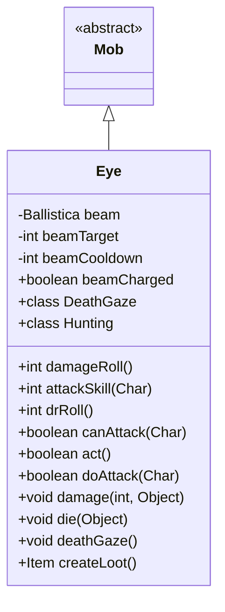

# Eye 类文档

## 1. 基本信息
| 属性 | 值 |
|------|-----|
| 文件路径 | core/src/main/java/com/shatteredpixel/shatteredpixeldungeon/actors/mobs/Eye.java |
| 包名 | com.shatteredpixel.shatteredpixeldungeon.actors.mobs |
| 类类型 | class |
| 继承关系 | extends Mob |
| 代码行数 | 297 行 |

## 2. 类职责说明
Eye（邪眼）是一种会飞的恶魔敌人，具有死亡凝视能力。它会先充能然后释放一道毁灭性光束，对直线上所有目标造成高伤害。充能时受到的伤害会大幅降低。邪眼掉落露水、种子和符石。

## 4. 继承与协作关系


## 静态常量表
| 常量名 | 类型 | 值 | 说明 |
|--------|------|-----|------|
| BEAM_TARGET | String | "beamTarget" | Bundle 存储键 |
| BEAM_COOLDOWN | String | "beamCooldown" | Bundle 存储键 |
| BEAM_CHARGED | String | "beamCharged" | Bundle 存储键 |

## 实例字段表
| 字段名 | 类型 | 修饰符 | 说明 |
|--------|------|--------|------|
| beam | Ballistica | private | 光束弹道 |
| beamTarget | int | private | 光束目标位置 |
| beamCooldown | int | private | 光束冷却时间 |
| beamCharged | boolean | public | 光束是否已充能 |

## 7. 方法详解

### damageRoll()
**签名**: `public int damageRoll()`
**功能**: 计算伤害掷骰
**返回值**: int - 伤害范围 20-30

### attackSkill(Char target)
**签名**: `public int attackSkill(Char target)`
**功能**: 获取攻击技能值
**返回值**: int - 攻击技能值 30

### drRoll()
**签名**: `public int drRoll()`
**功能**: 计算伤害减免
**返回值**: int - 伤害减免 0-10

### canAttack(Char enemy)
**签名**: `protected boolean canAttack(Char enemy)`
**功能**: 判断是否能攻击（包括远程光束）
**参数**:
- enemy: Char - 目标
**返回值**: boolean - 是否能攻击
**实现逻辑**:
```
第94-108行: 如果冷却结束且目标可见，准备光束
         如果已充能，必须攻击
```

### act()
**签名**: `protected boolean act()`
**功能**: 每回合更新状态
**返回值**: boolean - 行动结果
**实现逻辑**:
```
第113-116行: 如果不在追猎状态，取消充能
第117-120行: 恢复光束弹道
第121-122行: 减少冷却
```

### doAttack(Char enemy)
**签名**: `protected boolean doAttack(Char enemy)`
**功能**: 执行攻击或充能
**参数**:
- enemy: Char - 目标
**返回值**: boolean - 攻击是否完成
**实现逻辑**:
```
第130-131行: 如果冷却中或目标不在光束路径上，近战
第132-136行: 如果未充能，开始充能（双倍攻击延迟）
第137-149行: 如果已充能，释放死亡凝视
```

### damage(int dmg, Object src)
**签名**: `public void damage(int dmg, Object src)`
**功能**: 受伤时充能状态减伤
**参数**:
- dmg: int - 伤害值
- src: Object - 伤害来源
**实现逻辑**:
```
第155行: 充能状态下受到的伤害降至1/4
```

### die(Object cause)
**签名**: `public void die(Object cause)`
**功能**: 死亡时停止飞行
**参数**:
- cause: Object - 死亡原因
**实现逻辑**:
```
第161行: 设置飞行属性为 false
```

### deathGaze()
**签名**: `public void deathGaze()`
**功能**: 释放死亡凝视攻击
**实现逻辑**:
```
第172-173行: 取消充能状态，设置冷却
第177-227行: 对光束路径上的所有角色造成30-50伤害
          可摧毁易燃地形
```

### createLoot()
**签名**: `public Item createLoot()`
**功能**: 创建掉落物品
**返回值**: Item - 露水、种子或符石

## 内部类详解

### DeathGaze
**功能**: 死亡凝视伤害类型标记
**用途**: 允许区分近战和魔法攻击的抗性

### Hunting
**功能**: 自定义追猎状态
**方法**:
- `act()`: 即使看不到敌人也会攻击如果已充能

## 11. 使用示例
```java
// 邪眼充能后释放死亡凝视
Eye eye = new Eye();

// 充能时伤害减免75%
// 死亡凝视造成30-50伤害
// 掉落露水、种子、符石
```

## 注意事项
1. **飞行能力**: 可以飞越障碍
2. **死亡凝视**: 充能后释放直线高伤害
3. **充能减伤**: 充能时受到伤害降至1/4
4. **恶魔属性**: 属于 DEMONIC 类型
5. **抗性**: 对瓦解攻击有抗性

## 最佳实践
1. 充能时集火击杀
2. 躲避光束路径
3. 利用掩体
4. 不要站在直线上