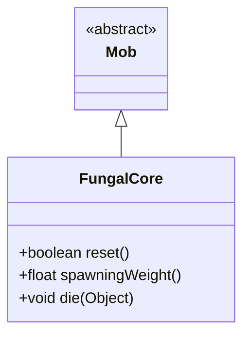

# FungalCore 类文档

## 1. 基本信息
| 属性 | 值 |
|------|-----|
| 文件路径 | core/src/main/java/com/shatteredpixel/shatteredpixeldungeon/actors/mobs/FungalCore.java |
| 包名 | com.shatteredpixel.shatteredpixeldungeon.actors.mobs |
| 类类型 | class |
| 继承关系 | extends Mob |
| 代码行数 | 56 行 |

## 2. 类职责说明
FungalCore（真菌核心）是一个不可移动的 BOSS 级敌人。它是一个被动的守卫，不进行任何攻击。击杀真菌核心会推进铁匠任务。通常与真菌哨兵和真菌纺织者一起生成，构成一个战斗区域。

## 4. 继承与协作关系


## 静态常量表
（无静态常量）

## 实例字段表
（无额外实例字段，继承自 Mob）

## 7. 方法详解

### reset()
**签名**: `public boolean reset()`
**功能**: 重置状态
**返回值**: boolean - true

### spawningWeight()
**签名**: `public float spawningWeight()`
**功能**: 获取生成权重
**返回值**: float - 0（不自然生成）

### die(Object cause)
**签名**: `public void die(Object cause)`
**功能**: 死亡时推进铁匠任务
**参数**:
- cause: Object - 死亡原因
**实现逻辑**:
```
第54行: 通知铁匠任务 BOSS 已被击败
```

## 11. 使用示例
```java
// 真菌核心是被动的守卫
FungalCore core = new FungalCore();

// 不会主动攻击
// 击杀后推进铁匠任务
```

## 注意事项
1. **不可移动**: 具有 IMMOVABLE 属性
2. **BOSS属性**: 属于 BOSS 类型
3. **被动状态**: 始终处于 PASSIVE 状态
4. **高HP**: 300 HP
5. **任务关联**: 与铁匠任务相关

## 最佳实践
1. 可以安全接近
2. 集中火力快速击杀
3. 注意周围的其他真菌敌人