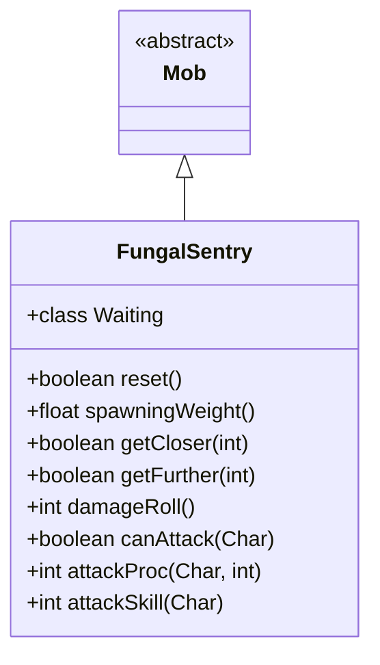

# FungalSentry 类文档

## 1. 基本信息
| 属性 | 值 |
|------|-----|
| 文件路径 | core/src/main/java/com/shatteredpixel/shatteredpixeldungeon/actors/mobs/FungalSentry.java |
| 包名 | com.shatteredpixel.shatteredpixeldungeon.actors.mobs |
| 类类型 | class |
| 继承关系 | extends Mob |
| 代码行数 | 122 行 |

## 2. 类职责说明
FungalSentry（真菌哨兵）是一种不可移动的小BOSS敌人。它有很高的 HP（200）和攻击技能（50），可以远程攻击并施加中毒效果。真菌哨兵总是能注意到英雄，免疫毒素和毒气。

## 4. 继承与协作关系


## 静态常量表
（无静态常量）

## 实例字段表
（无额外实例字段，继承自 Mob）

## 7. 方法详解

### reset()
**签名**: `public boolean reset()`
**功能**: 重置状态
**返回值**: boolean - true

### spawningWeight()
**签名**: `public float spawningWeight()`
**功能**: 获取生成权重
**返回值**: float - 0（不自然生成）

### getCloser(int target) / getFurther(int target)
**签名**: `protected boolean getCloser/getFurther(int target)`
**功能**: 移动方法（不可移动）
**返回值**: boolean - 始终返回 false

### damageRoll()
**签名**: `public int damageRoll()`
**功能**: 计算伤害掷骰
**返回值**: int - 伤害范围 5-10

### canAttack(Char enemy)
**签名**: `protected boolean canAttack(Char enemy)`
**功能**: 判断是否能攻击（包括远程）
**参数**:
- enemy: Char - 目标
**返回值**: boolean - 是否能攻击
**实现逻辑**:
```
第77-78行: 近战或魔法弹道可达
```

### attackProc(Char enemy, int damage)
**签名**: `public int attackProc(Char enemy, int damage)`
**功能**: 攻击时施加中毒
**参数**:
- enemy: Char - 目标
- damage: int - 伤害值
**返回值**: int - 最终伤害
**实现逻辑**:
```
第85行: 施加6回合中毒
```

### attackSkill(Char target)
**签名**: `public int attackSkill(Char target)`
**功能**: 获取攻击技能值
**返回值**: int - 攻击技能值 50（很高）

## 内部类详解

### Waiting（等待状态）
**功能**: 替代游荡状态
**方法**:
- `act()`: 总是注意到敌人
- `noticeEnemy()`: 消耗一回合再激活

## 11. 使用示例
```java
// 真菌哨兵是不可移动的守卫
FungalSentry sentry = new FungalSentry();

// 高HP和高命中
// 远程攻击施加中毒
// 总是能注意到玩家
```

## 注意事项
1. **不可移动**: 具有 IMMOVABLE 属性
2. **小BOSS**: 属于 MINIBOSS 类型
3. **高属性**: HP 200，攻击技能 50
4. **远程攻击**: 可以远程施毒
5. **免疫**: 对毒素和毒气免疫

## 最佳实践
1. 利用其不可移动性保持距离
2. 准备解毒手段
3. 使用高闪避或格挡
4. 真菌哨兵与真菌核心配合