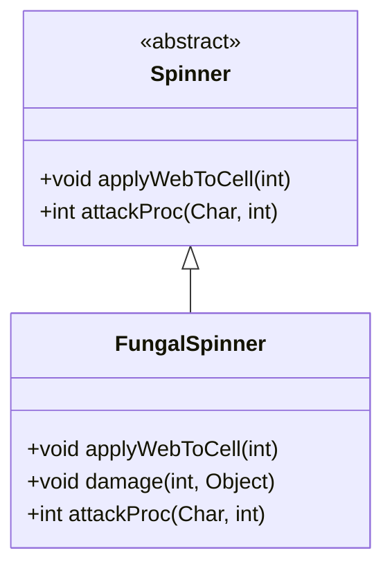

# FungalSpinner 类文档

## 1. 基本信息
| 属性 | 值 |
|------|-----|
| 文件路径 | core/src/main/java/com/shatteredpixel/shatteredpixeldungeon/actors/mobs/FungalSpinner.java |
| 包名 | com.shatteredpixel.shatteredpixeldungeon.actors.mobs |
| 类类型 | class |
| 继承关系 | extends Spinner |
| 代码行数 | 74 行 |

## 2. 类职责说明
FungalSpinner（真菌纺织者）是 Spinner 的变种。它喷射的不是蛛网而是再生效果，在地面生成草和高草。它免疫中毒，也不会在攻击时施加中毒效果。周围有草时受到的伤害会降低。

## 4. 继承与协作关系


## 静态常量表
（无静态常量）

## 实例字段表
（无额外实例字段，继承自 Spinner）

## 7. 方法详解

### applyWebToCell(int cell)
**签名**: `protected void applyWebToCell(int cell)`
**功能**: 在目标格子放置再生效果而非蛛网
**参数**:
- cell: int - 目标格子
**实现逻辑**:
```
第47行: 添加 Regrowth（再生）Blob
```

### damage(int dmg, Object src)
**签名**: `public void damage(int dmg, Object src)`
**功能**: 受伤时根据周围草数量减伤
**参数**:
- dmg: int - 伤害值
- src: Object - 伤害来源
**实现逻辑**:
```
第52-60行: 计算相邻草格子数量
         每个草格减少10-30%伤害
```

### attackProc(Char enemy, int damage)
**签名**: `public int attackProc(Char enemy, int damage)`
**功能**: 攻击时不施加中毒
**参数**:
- enemy: Char - 目标
- damage: int - 伤害值
**返回值**: int - 原始伤害（不施加中毒）
**实现逻辑**:
```
第67行: 直接返回伤害，跳过父类的中毒逻辑
```

## 11. 使用示例
```java
// 真菌纺织者喷射再生效果
FungalSpinner spinner = new FungalSpinner();

// 不施加中毒
// 周围有草时更难杀死
// 免疫再生效果
```

## 注意事项
1. **再生喷射**: 喷射的是再生效果而非蛛网
2. **草减伤**: 周围每个草格减少伤害
3. **无中毒**: 攻击不施加中毒
4. **免疫**: 对毒素和再生免疫
5. **小BOSS**: 与真菌核心相关

## 最佳实践
1. 先清除周围草皮减少其防御
2. 不必担心中毒效果
3. 利用再生效果可能对自己有利
4. 使用火焰清除草皮