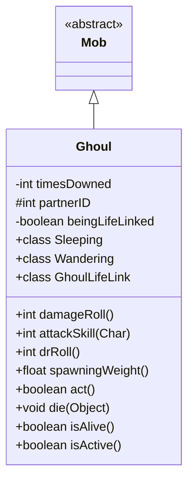

# Ghoul 类文档

## 1. 基本信息
| 属性 | 值 |
|------|-----|
| 文件路径 | core/src/main/java/com/shatteredpixel/shatteredpixeldungeon/actors/mobs/Ghoul.java |
| 包名 | com.shatteredpixel.shatteredpixeldungeon.actors.mobs |
| 类类型 | class |
| 继承关系 | extends Mob |
| 代码行数 | 377 行 |

## 2. 类职责说明
Ghoul（食尸鬼）是一种不死族敌人，具有独特的生命链接机制。它们成对生成，当一个食尸鬼死亡时，如果有另一个食尸鬼在视野内，它会暂时倒下并在一定回合后复活。只有两个食尸鬼都被击败才能真正消灭它们。

## 4. 继承与协作关系


## 静态常量表
| 常量名 | 类型 | 值 | 说明 |
|--------|------|-----|------|
| PARTNER_ID | String | "partner_id" | Bundle 存储键 |
| TIMES_DOWNED | String | "times_downed" | Bundle 存储键 |

## 实例字段表
| 字段名 | 类型 | 修饰符 | 说明 |
|--------|------|--------|------|
| timesDowned | int | private | 倒下次数 |
| partnerID | int | protected | 配偶 Actor ID |
| beingLifeLinked | boolean | private | 是否被生命链接 |

## 7. 方法详解

### damageRoll()
**签名**: `public int damageRoll()`
**功能**: 计算伤害掷骰
**返回值**: int - 伤害范围 16-22

### attackSkill(Char target)
**签名**: `public int attackSkill(Char target)`
**功能**: 获取攻击技能值
**返回值**: int - 攻击技能值 24

### drRoll()
**签名**: `public int drRoll()`
**功能**: 计算伤害减免
**返回值**: int - 伤害减免 0-4

### spawningWeight()
**签名**: `public float spawningWeight()`
**功能**: 获取生成权重
**返回值**: float - 0.5（比普通怪物低）

### act()
**签名**: `protected boolean act()`
**功能**: 自动创建配偶
**返回值**: boolean - 行动结果
**实现逻辑**:
```
第107-145行: 如果没有配偶，在相邻位置创建一个
           新食尸鬼继承持久性 Buff
```

### die(Object cause)
**签名**: `public void die(Object cause)`
**功能**: 死亡时的生命链接处理
**参数**:
- cause: Object - 死亡原因
**实现逻辑**:
```
第154-165行: 如果附近有存活配偶，不真正死亡
           而是进入生命链接状态等待复活
```

### isAlive()
**签名**: `public boolean isAlive()`
**功能**: 判断是否存活
**返回值**: boolean - 包括被生命链接状态

### isActive()
**签名**: `public boolean isActive()`
**功能**: 判断是否活跃
**返回值**: boolean - 不在被生命链接状态

## 内部类详解

### GhoulLifeLink
**功能**: 管理食尸鬼的复活机制
**方法**:
- `act()`: 倒计时复活
- `detach()`: 尝试寻找新宿主或真正死亡
- `searchForHost()`: 静态方法，搜索可用的宿主食尸鬼

### Sleeping
**功能**: 自定义睡眠状态
**方法**:
- `act()`: 如果配偶醒了，自己也醒

### Wandering
**功能**: 自定义游荡状态
**方法**:
- `continueWandering()`: 跟随配偶移动

## 11. 使用示例
```java
// 食尸鬼成对生成
Ghoul ghoul = new Ghoul();

// 击杀一个后，另一个会使其复活
// 必须快速击杀两个才能真正消灭

// 掉落金币
```

## 注意事项
1. **不死属性**: 属于 UNDEAD 类型
2. **成对生成**: 自动创建配偶
3. **生命链接**: 附近有同伴时会复活
4. **复活时间**: 每次倒下增加5回合复活时间
5. **金币掉落**: 20%概率掉落金币

## 最佳实践
1. 快速连续击杀两个食尸鬼
2. 将它们分开击杀防止复活
3. 使用范围效果同时伤害两个
4. 注意复活时间会累积