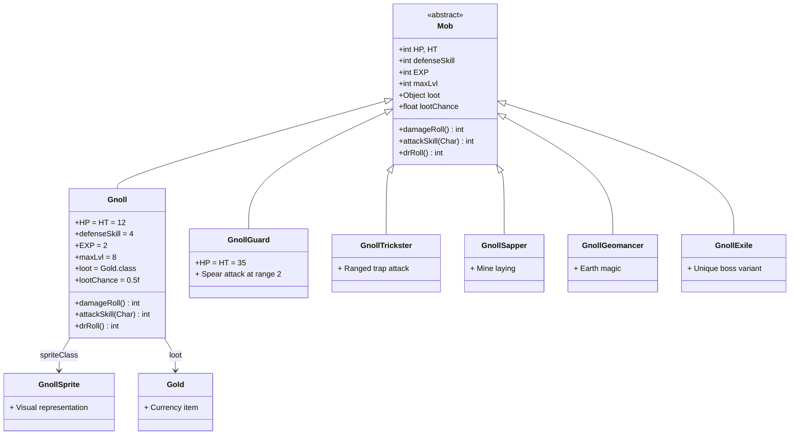

# Gnoll 源码详解

## 1. 基本信息

| 属性 | 值 |
|------|-----|
| **文件路径** | core/src/main/java/com/shatteredpixel/shatteredpixeldungeon/actors/mobs/Gnoll.java |
| **包名** | com.shatteredpixel.shatteredpixeldungeon.actors.mobs |
| **类类型** | public class |
| **继承关系** | extends Mob |
| **代码行数** | 58 |
| **登场层数** | 第1-4层（下水道） |
| **难度定位** | 入门级怪物 |

---

## 类职责

Gnoll（豺狼人）是游戏中最基础的敌对怪物之一，代表玩家在游戏早期遇到的第一个"真正"的敌人（相较于老鼠）。它的职责包括：

1. **早期战斗教学**：让玩家学习基本的战斗机制
2. **资源掉落**：提供金币和经验值
3. **难度递进**：比老鼠稍强，但仍然较弱

**设计特点**：
- 简单的近战AI，无特殊能力
- 均衡的属性，适合新手练习
- 适中的经验值和掉落

---

## 4. 继承与协作关系



---

## 静态常量表

Gnoll 类本身没有定义静态常量，但继承自父类的相关常量：

| 常量名 | 来源 | 值 | 说明 |
|--------|------|-----|------|
| `TIME_TO_WAKE_UP` | Mob | 1f | 唤醒所需时间 |

---

## 实例字段表

| 字段名 | 类型 | 初始值 | 说明 |
|--------|------|--------|------|
| `spriteClass` | Class&lt;? extends CharSprite&gt; | GnollSprite.class | 怪物精灵类 |
| `HP` | int | 12 | 当前生命值 |
| `HT` | int | 12 | 最大生命值 |
| `defenseSkill` | int | 4 | 防御技能值 |
| `EXP` | int | 2 | 击杀经验值 |
| `maxLvl` | int | 8 | 有效经验最大等级 |
| `loot` | Object | Gold.class | 掉落物品类型 |
| `lootChance` | float | 0.5f | 掉落概率（50%） |

---

## 7. 方法详解

### 1. 实例初始化块

```java
{
    spriteClass = GnollSprite.class;
    
    HP = HT = 12;
    defenseSkill = 4;
    
    EXP = 2;
    maxLvl = 8;
    
    loot = Gold.class;
    lootChance = 0.5f;
}
```

**逐行解释**：

| 行号 | 代码 | 说明 |
|------|------|------|
| 31 | `spriteClass = GnollSprite.class;` | 设置怪物的视觉表现类为 GnollSprite，负责渲染豺狼人的动画和外观 |
| 34 | `HP = HT = 12;` | 设置生命值为12点。这是早期怪物的典型数值，玩家用初始武器约需2-3次攻击击杀 |
| 35 | `defenseSkill = 4;` | 设置防御技能值为4。影响敌人攻击时的命中率，公式：命中率 = 攻击技能 - 防御技能 |
| 37 | `EXP = 2;` | 击杀获得2点经验值，是老鼠（EXP=1）的两倍 |
| 38 | `maxLvl = 8;` | 当英雄等级超过8级后，击杀此怪物不再获得经验（防止刷低级怪升级） |
| 40 | `loot = Gold.class;` | 掉落物类型为金币 |
| 41 | `lootChance = 0.5f;` | 50%概率掉落金币。实际掉落量 = 30 + 深度*10 到 60 + 深度*20 |

---

### 2. damageRoll()

```java
@Override
public int damageRoll() {
    return Random.NormalIntRange( 1, 6 );
}
```

**逐行解释**：

| 行号 | 代码 | 说明 |
|------|------|------|
| 44-47 | `@Override public int damageRoll()` | 重写父类方法，定义怪物的伤害随机范围 |
| 46 | `return Random.NormalIntRange( 1, 6 );` | 返回1-6点随机伤害（正态分布倾向中间值） |

**伤害分析**：

| 对比项 | Gnoll | Rat | 说明 |
|--------|-------|-----|------|
| 伤害范围 | 1-6 | 1-3 | 豺狼人伤害是老鼠的两倍范围 |
| 平均伤害 | 3.5 | 2 | 对无护甲玩家威胁较大 |
| 对玩家威胁 | 中等 | 低 | 早期可能造成可观伤害 |

**计算说明**：
- `Random.NormalIntRange(min, max)` 返回一个在 [min, max] 范围内的整数
- 概率分布略微偏向中间值（非均匀分布）
- 对于 1-6：大约 40% 概率得到 3-4，30% 概率得到 2 或 5，各约 15% 概率得到 1 或 6

---

### 3. attackSkill(Char target)

```java
@Override
public int attackSkill( Char target ) {
    return 10;
}
```

**逐行解释**：

| 行号 | 代码 | 说明 |
|------|------|------|
| 49-52 | `@Override public int attackSkill(Char target)` | 重写父类方法，定义攻击技能值 |
| 51 | `return 10;` | 返回固定的攻击技能值10 |

**命中计算**：

攻击命中率 = 攻击技能 - 目标防御技能

| 目标 | 防御技能 | 命中率计算 | 命中概率 |
|------|----------|------------|----------|
| 初始英雄 | 5 | 10 - 5 = 5 | 约85% |
| 战士（初始）| 7 | 10 - 7 = 3 | 约75% |
| 盗贼（初始）| 5 | 10 - 5 = 5 | 约85% |
| 老鼠对比 | - | 攻击技能5 | 更低的命中率 |

**公式说明**：
- 实际命中概率 = 1 / (1 + e^(-0.1 * (攻击技能 - 防御技能)))
- 攻击技能10是一个适中的值，对新手玩家不会太强也不会太弱

---

### 4. drRoll()

```java
@Override
public int drRoll() {
    return super.drRoll() + Random.NormalIntRange(0, 2);
}
```

**逐行解释**：

| 行号 | 代码 | 说明 |
|------|------|------|
| 54-57 | `@Override public int drRoll()` | 重写父类方法，定义伤害减免值 |
| 56 | `return super.drRoll() + Random.NormalIntRange(0, 2);` | 返回父类DR加上0-2点额外减免 |

**伤害减免（DR）分析**：

| 组件 | 值范围 | 说明 |
|------|--------|------|
| super.drRoll() | 0 | 父类默认无额外DR |
| 额外DR | 0-2 | 豺狼人自带的护甲值 |
| 总DR | 0-2 | 平均约1点减免 |

**实际效果**：
- 33% 概率减免 0 点
- 33% 概率减免 1 点
- 33% 概率减免 2 点

**对比其他早期怪物**：

| 怪物 | DR范围 | 平均DR | 生存能力 |
|------|--------|--------|----------|
| Rat | 0 | 0 | 最低 |
| **Gnoll** | 0-2 | 1 | 低 |
| Crab | 0-4 | 2 | 中等 |

---

## 11. 使用示例

### 1. 生成豺狼人

```java
// 在关卡生成时创建豺狼人
Gnoll gnoll = new Gnoll();
gnoll.pos = spawnPosition;  // 设置生成位置
Dungeon.level.mobs.add(gnoll);  // 添加到关卡
GameScene.add(gnoll);  // 添加到游戏场景
```

### 2. 自定义豺狼人变体

```java
// 创建一个更强的豺狼人
public class StrongGnoll extends Gnoll {
    {
        HP = HT = 18;  // 更高生命值
        defenseSkill = 6;  // 更高防御
        EXP = 3;  // 更多经验
    }
    
    @Override
    public int damageRoll() {
        return Random.NormalIntRange(2, 8);  // 更高伤害
    }
}
```

### 3. 检查是否应该掉落经验

```java
// 判断击杀是否给予经验
if (Dungeon.hero.lvl <= gnoll.maxLvl) {
    // 英雄等级 <= 8，获得完整经验
    Dungeon.hero.earnExp(gnoll.EXP, Gnoll.class);
} else {
    // 英雄等级 > 8，不获得经验
    // 防止玩家刷低级怪物
}
```

### 4. 计算实际伤害

```java
// 模拟豺狼人攻击玩家
int rawDamage = gnoll.damageRoll();  // 1-6
int playerDefense = Dungeon.hero.defenseSkill(gnoll);
int hitChance = gnoll.attackSkill(Dungeon.hero) - playerDefense;

// 命中判定
if (Random.Float() < hitProbability(hitChance)) {
    // 计算实际伤害（减去DR）
    int dr = Dungeon.hero.drRoll();
    int actualDamage = Math.max(1, rawDamage - dr);
    Dungeon.hero.damage(actualDamage, gnoll);
}
```

---

## 注意事项

### 1. 属性平衡

- **生命值12**：早期武器的平均伤害约4-6点，意味着2-3次攻击可以击杀
- **伤害1-6**：对生命值20的初始玩家构成威胁，但不会一击致命
- **防御技能4**：玩家的攻击有约85%命中率，保证战斗流畅

### 2. 掉落机制

```java
// 实际掉落量计算（Gold.random()方法）
quantity = Random.IntRange(30 + Dungeon.depth * 10, 60 + Dungeon.depth * 20);

// 第1层掉落示例：40-80金
// 第4层掉落示例：70-140金
```

### 3. 经验值有效范围

- `maxLvl = 8` 意味着：
  - 英雄等级1-8：获得完整2点经验
  - 英雄等级9+：不获得经验
- 这鼓励玩家继续探索更深层

### 4. AI行为

豺狼人使用默认的 Mob AI：
- **初始状态**：SLEEPING（睡眠）
- **发现敌人后**：HUNTING（追击）
- **无目标时**：WANDERING（游荡）

---

## 最佳实践

### 1. 创建自定义豺狼人变体

```java
// 推荐：继承 Gnoll 而不是重新实现
public class GnollScout extends Gnoll {
    {
        // 只修改需要改动的属性
        defenseSkill = 6;  // 更警觉
        EXP = 3;  // 更多经验
    }
    
    @Override
    public int damageRoll() {
        // 保持基础伤害，但更稳定
        return Random.NormalIntRange(2, 5);
    }
}
```

### 2. 平衡性调整

```java
// 如果觉得豺狼人太弱，可以调整：
{
    HP = HT = 15;  // +25% 生命值
    // 或
    lootChance = 0.75f;  // 更高掉落率
}
```

### 3. 添加特殊行为

```java
public class GnollLeader extends Gnoll {
    @Override
    protected boolean act() {
        // 自定义行为：召唤其他豺狼人
        if (HP < HT * 0.3f && !hasSummoned) {
            summonAllies();
            hasSummoned = true;
        }
        return super.act();
    }
    
    private void summonAllies() {
        for (int i = 0; i < 2; i++) {
            Gnoll ally = new Gnoll();
            ally.pos = findSpawnPosition();
            Dungeon.level.mobs.add(ally);
            GameScene.add(ally);
        }
    }
}
```

### 4. 调试技巧

```java
// 在开发时打印豺狼人属性
@Override
public void damage(int dmg, Object src) {
    GLog.i("Gnoll HP: %d/%d, DR: %d", HP, HT, drRoll());
    super.damage(dmg, src);
}
```

---

## 相关类参考

### 豺狼人家族

| 类名 | 位置 | 说明 |
|------|------|------|
| `Gnoll` | mobs/ | 基础豺狼人（本文档） |
| `GnollGuard` | mobs/ | 豺狼人守卫，持矛可远程攻击 |
| `GnollTrickster` | mobs/ | 豺狼人诡术师，使用陷阱 |
| `GnollSapper` | mobs/ | 豺狼人工兵，布置地雷 |
| `GnollGeomancer` | mobs/ | 豺狼人地术师，使用土系魔法 |
| `GnollExile` | mobs/ | 豺狼人流亡者，独特的Boss变种 |

### 精灵类

| 类名 | 说明 |
|------|------|
| `GnollSprite` | 基础豺狼人精灵 |
| `GnollGuardSprite` | 守卫精灵（带护甲） |
| `GnollTricksterSprite` | 诡术师精灵 |
| `GnollSapperSprite` | 工兵精灵 |
| `GnollGeomancerSprite` | 地术师精灵 |
| `GnollExileSprite` | 流亡者精灵 |

### 相关文件

- **资源文件**：`assets/sprites/gnoll.png` - 豺狼人精灵图
- **消息文件**：`messages/actors/mobs/gnoll.properties` - 文本描述

---

## 数值对比表

### 早期怪物属性对比

| 属性 | Rat | **Gnoll** | Crab | Swarm |
|------|-----|-----------|------|-------|
| HP | 5 | **12** | 15 | 40* |
| 伤害 | 1-3 | **1-6** | 1-6 | 1-2 |
| 攻击技能 | 5 | **10** | 12 | 10 |
| 防御技能 | 2 | **4** | 4 | 0 |
| DR | 0 | **0-2** | 0-4 | 0 |
| EXP | 1 | **2** | 3 | 3 |
| 掉落 | 无 | **金币50%** | 无 | 无 |

*Swarm的HP会分裂

### 战斗模拟

假设玩家使用初始短剑（伤害1-5）攻击：

| 对战 | 玩家攻击次数 | 豺狼人攻击次数 | 玩家受伤期望 |
|------|-------------|---------------|--------------|
| vs Rat | 1-2次 | 0-1次 | 0-2点 |
| **vs Gnoll** | **2-3次** | **1-2次** | **2-7点** |
| vs Crab | 2-3次 | 2-3次 | 4-12点 |

---

## 版本历史

| 版本 | 变更 |
|------|------|
| 原始Pixel Dungeon | 基础实现 |
| Shattered PD 0.1.0 | 继承原始实现 |
| 当前版本 | 无重大变更 |

---

## 总结

Gnoll 是一个设计良好的入门级怪物，它：

1. **平衡性好**：比老鼠稍强，让玩家感受到挑战但不会太难
2. **奖励合理**：适中的经验和金币掉落，鼓励战斗
3. **易于扩展**：简洁的代码结构便于创建变体
4. **教学价值**：让玩家学习基本的攻防机制

它是理解 Shattered Pixel Dungeon 怪物系统的最佳起点。