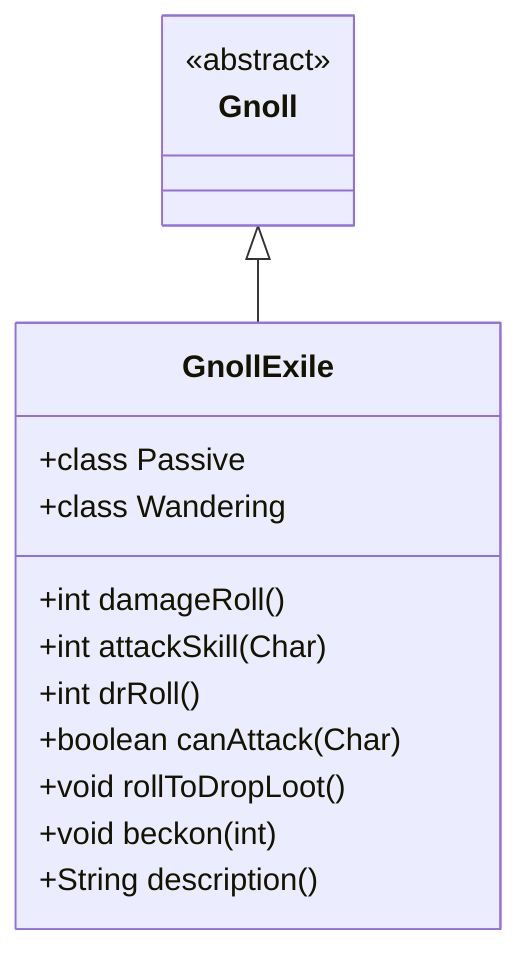

# GnollExile 类文档

## 1. 基本信息
| 属性 | 值 |
|------|-----|
| 文件路径 | core/src/main/java/com/sh/shatteredpixeldungeon/actors/mobs/GnollExile.java |
| 包名 | com.shatteredpixel.shatteredpixeldungeon.actors.mobs |
| 类类型 | class |
| 继承关系 | extends Gnoll |
| 代码行数 | 189 行 |

## 2. 类职责说明
GnollExile（豺狼流放者）是 Gnoll 的稀有变种。相比普通豺狼，它有更高的属性和额外的攻击距离，但初始为被动状态，不会主动攻击。只有受到负面效果或被惊吓时才会激活。死亡时掉落多个随机物品。

## 4. 继承与协作关系


## 静态常量表
（无静态常量）

## 实例字段表
（无额外实例字段，继承自 Gnoll）

## 7. 方法详解

### damageRoll()
**签名**: `public int damageRoll()`
**功能**: 计算伤害掷骰
**返回值**: int - 伤害范围 1-10

### attackSkill(Char target)
**签名**: `public int attackSkill(Char target)`
**功能**: 获取攻击技能值
**返回值**: int - 攻击技能值 15（比普通豺狼高50%）

### drRoll()
**签名**: `public int drRoll()`
**功能**: 计算伤害减免
**返回值**: int - 伤害减免 0-1

### canAttack(Char enemy)
**签名**: `protected boolean canAttack(Char enemy)`
**功能**: 判断是否能攻击（包括2格距离）
**参数**:
- enemy: Char - 目标
**返回值**: boolean - 是否能攻击
**实现逻辑**:
```
第75-95行: 近战或2格内弹道可达
         额外的攻击距离
```

### rollToDropLoot()
**签名**: `public void rollToDropLoot()`
**功能**: 死亡时掉落多个随机物品
**实现逻辑**:
```
第103-115行: 掉落2-3个随机物品
```

### beckon(int cell)
**签名**: `public void beckon(int cell)`
**功能**: 响应召唤
**参数**:
- cell: int - 召唤位置
**实现逻辑**:
```
第121-127行: 被动状态时只更新目标，不改变状态
```

### description()
**签名**: `public String description()`
**功能**: 获取描述
**返回值**: String - 根据状态返回不同描述

## 内部类详解

### Passive（被动状态）
**功能**: 初始状态，不主动攻击
**方法**:
- `act()`: 检查负面效果，可能激活
  - 受到负面效果时激活
  - 看到玩家时显示提示
  - 被惊吓时激活

### Wandering（游荡状态）
**功能**: 激活后的游荡
**方法**:
- `noticeEnemy()`: 显示激活警告

## 11. 使用示例
```java
// 流放者初始为被动状态
GnollExile exile = new GnollExile();

// 可以安全接近
// 受到负面效果或惊吓后激活
// 掉落多个物品
```

## 注意事项
1. **被动初始**: 初始为被动状态
2. **更高属性**: HP 24（普通豺狼12）
3. **额外距离**: 可以攻击2格距离
4. **多物品掉落**: 掉落2-3个随机物品
5. **触发条件**: 负面效果或惊吓激活

## 最佳实践
1. 可以安全绕过被动状态的流放者
2. 高价值掉落值得挑战
3. 使用负面效果可以激活它
4. 注意额外的攻击距离