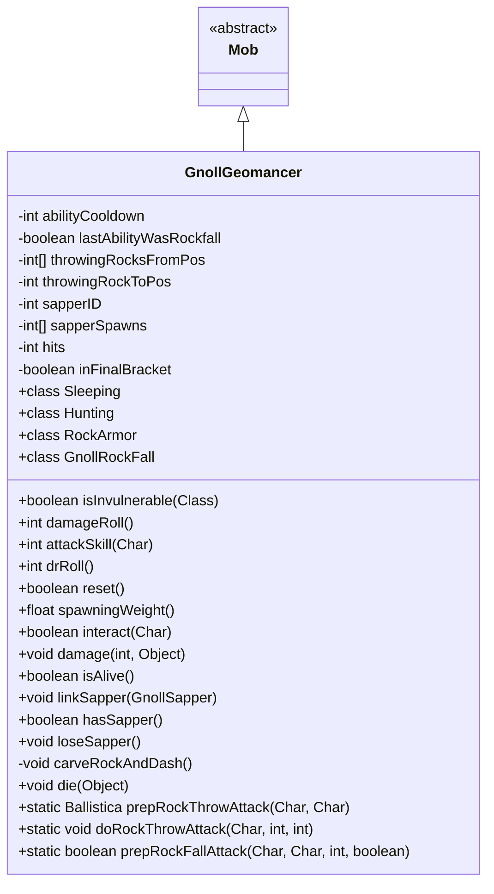

# GnollGeomancer 类文档

## 1. 基本信息
| 属性 | 值 |
|------|-----|
| 文件路径 | core/src/main/java/com/shatteredpixel/shatteredpixeldungeon/actors/mobs/GnollGeomancer.java |
| 包名 | com.shatteredpixel.shatteredpixeldungeon.actors.mobs |
| 类类型 | class |
| 继承关系 | extends Mob |
| 代码行数 | 898 行 |

## 2. 类职责说明
GnollGeomancer（豺狼地术师）是一个复杂的 BOSS 级敌人，拥有岩石装甲、投掷巨石、召唤落石等能力。它需要用镐子打破岩石装甲才能激活，之后会传送到工兵位置并与工兵配合。地术师与铁匠任务相关。

## 4. 继承与协作关系


## 核心机制

### 岩石装甲
- 初始睡眠状态被岩石装甲保护
- 需要用镐子攻击3次激活
- 每次血量下降1/3时重新获得25点护盾

### 巨石投掷
- 寻找视野内的巨石
- 投掷向目标位置
- 造成6-12伤害+麻痹

### 落石攻击
- 在目标周围召唤落石
- 范围随血量减少而增大

### 传送机制
- 血量下降时传送到工兵位置
- 沿路挖掘岩石并创造新巨石

## 7. 方法详解

### interact(Char c)
**签名**: `public boolean interact(Char c)`
**功能**: 用镐子打破岩石装甲
**参数**:
- c: Char - 交互角色
**实现逻辑**:
```
第192-265行: 检查是否有镐子和岩石装甲
第207-218行: 计算镐子伤害
第220-245行: 记录攻击次数，第3次激活BOSS
```

### damage(int dmg, Object src)
**签名**: `public void damage(int dmg, Object src)`
**功能**: 受伤时检查血量阶段
**参数**:
- dmg: int - 伤害值
- src: Object - 伤害来源
**实现逻辑**:
```
第269-294行: 每损失1/3血量传送并获得护盾
```

### carveRockAndDash()
**签名**: `private void carveRockAndDash()`
**功能**: 传送到工兵位置并挖掘岩石
**实现逻辑**:
```
第326-484行: 选择最近的工兵
          计算传送路径
          挖掘岩石并创造巨石
          传送并链接工兵
```

## 内部类详解

### RockArmor
**功能**: 岩石装甲护盾 Buff

### GnollRockFall
**功能**: 延迟落石攻击 Buff
**方法**:
- `affectChar()`: 造成伤害和麻痹
- `affectCell()`: 可能创造新巨石

### Sleeping
**功能**: 自定义睡眠状态，不响应普通唤醒

### Hunting
**功能**: BOSS 战斗状态
**方法**:
- `act()`: 选择投掷巨石或落石攻击

## 11. 使用示例
```java
// 地术师初始为睡眠状态
GnollGeomancer boss = new GnollGeomancer();

// 用镐子攻击3次激活
// 每次血量下降1/3时传送
// 击杀后推进铁匠任务
```

## 注意事项
1. **BOSS属性**: 属于 BOSS 类型
2. **不可移动**: 具有 IMMOVABLE 属性
3. **镐子必需**: 需要镐子才能激活
4. **三阶段战斗**: 每1/3血量为一个阶段
5. **工兵配合**: 与工兵链接时更强

## 最佳实践
1. 用镐子慢慢激活，不要急
2. 观察红色目标格躲避攻击
3. 击杀工兵削弱BOSS
4. 利用巨石作为掩体