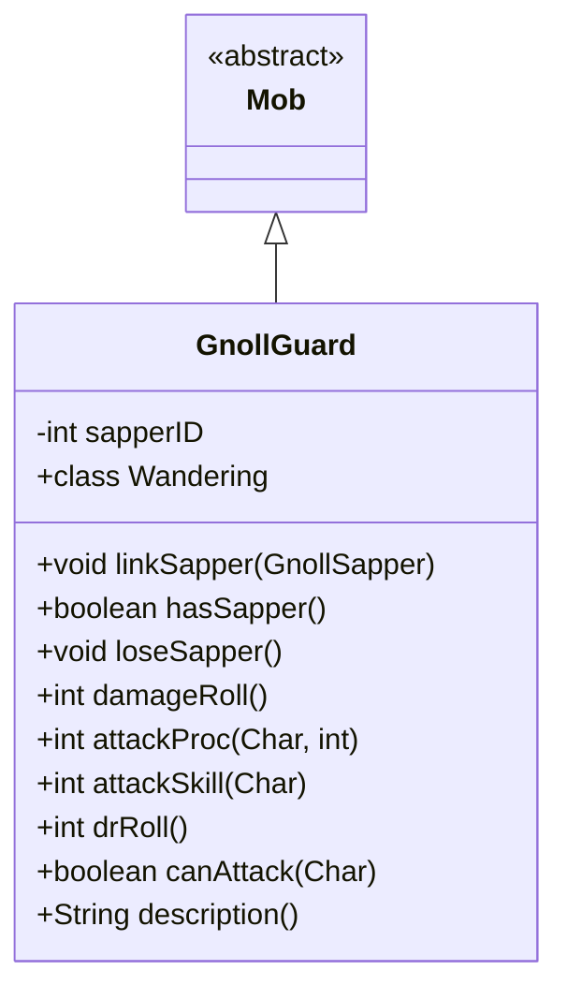

# GnollGuard 类文档

## 1. 基本信息
| 属性 | 值 |
|------|-----|
| 文件路径 | core/src/main/java/com/shatteredpixel/shatteredpixeldungeon/actors/mobs/GnollGuard.java |
| 包名 | com.shatteredpixel.shatteredpixeldungeon.actors.mobs |
| 类类型 | class |
| 继承关系 | extends Mob |
| 代码行数 | 152 行 |

## 2. 类职责说明
GnollGuard（豺狼守卫）是一种使用长矛的敌人，可以攻击2格距离内的目标。当与 GnollSapper（豺狼工兵）链接时，守卫获得护甲并大幅减少受到的伤害（75%减免）。它会向工兵位置游荡。

## 4. 继承与协作关系


## 静态常量表
| 常量名 | 类型 | 值 | 说明 |
|--------|------|-----|------|
| SAPPER_ID | String | "sapper_id" | Bundle 存储键 |

## 实例字段表
| 字段名 | 类型 | 修饰符 | 说明 |
|--------|------|--------|------|
| sapperID | int | private | 链接的工兵 Actor ID |

## 7. 方法详解

### linkSapper(GnollSapper sapper)
**签名**: `public void linkSapper(GnollSapper sapper)`
**功能**: 链接工兵，获得护甲
**参数**:
- sapper: GnollSapper - 工兵实例
**实现逻辑**:
```
第55行: 记录工兵ID
第56-58行: 更新精灵显示护甲
```

### hasSapper()
**签名**: `public boolean hasSapper()`
**功能**: 检查是否有存活工兵
**返回值**: boolean - 是否有工兵

### loseSapper()
**签名**: `public void loseSapper()`
**功能**: 解除工兵链接
**实现逻辑**:
```
第68-73行: 清除工兵ID并更新精灵
```

### damage(int dmg, Object src)
**签名**: `public void damage(int dmg, Object src)`
**功能**: 受伤时如果有工兵则大幅减伤
**参数**:
- dmg: int - 伤害值
- src: Object - 伤害来源
**实现逻辑**:
```
第78行: 如果有工兵，伤害降至1/4（75%减免）
```

### damageRoll()
**签名**: `public int damageRoll()`
**功能**: 计算伤害掷骰
**返回值**: int - 远程16-22，近战6-12
**实现逻辑**:
```
第84-88行: 远程攻击伤害更高
```

### attackProc(Char enemy, int damage)
**签名**: `public int attackProc(Char enemy, int damage)`
**功能**: 攻击时对高伤害进行警告
**参数**:
- enemy: Char - 目标
- damage: int - 伤害值
**返回值**: int - 最终伤害
**实现逻辑**:
```
第94-96行: 远程攻击造成超过12点伤害时显示警告
```

### canAttack(Char enemy)
**签名**: `protected boolean canAttack(Char enemy)`
**功能**: 判断是否能攻击（包括远程）
**参数**:
- enemy: Char - 目标
**返回值**: boolean - 是否能攻击
**实现逻辑**:
```
第113-115行: 2格内且弹道通畅
```

## 内部类详解

### Wandering（游荡状态）
**功能**: 向工兵位置游荡
**方法**:
- `randomDestination()`: 返回工兵位置或随机位置

## 11. 使用示例
```java
// 守卫与工兵配合
GnollGuard guard = new GnollGuard();
guard.linkSapper(sapper);

// 有工兵时伤害大幅减免
// 可以远程攻击
// 掉落长矛
```

## 注意事项
1. **远程攻击**: 可以攻击2格距离
2. **工兵护甲**: 有工兵时减伤75%
3. **伤害差异**: 远程伤害高于近战
4. **矛掉落**: 10%概率掉落长矛
5. **游荡目标**: 优先向工兵移动

## 最佳实践
1. 先击杀工兵移除护甲
2. 近战时守卫伤害较低
3. 注意远程攻击的高伤害