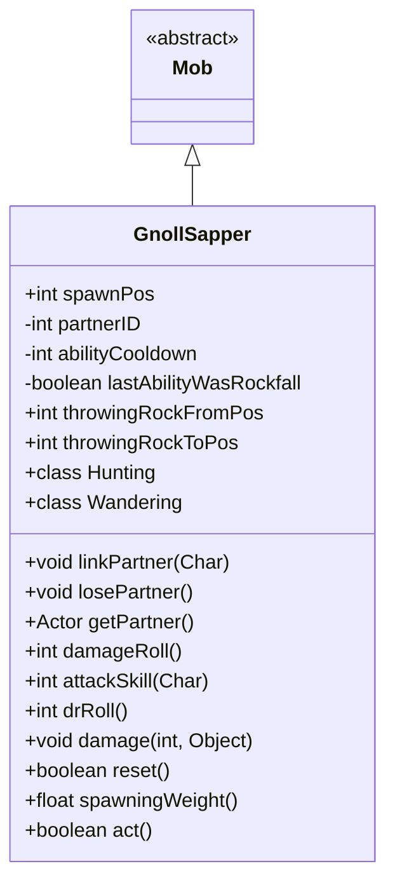

# GnollSapper 类文档

## 1. 基本信息
| 属性 | 值 |
|------|-----|
| 文件路径 | core/src/main/java/com/shatteredpixel/shatteredpixeldungeon/actors/mobs/GnollSapper.java |
| 包名 | com.shatteredpixel.shatteredpixeldungeon.actors.mobs |
| 类类型 | class |
| 继承关系 | extends Mob |
| 代码行数 | 269 行 |

## 2. 类职责说明
GnollSapper（豺狼工兵）是一种与 GnollGuard 或 GnollGeomancer 配合作战的小BOSS敌人。它能投掷巨石或召唤落石攻击，不会追击敌人而是保持在生成位置附近。工兵受伤害时会减少技能冷却。

## 4. 继承与协作关系


## 静态常量表
| 常量名 | 类型 | 值 | 说明 |
|--------|------|-----|------|
| SPAWN_POS | String | "spawn_pos" | Bundle 存储键 |
| PARTNER_ID | String | "partner_id" | Bundle 存储键 |
| ABILITY_COOLDOWN | String | "ability_cooldown" | Bundle 存储键 |
| LAST_ABILITY_WAS_ROCKFALL | String | "last_ability_was_rockfall" | Bundle 存储键 |
| ROCK_FROM_POS | String | "rock_from_pos" | Bundle 存储键 |
| ROCK_TO_POS | String | "rock_to_pos" | Bundle 存储键 |

## 实例字段表
| 字段名 | 类型 | 修饰符 | 说明 |
|--------|------|--------|------|
| spawnPos | int | public | 生成位置 |
| partnerID | int | private | 配偶 Actor ID |
| abilityCooldown | int | private | 技能冷却时间 |
| lastAbilityWasRockfall | boolean | private | 上次是否为落石攻击 |
| throwingRockFromPos | int | public | 巨石来源位置 |
| throwingRockToPos | int | public | 巨石目标位置 |

## 7. 方法详解

### linkPartner(Char c)
**签名**: `public void linkPartner(Char c)`
**功能**: 链接配偶（守卫或地术师）
**参数**:
- c: Char - 配偶角色
**实现逻辑**:
```
第67-73行: 解除旧链接，建立新链接
```

### losePartner()
**签名**: `public void losePartner()`
**功能**: 解除配偶链接
**实现逻辑**:
```
第76-84行: 解除双方的链接关系
```

### getPartner()
**签名**: `public Actor getPartner()`
**功能**: 获取配偶
**返回值**: Actor - 配偶 Actor

### die(Object cause)
**签名**: `public void die(Object cause)`
**功能**: 死亡时解除链接
**参数**:
- cause: Object - 死亡原因
**实现逻辑**:
```
第94行: 解除配偶链接
```

### damageRoll()
**签名**: `public int damageRoll()`
**功能**: 计算伤害掷骰
**返回值**: int - 伤害范围 1-6（较低）

### attackSkill(Char target)
**签名**: `public int attackSkill(Char target)`
**功能**: 获取攻击技能值
**返回值**: int - 攻击技能值 18

### damage(int dmg, Object src)
**签名**: `public void damage(int dmg, Object src)`
**功能**: 受伤时减少技能冷却
**参数**:
- dmg: int - 伤害值
- src: Object - 伤害来源
**实现逻辑**:
```
第110行: 每受到 10 点伤害减少 1 回合冷却
```

### drRoll()
**签名**: `public int drRoll()`
**功能**: 计算伤害减免
**返回值**: int - 伤害减免 0-6

### reset()
**签名**: `public boolean reset()`
**功能**: 重置状态
**返回值**: boolean - true

### spawningWeight()
**签名**: `public float spawningWeight()`
**功能**: 获取自然生成权重
**返回值**: float - 0（不自然生成）

### act()
**签名**: `protected boolean act()`
**功能**: 处理巨石投掷攻击
**返回值**: boolean - 行动结果
**实现逻辑**:
```
第130-145行: 如果有待执行的巨石投掷，执行攻击
第132行: 检查巨石是否仍然存在
第135行: 调用地术师的投掷攻击方法
```

## 内部类详解

### Hunting（追猎状态）
**功能**: 管理技能攻击和配偶协调
**方法**:
- `act()`: 复杂的技能选择逻辑
  - 第152-157行: 不追击离生成点太远的目标
  - 第161-177行: 协调配偶攻击
  - 第179-215行: 根据冷却选择投掷巨石或召唤落石

### Wandering（游荡状态）
**功能**: 保持在生成位置
**方法**:
- `randomDestination()`: 返回生成位置

## 11. 使用示例
```java
// 工兵与守卫或地术师配合作战
GnollSapper sapper = new GnollSapper();
sapper.linkPartner(guard);
sapper.spawnPos = position;

// 能投掷巨石或召唤落石
// 保持在生成位置附近

// 受伤时加快技能冷却
```

## 注意事项
1. **小BOSS属性**: 属于 MINIBOSS 类型
2. **配偶协作**: 与守卫或地术师配合
3. **不追击**: 保持在生成位置附近
4. **技能冷却**: 4-6 回合，受伤时减少
5. **两种技能**: 巨石投掷和落石攻击

## 最佳实践
1. 优先击杀配偶
2. 注意红色目标格避开攻击
3. 利用技能冷却窗口攻击
4. 不要离开其生成点太远