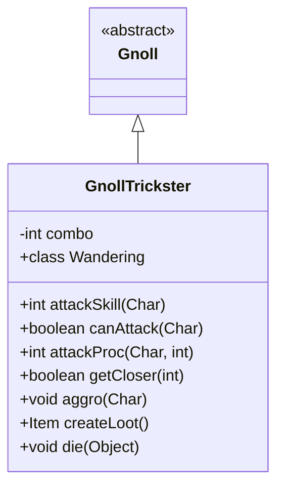

# GnollTrickster 类文档

## 1. 基本信息
| 属性 | 值 |
|------|-----|
| 文件路径 | core/src/main/java/com/shatteredpixel/shatteredpixeldungeon/actors/mobs/GnollTrickster.java |
| 包名 | com.shatteredpixel.shatteredpixeldungeon.actors.mobs |
| 类类型 | class |
| 继承关系 | extends Gnoll |
| 代码行数 | 176 行 |

## 2. 类职责说明
GnollTrickster（豺狼诡术师）是 Gnoll 的小BOSS变种。它使用远程攻击，并且连击次数越多，攻击效果越强。它会在追猎时保持距离，游荡时偏向玩家方向。与幽灵任务相关。

## 4. 继承与协作关系


## 静态常量表
| 常量名 | 类型 | 值 | 说明 |
|--------|------|-----|------|
| COMBO | String | "combo" | Bundle 存储键 |

## 实例字段表
| 字段名 | 类型 | 修饰符 | 说明 |
|--------|------|--------|------|
| combo | int | private | 连击计数器 |

## 7. 方法详解

### attackSkill(Char target)
**签名**: `public int attackSkill(Char target)`
**功能**: 获取攻击技能值
**返回值**: int - 攻击技能值 16

### canAttack(Char enemy)
**签名**: `protected boolean canAttack(Char enemy)`
**功能**: 判断是否能攻击（偏好远程）
**参数**:
- enemy: Char - 目标
**返回值**: boolean - 是否能攻击
**实现逻辑**:
```
第72-73行: 目标不在相邻位置且投射物可达
         偏好远程攻击而非近战
```

### attackProc(Char enemy, int damage)
**签名**: `public int attackProc(Char enemy, int damage)`
**功能**: 攻击时根据连击施加效果
**参数**:
- enemy: Char - 目标
- damage: int - 伤害值
**返回值**: int - 最终伤害
**实现逻辑**:
```
第80-83行: 连击时降低任务评分
第86-102行: 根据连击数+随机值决定效果：
  - effect >= 6: 施加燃烧（如果未燃烧）
  - effect > 2: 施加中毒
  - 效果强度随连击增加
```

### getCloser(int target)
**签名**: `protected boolean getCloser(int target)`
**功能**: 追猎时保持距离
**参数**:
- target: int - 目标位置
**返回值**: boolean - 是否成功移动
**实现逻辑**:
```
第108行: 移动时重置连击计数
第109-113行: 追猎状态下远离目标，保持远程距离
```

### aggro(Char ch)
**签名**: `public void aggro(Char ch)`
**功能**: 激活敌意
**参数**:
- ch: Char - 目标
**实现逻辑**:
```
第120-123行: 只能对视野内的目标激活敌意
```

### createLoot()
**签名**: `public Item createLoot()`
**功能**: 创建掉落物品
**返回值**: Item - 投掷武器
**实现逻辑**:
```
第128-136行: 创建投掷武器，设为+0，移除诅咒，数量减半
```

### die(Object cause)
**签名**: `public void die(Object cause)`
**功能**: 死亡时触发幽灵任务
**参数**:
- cause: Object - 死亡原因
**实现逻辑**:
```
第144行: 处理幽灵任务进度
```

## 内部类详解

### Wandering（游荡状态）
**功能**: 偏向玩家方向的游荡
**方法**:
- `randomDestination()`: 选择离英雄更近的位置

## 11. 使用示例
```java
// 诡术师使用远程攻击
GnollTrickster trickster = new GnollTrickster();

// 连击增加效果强度
// 连续被命中会遭受燃烧或中毒

// 死亡推进幽灵任务
```

## 注意事项
1. **小BOSS属性**: 属于 MINIBOSS 类型
2. **远程攻击**: 偏好保持距离射击
3. **连击效果**: 连击增加燃烧/中毒强度
4. **移动重置**: 移动会重置连击计数
5. **任务关联**: 与幽灵任务相关

## 最佳实践
1. 不断移动打断其连击
2. 逼近迫使近战
3. 准备解毒和治疗手段
4. 低连击时更容易对付