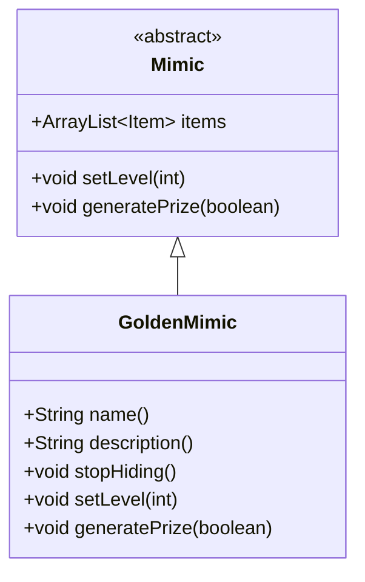

# GoldenMimic 类文档

## 1. 基本信息
| 属性 | 值 |
|------|-----|
| 文件路径 | core/src/main/java/com/shatteredpixel/shatteredpixeldungeon/actors/mobs/GoldenMimic.java |
| 包名 | com.shatteredpixel.shatteredpixeldungeon.actors.mobs |
| 类类型 | class |
| 继承关系 | extends Mimic |
| 代码行数 | 109 行 |

## 2. 类职责说明
GoldenMimic（金色宝箱怪）是 Mimic 的特殊变种，伪装成上锁宝箱。它的属性比普通宝箱怪高 33%，掉落的物品必定不诅咒，且有 50% 概率升级。金色宝箱怪是更危险的敌人，但奖励也更丰厚。

## 4. 继承与协作关系


## 静态常量表
（无静态常量）

## 实例字段表
（无额外实例字段，继承自 Mimic）

## 7. 方法详解

### name()
**签名**: `public String name()`
**功能**: 获取名称
**返回值**: String - 中立状态时显示"上锁宝箱"
**实现逻辑**:
```
第52-56行: 中立时显示宝箱名称，敌对时显示宝箱怪名称
```

### description()
**签名**: `public String description()`
**功能**: 获取描述
**返回值**: String - 描述文本
**实现逻辑**:
```
第61-69行: 中立时显示宝箱描述
         如果不是隐蔽模式，显示隐藏提示
```

### stopHiding()
**签名**: `public void stopHiding()`
**功能**: 停止隐藏，开始攻击
**实现逻辑**:
```
第73行: 进入追猎状态
第74-81行: 如果在视野内，显示警告和粒子效果
```

### setLevel(int level)
**签名**: `public void setLevel(int level)`
**功能**: 设置等级（提高 33%）
**参数**:
- level: int - 基础等级
**实现逻辑**:
```
第86行: 等级设为基础等级的 1.33 倍
```

### generatePrize(boolean useDecks)
**签名**: `protected void generatePrize(boolean useDecks)`
**功能**: 生成更好的奖品
**参数**:
- useDecks: boolean - 是否使用牌组生成
**实现逻辑**:
```
第91行: 先调用父类生成基础奖品
第93-106行: 对所有装备物品：
  - 取消诅咒
  - 移除诅咒附魔/刻印
  - 50% 概率升级 +0 物品
```

## 11. 使用示例
```java
// 金色宝箱怪伪装成上锁宝箱
GoldenMimic mimic = new GoldenMimic();
mimic.setLevel(Dungeon.depth);

// 打开宝箱时暴露
mimic.stopHiding();

// 掉落物品必定不诅咒
// 50% 概率升级
```

## 注意事项
1. **伪装外观**: 中立时显示为上锁宝箱
2. **更高属性**: 等级比普通宝箱怪高 33%
3. **优质掉落**: 物品必定不诅咒
4. **升级概率**: +0 物品有 50% 概率升级
5. **金色精灵**: 使用金色外观

## 最佳实践
1. 注意上锁宝箱可能是金色宝箱怪
2. 准备好战斗再开启
3. 高价值掉落值得挑战
4. MimicTooth 饰品可以识别隐蔽宝箱怪