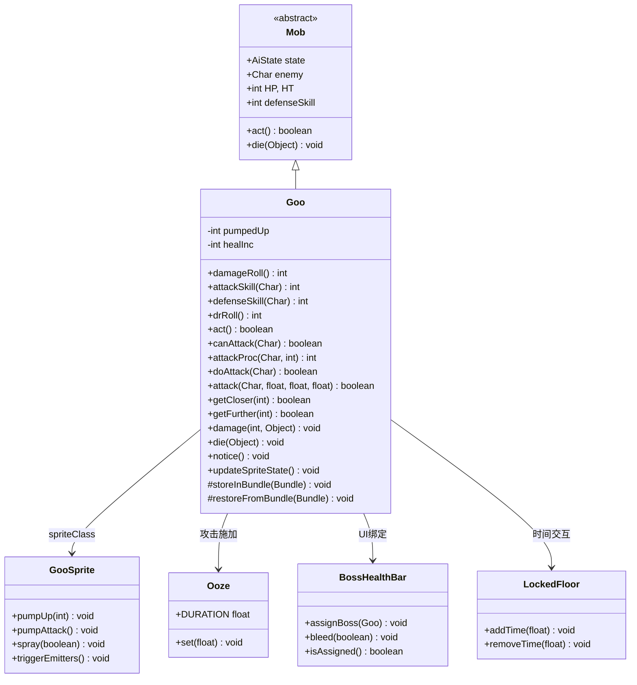
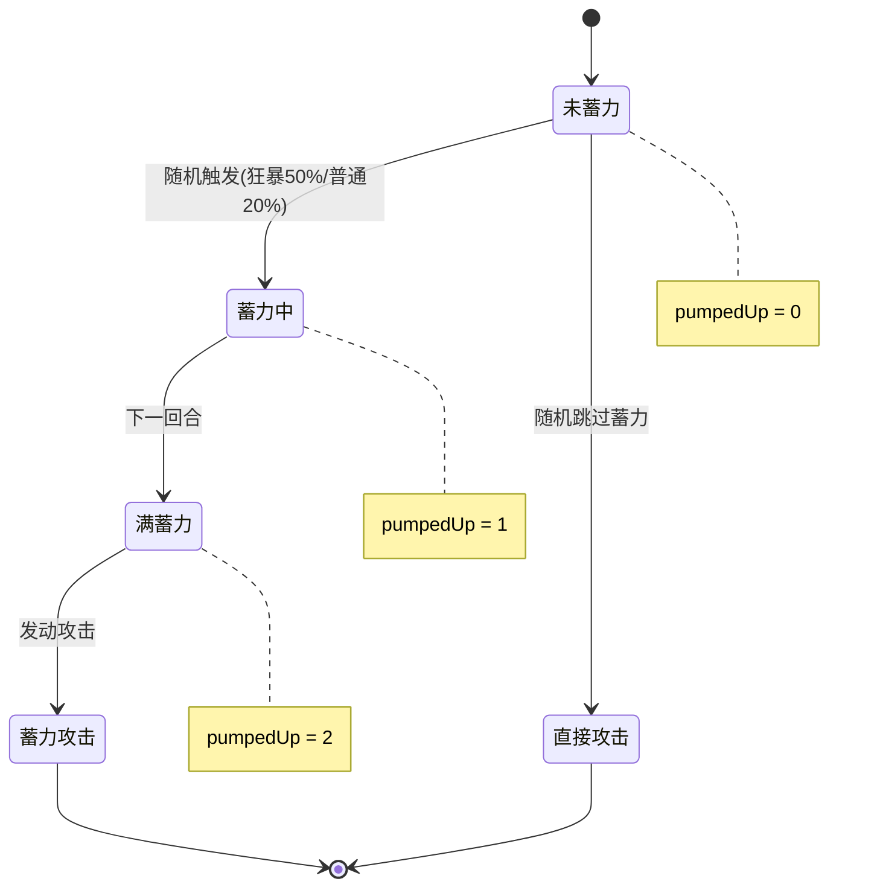
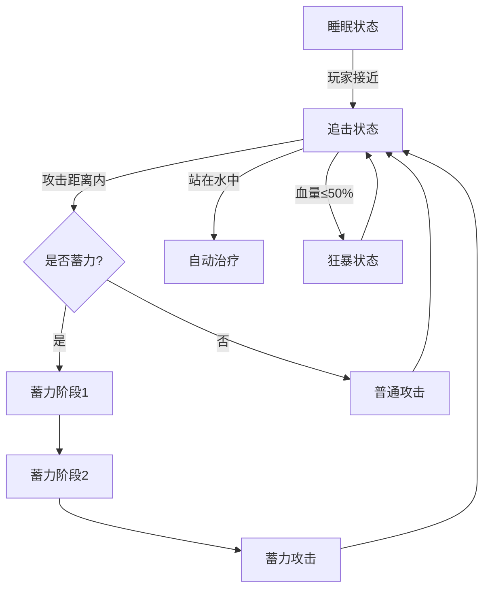

# Goo 源码详解

## 1. 基本信息

| 属性 | 值 |
|------|-----|
| **文件路径** | core/src/main/java/com/shatteredpixel/shatteredpixeldungeon/actors/mobs/Goo.java |
| **包名** | com.shatteredpixel.shatteredpixeldungeon.actors.mobs |
| **类类型** | public class |
| **继承关系** | extends Mob |
| **代码行数** | 350 |
| **游戏角色** | 第一关Boss - 粘液怪（Sewers Boss） |

---

## 类职责

Goo 是游戏第一个Boss——粘液怪，位于下水道最深层的Boss房间。它继承自 Mob 类，实现了独特的战斗机制：

1. **蓄力攻击系统**：通过 `pumpedUp` 计数器实现两阶段的蓄力攻击
2. **水中自愈**：站在水中时自动回复生命值
3. **狂暴状态**：血量低于50%时进入强化状态
4. **酸性攻击**：攻击有概率施加 Ooze（粘液腐蚀）Debuff
5. **远程投射攻击**：蓄力满后可攻击2格内的目标

**核心设计模式**：状态机 + 蓄力机制

---

## 4. 继承与协作关系



---

## 静态常量表

| 常量名 | 类型 | 值 | 说明 |
|--------|------|-----|------|
| 无静态常量 | - | - | 本类未定义静态常量 |

---

## 实例字段表

| 字段名 | 类型 | 默认值 | 说明 |
|--------|------|--------|------|
| `pumpedUp` | int | 0 | 蓄力计数器（0=未蓄力, 1=第一段蓄力, 2=满蓄力） |
| `healInc` | int | 1 | 水中治疗递增值（强敌挑战下可增长到3） |
| `PUMPEDUP` | String | "pumpedup" | 存档键名 |
| `HEALINC` | String | "healinc" | 存档键名 |

---

## 初始化块详解

```java
{
    HP = HT = Dungeon.isChallenged(Challenges.STRONGER_BOSSES) ? 120 : 100;
    EXP = 10;
    defenseSkill = 8;
    spriteClass = GooSprite.class;

    properties.add(Property.BOSS);
    properties.add(Property.DEMONIC);
    properties.add(Property.ACIDIC);
}
```

**属性说明**：

| 属性 | 普通模式 | 强敌挑战 | 说明 |
|------|----------|----------|------|
| HP/HT | 100 | 120 | 生命值上限 |
| EXP | 10 | 10 | 击杀经验 |
| defenseSkill | 8 | 8 | 基础防御值 |
| Property.BOSS | ✓ | ✓ | Boss标签 |
| Property.DEMONIC | ✓ | ✓ | 恶魔标签 |
| Property.ACIDIC | ✓ | ✓ | 酸性标签 |

---

## 7. 方法详解

### 1. damageRoll() - 伤害计算

```java
@Override
public int damageRoll() {
    int min = 1;
    int max = (HP*2 <= HT) ? 12 : 8;  // 狂暴状态下伤害更高
    if (pumpedUp > 0) {
        pumpedUp = 0;
        if (enemy == Dungeon.hero) {
            Statistics.qualifiedForBossChallengeBadge = false;  // 取消挑战徽章资格
            Statistics.bossScores[0] -= 100;  // 扣除Boss评分
        }
        return Random.NormalIntRange( min*3, max*3 );  // 蓄力攻击伤害×3
    } else {
        return Random.NormalIntRange( min, max );
    }
}
```

**伤害表**：

| 状态 | 伤害范围 |
|------|----------|
| 普通攻击（血量>50%） | 1-8 |
| 普通攻击（血量≤50%） | 1-12 |
| 蓄力攻击（血量>50%） | 3-24 |
| 蓄力攻击（血量≤50%） | 3-36 |

---

### 2. attackSkill() - 攻击技能值

```java
@Override
public int attackSkill( Char target ) {
    int attack = 10;
    if (HP*2 <= HT) attack = 15;    // 狂暴状态+5
    if (pumpedUp > 0) attack *= 2;   // 蓄力状态×2
    return attack;
}
```

**攻击技能表**：

| 状态 | 攻击值 |
|------|--------|
| 普通状态 | 10 |
| 狂暴状态 | 15 |
| 蓄力状态 | 20-30 |

---

### 3. defenseSkill() - 防御技能值

```java
@Override
public int defenseSkill(Char enemy) {
    return (int)(super.defenseSkill(enemy) * ((HP*2 <= HT)? 1.5 : 1));
}
```

**防御技能表**：

| 状态 | 防御值 |
|------|--------|
| 普通状态 | 8 |
| 狂暴状态（血量≤50%） | 12 |

---

### 4. act() - 行动逻辑（核心AI）

```java
@Override
public boolean act() {
    // 第1-7行：非追击状态时重置蓄力
    if (state != HUNTING && pumpedUp > 0){
        pumpedUp = 0;
        sprite.idle();
    }

    // 第9-32行：水中治疗机制
    if (!flying && Dungeon.level.water[pos] && HP < HT) {
        HP += healInc;
        Statistics.qualifiedForBossChallengeBadge = false;

        // 锁层时间交互
        LockedFloor lock = Dungeon.hero.buff(LockedFloor.class);
        if (lock != null){
            if (Dungeon.isChallenged(Challenges.STRONGER_BOSSES))
                lock.removeTime(healInc);
            else
                lock.removeTime(healInc*1.5f);
        }

        // 显示治疗特效
        if (Dungeon.level.heroFOV[pos]){
            sprite.showStatusWithIcon(CharSprite.POSITIVE, Integer.toString(healInc), FloatingText.HEALING);
        }

        // 强敌挑战：治疗量递增
        if (Dungeon.isChallenged(Challenges.STRONGER_BOSSES) && healInc < 3) {
            healInc++;
        }

        // 回满血时关闭出血特效
        if (HP*2 > HT) {
            BossHealthBar.bleed(false);
            ((GooSprite)sprite).spray(false);
            HP = Math.min(HP, HT);
        }
    } else {
        healInc = 1;  // 离开水域重置治疗量
    }
    
    // 第34-36行：非睡眠状态锁定楼层
    if (state != SLEEPING){
        Dungeon.level.seal();
    }

    return super.act();
}
```

**水中治疗机制**：

| 挑战模式 | 单次治疗量 | 最大治疗量 |
|----------|------------|------------|
| 普通模式 | 1 | 1 |
| 强敌挑战 | 1→2→3 | 3 |

---

### 5. canAttack() - 攻击范围判定

```java
@Override
protected boolean canAttack( Char enemy ) {
    if (pumpedUp > 0){
        // 蓄力状态下可攻击2格内目标
        // 双向弹道检测确保无障碍物阻挡
        return Dungeon.level.distance(enemy.pos, pos) <= 2
                    && new Ballistica(pos, enemy.pos, 
                        Ballistica.STOP_TARGET | Ballistica.STOP_SOLID | Ballistica.IGNORE_SOFT_SOLID
                        ).collisionPos == enemy.pos
                    && new Ballistica(enemy.pos, pos, 
                        Ballistica.STOP_TARGET | Ballistica.STOP_SOLID | Ballistica.IGNORE_SOFT_SOLID
                        ).collisionPos == pos;
    } else {
        return super.canAttack(enemy);  // 普通攻击仅相邻
    }
}
```

**攻击范围**：

| 状态 | 攻击范围 |
|------|----------|
| 普通攻击 | 相邻1格 |
| 蓄力攻击 | 2格内（需视线通畅） |

---

### 6. doAttack() - 攻击执行（蓄力机制核心）

```java
@Override
protected boolean doAttack( Char enemy ) {
    // 第1阶段：已开始蓄力，进入第2阶段
    if (pumpedUp == 1) {
        pumpedUp++;
        ((GooSprite)sprite).pumpUp(pumpedUp);
        spend(attackDelay());
        return true;
    } 
    // 第2阶段或直接攻击
    else if (pumpedUp >= 2 || Random.Int((HP*2 <= HT) ? 2 : 5) > 0) {
        boolean visible = Dungeon.level.heroFOV[pos];
        
        if (visible) {
            if (pumpedUp >= 2) {
                ((GooSprite)sprite).pumpAttack();
            } else {
                sprite.attack(enemy.pos);
            }
        } else {
            if (pumpedUp >= 2){
                ((GooSprite)sprite).triggerEmitters();
            }
            attack(enemy);
            Invisibility.dispel(this);
            spend(attackDelay());
        }
        return !visible;
    } 
    // 开始蓄力
    else {
        if (Dungeon.isChallenged(Challenges.STRONGER_BOSSES)){
            pumpedUp += 2;  // 强敌挑战直接满蓄力
            spend(GameMath.gate(attackDelay(), (int)Math.ceil(enemy.cooldown()), 3*attackDelay()));
        } else {
            pumpedUp++;
            spend(attackDelay());
        }

        ((GooSprite)sprite).pumpUp(pumpedUp);

        if (Dungeon.level.heroFOV[pos]) {
            sprite.showStatus(CharSprite.WARNING, Messages.get(this, "!!!"));
            GLog.n(Messages.get(this, "pumpup"));
        }
        return true;
    }
}
```

**蓄力攻击流程图**：



**蓄力触发概率**：

| 状态 | 触发蓄力概率 |
|------|-------------|
| 普通状态（血量>50%） | 20%（4/5概率攻击，1/5概率蓄力） |
| 狂暴状态（血量≤50%） | 50%（1/2概率攻击，1/2概率蓄力） |
| 强敌挑战 | 100%（直接满蓄力） |

---

### 7. attackProc() - 攻击附加效果

```java
@Override
public int attackProc( Char enemy, int damage ) {
    damage = super.attackProc(enemy, damage);
    
    // 33%概率施加粘液腐蚀
    if (Random.Int(3) == 0) {
        Buff.affect(enemy, Ooze.class).set(Ooze.DURATION);
        enemy.sprite.burst(0x000000, 5);  // 黑色粒子特效
    }

    // 蓄力攻击震动屏幕
    if (pumpedUp > 0) {
        PixelScene.shake(3, 0.2f);
    }

    return damage;
}
```

**Ooze（粘液腐蚀）效果**：

| 效果 | 说明 |
|------|------|
| 持续时间 | 20回合 |
| 每回合伤害 | 深度>5时：1+深度/5<br>深度=5时：1<br>深度<5时：50%概率1点 |
| 清除条件 | 站在水中 |

---

### 8. damage() - 受伤处理

```java
@Override
public void damage(int dmg, Object src) {
    // 首次受伤显示Boss血条
    if (!BossHealthBar.isAssigned()){
        BossHealthBar.assignBoss(this);
        Dungeon.level.seal();
    }
    
    boolean bleeding = (HP*2 <= HT);
    super.damage(dmg, src);
    
    // 进入狂暴状态
    if ((HP*2 <= HT) && !bleeding){
        BossHealthBar.bleed(true);
        sprite.showStatus(CharSprite.WARNING, Messages.get(this, "enraged"));
        ((GooSprite)sprite).spray(true);
        yell(Messages.get(this, "gluuurp"));
    }
    
    // 锁层时间惩罚
    LockedFloor lock = Dungeon.hero.buff(LockedFloor.class);
    if (lock != null && !isImmune(src.getClass()) && !isInvulnerable(src.getClass())){
        if (Dungeon.isChallenged(Challenges.STRONGER_BOSSES))
            lock.addTime(dmg);
        else
            lock.addTime(dmg*1.5f);
    }
}
```

**狂暴状态触发**：

| 触发条件 | 效果 |
|----------|------|
| HP ≤ 50% HT | Boss血条变红、喷射粒子、喊话 |

---

### 9. die() - 死亡处理

```java
@Override
public void die(Object cause) {
    super.die(cause);
    
    // 解锁楼层
    Dungeon.level.unseal();
    
    // Boss击杀特效
    GameScene.bossSlain();
    
    // 掉落下层钥匙
    Dungeon.level.drop(new WornKey(Dungeon.depth), pos).sprite.drop();
    
    // 掉落粘液块（平均2.5个）
    int blobs = Random.chances(new float[]{0, 0, 6, 3, 1});
    for (int i = 0; i < blobs; i++){
        int ofs;
        do {
            ofs = PathFinder.NEIGHBOURS8[Random.Int(8)];
        } while (!Dungeon.level.passable[pos + ofs]);
        Dungeon.level.drop(new GooBlob(), pos + ofs).sprite.drop(pos);
    }
    
    // 徽章验证
    Badges.validateBossSlain();
    if (Statistics.qualifiedForBossChallengeBadge){
        Badges.validateBossChallengeCompleted();
    }
    Statistics.bossScores[0] += 1000;
    
    yell(Messages.get(this, "defeated"));
}
```

**掉落物表**：

| 掉落物 | 数量 | 概率 |
|--------|------|------|
| WornKey（磨损钥匙） | 1 | 100% |
| GooBlob（粘液块） | 2 | 60% |
| GooBlob（粘液块） | 3 | 30% |
| GooBlob（粘液块） | 4 | 10% |

---

### 10. notice() - 发现玩家

```java
@Override
public void notice() {
    super.notice();
    if (!BossHealthBar.isAssigned()) {
        BossHealthBar.assignBoss(this);
        Dungeon.level.seal();
        yell(Messages.get(this, "notice"));
        
        // 枯玫瑰幽灵对话
        for (Char ch : Actor.chars()){
            if (ch instanceof DriedRose.GhostHero){
                ((DriedRose.GhostHero) ch).sayBoss();
            }
        }
    }
}
```

---

### 11. getCloser() / getFurther() - 移动处理

```java
@Override
protected boolean getCloser(int target) {
    if (pumpedUp != 0) {
        pumpedUp = 0;
        sprite.idle();
    }
    return super.getCloser(target);
}

@Override
protected boolean getFurther(int target) {
    if (pumpedUp != 0) {
        pumpedUp = 0;
        sprite.idle();
    }
    return super.getFurther(target);
}
```

**设计意图**：移动会打断蓄力，防止玩家被"蹭血"后Boss追击时仍保持满蓄力。

---

## AI行为总结



---

## 技能机制详解

### 技能1：普通攻击

| 属性 | 值 |
|------|-----|
| 范围 | 相邻1格 |
| 伤害 | 1-8（普通）/ 1-12（狂暴） |
| 附加效果 | 33%概率施加Ooze |

### 技能2：蓄力攻击（Pump Attack）

| 属性 | 值 |
|------|-----|
| 准备时间 | 1-2回合 |
| 范围 | 2格内（直线视线） |
| 伤害 | 3-24（普通）/ 3-36（狂暴） |
| 附加效果 | 33%概率施加Ooze、屏幕震动 |
| 特殊 | 打断会导致蓄力清零 |

### 技能3：水中自愈

| 属性 | 值 |
|------|-----|
| 触发条件 | 站在水中且HP < HT |
| 治疗量 | 1/回合（普通）/ 1-3/回合（强敌） |
| 特殊 | 治疗会减少锁层时间 |

### 技能4：狂暴状态

| 属性 | 值 |
|------|-----|
| 触发条件 | HP ≤ 50% HT |
| 效果 | 伤害+50%、防御+50%、蓄力概率翻倍 |

---

## 11. 使用示例

### 在关卡生成中放置Goo

```java
// 在SewerBossLevel中
Goo goo = new Goo();
goo.pos = centerPos;  // Boss房间中心
Dungeon.level.mobs.add(goo);
Actor.add(goo);
```

### 检查Goo是否被击杀

```java
// 检查Boss击杀徽章
if (Badges.isUnlocked(Badges.Badge.BOSS_SLAIN_1)) {
    // Goo已被击杀
}
```

### 自定义Goo变体

```java
public class HardGoo extends Goo {
    {
        HP = HT = 150;  // 更高血量
    }
    
    @Override
    public int damageRoll() {
        // 始终使用蓄力攻击伤害
        return Random.NormalIntRange(3, 36);
    }
}
```

---

## 注意事项

### 战斗机制

1. **蓄力打断**：移动或受到某些效果会重置 `pumpedUp`
2. **水中治疗**：玩家可以利用这一点，不攻击站在水中的Goo来获得更多时间
3. **锁层机制**：Goo被激活后楼层会锁定，死亡后解锁

### 徽章与评分

| 条件 | 影响 |
|------|------|
| 被蓄力攻击命中 | 取消Boss挑战徽章资格，扣100分 |
| Goo在水中治疗 | 取消Boss挑战徽章资格 |
| 击杀Goo | 获得1000分 |

### 强敌挑战差异

| 属性 | 普通模式 | 强敌挑战 |
|------|----------|----------|
| 血量 | 100 | 120 |
| 蓄力机制 | 1→2回合 | 直接满蓄力 |
| 水中治疗 | 固定1/回合 | 递增1→2→3 |
| 时间惩罚 | 伤害×1.5 | 伤害×1 |

---

## 最佳实践

### 作为玩家

1. **利用水域**：站在水中可以清除Ooze Debuff
2. **打断蓄力**：在Goo蓄力期间使用控制技能或拉开距离
3. **避免水中战斗**：不要让Goo站在水中，它会持续回血

### 作为开发者

1. **继承修改**：重写 `damageRoll()`、`attackSkill()` 调整难度
2. **自定义蓄力**：修改 `doAttack()` 中的蓄力逻辑
3. **视觉效果**：配合 GooSprite 的 `pumpUp()`、`spray()` 方法

---

## 相关类

| 类名 | 关系 | 说明 |
|------|------|------|
| `Mob` | 父类 | 提供基础AI和战斗框架 |
| `GooSprite` | 精灵类 | 处理动画和粒子效果 |
| `Ooze` | Buff | 粘液腐蚀Debuff |
| `BossHealthBar` | UI组件 | Boss血条显示 |
| `LockedFloor` | Buff | 楼层锁定机制 |
| `SewerBossLevel` | 关卡类 | Goo所在的Boss层 |
| `WornKey` | 掉落物 | 击杀后掉落的钥匙 |
| `GooBlob` | 掉落物 | 击杀后掉落的粘液块 |