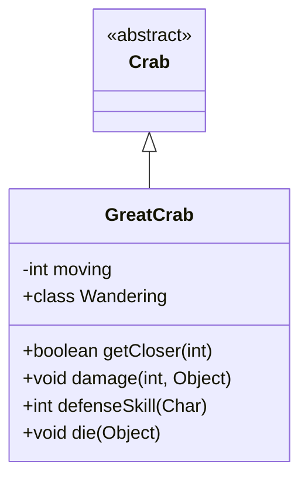

# GreatCrab 类文档

## 1. 基本信息
| 属性 | 值 |
|------|-----|
| 文件路径 | core/src/main/java/com/shatteredpixel/shatteredpixeldungeon/actors/mobs/GreatCrab.java |
| 包名 | com.shatteredpixel.shatteredpixeldungeon.actors.mobs |
| 类类型 | class |
| 继承关系 | extends Crab |
| 代码行数 | 135 行 |

## 2. 类职责说明
GreatCrab（大螃蟹）是一种小BOSS级别的螃蟹变种。它能格挡所有来自当前目标的近战攻击和魔杖攻击，只有在其看不到攻击者或被麻痹时才能被命中。移动速度较慢，会掉落两块肉。与幽灵任务相关。

## 4. 继承与协作关系


## 静态常量表
（无静态常量）

## 实例字段表
| 字段名 | 类型 | 修饰符 | 说明 |
|--------|------|--------|------|
| moving | int | private | 移动计数器 |

## 7. 方法详解

### getCloser(int target)
**签名**: `protected boolean getCloser(int target)`
**功能**: 降低移动频率
**参数**:
- target: int - 目标位置
**返回值**: boolean - 是否成功移动
**实现逻辑**:
```
第65-71行: 每移动2回合才实际移动1次
         保持检测率但降低实际移动速度
```

### damage(int dmg, Object src)
**签名**: `public void damage(int dmg, Object src)`
**功能**: 受到伤害时的格挡处理
**参数**:
- dmg: int - 伤害值
- src: Object - 伤害来源
**实现逻辑**:
```
第79-88行: 如果看到敌人、未睡眠、未麻痹、来源是魔杖/法术、目标是英雄：
         格挡攻击，播放格挡音效，降低任务评分
第89-91行: 否则正常受到伤害
```

### defenseSkill(Char enemy)
**签名**: `public int defenseSkill(Char enemy)`
**功能**: 获取防御技能值
**参数**:
- enemy: Char - 攻击者
**返回值**: int - 防御技能值（可能为无限闪避）
**实现逻辑**:
```
第97-110行: 如果看到敌人、未睡眠、未麻痹、敌人是当前目标且可见：
         返回 INFINITE_EVASION（无限闪避），播放格挡音效
第111行: 否则返回父类防御值
```

### die(Object cause)
**签名**: `public void die(Object cause)`
**功能**: 死亡时触发幽灵任务
**参数**:
- cause: Object - 死亡原因
**实现逻辑**:
```
第118行: 处理幽灵任务进度
```

## 内部类详解

### Wandering（游荡状态）
**功能**: 偏向玩家方向的游荡
**方法**:
- `randomDestination()`: 选择两个候选位置中离英雄更近的一个

## 11. 使用示例
```java
// 大螃蟹格挡大部分攻击
GreatCrab crab = new GreatCrab();

// 只能在以下情况命中：
// - 睡眠时
// - 麻痹时
// - 隐身攻击
// - 非当前目标

// 死亡时推进幽灵任务
```

## 注意事项
1. **小BOSS属性**: 属于 MINIBOSS 类型
2. **格挡机制**: 格挡所有可见目标的攻击
3. **慢速移动**: 移动速度降低
4. **肉掉落**: 掉落 2 块神秘肉
5. **任务关联**: 与幽灵任务相关

## 最佳实践
1. 使用隐身绕到背后攻击
2. 等待其睡眠或使用麻痹
3. 使用范围效果绕过格挡
4. 非目标角色可以正常命中