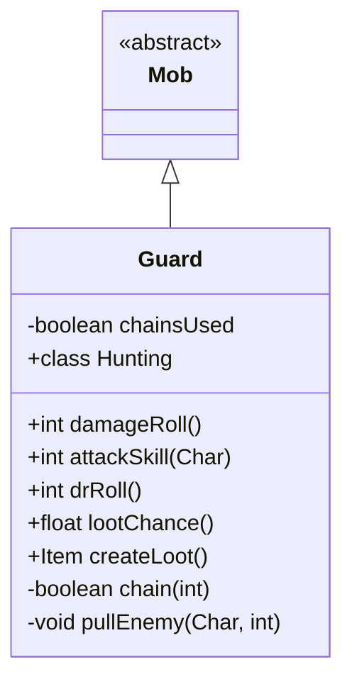

# Guard 类文档

## 1. 基本信息
| 属性 | 值 |
|------|-----|
| 文件路径 | core/src/main/java/com/shatteredpixel/shatteredpixeldungeon/actors/mobs/Guard.java |
| 包名 | com.shatteredpixel.shatteredpixeldungeon.actors.mobs |
| 类类型 | class |
| 继承关系 | extends Mob |
| 代码行数 | 192 行 |

## 2. 类职责说明
Guard（守卫）是一种使用锁链拉取敌人的不死族敌人。它可以用锁链将远处的敌人拉到身边并造成残废效果。守卫只能使用一次锁链，之后只能进行普通近战攻击。它是监狱层的典型敌人。

## 4. 继承与协作关系


## 静态常量表
| 常量名 | 类型 | 值 | 说明 |
|--------|------|-----|------|
| CHAINSUSED | String | "chainsused" | Bundle 存储键 |

## 实例字段表
| 字段名 | 类型 | 修饰符 | 说明 |
|--------|------|--------|------|
| chainsUsed | boolean | private | 是否已使用锁链 |

## 7. 方法详解

### damageRoll()
**签名**: `public int damageRoll()`
**功能**: 计算伤害掷骰
**返回值**: int - 伤害范围 4-12

### chain(int target)
**签名**: `private boolean chain(int target)`
**功能**: 使用锁链拉取敌人
**参数**:
- target: int - 目标位置
**返回值**: boolean - 是否成功使用锁链
**实现逻辑**:
```
第71-72行: 如果已使用锁链或目标不可移动，失败
第74-79行: 计算锁链弹道，检查有效性
第81-89行: 寻找拉取目标位置
第97-116行: 显示锁链动画并拉取敌人
第119行: 标记锁链已使用
```

### pullEnemy(Char enemy, int pullPos)
**签名**: `private void pullEnemy(Char enemy, int pullPos)`
**功能**: 执行拉取动作
**参数**:
- enemy: Char - 被拉取的敌人
- pullPos: int - 拉取到的位置
**实现逻辑**:
```
第124-126行: 更新敌人位置和精灵
第127行: 施加残废效果
第128-134行: 如果是英雄，中断动作并更新视野
```

### attackSkill(Char target)
**签名**: `public int attackSkill(Char target)`
**功能**: 获取攻击技能值
**返回值**: int - 攻击技能值 12

### drRoll()
**签名**: `public int drRoll()`
**功能**: 计算伤害减免
**返回值**: int - 伤害减免 0-7

### lootChance()
**签名**: `public float lootChance()`
**功能**: 计算掉落概率
**返回值**: float - 随掉落数量降低的概率

### createLoot()
**签名**: `public Item createLoot()`
**功能**: 创建掉落物品
**返回值**: Item - 随机护甲

## 内部类详解

### Hunting（追猎状态）
**功能**: 管理锁链攻击行为
**方法**:
- `act()`: 在适当时机使用锁链拉取敌人

## 11. 使用示例
```java
// 守卫使用锁链拉取敌人
Guard guard = new Guard();

// 锁链只能使用一次
// 拉取后敌人会被残废

// 掉落护甲
```

## 注意事项
1. **不死属性**: 属于 UNDEAD 类型
2. **单次锁链**: 只能使用一次锁链
3. **残废效果**: 拉取后施加残废
4. **护甲掉落**: 掉落随机护甲
5. **范围限制**: 锁链有效距离约 5 格

## 最佳实践
1. 被拉取后立即移动
2. 注意残废效果限制
3. 在锁链使用后守卫变得较弱
4. 护甲掉落对防御很有价值