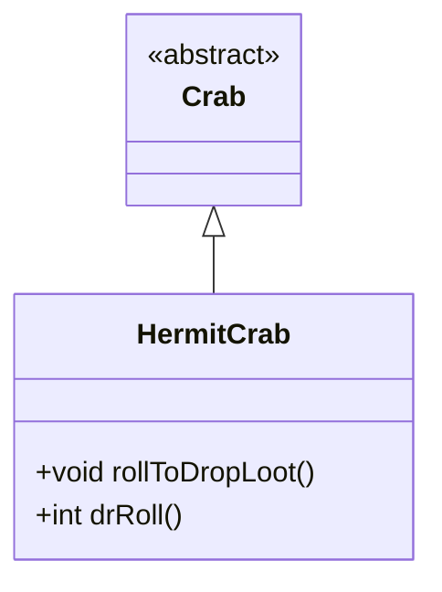

# HermitCrab 类文档

## 1. 基本信息
| 属性 | 值 |
|------|-----|
| 文件路径 | core/src/main/java/com/shatteredpixel/shatteredpixeldungeon/actors/mobs/HermitCrab.java |
| 包名 | com.shatteredpixel.shatteredpixeldungeon.actors.mobs |
| 类类型 | class |
| 继承关系 | extends Crab |
| 代码行数 | 54 行 |

## 2. 类职责说明
HermitCrab（寄居蟹）是 Crab 的稀有变种。相比普通螃蟹，它有更高的 HP（+67%）、更高的伤害减免、但移动速度减半。它必定掉落护甲，掉落肉的概率也更高。

## 4. 继承与协作关系


## 静态常量表
（无静态常量）

## 实例字段表
（无额外实例字段，继承自 Crab）

## 7. 方法详解

### rollToDropLoot()
**签名**: `public void rollToDropLoot()`
**功能**: 掉落额外护甲
**实现逻辑**:
```
第42行: 调用父类掉落处理
第44-46行: 如果英雄等级合适，额外掉落随机护甲
```

### drRoll()
**签名**: `public int drRoll()`
**功能**: 计算伤害减免
**返回值**: int - 伤害减免 2-6（比普通螃蟹高）
**实现逻辑**:
```
第51行: 父类减免 + 2 固定值
```

## 11. 使用示例
```java
// 寄居蟹是螃蟹的稀有变种
HermitCrab crab = new HermitCrab();

// 更高 HP 和伤害减免
// 移动速度减半
// 必定掉落护甲
```

## 注意事项
1. **更高 HP**: 25 HP（普通螃蟹 15）
2. **更慢速度**: 基础速度 1.0（普通螃蟹 2.0）
3. **更高减免**: 2-6 伤害减免
4. **护甲掉落**: 必定掉落随机护甲
5. **肉掉落**: 3倍掉落概率

## 最佳实践
1. 利用其慢速保持距离
2. 护甲掉落对资源补充很有价值
3. 注意较高的伤害减免