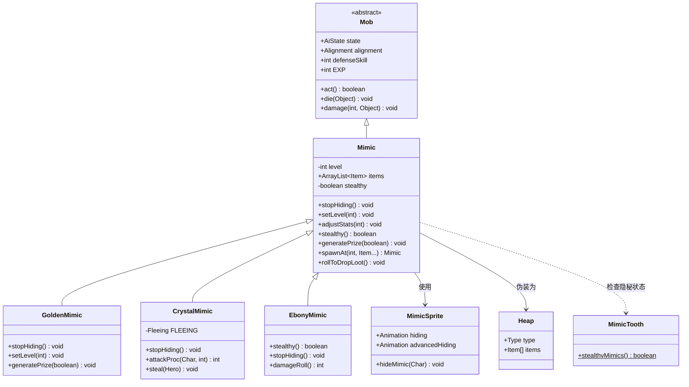

# Mimic 源码详解

## 1. 基本信息

| 属性 | 值 |
|------|-----|
| **文件路径** | core/src/main/java/com/shatteredpixel/shatteredpixeldungeon/actors/mobs/Mimic.java |
| **包名** | com.shatteredpixel.shatteredpixeldungeon.actors.mobs |
| **类类型** | public class |
| **继承关系** | extends Mob |
| **代码行数** | 361 |
| **中文名称** | 宝箱怪 |

---

## 类职责

Mimic（宝箱怪）是游戏中一种特殊的怪物，具有**伪装机制**——可以伪装成普通宝箱，等待玩家上钩后发动袭击。

### 核心职责

1. **伪装系统**：隐藏时显示为普通宝箱，欺骗玩家
2. **突袭机制**：首次攻击具有额外伤害加成
3. **战利品容器**：携带预设的物品，死亡后掉落
4. **变体支持**：为三种子类提供基础行为模板

### 设计亮点

- **状态切换**：从 `NEUTRAL`（中立/伪装）→ `ENEMY`（敌对）
- **交互伪装**：点击时触发攻击而非正常开箱
- **隐藏提示**：非隐秘模式下显示可疑提示

---

## 4. 继承与协作关系



---

## 静态常量表

| 常量名 | 类型 | 值 | 说明 |
|--------|------|-----|------|
| `LEVEL` | String | "level" | Bundle 存储键：等级 |
| `ITEMS` | String | "items" | Bundle 存储键：物品列表 |
| `STEALTHY` | String | "stealthy" | Bundle 存储键：隐秘状态 |

---

## 实例字段表

| 字段名 | 类型 | 默认值 | 说明 |
|--------|------|--------|------|
| `level` | int | 0 | 宝箱怪等级，影响属性和伤害 |
| `items` | ArrayList&lt;Item&gt; | null | 携带的物品列表，死亡后掉落 |
| `stealthy` | boolean | false | 是否为隐秘宝箱怪（更难被发现） |

### 继承自 Mob 的关键字段

| 字段名 | 默认值 | 说明 |
|--------|--------|------|
| `spriteClass` | MimicSprite.class | 精灵类 |
| `properties` | Property.DEMONIC | 恶魔属性 |
| `EXP` | 0 | 不提供经验值 |
| `alignment` | NEUTRAL | 初始为中立（伪装状态） |
| `state` | PASSIVE | 初始为被动状态 |

---

## 7. 方法详解

### 核心机制方法

#### act()

```java
@Override
protected boolean act() {
    if (alignment == Alignment.NEUTRAL && state != PASSIVE){
        alignment = Alignment.ENEMY;
        if (sprite != null) sprite.idle();
        if (Dungeon.level.heroFOV[pos]) {
            GLog.w(Messages.get(this, "reveal") );
            CellEmitter.get(pos).burst(Speck.factory(Speck.STAR), 10);
            Sample.INSTANCE.play(Assets.Sounds.MIMIC);
        }
    }
    return super.act();
}
```

**方法作用**：执行每回合的行动逻辑。

**触发时机**：当宝箱怪处于中立状态但AI状态不再是被动时，自动暴露身份。

**暴露效果**：
1. 阵营切换为敌对
2. 精灵进入空闲状态
3. 显示"宝箱怪出现"警告
4. 播放粒子效果（星星）
5. 播放宝箱怪音效

---

#### stopHiding()

```java
public void stopHiding(){
    state = HUNTING;                    // 进入追击状态
    if (sprite != null) sprite.idle();  // 更新精灵显示
    
    if (Actor.chars().contains(this) && Dungeon.level.heroFOV[pos]) {
        enemy = Dungeon.hero;
        target = Dungeon.hero.pos;
        GLog.w(Messages.get(this, "reveal") );
        CellEmitter.get(pos).burst(Speck.factory(Speck.STAR), 10);
        Sample.INSTANCE.play(Assets.Sounds.MIMIC);
    }
}
```

**方法作用**：停止伪装，开始攻击玩家。

**调用场景**：
- 玩家点击伪装的宝箱
- 宝箱怪受到伤害
- 宝箱怪获得负面Buff

**行为变化**：
- AI状态：`PASSIVE` → `HUNTING`
- 立即锁定玩家为目标

---

#### interact(Char c)

```java
@Override
public boolean interact(Char c) {
    if (alignment != Alignment.NEUTRAL || c != Dungeon.hero){
        return super.interact(c);
    }
    stopHiding();

    Dungeon.hero.busy();
    Dungeon.hero.sprite.operate(pos);
    
    // 隐身/时间停止时可避免被攻击
    if (Dungeon.hero.invisible <= 0
            && Dungeon.hero.buff(Swiftthistle.TimeBubble.class) == null
            && Dungeon.hero.buff(TimekeepersHourglass.timeFreeze.class) == null){
        return doAttack(Dungeon.hero);
    } else {
        sprite.idle();
        alignment = Alignment.ENEMY;
        Dungeon.hero.spendAndNext(1f);
        return true;
    }
}
```

**方法作用**：处理玩家与伪装宝箱的交互。

**交互流程**：
1. 检查是否为伪装状态
2. 停止伪装
3. 判断是否可以偷袭
   - 玩家隐身：无法偷袭
   - 时间停止（沙漏/风灵草）：无法偷袭
   - 正常情况：发动偷袭攻击

---

### 属性计算方法

#### damageRoll()

```java
@Override
public int damageRoll() {
    if (alignment == Alignment.NEUTRAL){
        // 伪装状态下的偷袭伤害 = 固定值（2 + 2*level）
        return Random.NormalIntRange( 2 + 2*level, 2 + 2*level);
    } else {
        // 正常伤害 = 1+level 到 2+2*level
        return Random.NormalIntRange( 1 + level, 2 + 2*level);
    }
}
```

**方法作用**：计算伤害值。

**伤害特点**：
- **偷袭伤害**：固定值，无随机范围，比正常攻击更高
- **正常伤害**：有随机范围

**示例**（level=5）：
- 偷袭伤害：12
- 正常伤害：6~12

---

#### attackSkill(Char target)

```java
@Override
public int attackSkill( Char target ) {
    if (target != null && alignment == Alignment.NEUTRAL && target.invisible <= 0){
        return INFINITE_ACCURACY;  // 无限精准（必定命中）
    } else {
        return 6 + level;
    }
}
```

**方法作用**：计算攻击技能值（命中率相关）。

**命中机制**：
- 伪装状态下偷袭：**无限精准**，必定命中
- 正常战斗：6 + level

---

#### adjustStats(int level)

```java
public void adjustStats( int level ) {
    HP = HT = (1 + level) * 6;      // 生命值 = (1+等级) * 6
    defenseSkill = 2 + level/2;     // 防御技能 = 2 + 等级/2
    
    enemySeen = true;               // 标记已发现敌人
}
```

**方法作用**：根据等级调整属性。

**属性公式**：
| 等级 | HP/HT | defenseSkill |
|------|-------|--------------|
| 1 | 12 | 2 |
| 5 | 36 | 4 |
| 10 | 66 | 7 |
| 15 | 96 | 9 |

---

### 伪装相关方法

#### name()

```java
@Override
public String name() {
    if (alignment == Alignment.NEUTRAL){
        return Messages.get(Heap.class, "chest");  // 显示为"宝箱"
    } else {
        return super.name();                        // 显示真实名称
    }
}
```

**方法作用**：返回显示名称，伪装时显示为普通宝箱。

---

#### description()

```java
@Override
public String description() {
    if (alignment == Alignment.NEUTRAL){
        if (MimicTooth.stealthyMimics()){
            return Messages.get(Heap.class, "chest_desc");  // 仅显示宝箱描述
        } else {
            // 显示宝箱描述 + 隐藏提示
            return Messages.get(Heap.class, "chest_desc") + "\n\n" + Messages.get(this, "hidden_hint");
        }
    } else {
        return super.description();
    }
}
```

**方法作用**：返回描述文本。

**显示逻辑**：
- **隐秘模式**（MimicTooth 饰品激活）：完全伪装
- **普通模式**：显示可疑提示

---

#### stealthy()

```java
public boolean stealthy(){
    return stealthy;
}
```

**方法作用**：检查是否为隐秘宝箱怪。

**隐秘效果**：
- 描述中不显示提示
- 精灵使用不同的隐藏动画

---

### 触发暴露的方法

#### add(Buff buff)

```java
@Override
public boolean add(Buff buff) {
    if (super.add(buff)) {
        if (buff.type == Buff.buffType.NEGATIVE && alignment == Alignment.NEUTRAL) {
            alignment = Alignment.ENEMY;
            stopHiding();
            if (sprite != null) sprite.idle();
        }
        return true;
    }
    return false;
}
```

**方法作用**：添加Buff时检查是否触发暴露。

**触发条件**：负面Buff + 中立状态 = 自动暴露

---

#### defenseProc(Char enemy, int damage)

```java
@Override
public int defenseProc(Char enemy, int damage) {
    if (state == PASSIVE){
        alignment = Alignment.ENEMY;
        stopHiding();
    }
    return super.defenseProc(enemy, damage);
}
```

**方法作用**：被攻击时触发暴露。

---

#### damage(int dmg, Object src)

```java
@Override
public void damage(int dmg, Object src) {
    if (state == PASSIVE){
        alignment = Alignment.ENEMY;
        stopHiding();
    }
    super.damage(dmg, src);
}
```

**方法作用**：受伤时触发暴露。

---

#### die(Object cause)

```java
@Override
public void die(Object cause) {
    if (state == PASSIVE){
        alignment = Alignment.ENEMY;
        stopHiding();
    }
    super.die(cause);
}
```

**方法作用**：死亡时确保暴露状态（用于掉落物品）。

---

### 战利品系统

#### rollToDropLoot()

```java
@Override
public void rollToDropLoot(){
    if (items != null) {
        for (Item item : items) {
            Dungeon.level.drop( item, pos ).sprite.drop();
        }
        items = null;
    }
    super.rollToDropLoot();
}
```

**方法作用**：死亡时掉落携带的物品。

**掉落机制**：
1. 掉落预设的物品列表（items）
2. 调用父类方法处理常规掉落

---

#### generatePrize(boolean useDecks)

```java
protected void generatePrize( boolean useDecks ){
    Item reward = null;
    do {
        switch (Random.Int(5)) {
            case 0: reward = new Gold().random(); break;
            case 1: reward = Generator.randomMissile(!useDecks); break;
            case 2: reward = Generator.randomArmor(); break;
            case 3: reward = Generator.randomWeapon(!useDecks); break;
            case 4: reward = useDecks ? Generator.random(Generator.Category.RING) 
                                      : Generator.randomUsingDefaults(Generator.Category.RING); break;
        }
    } while (reward == null || Challenges.isItemBlocked(reward));
    
    items.add(reward);

    if (MimicTooth.stealthyMimics()){
        items.add(Generator.randomUsingDefaults());  // 额外随机物品
    }
}
```

**方法作用**：生成击杀奖励物品。

**奖励池**：
| 概率 | 物品类型 |
|------|---------|
| 20% | 金币 |
| 20% | 投掷武器 |
| 20% | 护甲 |
| 20% | 武器 |
| 20% | 戒指 |

**MimicTooth 加成**：额外获得一个随机物品。

---

### 静态工厂方法

#### spawnAt(int pos, Item... items)

```java
public static Mimic spawnAt( int pos, Item... items){
    return spawnAt(pos, Mimic.class, items);
}

public static Mimic spawnAt( int pos, Class mimicType, Item... items){
    return spawnAt(pos, mimicType, true, items);
}

public static Mimic spawnAt( int pos, boolean useDecks, Item... items){
    return spawnAt(pos, Mimic.class, useDecks, items);
}

public static Mimic spawnAt( int pos, Class mimicType, boolean useDecks, Item... items){
    Mimic m;
    if (mimicType == GoldenMimic.class){
        m = new GoldenMimic();
    } else if (mimicType == CrystalMimic.class) {
        m = new CrystalMimic();
    } else if (mimicType == EbonyMimic.class) {
        m = new EbonyMimic();
    } else {
        m = new Mimic();
    }

    m.items = new ArrayList<>( Arrays.asList(items) );
    m.setLevel( Dungeon.scalingDepth() );
    m.pos = pos;

    m.generatePrize(useDecks);

    if (MimicTooth.stealthyMimics()){
        m.stealthy = true;
    }

    return m;
}
```

**方法作用**：在指定位置生成宝箱怪。

**参数说明**：
| 参数 | 类型 | 说明 |
|------|------|------|
| `pos` | int | 生成位置 |
| `mimicType` | Class | 宝箱怪类型（默认Mimic.class） |
| `useDecks` | boolean | 是否使用牌组生成 |
| `items` | Item... | 预设物品 |

---

### 其他方法

#### beckon(int cell)

```java
@Override
public void beckon( int cell ) {
    if (alignment != Alignment.NEUTRAL) {
        super.beckon(cell);
    }
}
```

**方法作用**：伪装状态下不响应吸引。

---

#### spawningWeight()

```java
@Override
public float spawningWeight() {
    return 0f;  // 不自然生成
}
```

**方法作用**：宝箱怪不会随机生成，只能通过代码创建。

---

#### reset()

```java
@Override
public boolean reset() {
    if (state != PASSIVE) state = WANDERING;
    return true;
}
```

**方法作用**：关卡重置时，暴露的宝箱怪进入游荡状态。

---

## AI行为详解

### 状态转换图

```
┌─────────────┐
│   PASSIVE   │ ← 初始状态（伪装）
│  (中立)     │
└──────┬──────┘
       │ 触发条件：
       │ - 玩家点击
       │ - 受到伤害
       │ - 获得负面Buff
       ▼
┌─────────────┐
│  HUNTING    │ ← 追击玩家
│  (敌对)     │
└─────────────┘
```

### 暴露触发条件

| 触发方式 | 方法 | 效果 |
|---------|------|------|
| 玩家点击 | `interact()` | 偷袭攻击或延迟攻击 |
| 受到伤害 | `damage()` | 立即暴露 |
| 被攻击 | `defenseProc()` | 立即暴露 |
| 负面Buff | `add(Buff)` | 立即暴露 |
| AI行动 | `act()` | 状态异常时自动暴露 |

---

## 伪装机制详解

### 伪装层级

```
┌────────────────────────────────────────┐
│           伪装显示层                    │
│  ┌──────────────────────────────────┐  │
│  │  名称: "宝箱"                     │  │
│  │  描述: 普通宝箱描述               │  │
│  │  图标: 关闭的宝箱                 │  │
│  └──────────────────────────────────┘  │
└────────────────────────────────────────┘
                    ▼
            玩家点击触发
                    ▼
┌────────────────────────────────────────┐
│           真实显示层                    │
│  ┌──────────────────────────────────┐  │
│  │  名称: "宝箱怪"                   │  │
│  │  描述: 怪物描述                   │  │
│  │  图标: 张嘴的宝箱怪               │  │
│  └──────────────────────────────────┘  │
└────────────────────────────────────────┘
```

### 隐秘模式（MimicTooth 饰品）

当玩家装备 **MimicTooth（宝箱怪之牙）** 饰品时：

1. 宝箱怪变为隐秘模式
2. 描述不显示可疑提示
3. 精灵使用"高级隐藏"动画
4. 击杀后额外掉落一个物品

---

## 子类变体

### 1. GoldenMimic（黄金宝箱怪）

| 特性 | 说明 |
|------|------|
| **伪装外观** | 上锁的金箱 |
| **等级加成** | level × 1.33 |
| **物品品质** | 必定非诅咒，50%概率+1强化 |
| **音效** | 低音调（0.85） |

**setLevel()**:
```java
@Override
public void setLevel(int level) {
    super.setLevel(Math.round(level*1.33f));  // 等级提升33%
}
```

---

### 2. CrystalMimic（水晶宝箱怪）

| 特性 | 说明 |
|------|------|
| **伪装外观** | 水晶宝箱 |
| **行为模式** | 偷窃而非攻击，然后逃跑 |
| **初始状态** | FLEEING 而非 HUNTING |
| **加速效果** | 暴露后获得急速Buff |
| **音效** | 高音调（1.25） |

**特殊行为**：
- 攻击时偷窃玩家物品
- 使用传送将玩家移开
- 逃跑成功后消失（物品永久丢失）

---

### 3. EbonyMimic（黑檀宝箱怪）

| 特性 | 说明 |
|------|------|
| **伪装外观** | 不显示名称（完全隐藏） |
| **伤害倍率** | 偷袭伤害 × 2 |
| **物品品质** | 必定非诅咒，必定至少+1 |
| **额外掉落** | 多一个随机物品 |
| **始终隐秘** | `stealthy()` 永远返回 true |
| **精灵透明** | 隐藏时20%透明度 |

**damageRoll()**:
```java
@Override
public int damageRoll() {
    if (alignment == Alignment.NEUTRAL){
        return Math.round(super.damageRoll()*2f);  // 偷袭伤害翻倍
    } else {
        return super.damageRoll();
    }
}
```

---

## 11. 使用示例

### 生成普通宝箱怪

```java
// 在位置 pos 生成携带剑和金币的宝箱怪
Mimic mimic = Mimic.spawnAt(pos, new Sword(), new Gold(50));
Dungeon.level.mobs.add(mimic);
Actor.add(mimic);
```

### 生成黄金宝箱怪

```java
Mimic goldenMimic = Mimic.spawnAt(pos, GoldenMimic.class, new Artifact());
Dungeon.level.mobs.add(goldenMimic);
Actor.add(goldenMimic);
```

### 手动触发暴露

```java
if (mimic.alignment == Alignment.NEUTRAL) {
    mimic.stopHiding();  // 触发暴露
}
```

### 检查是否为隐秘宝箱怪

```java
if (mimic.stealthy()) {
    // 隐秘宝箱怪，更难发现
}
```

---

## 注意事项

### 状态一致性

1. **阵营与状态关联**：`alignment == NEUTRAL` 时应为 `state == PASSIVE`
2. **暴露时机**：多个方法都会触发暴露，确保逻辑一致性
3. **物品非空**：调用 `generatePrize()` 前确保 `items` 已初始化

### 性能考虑

1. **延迟生成**：物品在 `spawnAt()` 时生成，而非构造函数
2. **存档优化**：使用 Bundle 序列化物品列表

### 常见陷阱

1. **忘记添加到 Actor**：生成的宝箱怪需要通过 `Actor.add()` 添加
2. **物品引用问题**：物品列表使用引用，修改会影响原始物品
3. **状态不同步**：暴露后必须同时更新 `alignment` 和 `state`

---

## 最佳实践

### 创建自定义宝箱怪

```java
public class CustomMimic extends Mimic {
    {
        spriteClass = CustomMimicSprite.class;
    }
    
    @Override
    public String name() {
        if (alignment == Alignment.NEUTRAL) {
            return "特殊容器";  // 自定义伪装名称
        }
        return super.name();
    }
    
    @Override
    public void stopHiding() {
        super.stopHiding();
        // 添加自定义暴露效果
        Buff.affect(this, SomeBuff.class);
    }
    
    @Override
    protected void generatePrize(boolean useDecks) {
        super.generatePrize(useDecks);
        // 自定义物品生成逻辑
        items.add(new CustomItem());
    }
}
```

### 避免偷袭的方法

```java
// 检查是否可以安全交互
if (mimic.alignment == Alignment.NEUTRAL) {
    // 使用隐身药水
    Buff.affect(Dungeon.hero, Invisibility.class);
    // 现在交互不会被偷袭
    mimic.interact(Dungeon.hero);
}
```

---

## 相关文件

| 文件 | 说明 |
|------|------|
| `MimicSprite.java` | 宝箱怪精灵类 |
| `GoldenMimic.java` | 黄金宝箱怪 |
| `CrystalMimic.java` | 水晶宝箱怪 |
| `EbonyMimic.java` | 黑檀宝箱怪 |
| `MimicTooth.java` | 宝箱怪之牙饰品 |
| `Heap.java` | 物品堆（宝箱外观来源） |