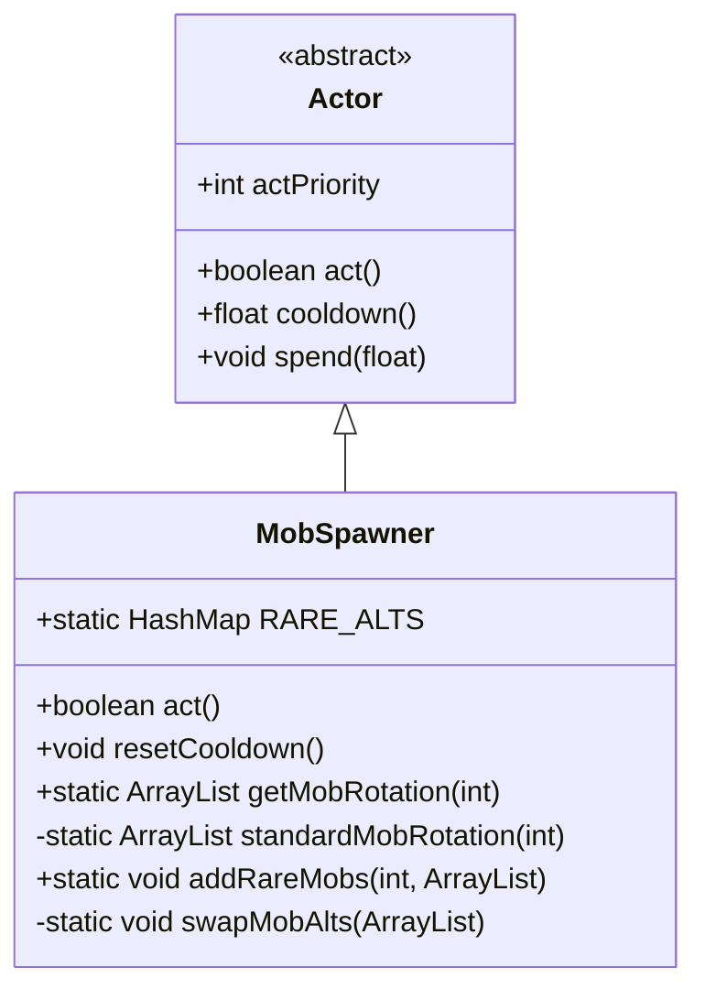

# MobSpawner 类文档

## 1. 基本信息
| 属性 | 值 |
|------|-----|
| 文件路径 | core/src/main/java/com/shatteredpixel/shatteredpixeldungeon/actors/mobs/MobSpawner.java |
| 包名 | com.shatteredpixel.shatteredpixeldungeon.actors.mobs |
| 类类型 | class |
| 继承关系 | extends Actor |
| 代码行数 | 276 行 |

## 2. 类职责说明
MobSpawner 是一个负责怪物生成管理的 Actor 类。它根据当前怪物数量限制决定是否生成新怪物，并管理各深度的怪物轮换列表。它还处理稀有怪物和变种怪物的生成概率。

## 4. 继承与协作关系


## 静态常量表
| 常量名 | 类型 | 值 | 说明 |
|--------|------|-----|------|
| RARE_ALTS | HashMap | ... | 普通怪物到稀有变种的映射表 |

## 实例字段表
（无实例字段，继承自 Actor）

## 7. 方法详解

### act()
**签名**: `protected boolean act()`
**功能**: 每回合检查并生成怪物
**返回值**: boolean - 始终返回 true
**实现逻辑**:
```
第41-48行: 如果怪物数量低于限制，尝试生成
第50-52行: 否则等待重生冷却
```

### resetCooldown()
**签名**: `public void resetCooldown()`
**功能**: 重置生成冷却时间
**实现逻辑**:
```
第58-59行: 立即重置为完整冷却时间
```

### getMobRotation(int depth)
**签名**: `public static ArrayList<Class<? extends Mob>> getMobRotation(int depth)`
**功能**: 获取指定深度的怪物轮换列表
**参数**:
- depth: int - 地牢深度
**返回值**: ArrayList - 怪物类型列表
**实现逻辑**:
```
第63-68行: 获取标准轮换，添加稀有怪物，交换变种，打乱顺序
```

### standardMobRotation(int depth)
**签名**: `private static ArrayList<Class<? extends Mob>> standardMobRotation(int depth)`
**功能**: 获取标准怪物轮换
**参数**:
- depth: int - 地牢深度
**返回值**: ArrayList - 怪物类型列表
**实现逻辑**:
```
第72-210行: 根据深度返回不同的怪物组合
          分为四个区域：下水道(1-5)、监狱(6-10)、洞穴(11-15)、城市(16-20)、大厅(21-26)
```

### addRareMobs(int depth, ArrayList rotation)
**签名**: `public static void addRareMobs(int depth, ArrayList<Class<?extends Mob>> rotation)`
**功能**: 添加稀有怪物到轮换
**参数**:
- depth: int - 地牢深度
- rotation: ArrayList - 怪物轮换列表
**实现逻辑**:
```
第215-241行: 根据深度有2.5%概率添加特定稀有怪物
```

### swapMobAlts(ArrayList rotation)
**签名**: `private static void swapMobAlts(ArrayList<Class<?extends Mob>> rotation)`
**功能**: 将普通怪物替换为变种
**参数**:
- rotation: ArrayList - 怪物轮换列表
**实现逻辑**:
```
第244-255行: 根据概率（受饰品影响）将普通怪物替换为变种
```

## 稀有变种映射表

| 普通怪物 | 稀有变种 |
|---------|---------|
| Rat | Albino |
| Gnoll | GnollExile |
| Crab | HermitCrab |
| Slime | CausticSlime |
| Thief | Bandit |
| Necromancer | SpectralNecromancer |
| Brute | ArmoredBrute |
| DM200 | DM201 |
| Monk | Senior |
| Elemental | ChaosElemental |
| Scorpio | Acidic |

## 11. 使用示例
```java
// 获取当前深度的怪物轮换
ArrayList<Class<? extends Mob>> mobs = MobSpawner.getMobRotation(Dungeon.depth);

// 重置生成冷却
Dungeon.level.mobSpawner.resetCooldown();

// 稀有变种概率受 RatSkull 饰品影响
// 默认 1/50 概率替换为变种
```

## 注意事项
1. **Actor 优先级**: 作为 BUFF_PRIO 优先级运行
2. **怪物限制**: 受 Dungeon.level.mobLimit() 限制
3. **重生冷却**: 受 Dungeon.level.respawnCooldown() 控制
4. **深度分段**: 不同深度有不同的怪物组合
5. **变种概率**: 受 RatSkull 饰品影响

## 最佳实践
1. 使用 getMobRotation 了解当前深度的怪物类型
2. 稀有变种提供更多挑战和奖励
3. RatSkull 饰品增加变种出现概率