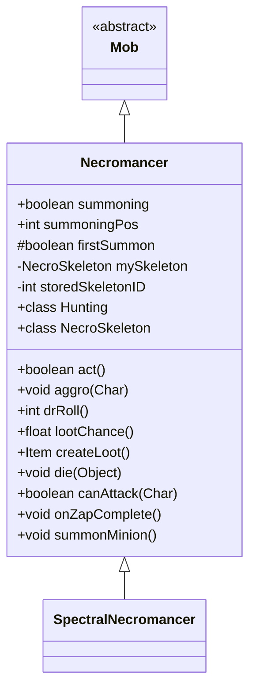

# Necromancer 类文档

## 1. 基本信息
| 属性 | 值 |
|------|-----|
| 文件路径 | core/src/main/java/com/shatteredpixel/shatteredpixeldungeon/actors/mobs/Necromancer.java |
| 包名 | com.shatteredpixel.shatteredpixeldungeon.actors.mobs |
| 类类型 | class |
| 继承关系 | extends Mob |
| 代码行数 | 440 行 |

## 2. 类职责说明
Necromancer（死灵法师）是一种召唤型敌人，会召唤骷髅仆从并为其治疗或施加激素涌动。死灵法师不会直接攻击，而是专注于召唤和支援骷髅。自身死亡时，骷髅也会死亡。存在稀有变种 SpectralNecromancer。

## 4. 继承与协作关系


## 静态常量表
| 常量名 | 类型 | 值 | 说明 |
|--------|------|-----|------|
| SUMMONING | String | "summoning" | Bundle 存储键 |
| FIRST_SUMMON | String | "first_summon" | Bundle 存储键 |
| SUMMONING_POS | String | "summoning_pos" | Bundle 存储键 |
| MY_SKELETON | String | "my_skeleton" | Bundle 存储键 |

## 实例字段表
| 字段名 | 类型 | 修饰符 | 说明 |
|--------|------|--------|------|
| summoning | boolean | public | 是否正在召唤 |
| summoningPos | int | public | 召唤位置 |
| firstSummon | boolean | protected | 是否为首次召唤 |
| mySkeleton | NecroSkeleton | private | 已召唤的骷髅 |
| storedSkeletonID | int | private | 存储的骷髅ID |

## 7. 方法详解

### act()
**签名**: `protected boolean act()`
**功能**: 每回合检查召唤状态
**返回值**: boolean - 行动结果
**实现逻辑**:
```
第79-82行: 如果不在追猎状态但正在召唤，取消召唤
```

### aggro(Char ch)
**签名**: `public void aggro(Char ch)`
**功能**: 激活敌意并通知骷髅
**参数**:
- ch: Char - 目标
**实现逻辑**:
```
第89-93行: 同时激活骷髅的敌意
```

### drRoll()
**签名**: `public int drRoll()`
**功能**: 计算伤害减免
**返回值**: int - 伤害减免 0-5

### lootChance()
**签名**: `public float lootChance()`
**功能**: 计算掉落概率
**返回值**: float - 随掉落数量降低的概率

### createLoot()
**签名**: `public Item createLoot()`
**功能**: 创建掉落物品
**返回值**: Item - 治疗药水

### die(Object cause)
**签名**: `public void die(Object cause)`
**功能**: 死亡时杀死骷髅
**参数**:
- cause: Object - 死亡原因
**实现逻辑**:
```
第114-124行: 如果骷髅存活且同阵营，杀死骷髅
```

### canAttack(Char enemy)
**签名**: `protected boolean canAttack(Char enemy)`
**功能**: 判断是否能攻击
**返回值**: boolean - false（不会直接攻击）

### onZapComplete()
**签名**: `public void onZapComplete()`
**功能**: 完成支援骷髅的动作
**实现逻辑**:
```
第173-184行: 如果骷髅HP未满，治疗骷髅
第186-194行: 否则给骷髅施加激素涌动
```

### summonMinion()
**签名**: `public void summonMinion()`
**功能**: 召唤骷髅仆从
**实现逻辑**:
```
第200-242行: 如果召唤位置被占用，推开或伤害阻挡者
第244-261行: 创建或传送骷髅到召唤位置
```

## 内部类详解

### Hunting（追猎状态）
**功能**: 管理召唤和支援行为
**方法**:
- `act()`: 复杂的召唤/支援逻辑
  - 第283-286行: 如果正在召唤，执行召唤
  - 第296-331行: 如果没有骷髅且敌人在4格内，召唤骷髅
  - 第333-397行: 如果有骷髅，传送或支援骷髅

### NecroSkeleton（死灵骷髅）
**功能**: 死灵法师召唤的特殊骷髅
**特点**:
- 不提供经验和掉落
- HP固定为20/25
- 使用变暗的精灵

## 11. 使用示例
```java
// 死灵法师召唤骷髅
Necromancer necro = new Necromancer();

// 不会直接攻击，而是召唤和支援骷髅
// 击杀死灵法师也会杀死骷髅

// 掉落治疗药水
```

## 注意事项
1. **不死属性**: 属于 UNDEAD 类型
2. **无直接攻击**: canAttack 始终返回 false
3. **骷髅关联**: 死亡时杀死骷髅
4. **召唤位置**: 会推开阻挡者
5. **首次召唤**: 首次召唤更快（1回合）

## 最佳实践
1. 优先击杀死灵法师可同时消灭骷髅
2. 保持在召唤范围外
3. 干扰召唤过程
4. 骷髅被治疗后需要更多伤害