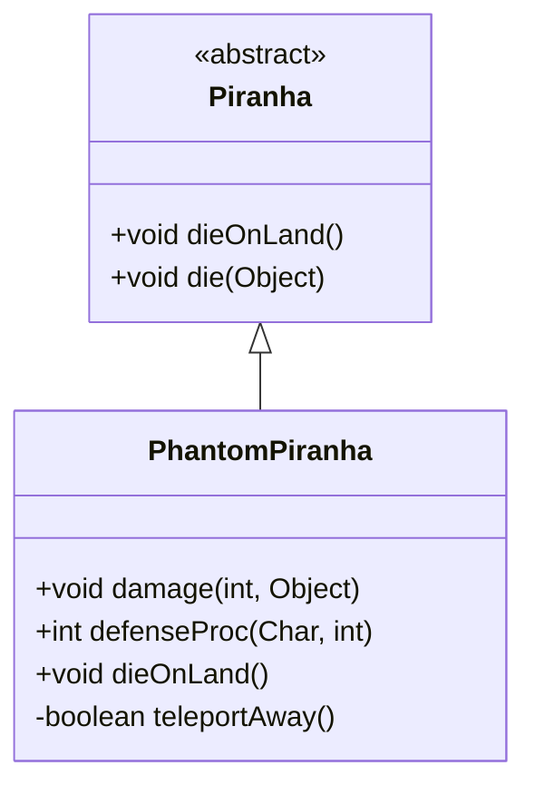

# PhantomPiranha 类文档

## 1. 基本信息
| 属性 | 值 |
|------|-----|
| 文件路径 | core/src/main/java/com/shatteredpixel/shatteredpixeldungeon/actors/mobs/PhantomPiranha.java |
| 包名 | com.shatteredpixel.shatteredpixeldungeon.actors.mobs |
| 类类型 | class |
| 继承关系 | extends Piranha |
| 代码行数 | 124 行 |

## 2. 类职责说明
PhantomPiranha（幽灵食人鱼）是 Piranha 的稀有变种。受到远距离攻击时会传送，伤害减半。它会传送到攻击者附近或远离视野的位置，离水时也会尝试传送而非死亡。掉落幽灵肉而非神秘肉。

## 4. 继承与协作关系


## 静态常量表
（无静态常量）

## 实例字段表
（无额外实例字段，继承自 Piranha）

## 7. 方法详解

### damage(int dmg, Object src)
**签名**: `public void damage(int dmg, Object src)`
**功能**: 受到伤害时的处理
**参数**:
- dmg: int - 伤害值
- src: Object - 伤害来源
**实现逻辑**:
```
第51-53行: 确定伤害来源角色
第55-57行: 如果来源不相邻，伤害减半
第60-79行: 如果存活且不是腐化：
  - 传送到攻击者附近的水域
  - 或传送到远离视野的位置
```

### defenseProc(Char enemy, int damage)
**签名**: `public int defenseProc(Char enemy, int damage)`
**功能**: 防御处理
**返回值**: int - 实际伤害
**实现逻辑**:
```
第84行: 调用父类方法
```

### dieOnLand()
**签名**: `public void dieOnLand()`
**功能**: 离水时尝试传送而非死亡
**实现逻辑**:
```
第89-91行: 如果无法传送则死亡
```

### teleportAway()
**签名**: `private boolean teleportAway()`
**功能**: 传送到其他水域
**返回值**: boolean - 是否成功传送
**实现逻辑**:
```
第96-98行: 飞行状态不传送
第100-110行: 收集视野内外的水域候选位置
第112-119行: 优先传送到视野外的位置
```

## 11. 使用示例
```java
// 幽灵食人鱼是稀有变种
PhantomPiranha phantom = new PhantomPiranha();

// 受到远程攻击时伤害减半并传送
// 离水时会尝试传送而非死亡

// 掉落幽灵肉
```

## 注意事项
1. **伤害减半**: 远距离攻击伤害减半
2. **传送能力**: 受伤后会传送
3. **离水传送**: 离水时尝试传送而非死亡
4. **特殊掉落**: 掉落幽灵肉
5. **稀有度**: 默认2%概率生成

## 最佳实践
1. 使用近战攻击避免触发传送
2. 阻止传送后快速击杀
3. 幽灵肉提供特殊效果
4. 配合 RatSkull 饰品提高出现概率