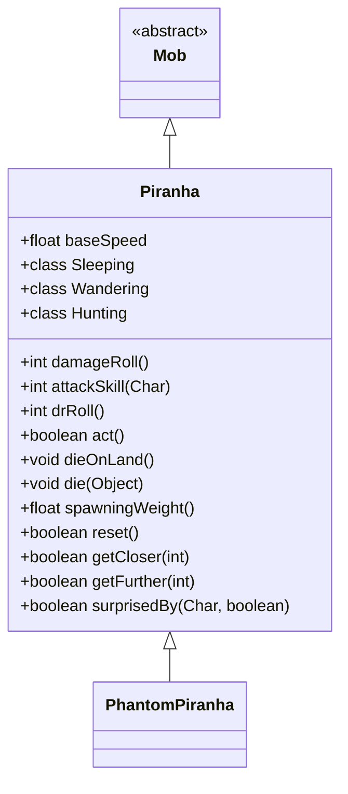

# Piranha 类文档

## 1. 基本信息
| 属性 | 值 |
|------|-----|
| 文件路径 | core/src/main/java/com/shatteredpixel/shatteredpixeldungeon/actors/mobs/Piranha.java |
| 包名 | com.shatteredpixel.shatteredpixeldungeon.actors.mobs |
| 类类型 | class |
| 继承关系 | extends Mob |
| 代码行数 | 214 行 |

## 2. 类职责说明
Piranha（食人鱼）是一种水中敌人，只能在水中移动。离开水后会立即死亡。食人鱼的属性随地牢深度增长，移动速度快（2倍）。它们只在能到达敌人的情况下才会激活，对多数负面效果免疫。存在稀有变种 PhantomPiranha。

## 4. 继承与协作关系


## 静态常量表
（无静态常量）

## 实例字段表
（无额外实例字段，继承自 Mob）

## 7. 方法详解

### 构造函数
**签名**: `public Piranha()`
**功能**: 初始化属性
**实现逻辑**:
```
第65-66行: HP/HT = 10 + depth*5, 防御 = 10 + depth*2
```

### act()
**签名**: `protected boolean act()`
**功能**: 每回合检查是否在水中
**返回值**: boolean - 行动结果
**实现逻辑**:
```
第72-76行: 如果不在水中或不在飞行，死亡
第78-80行: 否则正常行动
```

### damageRoll()
**签名**: `public int damageRoll()`
**功能**: 计算伤害掷骰
**返回值**: int - 伤害范围 depth 到 4+depth*2

### attackSkill(Char target)
**签名**: `public int attackSkill(Char target)`
**功能**: 获取攻击技能值
**返回值**: int - 攻击技能值 20 + depth*2

### drRoll()
**签名**: `public int drRoll()`
**功能**: 计算伤害减免
**返回值**: int - 伤害减免 0 到 depth

### surprisedBy(Char enemy, boolean attacking)
**签名**: `public boolean surprisedBy(Char enemy, boolean attacking)`
**功能**: 判断是否被伏击
**参数**:
- enemy: Char - 敌人
- attacking: boolean - 是否正在攻击
**返回值**: boolean - 是否被伏击
**实现逻辑**:
```
第100-107行: 睡眠状态或不可见或不在视野内时被伏击
```

### dieOnLand()
**签名**: `public void dieOnLand()`
**功能**: 离水时死亡
**实现逻辑**:
```
第111行: 调用 die(null)
```

### die(Object cause)
**签名**: `public void die(Object cause)`
**功能**: 死亡时更新统计
**参数**:
- cause: Object - 死亡原因
**实现逻辑**:
```
第118-119行: 更新击杀统计和徽章验证
```

### spawningWeight()
**签名**: `public float spawningWeight()`
**功能**: 获取自然生成权重
**返回值**: float - 0（不自然生成）

### reset()
**签名**: `public boolean reset()`
**功能**: 重置状态
**返回值**: boolean - true

### getCloser(int target)
**签名**: `protected boolean getCloser(int target)`
**功能**: 在水中接近目标
**参数**:
- target: int - 目标位置
**返回值**: boolean - 是否成功移动
**实现逻辑**:
```
第139行: 只在水面格子中寻找路径
```

### getFurther(int target)
**签名**: `protected boolean getFurther(int target)`
**功能**: 在水中远离目标
**参数**:
- target: int - 目标位置
**返回值**: boolean - 是否成功移动

### random()
**签名**: `public static Piranha random()`
**功能**: 随机生成食人鱼（可能是幽灵变种）
**返回值**: Piranha - 生成的食人鱼
**实现逻辑**:
```
第207-212行: 2%概率（受饰品影响）生成幽灵食人鱼
```

## 内部类详解

### Sleeping / Wandering / Hunting
**功能**: 重写 AI 状态，检查水路可达性
**方法**:
- `act()`: 检查是否存在水路到达敌人

## 11. 使用示例
```java
// 食人鱼只在水中生成
Piranha piranha = Piranha.random();
piranha.pos = waterCell;
GameScene.add(piranha);

// 离开水会立即死亡
// 只能在水中移动
// 属性随深度增长
```

## 注意事项
1. **水中限定**: 只能在水中存在和移动
2. **快速移动**: 移动速度是正常的2倍
3. **深度缩放**: 属性随深度增长
4. **免疫效果**: 对多数负面效果免疫（除电击和冰冻）
5. **稀有变种**: 可能生成幽灵食人鱼

## 最佳实践
1. 将食人鱼引出水面使其死亡
2. 使用电击或冰冻攻击
3. 注意水中无法使用伏击
4. 幽灵食人鱼更难对付