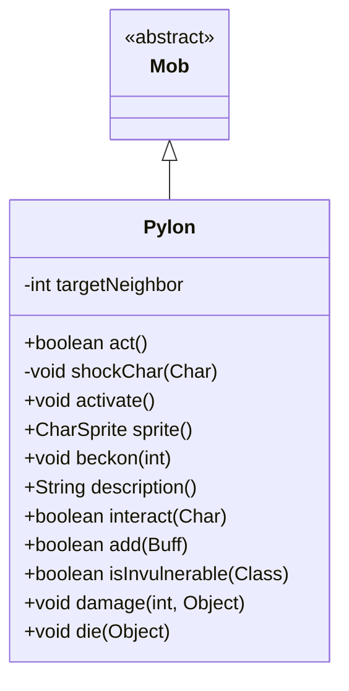

# Pylon 类文档

## 1. 基本信息
| 属性 | 值 |
|------|-----|
| 文件路径 | core/src/main/java/com/shatteredpixel/shatteredpixeldungeon/actors/mobs/Pylon.java |
| 包名 | com.shatteredpixel.shatteredpixeldungeon.actors.mobs |
| 类类型 | class |
| 继承关系 | extends Mob |
| 代码行数 | 236 行 |

## 2. 类职责说明
Pylon（塔楼）是 DM-300 boss 战中的辅助敌人。它们是不可移动的电击发射器，围绕自身释放闪电攻击。塔楼初始为中立状态，被 DM-300 激活后变为敌对。每个塔楼被摧毁后，DM-300 会进入短暂的无敌状态。高伤害会被削减。

## 4. 继承与协作关系


## 静态常量表
| 常量名 | 类型 | 值 | 说明 |
|--------|------|-----|------|
| ALIGNMENT | String | "alignment" | Bundle 存储键 |
| TARGET_NEIGHBOUR | String | "target_neighbour" | Bundle 存储键 |

## 实例字段表
| 字段名 | 类型 | 修饰符 | 说明 |
|--------|------|--------|------|
| targetNeighbor | int | private | 当前电击目标方向索引 |

## 7. 方法详解

### act()
**签名**: `protected boolean act()`
**功能**: 每回合释放电击攻击
**返回值**: boolean - 行动结果
**实现逻辑**:
```
第74-88行: 更新视野和敌人信息
第90-93行: 如果是中立状态，只等待
第95-104行: 计算电击目标格子（围绕自身的格子）
第106-122行: 显示闪电特效和粒子
第124-126行: 对目标格子中的角色造成伤害
第128行: 轮换到下一个目标方向
```

### shockChar(Char ch)
**签名**: `private void shockChar(Char ch)`
**功能**: 对角色造成电击伤害
**参数**:
- ch: Char - 目标角色
**实现逻辑**:
```
第136-137行: 闪避显示，造成10-20电击伤害
第140-147行: 如果击杀英雄，更新统计和失败记录
```

### activate()
**签名**: `public void activate()`
**功能**: 激活塔楼，变为敌对状态
**实现逻辑**:
```
第152行: 设置对齐为敌对
第153行: 设置状态为追猎
第154行: 更新精灵显示
```

### sprite()
**签名**: `public CharSprite sprite()`
**功能**: 获取精灵，如果已激活则显示激活状态
**返回值**: CharSprite - 精灵实例

### beckon(int cell)
**签名**: `public void beckon(int cell)`
**功能**: 响应召唤（忽略）
**实现逻辑**:
```
第166行: 什么都不做，塔楼不响应召唤
```

### description()
**签名**: `public String description()`
**功能**: 获取描述
**返回值**: String - 根据激活状态返回不同描述

### add(Buff buff)
**签名**: `public boolean add(Buff buff)`
**功能**: 添加 Buff
**参数**:
- buff: Buff - 要添加的 Buff
**返回值**: boolean - 是否成功
**实现逻辑**:
```
第186-189行: 中立状态下免疫所有 Buff
```

### isInvulnerable(Class effect)
**签名**: `public boolean isInvulnerable(Class effect)`
**功能**: 判断是否无敌
**参数**:
- effect: Class - 效果类型
**返回值**: boolean - 是否无敌
**实现逻辑**:
```
第195行: 中立状态下完全无敌
```

### damage(int dmg, Object src)
**签名**: `public void damage(int dmg, Object src)`
**功能**: 受到伤害时的处理
**参数**:
- dmg: int - 伤害值
- src: Object - 伤害来源
**实现逻辑**:
```
第200-203行: 高伤害削减（类似史莱姆）
第205-209行: 延长楼层锁定时间
```

### die(Object cause)
**签名**: `public void die(Object cause)`
**功能**: 死亡时通知关卡
**参数**:
- cause: Object - 死亡原因
**实现逻辑**:
```
第216行: 通知 CavesBossLevel 消除塔楼
```

## 11. 使用示例
```java
// 塔楼初始为中立
Pylon pylon = new Pylon();
pylon.alignment = Alignment.NEUTRAL;

// 被 DM-300 激活
pylon.activate();

// 塔楼围绕自身释放电击
// 击杀后 DM-300 进入无敌状态
```

## 注意事项
1. **多重属性**: MINIBOSS, BOSS_MINION, INORGANIC, ELECTRIC, IMMOVABLE, STATIC
2. **中立状态**: 初始中立，激活后变为敌对
3. **伤害削减**: 高伤害会被平方根公式削减
4. **电击攻击**: 围绕自身轮换释放电击
5. **boss 关联**: 死亡会影响 DM-300 的状态

## 最佳实践
1. 优先激活的塔楼可以伤害玩家
2. 在电击间隙移动
3. 使用高伤害快速击杀
4. 注意击杀后 DM-300 的无敌状态