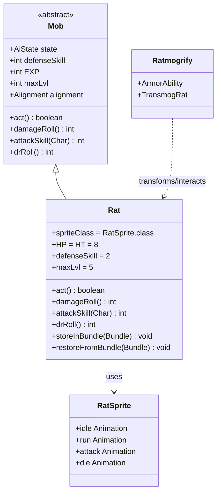

# Rat 源码详解

## 1. 基本信息

| 属性 | 值 |
|------|-----|
| **文件路径** | core/src/main/java/com/shatteredpixel/shatteredpixeldungeon/actors/mobs/Rat.java |
| **包名** | com.shatteredpixel.shatteredpixeldungeon.actors.mobs |
| **类类型** | public class |
| **继承关系** | extends Mob |
| **代码行数** | 82 |
| **中文名称** | 老鼠 |
| **怪物类型** | 基础怪物（新手区常见敌人） |

---

## 类职责

Rat（老鼠）是游戏中最基础的敌人之一，是新手玩家在地下城最初几层遇到的主要威胁。

**核心职责**：

1. **教学用途**：作为玩家遇到的第一个敌人类型，帮助玩家熟悉战斗机制
2. **低威胁敌人**：拥有较低的HP和攻击力，适合新手玩家练手
3. **Ratmogrify互动**：与盗贼的护甲技能"鼠化"有特殊交互

**设计特点**：
- 简洁的属性设计，没有复杂的AI行为
- 是理解Mob类继承和定制化的最佳示例

---

## 4. 继承与协作关系



---

## 静态常量表

| 常量名 | 类型 | 值 | 用途 |
|--------|------|-----|------|
| `RAT_ALLY` | String | "rat_ally" | Bundle存档键，用于保存老鼠是否为盟友 |

---

## 实例字段表

Rat 使用实例初始化块 `{}` 来设置默认值：

| 字段名 | 类型 | 值 | 来源 | 说明 |
|--------|------|-----|------|------|
| `spriteClass` | Class | RatSprite.class | Mob | 精灵类，决定怪物的视觉表现 |
| `HP` | int | 8 | Char | 当前生命值 |
| `HT` | int | 8 | Char | 最大生命值 |
| `defenseSkill` | int | 2 | Mob | 防御技能值，影响闪避率 |
| `maxLvl` | int | 5 | Mob | 最大有效等级，超过此等级击杀不获得经验 |

**继承的默认值**（来自Mob类）：

| 字段名 | 默认值 | 说明 |
|--------|--------|------|
| `EXP` | 1 | 击杀经验值 |
| `alignment` | Alignment.ENEMY | 敌对阵营 |
| `state` | SLEEPING | 初始为睡眠状态 |

---

## 7. 方法详解

### 1. 实例初始化块

```java
{
    spriteClass = RatSprite.class;
    
    HP = HT = 8;
    defenseSkill = 2;

    maxLvl = 5;
}
```

**逐行解释**：

| 行号 | 代码 | 作用 |
|------|------|------|
| 33-34 | `spriteClass = RatSprite.class;` | 设置精灵类为RatSprite，定义老鼠的外观动画 |
| 36 | `HP = HT = 8;` | 设置生命值为8点，是游戏中最脆弱的怪物之一 |
| 37 | `defenseSkill = 2;` | 防御技能为2，玩家很容易命中 |
| 39 | `maxLvl = 5;` | 最大有效等级5，玩家等级超过7级后击杀不获得经验 |

---

### 2. act() 方法

```java
@Override
protected boolean act() {
    if (alignment != Alignment.ALLY
            && Dungeon.level.heroFOV[pos]
            && Dungeon.hero.armorAbility instanceof Ratmogrify){
        alignment = Alignment.NEUTRAL;
        if (enemy == Dungeon.hero) enemy = null;
        if (state == SLEEPING) state = WANDERING;
    }
    return super.act();
}
```

**方法作用**：执行老鼠每回合的行动，包含与Ratmogrify技能的特殊交互。

**逐行解释**：

| 行号 | 代码 | 作用 |
|------|------|------|
| 43-46 | `if (alignment != Alignment.ALLY ...)` | 检查三个条件：1)不是盟友 2)在英雄视野内 3)英雄装备了Ratmogrify技能 |
| 44 | `Dungeon.level.heroFOV[pos]` | 检查老鼠当前位置是否在英雄视野范围内 |
| 45 | `Dungeon.hero.armorAbility instanceof Ratmogrify` | 检查英雄的护甲技能是否是"鼠化" |
| 47 | `alignment = Alignment.NEUTRAL;` | 将阵营设为中立，不再主动攻击玩家 |
| 48 | `if (enemy == Dungeon.hero) enemy = null;` | 如果当前敌人是英雄，清除目标 |
| 49 | `if (state == SLEEPING) state = WANDERING;` | 如果在睡眠状态，切换到游荡状态 |
| 51 | `return super.act();` | 调用父类Mob的act()方法执行标准AI行为 |

**设计意义**：
- 这是游戏中的特殊彩蛋机制
- 当盗贼选择Ratmogrify技能时，普通老鼠会变得"友好"
- 体现老鼠害怕被"鼠化"的幽默设计

---

### 3. damageRoll() 方法

```java
@Override
public int damageRoll() {
    return Random.NormalIntRange( 1, 4 );
}
```

**方法作用**：返回老鼠攻击时造成的伤害值。

**逐行解释**：

| 行号 | 代码 | 作用 |
|------|------|------|
| 56 | `return Random.NormalIntRange( 1, 4 );` | 返回1-4之间的随机整数（均匀分布） |

**伤害分析**：
- 最低伤害：1点
- 最高伤害：4点
- 平均伤害：2.5点
- 对于HP约20点的新手英雄，需要约8次攻击才能致命

---

### 4. attackSkill() 方法

```java
@Override
public int attackSkill( Char target ) {
    return 8;
}
```

**方法作用**：返回老鼠对目标攻击时的技能值。

**逐行解释**：

| 行号 | 代码 | 作用 |
|------|------|------|
| 61 | `return 8;` | 固定返回8点攻击技能值 |

**命中率计算**：
- 命中率 = 1 - 目标防御技能 / (攻击技能 + 目标防御技能)
- 对防御技能2的新手英雄：命中率 ≈ 1 - 2/(8+2) = 80%

---

### 5. drRoll() 方法

```java
@Override
public int drRoll() {
    return super.drRoll() + Random.NormalIntRange(0, 1);
}
```

**方法作用**：返回老鼠的伤害减免值。

**逐行解释**：

| 行号 | 代码 | 作用 |
|------|------|------|
| 66 | `return super.drRoll() + Random.NormalIntRange(0, 1);` | 调用父类方法并额外添加0-1点随机减免 |

**伤害减免分析**：
- 基础减免（父类）：通常为0
- 额外减免：0或1点（各50%概率）
- 平均减免：0.5点
- 这是老鼠唯一具有的防御机制

---

### 6. storeInBundle() 方法

```java
@Override
public void storeInBundle(Bundle bundle) {
    super.storeInBundle(bundle);
    if (alignment == Alignment.ALLY) bundle.put(RAT_ALLY, true);
}
```

**方法作用**：将老鼠的状态保存到Bundle中，用于游戏存档。

**逐行解释**：

| 行号 | 代码 | 作用 |
|------|------|------|
| 73 | `super.storeInBundle(bundle);` | 调用父类方法保存基础数据 |
| 74 | `if (alignment == Alignment.ALLY) bundle.put(RAT_ALLY, true);` | 如果是盟友，保存标记 |

---

### 7. restoreFromBundle() 方法

```java
@Override
public void restoreFromBundle(Bundle bundle) {
    super.restoreFromBundle(bundle);
    if (bundle.contains(RAT_ALLY)) alignment = Alignment.ALLY;
}
```

**方法作用**：从Bundle恢复老鼠的状态，用于读取存档。

**逐行解释**：

| 行号 | 代码 | 作用 |
|------|------|------|
| 80 | `super.restoreFromBundle(bundle);` | 调用父类方法恢复基础数据 |
| 81 | `if (bundle.contains(RAT_ALLY)) alignment = Alignment.ALLY;` | 如果存档中有盟友标记，恢复为盟友 |

---

## 属性总结表

### 战斗属性

| 属性 | 值 | 评价 |
|------|-----|------|
| HP | 8 | 极低，1-2次攻击可击杀 |
| 攻击伤害 | 1-4 | 低，对新手威胁小 |
| 攻击技能 | 8 | 低，命中率不高 |
| 防御技能 | 2 | 极低，容易被命中 |
| 伤害减免 | 0-1 | 几乎没有 |
| 经验值 | 1 | 最低经验 |
| 最大有效等级 | 5 | 仅前期有效 |

### 生成位置

| 区域 | 出现层数 |
|------|----------|
| 普通地牢 | 1-5层 |
| 其他区域 | 不出现 |

---

## 11. 使用示例

### 1. 创建自定义基础怪物

```java
public class Mouse extends Mob {
    {
        spriteClass = MouseSprite.class;
        
        // 属性设置参考Rat的模式
        HP = HT = 5;           // 更弱的生命值
        defenseSkill = 1;      // 更低的防御
        
        maxLvl = 3;            // 更低的等级上限
    }
    
    @Override
    public int damageRoll() {
        return Random.NormalIntRange(1, 2);  // 更低的伤害
    }
    
    @Override
    public int attackSkill(Char target) {
        return 5;  // 更低的命中
    }
    
    @Override
    public int drRoll() {
        return 0;  // 没有减免
    }
}
```

### 2. 检测老鼠的Ratmogrify交互

```java
// 检查老鼠是否因Ratmogrify变为中立
if (rat.alignment == Alignment.NEUTRAL) {
    GLog.i("这只老鼠似乎认出了你的力量，不敢攻击！");
}

// 通过Ratmogrify技能生成盟友老鼠
Rat allyRat = new Rat();
allyRat.alignment = Char.Alignment.ALLY;
allyRat.state = allyRat.HUNTING;
GameScene.add(allyRat);
```

### 3. 存档系统使用

```java
// 保存（游戏内部自动调用）
Bundle bundle = new Bundle();
rat.storeInBundle(bundle);

// 恢复
Rat restoredRat = new Rat();
restoredRat.restoreFromBundle(bundle);
// 如果存档时是盟友，恢复后仍是盟友
```

---

## 注意事项

### 1. Ratmogrify交互的特殊性

- **触发条件**：老鼠必须在英雄视野内，且英雄必须装备了Ratmogrify技能
- **效果**：老鼠变为中立，不会主动攻击
- **持久性**：状态不是永久的，离开视野后可能重置

### 2. 存档兼容性

- `RAT_ALLY` 键用于保存盟友状态
- 必须同时重写 `storeInBundle()` 和 `restoreFromBundle()` 以确保存档正确

### 3. 属性继承

- Rat 没有设置 `EXP`，使用 Mob 默认值 1
- 没有设置 `loot` 和 `lootChance`，不会掉落特殊物品
- 继承了 Mob 的标准 AI 行为（睡眠→游荡→追击）

---

## 最佳实践

### 1. 创建类似基础怪物时

```java
// 推荐的属性设置顺序
{
    spriteClass = YourSprite.class;  // 1. 精灵类
    HP = HT = X;                     // 2. 生命值
    defenseSkill = Y;                // 3. 防御技能
    maxLvl = Z;                      // 4. 等级上限
    
    // 可选：添加掉落
    // loot = SomeItem.class;
    // lootChance = 0.1f;
}
```

### 2. 添加特殊行为时

```java
@Override
protected boolean act() {
    // 自定义逻辑放在 super.act() 之前
    if (someCondition) {
        doSomething();
    }
    return super.act();  // 总是调用父类方法
}
```

### 3. 保持简洁

- Rat 类只有 82 行，展示了 Mob 定制化的简洁性
- 只重写必要的方法
- 使用实例初始化块设置默认值

---

## 与相关类的对比

| 类 | HP | 伤害 | 防御 | 特点 |
|----|-----|------|------|------|
| **Rat** | 8 | 1-4 | 2 | 最弱，Ratmogrify交互 |
| Gnoll | 12 | 2-5 | 4 | 基础敌人 |
| Crab | 15 | 3-6 | 5 | 水中加速 |
| Snake | 10 | 2-5 | 3 | 闪避能力 |

---

## 版本历史

| 版本 | 变更 |
|------|------|
| 初始版本 | 作为基础怪物实现 |
| Ratmogrify更新 | 添加与Ratmogrify技能的特殊交互 |
| 盟友系统 | 添加存档支持（RAT_ALLY键） |